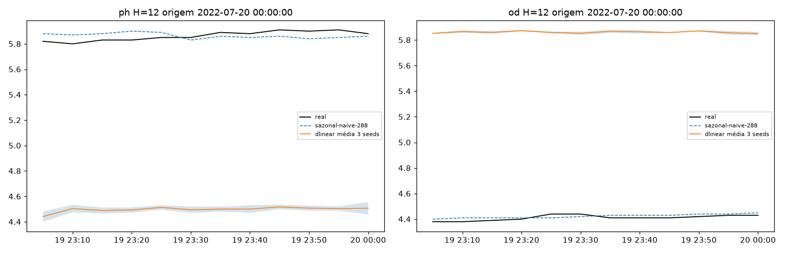
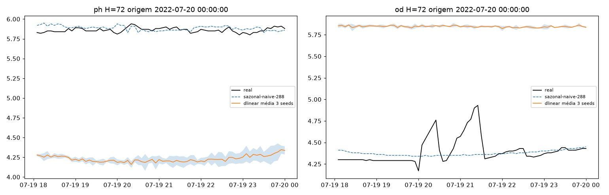
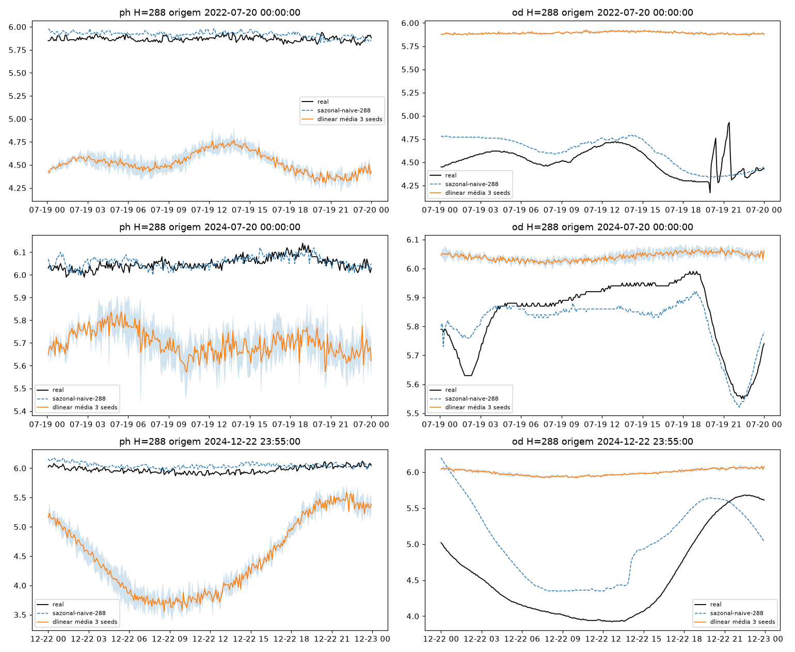
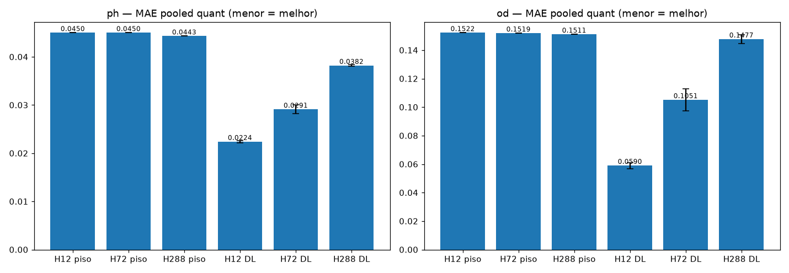
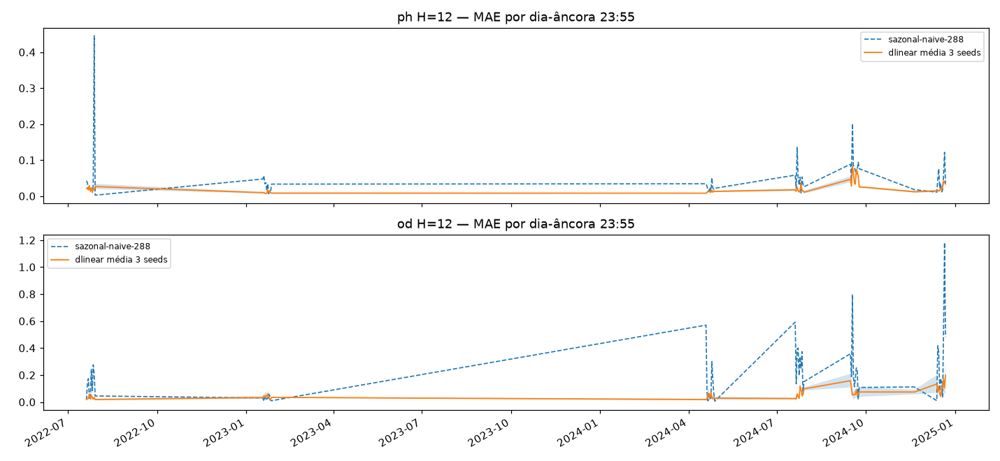
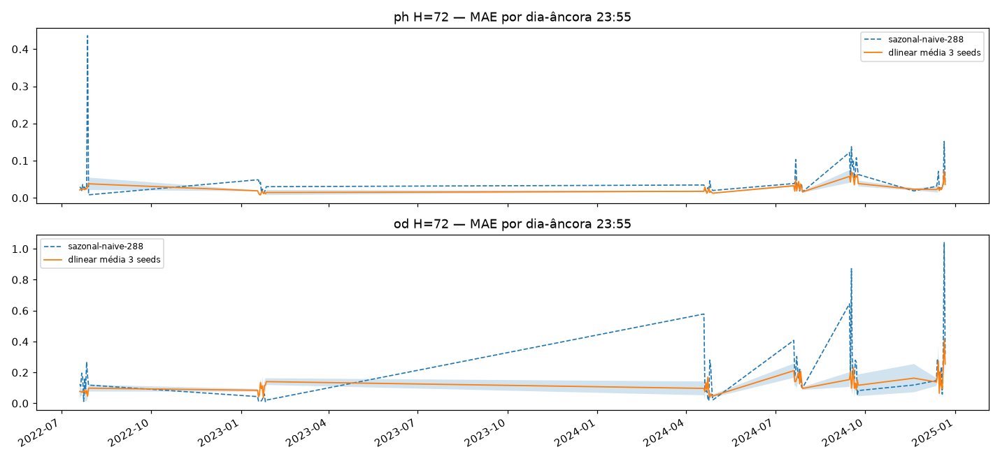
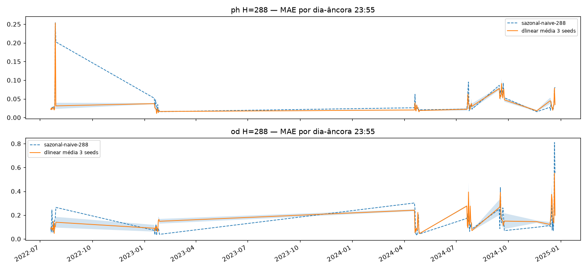
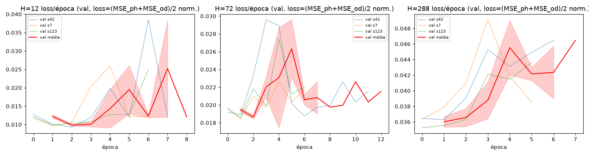
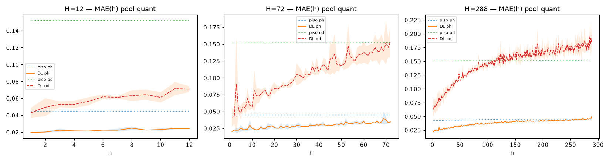

# Experimento M1 — DLinear-multi (EF01): pipeline 4-canais + 3 horizontes dedicados × 3 seeds

DLinear multicanal (OD + pH + Temp + Turb + tempo) nos horizontes dedicados
`H = 12 (1h) / 72 (6h) / 288 (24h)`, `L=2304` fixo, treino 2022–2024 no split
único com purge/embargo ±288. Primeiro experimento multivariável: valida o
pipeline 4-canais e fecha os pisos por horizonte para M2/M3.
Artefatos gerados por `multivariavel/notebooks/M1-dlinear-multi.ipynb` (executado
de ponta a ponta, 0 erros; procedência: `administrador-HP-Z4-G5-Workstation-Desktop-PC`,
20c, torch 2.14.0+cu126, `DEVICE=cuda` em 1× RTX 4000 Ada via
`CUDA_VISIBLE_DEVICES=0`/`M1_DEVICE=cuda`, 7,3 min, 9 treinos em 305 s, git HEAD
`766bd56`). 2025 intocado.
Reproduzir: `CUDA_VISIBLE_DEVICES=0 M1_DEVICE=cuda .venv/bin/jupyter nbconvert --to notebook --execute --inplace --ExecutePreprocessor.timeout=7200 multivariavel/notebooks/M1-dlinear-multi.ipynb`

## Protocolo (travado do `multivariavel/PLANO.md`)

- **Janelas** `L=2304 → H∈{12,72,288}` (8 d de contexto; 1 h / 6 h / 24 h), um pipeline por H.
- **Canais**: alvos pH + OD (2 heads), covariáveis Temp + Turb (observed-only); Precipitação excluída. Estação austral só p/ reporte, nunca feature.
- **Limpeza**: grade 5 min por ano + concat 2022→2024, interp `time` limite 24 por canal, descarta janela se qualquer dos 4 canais tem NaN (descarte conjunto pós-interp: 2022 15,9% · 2023 1,1% · 2024 6,5%), winsorize de Turbidez em p99 do treino (59,2 NTU) + RevIN per-channel per-window no modelo, z-score por canal fitado só no treino (`modelos/normalizacao.json`).
- **Features**: 11 por passo (4 canais + `tod_sin/cos` + `solar` + 4 Fourier da origem, vocabulário do 12/16) — só no input, nada de futuro dos canais.
- **Val = 7 fatias por data de fim** (5 v2-2024 + 2 auxiliares fixas: verão 18–27/jan/2023, inverno 20–29/jul/2022); purge/embargo ±288 único (Hmax) com `assert gap ≥ 289`, overlap zero (gap mín +289 nos 3 H).
- **Cobertura**: 6 fatias cheias (2880) + **nov/24 qualitativa (436/1440)** — micro-outages de Turbidez (21/nov 55 slots + 23/nov 34 slots) amplificados pela janela de ~2300 passos; pela regra do plano fica fora do pooled. Dias-âncora 23:55: 61 (10+10+10+1+10+10+10).
- **Treino**: `DLinearMulti` (concat → decomposição pool k=25 + lineares por canal-alvo → 2 heads; 1,2M params em H12 · 7,3M em H72 · 29,2M em H288), loss `(MSE_ph+MSE_od)/2` normalizada, hiperparams verbatim do 14-DLinear (`LR=1e-3`, `MAX 30/PAT 5`, `BATCH=512`, Adam/MSE, strides 4/4), seeds `[42, 7, 123]`, early stopping por val pooled (best eps. 1–7). Treino pós-purge: H12 206.009 · H72 204.269 · H288 198.183 janelas.

## Tabela principal — val pooled quantitativa (6 fatias, 17.280 origens)

| H | pH piso | pH DLinear | OD piso | OD DLinear |
|---|---|---|---|---|
| 12 (1h) | 0,0450 | **0,0224±0,0002** | 0,1522 | **0,0590±0,0021** |
| 72 (6h) | 0,0450 | **0,0291±0,0009** | 0,1519 | **0,1051±0,0076** |
| 288 (24h) | 0,0443 | **0,0382±0,0002** | 0,1511 | **0,1477±0,0032** |

(copiado de `metricas_pooled.csv` — DLinear = média±dp das 3 seeds; **bate o `sazonal-naive-288` nos 6 (H, variável)**; contexto, sem comparação direta: réguas uni-v2 H=288 em val 2024 distinta — pH 0,0465 / OD 0,2056 no benchmark 2025.)

## Val por fatia — MAE (média 3 seeds; `metricas_por_fatia.csv`)

| fatia | H12 pH (dl × piso) | H12 OD | H72 pH | H72 OD | H288 pH | H288 OD |
|---|---|---|---|---|---|---|
| abr24 | 0,0147 × 0,0282 | 0,0400 × 0,1186 | 0,0184 × 0,0282 | 0,0659 × 0,1190 | 0,0231 × 0,0282 | 0,1032 × 0,1240 |
| jul24 | 0,0173 × 0,0392 | 0,0548 × 0,1328 | 0,0279 × 0,0392 | 0,1036 × 0,1324 | 0,0375 × 0,0391 | 0,1455 × 0,1316 (piso vence) |
| set24 | 0,0463 × 0,0691 | 0,0767 × 0,1981 | 0,0552 × 0,0690 | 0,1492 × 0,1973 | 0,0608 × 0,0693 | 0,1920 × 0,1969 |
| dez24 | 0,0208 × 0,0381 | 0,0850 × 0,2546 | 0,0266 × 0,0377 | 0,1550 × 0,2536 | 0,0345 × 0,0354 | 0,2366 × 0,2499 |
| jan23aux | 0,0107 × 0,0288 | 0,0552 × 0,0701 | 0,0141 × 0,0288 | 0,0828 × 0,0704 (piso vence) | 0,0230 × 0,0294 | 0,1058 × 0,0717 (piso vence) |
| jul22aux | 0,0245 × 0,0667 | 0,0425 × 0,1387 | 0,0326 × 0,0670 | 0,0743 × 0,1388 | 0,0505 × 0,0644 | 0,1033 × 0,1326 |
| nov24 (quali) | fora do pooled | fora do pooled | fora do pooled | fora do pooled | pH 0,0230 × 0,0176 (piso vence, fora da manchete) | — |

## Curva MAE(h) — o dedicado curto é redundante? Não (`metricas_mae_h.csv`, `08-mae-h.png`)

- pH: H12 vence o H288 em 10/12 passos de h≤12 (h=12: 0,0243±0,0009 × 0,0297±0,0061).
- OD: H12 vence em 12/12 (h=12: 0,0708±0,0035 × 0,0772±0,0126).
- Veredito: horizontes dedicados se justificam; o modelo 24h não cobre o 1h.

## Dias-âncora (61, `metricas_por_dia.csv`)

Mesma ordem do pooled; detalhe por dia no CSV (1 âncora em nov/24, fatia qualitativa).

## Figuras — o que cada uma mostra

### `01-eda.png`, `01b-distribuicao.png`, `02-limpeza.png`, `03-stl.png` — dado 2022–2024 (blocos NaN por canal, cauda da Turbidez, deriva interanual do OD)

### `04-forecasts-H{12,72,288}.png` — 3 origens do treino (real × sazonal × DLinear média±dp 3 seeds)

### `05-mae-por-H.png` — barras MAE pooled por (H, variável): pisos × DLinear

### `06-val-dias-H{12,72,288}.png` — MAE por dia-âncora (7 fatias; faixa = nov/24 qualitativa)

### `07-curvas-treino.png` — loss por época (3 painéis H × 3 seeds; best nas eps. 1–7, sem divergência)

### `08-mae-h.png` — curva MAE(h) por (H, variável): o teste de redundância do H curto

## Arquivos

| Arquivo | O quê |
|---|---|
| `metricas_pooled.csv` | Val pooled por H em CSV (primária, 3 linhas: pisos + DLinear por seed + média±dp) |
| `metricas_por_fatia.csv` | MAE/RMSE por (H, fatia, variável, modelo, seed) em CSV (168 linhas + flag `qualitativa`) |
| `metricas_por_dia.csv` | MAE por dia-âncora em CSV (366 linhas) |
| `metricas_mae_h.csv` | MAE por passo do horizonte em CSV (744 linhas: H×h×var) |
| `modelos/dlinear_multi_H{h}_s{42,7,123}.pt` | DLinearMulti treinado por (H, seed) (state_dict + config) |
| `modelos/normalizacao.json` | z-stats por canal e por H + slices + seeds + feats + winsor p99 (pequeno, versionado) |
| `figs/` | As 13 figuras explicadas acima |

## Leitura dos resultados

1. **Pipeline 4-canais validado e pisos fechados nos 3 H** — entrega do M1 cumprida: M2/M3 herdam limpeza, janelas, purge e pisos sem retrabalho.
2. **Ganho cai com H**: no pH −50% (H12) → −35% (H72) → −14% (H288) sobre o piso; no OD −61% → −31% → −2%. O H288-OD (0,1477 × 0,1511) é a margem mais fina — é onde a ablação CI vs CD precisa mostrar serviço.
3. **OD-H288 perde 2 das 6 fatias p/ o piso** (jul24, jan23aux) e OD-H72 perde jan23aux — o pooled vence graças a dez24/jul22aux/set24. Sinal de que o resíduo linear capta o ciclo diário mas sofre em deriva de nível: ponto a retestar no M3.
4. **dez24-OD é a fatia dura** (0,24–0,25 nos dois modelos, todos os H) e **set24 a dura do pH** — mesmo perfil sazonal do uni.
5. **Instabilidade OD-H72 entre seeds** (0,1006–0,1139) vs pH estável (±0,0002–0,0009) — acompanhar no M2/M3; se persistir, questiona 3 seeds p/ OD.
6. Limitações declaradas: time-features só no input (futuro-known permitido, não usado, no horizonte); loss MSE sem Huber (spike tratado só com winsorize + RevIN); comparação com réguas uni-v2 só no benchmark 2025.
7. Fila: `M2-patchtst-multi-CI` → `M3-patchtst-multi-CD` no mesmo split (1 job/GPU) — checkpoints guardados.
