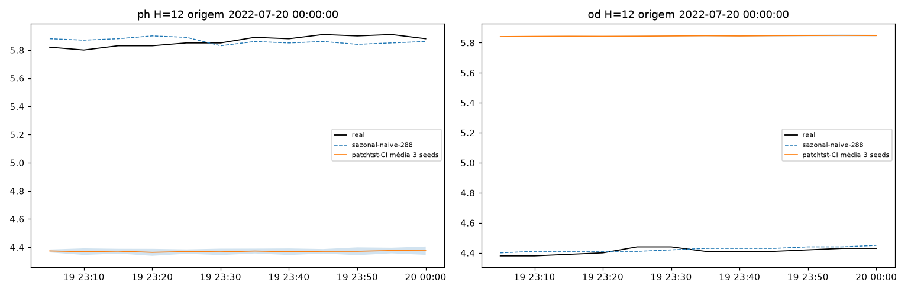
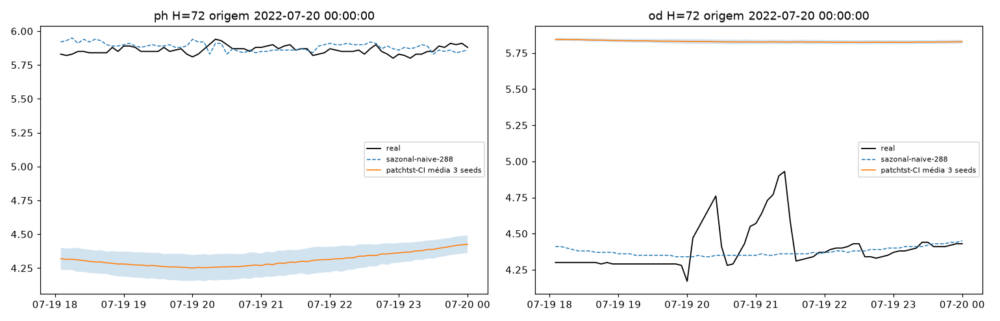
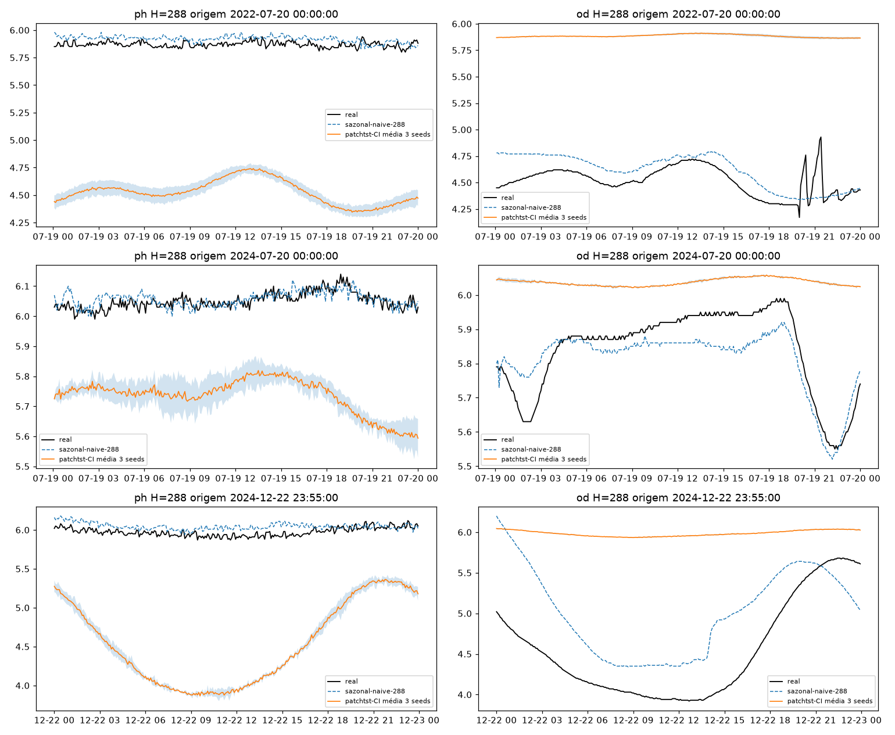
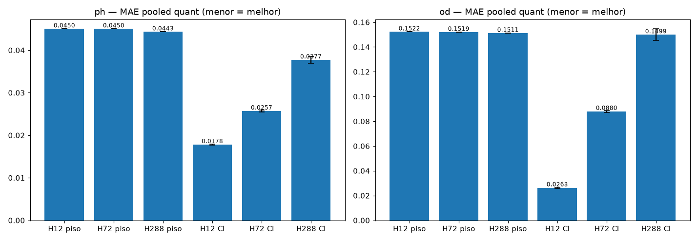
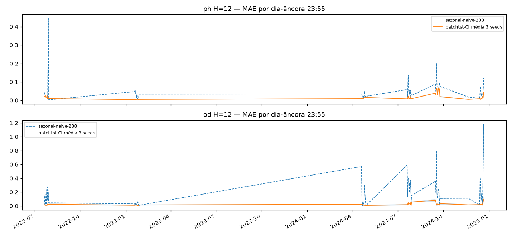
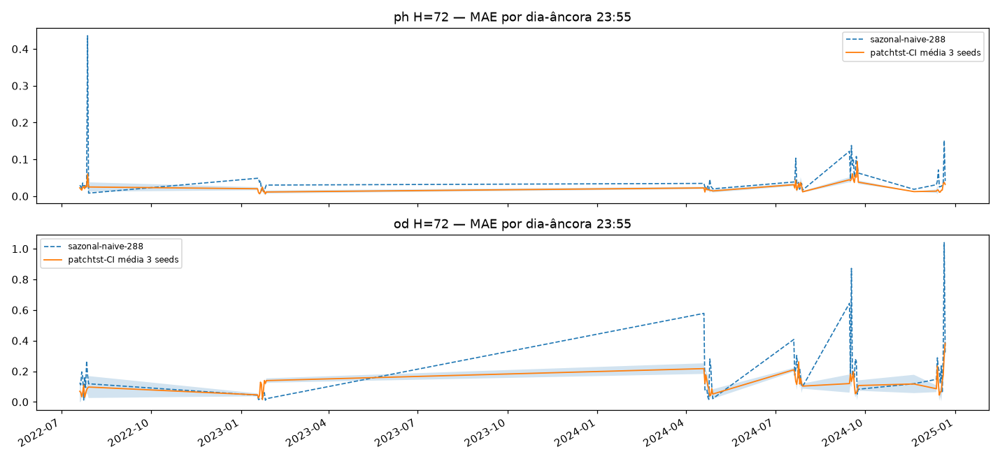
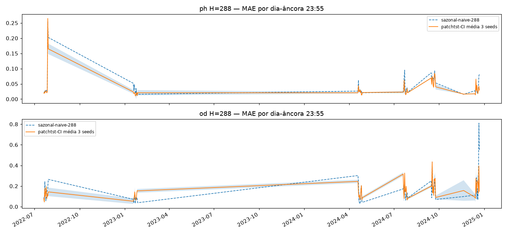
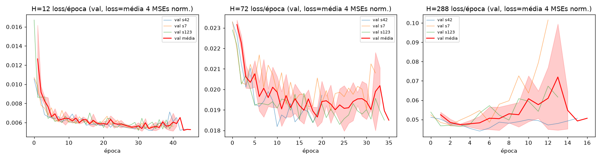
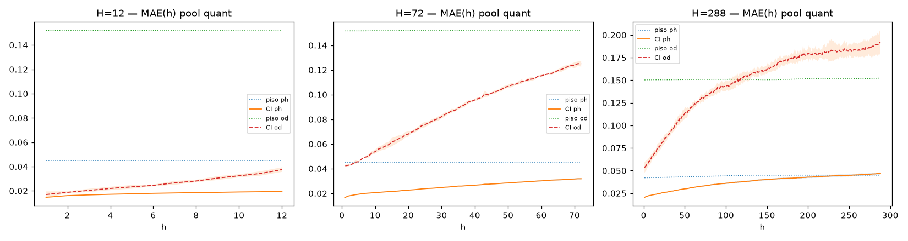

# Experimento M2 — PatchTST-multi channel-independent, CI (EF01): braço controle da ablação CI vs CD, 3 horizontes dedicados × 3 seeds

PatchTST com pesos compartilhados e forward separado por canal (OD/pH/Temp/Turb
como séries univariadas independentes) nos horizontes dedicados
`H = 12 (1h) / 72 (6h) / 288 (24h)`, `L=2304` fixo, treino 2022–2024 no split
único com purge/embargo ±288. Segundo experimento multivariável: braço controle
da ablação CI vs CD (o contraste é o resultado principal do plano); herda do M1
o pipeline 4-canais completo e troca SÓ o modelo.
Artefatos gerados por `multivariavel/notebooks/M2-patchtst-multi-CI.ipynb` (executado
de ponta a ponta, 0 erros; procedência: `administrador-HP-Z4-G5-Workstation-Desktop-PC`,
20c, torch 2.14.0+cu126, `DEVICE=cuda` em 1× RTX 4000 Ada via
`CUDA_VISIBLE_DEVICES=0`/`M2_DEVICE=cuda` (GPU 1 ocupada por outro worker em paralelo),
threads `OMP/MKL/OpenBLAS_NUM_THREADS=8`, 62,0 min, 9 treinos em 3580 s, git HEAD
`97fa534`). 2025 intocado.
Reproduzir: `CUDA_VISIBLE_DEVICES=0 M2_DEVICE=cuda .venv/bin/jupyter nbconvert --to notebook --execute --inplace --ExecutePreprocessor.timeout=7200 multivariavel/notebooks/M2-patchtst-multi-CI.ipynb`

## Protocolo (travado do `multivariavel/PLANO.md`, pipeline herdado do M1)

- **Janelas** `L=2304 → H∈{12,72,288}` (8 d de contexto; 1 h / 6 h / 24 h), um pipeline por H. Células de carga→normalização **verbatim do M1** (mesmo split, mesmas janelas, mesmos pisos recalculados).
- **Canais**: alvos pH + OD (métricas só nesses dois), covariáveis Temp + Turb (observed-only, supervisionadas na loss p/ compartilhar pesos, nunca como input cruzado); Precipitação excluída. Estação austral só p/ reporte, nunca feature.
- **Limpeza**: grade 5 min por ano + concat 2022→2024, interp `time` limite 24 por canal, descarta janela se qualquer dos 4 canais tem NaN (descarte conjunto pós-interp: 2022 15,9% · 2023 1,1% · 2024 6,5%), winsorize de Turbidez em p99 do treino (59,2 NTU) + z-score por canal fitado só no treino (`modelos/normalizacao.json`, herdado do M1 + metadados CI).
- **CI estrito** (Nie et al. 2022): backbone PatchTST **verbatim do 14** (patches 48/24 → 83 tokens de `LN=2016`, transformer 3×64/4 heads, FF 128, dropout 0,1, RevIN escalar compartilhada); cada forward por canal recebe `[valor do canal + 7 time-feats]` (`tod_sin/cos` + `solar/90` por passo + 4 Fourier da origem, per-timestamp, sem cruzar canais — mesma ideia do conv `in_channels` 3→8 do uni-12); **loss = média dos 4 MSEs normalizados** (OD/pH/Temp/Turb); na inferência usam-se SÓ pH e OD. `DLinearMulti` NÃO entra aqui.
- **Val = 7 fatias por data de fim** (5 v2-2024 + 2 auxiliares fixas: verão 18–27/jan/2023, inverno 20–29/jul/2022); purge/embargo ±288 único (Hmax) com `assert gap ≥ 289`, overlap zero (gap mín +289 nos 3 H).
- **Cobertura**: 6 fatias cheias (2880) + **nov/24 qualitativa (436/1440)** — mesma do M1, fora do pooled. Dias-âncora 23:55: 61 (10+10+10+1+10+10+10).
- **Treino**: `PatchTSTCI` (194.126 params em H12 · 512.906 em H72 · 1.660.514 em H288), loss média-4-MSE normalizada, hiperparams verbatim 14-PatchTST (`LR=1e-3`, `MAX 60/PAT 10`, `BATCH=256` janelas/passo com os 4 forwards empilhados, Adam/MSE, strides 4/4 — sem redução: full-run em 62,0 min, documentado), seeds `[42, 7, 123]`, early stopping por val pooled (best eps. 3–35). Treino pós-purge: H12 206.009 · H72 204.269 · H288 198.183 janelas.

## Tabela principal — val pooled quantitativa (6 fatias, 17.280 origens)

| H | pH piso | pH CI | OD piso | OD CI |
|---|---|---|---|---|
| 12 (1h) | 0,0450 | **0,0178±0,0001** | 0,1522 | **0,0263±0,0004** |
| 72 (6h) | 0,0450 | **0,0257±0,0002** | 0,1519 | **0,0880±0,0008** |
| 288 (24h) | 0,0443 | **0,0377±0,0008** | 0,1511 | **0,1499±0,0047** |

(copiado de `metricas_pooled.csv` — CI = média±dp das 3 seeds; **bate o `sazonal-naive-288` nos 6 (H, variável)**; contexto, sem comparação direta: réguas uni-v2 H=288 em val 2024 distinta — pH 0,0465 / OD 0,2056 no benchmark 2025.)

## Val por fatia — MAE (média 3 seeds; `metricas_por_fatia.csv`)

| fatia | H12 pH (ci × piso) | H12 OD | H72 pH | H72 OD | H288 pH | H288 OD |
|---|---|---|---|---|---|---|
| abr24 | 0,0132 × 0,0282 | 0,0184 × 0,1186 | 0,0170 × 0,0282 | 0,0701 × 0,1190 | 0,0245 × 0,0282 | 0,1338 × 0,1240 (piso vence) |
| jul24 | 0,0120 × 0,0392 | 0,0292 × 0,1328 | 0,0222 × 0,0392 | 0,0904 × 0,1324 | 0,0319 × 0,0391 | 0,1471 × 0,1316 (piso vence) |
| set24 | 0,0417 × 0,0691 | 0,0269 × 0,1981 | 0,0491 × 0,0690 | 0,1107 × 0,1973 | 0,0613 × 0,0693 | 0,1906 × 0,1969 |
| dez24 | 0,0141 × 0,0381 | 0,0366 × 0,2546 | 0,0213 × 0,0377 | 0,1111 × 0,2536 | 0,0317 × 0,0354 | 0,2042 × 0,2499 |
| jan23aux | 0,0057 × 0,0288 | 0,0269 × 0,0701 | 0,0101 × 0,0288 | 0,0748 × 0,0704 (piso vence) | 0,0204 × 0,0294 | 0,1129 × 0,0717 (piso vence) |
| jul22aux | 0,0203 × 0,0667 | 0,0196 × 0,1387 | 0,0344 × 0,0670 | 0,0709 × 0,1388 | 0,0567 × 0,0644 | 0,1112 × 0,1326 |
| nov24 (quali) | 0,0115 × 0,0167 (fora do pooled) | 0,0249 × 0,1074 (fora do pooled) | 0,0140 × 0,0175 (fora do pooled) | 0,0823 × 0,1046 (fora do pooled) | pH 0,0188 × 0,0176 (piso vence, fora da manchete) | OD 0,1593 × 0,0911 (piso vence, fora da manchete) |

## Curva MAE(h) — o dedicado curto é redundante? Não (`metricas_mae_h.csv`, `08-mae-h.png`)

- pH: H12 vence o H288 em 12/12 passos de h≤12 (h=12: 0,0196±0,0001 × 0,0234±0,0002).
- OD: H12 vence em 12/12 (h=12: 0,0375±0,0019 × 0,0681±0,0037).
- Veredito: horizontes dedicados se justificam; o modelo 24h não cobre o 1h (mesmo veredito do M1, margens maiores no OD).

## Dias-âncora (61, `metricas_por_dia.csv`)

Mesma ordem do pooled (61 âncoras por H: 10+10+10+1+10+10+10); detalhe por dia no CSV (1 âncora em nov/24, fatia qualitativa).

## Figuras — o que cada uma mostra

### `01-eda.png`, `01b-distribuicao.png`, `02-limpeza.png`, `03-stl.png` — dado 2022–2024 (blocos NaN por canal, cauda da Turbidez, deriva interanual do OD)

### `04-forecasts-H{12,72,288}.png` — 3 origens do treino em H288 (1 em H12/H72): real × sazonal × CI média±dp 3 seeds

### `05-mae-por-H.png` — barras MAE pooled por (H, variável): pisos × CI

### `06-val-dias-H{12,72,288}.png` — MAE por dia-âncora (7 fatias; faixa = nov/24 qualitativa)

### `07-curvas-treino.png` — loss por época (3 painéis H × 3 seeds; best nas eps. 3–35, sem divergência)

### `08-mae-h.png` — curva MAE(h) por (H, variável): o teste de redundância do H curto

## Arquivos

| Arquivo | O quê |
|---|---|
| `metricas_pooled.csv` | Val pooled por H em CSV (primária, 3 linhas: pisos + CI por seed + média±dp) |
| `metricas_por_fatia.csv` | MAE/RMSE por (H, fatia, variável, modelo, seed) em CSV (168 linhas + flag `qualitativa`) |
| `metricas_por_dia.csv` | MAE por dia-âncora em CSV (366 linhas) |
| `metricas_mae_h.csv` | MAE por passo do horizonte em CSV (744 linhas: H×h×var) |
| `modelos/patchtst_CI_H{h}_s{42,7,123}.pt` | PatchTSTCI treinado por (H, seed) (state_dict + config) |
| `modelos/normalizacao.json` | z-stats por canal e por H + slices + seeds + feats + winsor p99 + metadados CI (pequeno, versionado) |
| `figs/` | As 13 figuras explicadas acima |

## Leitura dos resultados

1. **CI bate o piso nos 6 (H, variável) no pooled** — mas o H288-OD (0,1499 × 0,1511, −0,8%) repete a margem fina do M1: é onde a ablação CD precisa mostrar serviço.
2. **CI vs M1-DLinear** (lido de `../M1-dlinear-multi/metricas_pooled.csv`, mesma val — comparação honesta, sem alegar transferência p/ 2025): CI vence em 5/6 — H12 pH 0,0178 × 0,0224 (−21%) e OD 0,0263 × 0,0590 (−55%); H72 pH 0,0257 × 0,0291 (−12%) e OD 0,0880 × 0,1051 (−16%); H288 pH 0,0377 × 0,0382 (−1%); **M1 vence só o H288-OD** 0,1477 × 0,1499 (+1,5%, dentro de ~1 dp de cada lado). O ganho do CI sobre o linear concentra-se nos Hs curtos; em 24h os dois empatam tecnicamente.
3. **Por fatia, o padrão de dificuldade é o mesmo do M1**: dez24-OD é a fatia dura (0,20–0,25, todos os H) e set24 a dura do pH; jan23aux-OD é onde o piso mais morde (vence CI em H72 e H288, como venceu o DLinear). H288-OD perde 3/6 fatias quantitativas p/ o piso (abr24, jul24, jan23aux) — mesma fragilidade de nível do M1, ponto a retestar no M3.
4. **Estabilidade entre seeds**: pH estável em todos os H (±0,0001–0,0008); OD-H288 tem dp 0,0047 (0,1464–0,1553) — mesma ordem do M1 (±0,0032), sem agravamento pelo transformer.
5. **H12 varre todas as fatias** (14/14 ci×piso, incl. a quali nov24) — o CI curto é o resultado mais sólido do experimento.
6. Limitações declaradas: time-features só no input (futuro-known permitido no horizonte, não usado); loss MSE sem Huber (spike tratado só com winsorize + RevIN); `BATCH=256` = janelas por passo com 4 forwards empilhados (documentado no §8 do notebook); comparação com réguas uni-v2 só no benchmark 2025.
7. Fila: `M3-patchtst-multi-CD` no mesmo split (joint-attention; o contraste CI×CD é o resultado principal) — checkpoints guardados.
