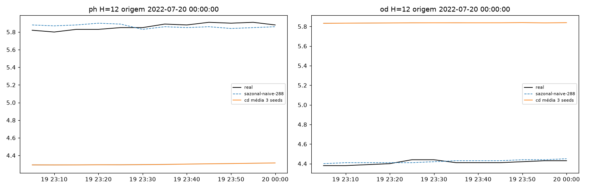
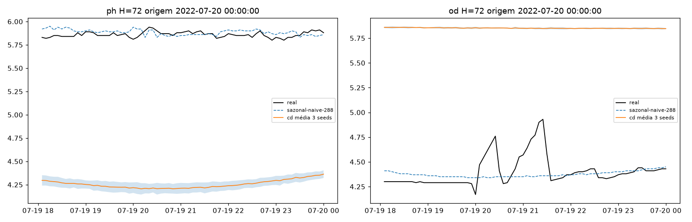
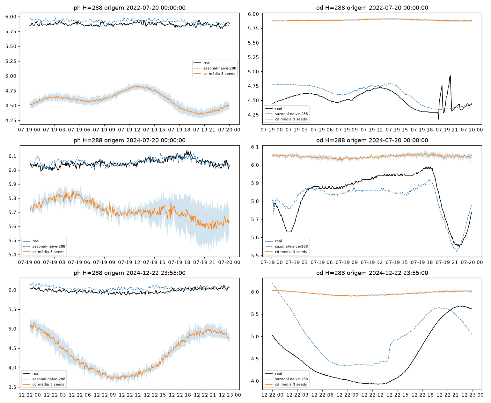
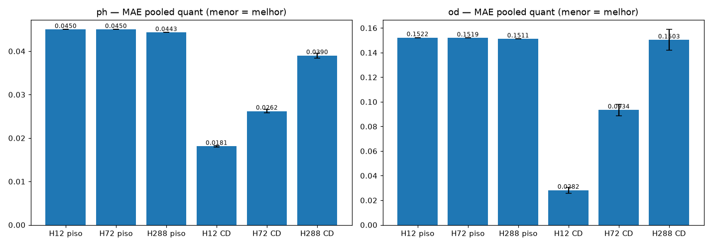
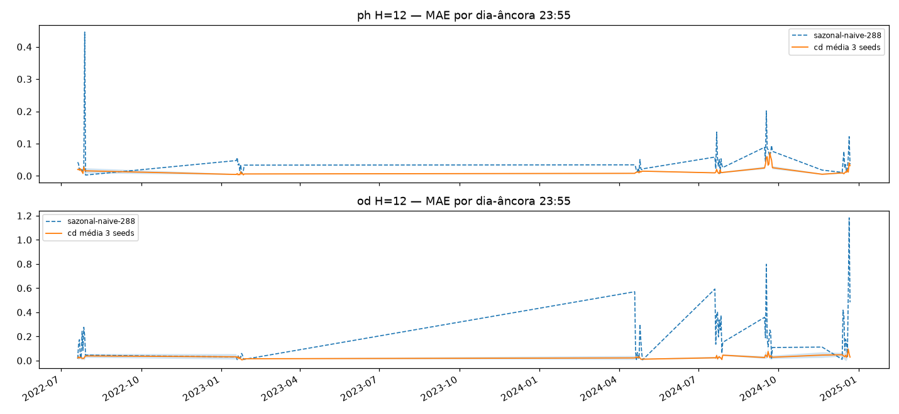
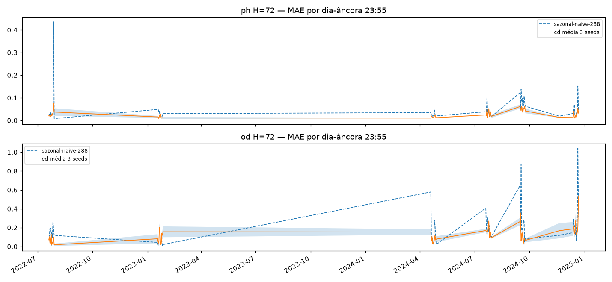
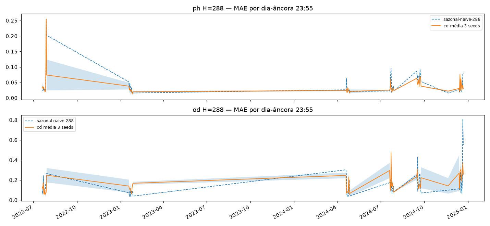
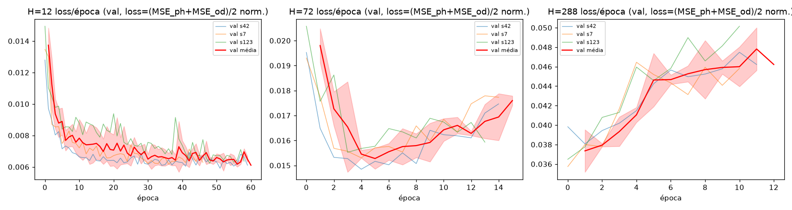
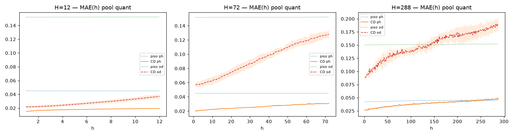

# Experimento M3 — PatchTST-CD multi (EF01): joint-attention 4 canais → 2 heads, 3 horizontes dedicados × 3 seeds

PatchTST channel-dependent (OD + pH + Temp + Turb + tempo) nos horizontes dedicados
`H = 12 (1h) / 72 (6h) / 288 (24h)`, `L=2304` fixo, treino 2022–2024 no split
único com purge/embargo ±288. Braço **tratamento** da ablação CI vs CD: CD =
joint-attention sobre patches concatenados dos 4 canais (único ponto que difere do
M2-CI — splits, seeds, Hs, limpeza e métricas idênticos, p/ o contraste ser limpo).
Artefatos gerados por `multivariavel/notebooks/M3-patchtst-multi-CD.ipynb` (executado
de ponta a ponta, 0 erros; procedência: `administrador-HP-Z4-G5-Workstation-Desktop-PC`,
20c, torch 2.14.0+cu126, `DEVICE=cuda` em 1× RTX 4000 Ada via
`CUDA_VISIBLE_DEVICES=1`/`M3_DEVICE=cuda`, 20,6 min, 9 treinos em 1101 s, git HEAD
`97fa534`). 2025 intocado.
Reproduzir: `CUDA_VISIBLE_DEVICES=1 M3_DEVICE=cuda .venv/bin/jupyter nbconvert --to notebook --execute --inplace --ExecutePreprocessor.timeout=7200 multivariavel/notebooks/M3-patchtst-multi-CD.ipynb`

## Protocolo (travado do `multivariavel/PLANO.md`, idêntico ao M1 exceto backbone)

- **Janelas** `L=2304 → H∈{12,72,288}` (8 d de contexto; 1 h / 6 h / 24 h), um pipeline por H.
- **Canais**: alvos pH + OD (2 heads), covariáveis Temp + Turb (observed-only); Precipitação excluída. Estação austral só p/ reporte, nunca feature.
- **Limpeza**: grade 5 min por ano + concat 2022→2024, interp `time` limite 24 por canal, descarta janela se qualquer dos 4 canais tem NaN (descarte conjunto pós-interp: 2022 16,1% · 2023 1,3% · 2024 6,7% — iguais ao M1), winsorize de Turbidez em p99 do treino (59,2 NTU) + RevIN per-channel per-window no modelo, z-score por canal fitado só no treino (`modelos/normalizacao.json`).
- **Features**: 11 por passo (4 canais + `tod_sin/cos` + `solar` + 4 Fourier da origem, vocabulário do 12/16) — só no input, nada de futuro dos canais.
- **Val = 7 fatias por data de fim** (5 v2-2024 + 2 auxiliares fixas: verão 18–27/jan/2023, inverno 20–29/jul/2022); purge/embargo ±288 único (Hmax) com `assert gap ≥ 289`, overlap zero (gap mín +289 nos 3 H).
- **Cobertura**: 6 fatias cheias (2880) + **nov/24 qualitativa (436/1440)** — micro-outages de Turbidez amplificados pela janela de ~2300 passos; pela regra do plano fica fora do pooled. Dias-âncora 23:55: 61 (10+10+10+1+10+10+10).
- **Treino**: `PatchTST_CD` (11 séries → patches 48/24 empilhados, N=95 → projeção `528→64` → transformer verbatim 14: 3 camadas × 64 / 4 heads / FF 128 / dropout 0,1 + posicional aprendido → 2 heads `6080→H`: pH, OD; 0,29M params em H12 · 1,02M em H72 · 3,64M em H288), loss `(MSE_ph+MSE_od)/2` normalizada, hiperparams verbatim do 14-PatchTST (`LR=1e-3`, `MAX 60/PAT 10`, `BATCH=256`, Adam/MSE, strides 4/4), seeds `[42, 7, 123]`, early stopping por val pooled (best eps. 37–52 em H12 · 4–5 em H72 · 1–2 em H288). Treino pós-purge: H12 206.009 · H72 204.269 · H288 198.183 janelas.

## Tabela principal — val pooled quantitativa (6 fatias, 17.280 origens)

| H | pH piso | pH CD | OD piso | OD CD |
|---|---|---|---|---|
| 12 (1h) | 0,0450 | **0,0181±0,0002** | 0,1522 | **0,0282±0,0024** |
| 72 (6h) | 0,0450 | **0,0262±0,0004** | 0,1519 | **0,0934±0,0046** |
| 288 (24h) | 0,0443 | **0,0390±0,0006** | 0,1511 | **0,1503±0,0085** |

(copiado de `metricas_pooled.csv` — CD = média±dp das 3 seeds; **bate o `sazonal-naive-288` nos 6 (H, variável) no pooled**, com a margem do OD-H288 finíssima (0,1503 × 0,1511, dentro do dp ±0,0085); contexto, sem comparação direta: réguas uni-v2 H=288 em val 2024 distinta — pH 0,0465 / OD 0,2056 no benchmark 2025.)

## CD vs M1-DLinear — comparação honesta (mesmo split/pisos/Hs; lido de `multivariavel/resultados/M1-dlinear-multi/metricas_pooled.csv`)

| H | pH M1 | pH CD | OD M1 | OD CD |
|---|---|---|---|---|
| 12 (1h) | 0,0224±0,0002 | **0,0181±0,0002 (−19%)** | 0,0590±0,0021 | **0,0282±0,0024 (−52%)** |
| 72 (6h) | 0,0291±0,0009 | **0,0262±0,0004 (−10%)** | 0,1051±0,0076 | **0,0934±0,0046 (−11%)** |
| 288 (24h) | **0,0382±0,0002** | 0,0390±0,0006 (+2%, M1 vence) | **0,1477±0,0032** | 0,1503±0,0085 (+2%, M1 vence) |

CD vence o DLinear em 4 dos 6 (H, var) — todo o ganho está nos horizontes curtos; no H=288 o
linear empata/vence (pH e OD). Sem alegar transferência p/ 2025: o veredito final sobre
multivariado (e o confronto CD×CI) fica p/ o benchmark 2025 e p/ quando M2-CI existir.

## Val por fatia — MAE (média 3 seeds; `metricas_por_fatia.csv`)

| fatia | H12 pH (cd × piso) | H12 OD | H72 pH | H72 OD | H288 pH | H288 OD |
|---|---|---|---|---|---|---|
| abr24 | 0,0128 × 0,0282 | 0,0185 × 0,1186 | 0,0168 × 0,0282 | 0,0624 × 0,1190 | 0,0239 × 0,0282 | 0,1136 × 0,1240 |
| jul24 | 0,0125 × 0,0392 | 0,0298 × 0,1328 | 0,0251 × 0,0392 | 0,0880 × 0,1324 | 0,0353 × 0,0391 | 0,1517 × 0,1316 (piso vence) |
| set24 | 0,0401 × 0,0691 | 0,0305 × 0,1981 | 0,0459 × 0,0690 | 0,1101 × 0,1973 | 0,0553 × 0,0693 | 0,1772 × 0,1969 |
| dez24 | 0,0152 × 0,0381 | 0,0354 × 0,2546 | 0,0234 × 0,0377 | 0,1472 × 0,2536 | 0,0371 × 0,0354 (piso vence) | 0,2449 × 0,2499 |
| jan23aux | 0,0070 × 0,0288 | 0,0283 × 0,0701 | 0,0136 × 0,0288 | 0,0834 × 0,0704 (piso vence) | 0,0252 × 0,0294 | 0,1110 × 0,0717 (piso vence) |
| jul22aux | 0,0208 × 0,0667 | 0,0267 × 0,1387 | 0,0323 × 0,0670 | 0,0691 × 0,1388 | 0,0574 × 0,0644 | 0,1033 × 0,1326 |
| nov24 (quali) | fora do pooled | fora do pooled | fora do pooled | fora do pooled | pH 0,0235 × 0,0176 (piso vence, fora da manchete) | — |

## Curva MAE(h) — o dedicado curto é redundante? Não (`metricas_mae_h.csv`, `08-mae-h.png`)

- pH: H12 vence o H288 em 12/12 passos de h≤12 (h=12: 0,0195±0,0001 × 0,0285±0,0011).
- OD: H12 vence em 12/12 (h=12: 0,0370±0,0030 × 0,0968±0,0119).
- Veredito: horizontes dedicados se justificam; o modelo 24h não cobre o 1h (no OD-H288 o erro em h≤12 é ~2,6× o do H12).

## Dias-âncora (61, `metricas_por_dia.csv`)

Mesma ordem do pooled; detalhe por dia no CSV (1 âncora em nov/24, fatia qualitativa).

## Figuras — o que cada uma mostra

### `01-eda.png`, `01b-distribuicao.png`, `02-limpeza.png`, `03-stl.png` — dado 2022–2024 (blocos NaN por canal, cauda da Turbidez, pH não-estacionário no ADF)

### `04-forecasts-H{12,72,288}.png` — 3 origens do treino em H288 (1 em H12/H72): real × sazonal × CD média±dp 3 seeds

### `05-mae-por-H.png` — barras MAE pooled por (H, variável): pisos × CD

### `06-val-dias-H{12,72,288}.png` — MAE por dia-âncora (7 fatias; faixa = nov/24 qualitativa)

### `07-curvas-treino.png` — loss por época (3 painéis H × 3 seeds; H12 best eps. 37–52, H72 eps. 4–5, H288 eps. 1–2)

### `08-mae-h.png` — curva MAE(h) por (H, variável): o teste de redundância do H curto

## Arquivos

| Arquivo | O quê |
|---|---|
| `metricas_pooled.csv` | Val pooled por H em CSV (primária, 3 linhas: pisos + CD por seed + média±dp) |
| `metricas_por_fatia.csv` | MAE/RMSE por (H, fatia, variável, modelo, seed) em CSV (168 linhas + flag `qualitativa`) |
| `metricas_por_dia.csv` | MAE por dia-âncora em CSV (366 linhas) |
| `metricas_mae_h.csv` | MAE por passo do horizonte em CSV (744 linhas: H×h×var) |
| `modelos/patchtst_CD_H{h}_s{42,7,123}.pt` | PatchTST_CD treinado por (H, seed) (state_dict + config) |
| `modelos/normalizacao.json` | z-stats por canal e por H + slices + seeds + feats + winsor p99 (pequeno, versionado) |
| `figs/` | As 13 figuras explicadas acima |

## Leitura dos resultados

1. **CD bate o piso nos 6 (H, var) no pooled** — mas o OD-H288 (0,1503 × 0,1511, dp ±0,0085) é margem estatisticamente nula; o modelo só se sustenta ali graças a abr24/set24/dez24/jul22aux (perde jul24 e jan23aux p/ o piso).
2. **Ganho sobre o M1-DLinear concentrado nos Hs curtos**: H12 −19% pH / −52% OD; H72 −10% / −11%; H288 perde os dois (+2% cada). A joint-attention captura dinâmica cruzada de curto alcance; em 24h o resíduo linear prevalece — hipótese a retestar contra o M2-CI (se CI repetir o padrão, o ganho curto é do backbone, não da atenção conjunta).
3. **H288 converge em 1–2 épocas** (best val ep 1–2, ~50 s) vs H12 em 37–52 (201–257 s): no H longo o transformer satura de imediato — sinal de que o H288-CD pode estar subtraindo capacidade (ou que o sinal de 24h cabe num ajuste raso). H72 fica no meio (eps. 4–5).
4. **dez24-OD é a fatia dura** (0,24–0,25 CD e piso, todos os H) e **set24 a dura do pH** — mesmo perfil sazonal do M1/uni.
5. **Instabilidade OD-H288 entre seeds** (0,1446–0,1600, dp ±0,0085) vs pH estável (±0,0002–0,0006) — mesmo padrão do M1 (OD-H72 lá); reforça acompanhar seeds p/ OD no benchmark.
6. Limitações declaradas: time-features só no input (futuro-known permitido, não usado, no horizonte); loss MSE sem Huber (spike tratado só com winsorize + RevIN); comparação com M1 só em val 2024 (transferência p/ 2025 só no benchmark); confronto CD×CI pendente do M2.
7. Fila: benchmark 2025 (só inferência) + `M2-patchtst-multi-CI` no mesmo split (1 job/GPU) — checkpoints guardados.
