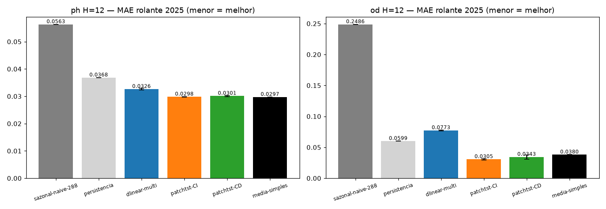
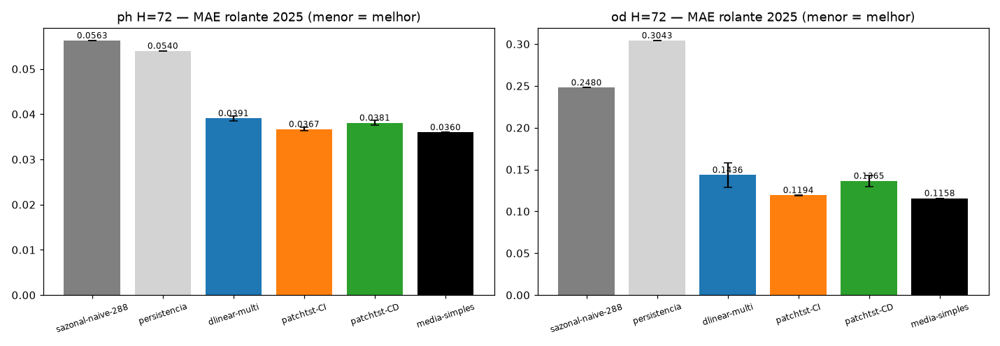
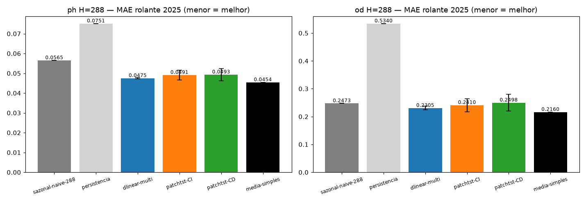
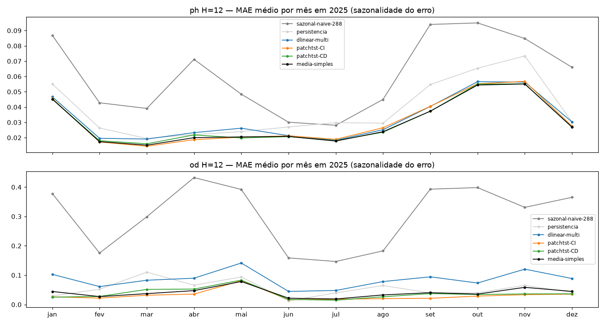
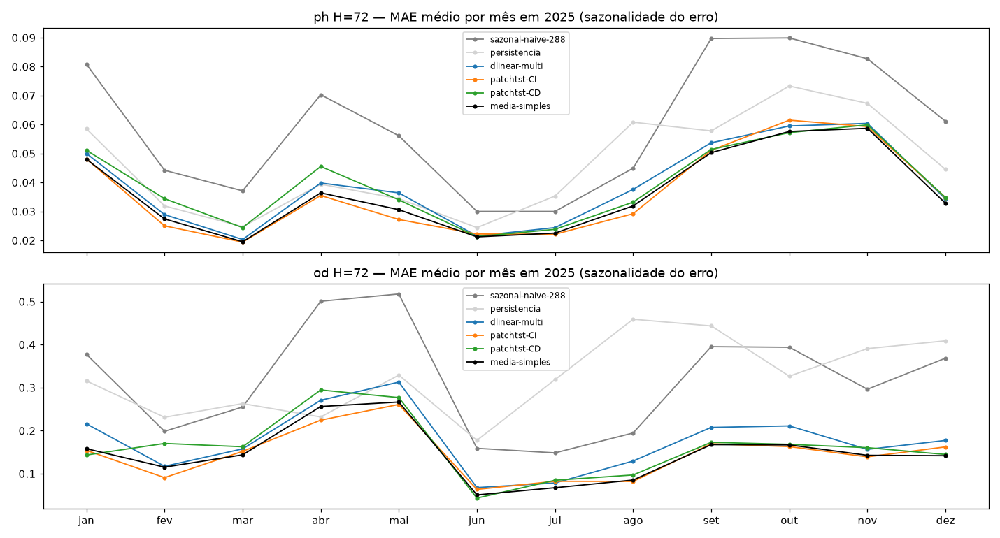
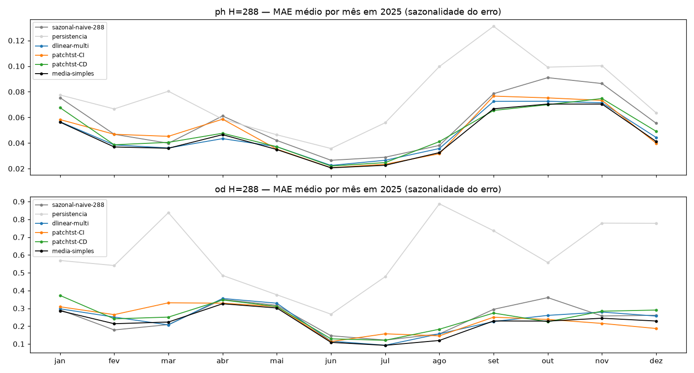
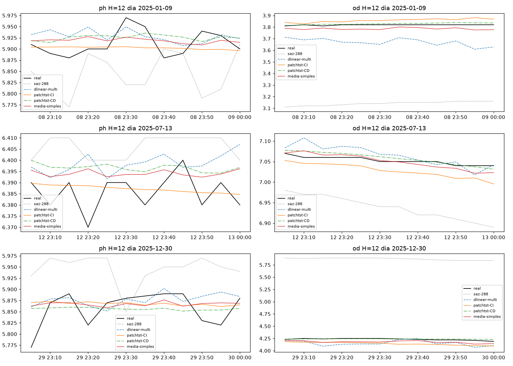
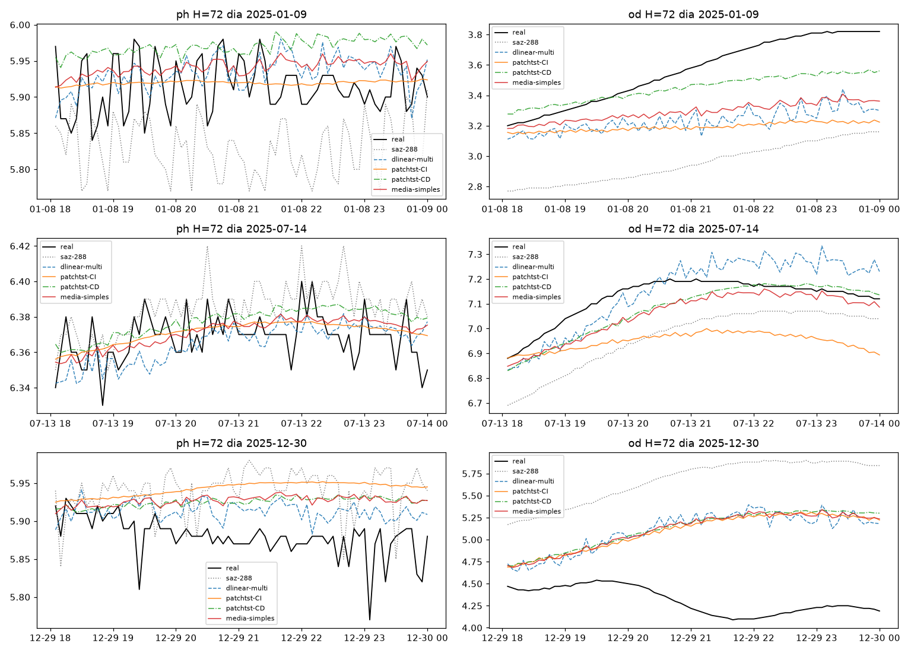
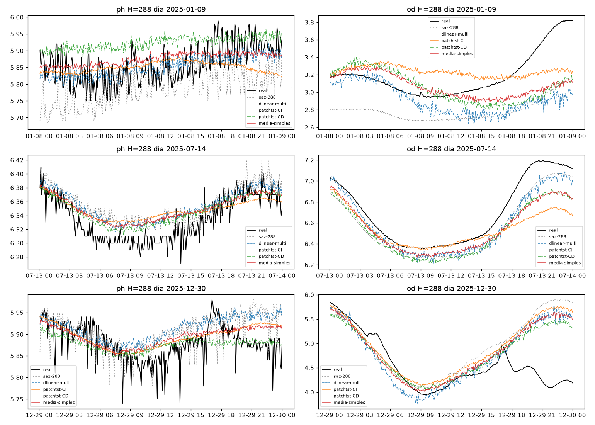

# Experimento M4 — Benchmark 2025 multivariável: M1+M2+M3 × ano intocado (só inferência)

Veredito do plano multivariável (`multivariavel/PLANO.md`, passo 3): os 27 checkpoints
de M1/M2/M3 (treino 2022–2024, `L=2304`, purge/embargo, 7 fatias) previstos em 2025,
ano nunca tocado por nenhum treino, val, tuning, seleção ou ajuste de peso.
Primeiro toque em 2025 = este notebook.
Artefatos gerados por `multivariavel/notebooks/M4-benchmark-2025.ipynb` (executado de ponta a ponta, 0 erros;
procedência: `administrador-HP-Z4-G5-Workstation-Desktop-PC`, 20c, torch 2.14.0+cu126,
`DEVICE=cuda` em 1× RTX 4000 Ada via `CUDA_VISIBLE_DEVICES=0`/`M4_DEVICE=cuda`,
wall 5,5 min, git HEAD `d82e298`).
Reproduzir: `CUDA_VISIBLE_DEVICES=0 M4_DEVICE=cuda .venv/bin/jupyter nbconvert --to notebook --execute --inplace --ExecutePreprocessor.timeout=7200 multivariavel/notebooks/M4-benchmark-2025.ipynb`
(exige os 27 checkpoints M1/M2/M3; ~6 min em 1× GPU; sem treino — trava executável na §8:
`torch.set_grad_enabled(False)` global + `@torch.no_grad()` + `.eval()` + varredura do
próprio `.ipynb` contra tokens de treino).

## Configuração do experimento

- **Benchmark:** `multivariavel/dados/benchmark/ef01-mogi-das-cruzes_multivariavel_2025.csv`
  (OD + pH + Temp + Turb), limpeza idêntica ao M1 (interp `time` limite 24 por canal,
  descarte conjunto, winsorize da turbidez no p99 train-only 59,2 NTU, z-stats dos
  `normalizacao.json` de cada experimento — aplicados, nunca recalculados; divergência
  entre os três JSONs < 1e-6), janelas `L=2304 → H∈{12,72,288}` rolantes no ano inteiro
- **Cobertura (descarte conjunto pós-interp):** H12 74.752 janelas + 261 dias-âncora ·
  H72 74.032 + 260 · H288 71.607 + 250 (âncoras 09/jan → 30/dez; 31/dez sem 23:55 —
  a cauda do CSV termina em 31/dez 00:00). 2025 tem pH ~6,1% / OD 0,6% / Turb 3,1% de
  faltantes na grade cheia (incluídos os 287 slots da cauda ausente)
- **Modelos por (H, variável):** 2 pisos (`sazonal-naive-288` por canal + `persistencia`
  como contexto) + seed-mean de cada família (média das 3 seeds, pesos 1/3 fixos:
  `dlinear-multi` M1, `patchtst-CI` M2, `patchtst-CD` M3) + `media-simples` (média das
  3 seed-means, pesos 1/3 fixos — SÓ diagnóstico, PLANO §2)

## Tabela principal — benchmark rolante 2025 (seed-mean, manchete)

**H=12 (1h), 74.752 origens:**

| modelo | pH MAE | pH RMSE | OD MAE | OD RMSE |
|---|---|---|---|---|
| **media-simples (diag.)** | **0,0297** | 0,0418 | 0,0380 | 0,0664 |
| **patchtst-CI (M2)** | 0,0298 | 0,0421 | **0,0305** | 0,0589 |
| patchtst-CD (M3) | 0,0301 | 0,0423 | 0,0343 | 0,0617 |
| dlinear-multi (M1) | 0,0326 | 0,0454 | 0,0773 | 0,1133 |
| persistencia | 0,0368 | 0,0548 | 0,0599 | 0,0926 |
| sazonal-naive-288 | 0,0563 | 0,0786 | 0,2486 | 0,3696 |

**H=72 (6h), 74.032 origens:**

| modelo | pH MAE | pH RMSE | OD MAE | OD RMSE |
|---|---|---|---|---|
| **media-simples (diag.)** | **0,0360** | 0,0504 | **0,1158** | 0,1816 |
| **patchtst-CI (M2)** | 0,0367 | 0,0515 | 0,1194 | 0,1865 |
| patchtst-CD (M3) | 0,0381 | 0,0527 | 0,1365 | 0,2033 |
| dlinear-multi (M1) | 0,0391 | 0,0544 | 0,1436 | 0,2111 |
| persistencia | 0,0540 | 0,0753 | 0,3043 | 0,4362 |
| sazonal-naive-288 | 0,0563 | 0,0787 | 0,2480 | 0,3688 |

**H=288 (24h), 71.607 origens:**

| modelo | pH MAE | pH RMSE | OD MAE | OD RMSE |
|---|---|---|---|---|
| **media-simples (diag.)** | **0,0454** | 0,0629 | **0,2160** | 0,3099 |
| **dlinear-multi (M1)** | 0,0475 | 0,0657 | 0,2305 | 0,3265 |
| patchtst-CI (M2) | 0,0491 | 0,0679 | 0,2410 | 0,3438 |
| patchtst-CD (M3) | 0,0493 | 0,0671 | 0,2498 | 0,3454 |
| sazonal-naive-288 | 0,0565 | 0,0789 | 0,2473 | 0,3687 |
| persistencia | 0,0751 | 0,1015 | 0,5340 | 0,7155 |

(copiado de `metricas_benchmark.csv` — seed = `seed-mean/fixo`; por seed em
`metricas_benchmark.csv` com seed 42/7/123; dias-âncora em `metricas_diaria.csv`;
por mês em `metricas_por_mes.csv`)

**Margens ±dp entre seeds no rolante** (média±dp dos MAEs por seed — teste de margem,
não manchete): H12 ph DL 0,0346±0,0003 · CI 0,0300±0,0001 · CD 0,0305±0,0003 /
od DL 0,0963±0,0008 · CI 0,0368±0,0012 · CD 0,0407±0,0034;
H72 ph DL 0,0422±0,0005 · CI 0,0375±0,0004 · CD 0,0391±0,0005 /
od DL 0,1734±0,0147 · CI 0,1324±0,0004 · CD 0,1479±0,0067;
H288 ph DL 0,0499±0,0003 · CI 0,0508±0,0026 · CD 0,0526±0,0031 /
od DL 0,2543±0,0065 · CI 0,2585±0,0235 · CD 0,2723±0,0299.
Nota: o MAE da predição seed-mean (tabela acima) é sistematicamente menor que a média
dos MAEs por seed — cancelamento genuíno (erros entre seeds têm correlação só 0,52–0,66;
verificado com código independente p/ M1-H12-OD: seeds 0,0968/0,0959/0,0969 → média 0,0774).

**Dias-âncora (checagem, não manchete):** mesma ordem do rolante em 5/6 (H,var) —
pH ms vence nos 3 H (0,0296 / 0,0368 / 0,0453); OD H12 CI 0,0302 < ms 0,0404,
H72 CI 0,1460 ≈ ms 0,1478, H288 ms 0,2182 < DL 0,2369. O ranking rolante decide.

## Figuras — o que cada uma mostra

### `01-eda.png` — o ano de 2025 (4 canais; pH com a maior taxa de faltantes, cauda 31/dez ausente)

### `04-mae-H{12,72,288}.png` — barras de MAE no benchmark (seed-mean ±dp entre seeds)

### `05-mensal-H{12,72,288}.png` — MAE médio por mês, dias-âncora (sazonalidade do erro)

- Leitura: o perfil sazonal do uni-18 se repete — no pH o erro concentra-se em
  set–nov (pior mês out/nov ~0,06–0,09 conforme H) com o melhor em jun (~0,02) ou mar
  nos Hs curtos; no OD os erros são mínimos em jun–jul (~0,01–0,12) e máximos em
  abr–mai/out (~0,26–0,52); a persistência no OD-H12 (0,0599) é o único piso que morde
  um modelo treinável (DLinear 0,0773) — ver veredito.

### `06-exemplos-H{12,72,288}.png` — 3 dias-âncora previstos (real × saz-288 × M1/M2/M3/ms)

## Arquivos

| Arquivo | O quê |
|---|---|
| `metricas_benchmark.csv` | Rolante completo em CSV (primária: 90 linhas = 3 H × 2 var × (6 seed-mean/fixos + 9 por seed)) |
| `metricas_diaria.csv` | Dias-âncora em CSV (771 dias × 2 var; MAE por modelo + por seed + média±dp) |
| `metricas_por_mes.csv` | MAE médio por mês em CSV (72 linhas = 3 H × 12 meses × 2 var) |
| `figs/` | As 11 figuras explicadas acima |

Sem pasta `modelos/` — nenhum treino aqui; todos os checkpoints são de M1/M2/M3.

## Veredito — o que o benchmark 2025 decide

1. **O ranking CI×CD×DLinear transfere da val p/ 2025 em 5/6 (H,var)** (val = pooled
   M1/M2/M3; 2025 = rolante seed-mean deste bench):
   H12 ph val CI 0,0178 < CD 0,0181 < DL 0,0224 → 2025 CI 0,0298 < CD 0,0301 < DL 0,0326;
   H12 od val CI 0,0263 < CD 0,0282 < DL 0,0590 → 2025 CI 0,0305 < CD 0,0343 < DL 0,0773;
   H72 ph val CI 0,0257 < CD 0,0262 < DL 0,0291 → 2025 CI 0,0367 < CD 0,0381 < DL 0,0391;
   H72 od val CI 0,0880 < CD 0,0934 < DL 0,1051 → 2025 CI 0,1194 < CD 0,1365 < DL 0,1436;
   H288 od val DL 0,1477 < CI 0,1499 < CD 0,1503 → 2025 DL 0,2305 < CI 0,2410 < CD 0,2498.
   Exceção honesta: **H288-pH troca CI×DL** (val CI 0,0377 < DL 0,0382; 2025 DL 0,0475 <
   CI 0,0491) — gap 0,0016 dentro do dp do CI (±0,0026): margem nula, empate técnico.
   **CI vence CD nos 6/6 em 2025** (com folga em H12-od/H72-od; técnico em H288-ph).
2. **Todos batem o piso sazonal do mesmo H em 2025, menos dois pontos honestos:**
   o CD-H288-OD (0,2498 × piso 0,2473, margem nula ante dp ±0,0299) empata tecnicamente, e
   o DLinear-H12-OD (0,0773) perde até da **persistência** (0,0599) — o linear erra nível
   de 1h no OD de 2025; o CI (0,0305) segue o melhor ali.
3. **Multi-H288 × réguas uni-v2** (pH PatchTST 0,0465 · OD PatchTST 0,2056 — mesmo ano de
   teste, comparação direta, com o caveat de val de origem distinta): nenhum modelo
   multi solo bate as réguas (pH DL 0,0475 / CI 0,0491 / CD 0,0493 · OD DL 0,2305 /
   CI 0,2410 / CD 0,2498). A média-simples-diagnóstico empata/morde no pH (0,0454,
   −2,4% sobre 0,0465, dentro de margem) e perde no OD (0,2160 × 0,2056). Pisos multi
   deste bench ≈ pisos uni do 18 (saz pH 0,0565 = idêntico; OD 0,2473 × 0,2519).
4. **Sem régua nova:** a média-simples lidera 5/6 (H,var) mas é diagnóstico
   (PLANO §2) e suas margens sobre o melhor solo (pH: 0,0001–0,0021; OD-H288: 0,0145
   ante dp ±0,0065–0,0299) não passam em teste de margem folgado — nenhuma régua é
   declarada aqui.
