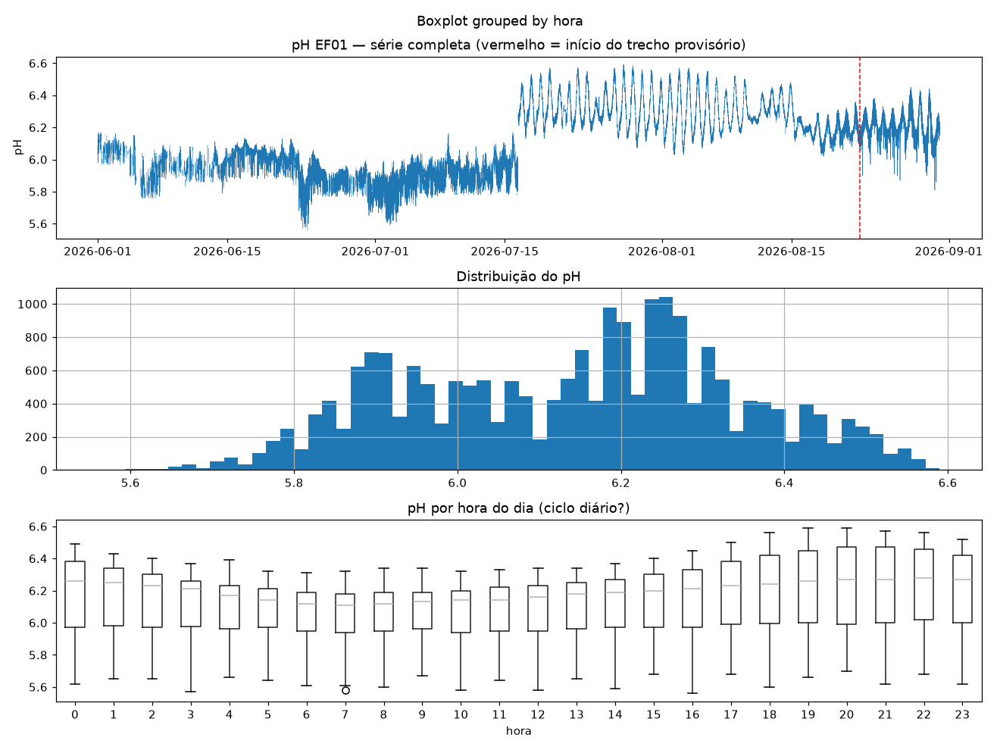
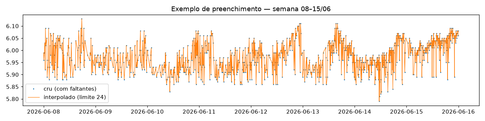
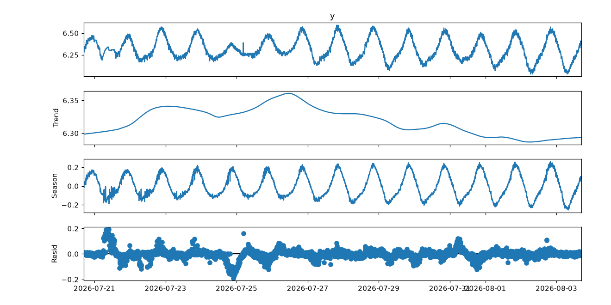
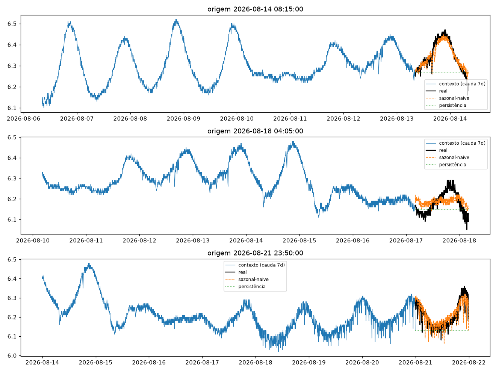
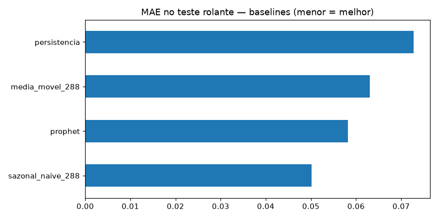
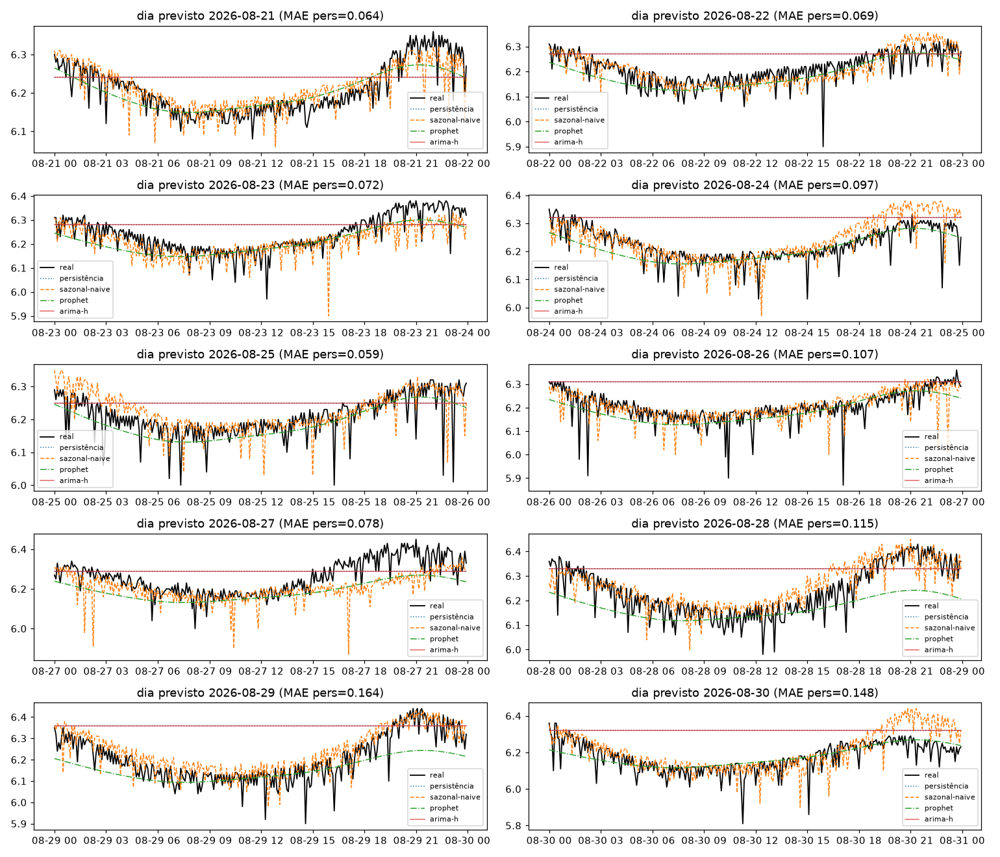

# Experimento 00 — baseline univariado pH (EF01)

Artefatos gerados por `notebooks/00-baseline-arima-prophet.ipynb` (executado de ponta a ponta, 0 erros).
Reproduzir: `uv run --with jupyter jupyter nbconvert --to notebook --execute --inplace notebooks/00-baseline-arima-prophet.ipynb`
(com o `.venv` ativo, ou `uv pip install -r requirements.txt` antes).

## Configuração do experimento

- **Série:** pH, estação EF01 Mogi das Cruzes, passo de 5 min (`dados/`, ver `dados/README.md`)
- **Lookback `L`:** 8640 (30 dias) · **Horizonte `H`:** 288 (1 dia) · **Split temporal 70/15/15 pré-holdout sem shuffle** (teste rolante: 2.204 origens, alvos 14/08 → 21/08/2026)
- **Holdout puro:** últimos 10 dias (alvos 21/08 → 31/08, 2.594 origens) — alvos nunca treinados; 10 origens diárias (fim de cada dia) para o teste dia-a-dia
- Limpeza: grade completa de 5 min + interpolação temporal máx. 2 h (0 NaN restante; 0 janelas descartadas)

## Tabela principal — teste rolante (2.204 origens)

| modelo | MAE | RMSE | MAPE | sMAPE |
|---|---|---|---|---|
| **sazonal-naive (lag 288)** | **0,0501** | 0,0648 | 0,8079 | 0,8051 |
| Prophet | 0,0582 | 0,0712 | 0,9347 | 0,9337 |
| média móvel 288 | 0,0631 | 0,0768 | 1,0159 | 1,0133 |
| persistência | 0,0727 | 0,0942 | 1,1683 | 1,1657 |

**Baseline a bater: sazonal-naive (MAE 0,0501).** Em H=1 dia o jogo vira: repetir o último valor (persistência) é o pior modelo — ontem-na-mesma-hora carrega o ciclo diário inteiro.

## Tabela do holdout — 10 dias previstos (alvos nunca treinados)

| modelo | MAE | RMSE | MAPE | sMAPE |
|---|---|---|---|---|
| **sazonal-naive 288** | **0,0466** | 0,0673 | 0,7501 | 0,7497 |
| prophet | 0,0474 | 0,0632 | 0,7599 | 0,7626 |
| média móvel 288 | 0,0655 | 0,0823 | 1,0547 | 1,0540 |
| persistência | 0,0973 | 0,1204 | 1,5774 | 1,5599 |
| arima_212_h | 0,0973 | 0,1204 | 1,5774 | 1,5599 |

MAE por dia previsto (persistência × sazonal-naive):

| dia | persistência | sazonal-naive |
|---|---|---|
| 21/08 | 0,064 | 0,032 |
| 22/08 | 0,069 | 0,036 |
| 23/08 | 0,073 | 0,044 |
| 24/08 | 0,097 | 0,041 |
| 25/08 | 0,059 | 0,038 |
| 26/08 | 0,107 | 0,037 |
| 27/08 | 0,078 | 0,068 |
| 28/08 | 0,115 | 0,052 |
| 29/08 | 0,164 | 0,054 |
| 30/08 | 0,148 | 0,063 |

O sazonal-naive vence em **todos os 10 dias**; a persistência degrada até 0,164 nos últimos dias. Nota honesta: o ARIMA em grade horária empata exatamente com a persistência (convergiu para ela) — conte-o como "não melhor que ingênuo", não como alternativa real. Detalhe por dia em `metricas_holdout.csv`.

## Figuras — o que cada uma mostra

### `01-eda.png` — perfil da série, distribuição e ciclo diário

- **Topo (série completa):** dois regimes visíveis — até ~15/07 o pH oscila em torno de 5,9 com amplitude pequena; depois há uma **mudança de nível** (~6,3) com oscilação diária ampla. A linha vermelha tracejada marca 22/08, início do trecho **provisório** (não validado). Qualquer modelo precisa lidar com essa quebra — um treino só no 1º regime não generaliza para o 2º.
- **Meio (histograma):** distribuição bimodal (corcovas ~5,9 e ~6,25), reflexo direto dos dois regimes — não é uma gaussiana única.
- **Base (boxplot por hora):** ciclo diário real — medianas mais altas à noite (19–23 h) e mais baixas de manhã (6–10 h). É por isso que o sazonal-naive (lag 288 = 1 dia) era um candidato natural; mesmo assim perde da persistência em H=1 h (ver tabelas).

### `02-limpeza.png` — cru × interpolado (semana 08–15/06)

- Pontos azuis = medições crus (com buracos); linha laranja = série após interpolação temporal limitada a 24 passos (2 h). Os gaps são curtos e a série é lenta, então a ponte reta não inventa dinâmica — e o maior gap do dataset tem só 18 passos (1,5 h), logo **nenhuma janela foi descartada**.

### `03-stl.png` — decomposição STL (cauda do treino, período 288)

- **Season:** ciclo diário limpo de amplitude ±0,2 — confirma o boxplot da `01-eda.png`.
- **Trend:** deriva lenta (6,29–6,36 no trecho) — o ADF rejeita raiz unitária (p≈1e-4), mas a quebra de nível de julho mostra que "estacionária no teste ADF" ≠ "estável entre regimes".
- **Resid:** pequeno e centrado, com um mergulho isolado ~24–25/07 (evento real ou falha de sensor — candidato a análise de anomalia futura).

### `04-forecasts.png` — 3 origens do teste rolante (dia inteiro previsto)

- Cada painel: cauda de 7 dias de contexto (azul), dia real (preto), sazonal-naive (laranja, acompanha o ciclo) e persistência (verde pontilhado, reta — sistematicamente deslocada quando o dia tem amplitude).
- Origens em 14/08, 18/08 e 21/08: dá para ver o sazonal-naive "acertando a forma" do dia e a persistência errando o nível.

### `05-mae.png` — barras de MAE no teste rolante

- Sazonal-naive isolado na frente; Prophet e média móvel no meio; persistência sozinha atrás — o inverso exato do experimento H=12. O ARIMA não entra neste gráfico (avaliado em subamostra/diário).

### `06-holdout-dias.png` — os 10 dias previstos × real (o teste pedido)

- Um painel por dia (21→30/08): real (preto), persistência (azul pontilhado, reta horizontal), sazonal-naive (laranja, segue o ciclo), Prophet (verde, versão suavizada do ciclo) e ARIMA-h (vermelho, colado na persistência).
- Leitura direta: nos dias 29–30/08 a persistência/ARIMA ficam parados num patamar enquanto o real percorre o ciclo (MAE 0,164/0,148 no título); o sazonal-naive acompanha todos os dias (MAE 0,032–0,068). **É assim que se vê se "o dia previsto bate com o original".**

## Arquivos

| Arquivo | O quê |
|---|---|
| `metricas_baseline.csv` | Tabela do teste rolante em CSV |
| `metricas_holdout.csv` | Tabela do holdout diário (todos os modelos) em CSV |
| `modelos/arima212_cauda_treino.pkl` | ARIMA(2,1,2) ajustado na cauda horária do treino (inspeção/reuso) |
| `modelos/prophet_ph.json` (2,7 MB) | Modelo Prophet serializado (sazonalidade diária + semanal) |
| `figs/` | As 6 figuras explicadas acima |

## Leitura dos resultados

1. **Em H=1 dia a persistência quebra (MAE 0,097 no holdout) e o sazonal-naive vira a régua (0,047).** Modelos futuros (LSTM, PatchTST) precisam superá-lo **neste desenho**.
2. **O ciclo diário paga em H=288** — ontem-na-mesma-hora carrega a forma do dia inteiro (`04`/`06`); Prophet entrega quase o mesmo com curva suavizada.
3. **ARIMA horário ≈ persistência** — a agregação 1 h + expansão ×12 não capturou o ciclo; conte-o como "não melhor que ingênuo".
4. **Trecho provisório:** o holdout inclui dados pós-22/08/2026 (não validados) — ver `dados/README.md`; o bloco 12–22/08 validado é o sanity check barato.
5. **Quebra de regime de julho** (`01-eda.png`): o próximo experimento deveria testar robustez a ela (ex.: treinar só pré-quebra e avaliar pós-quebra).
