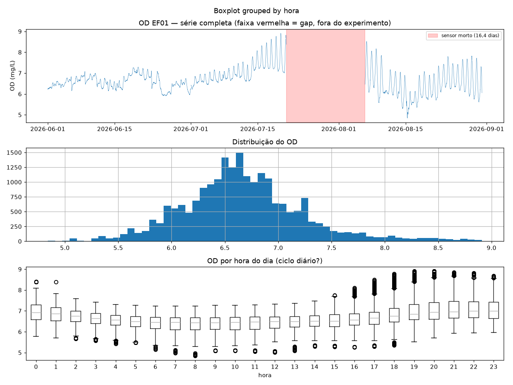
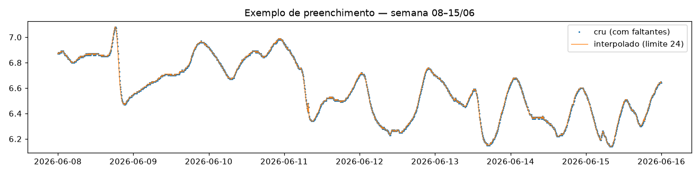
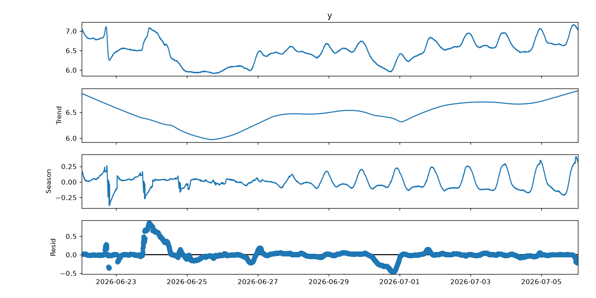
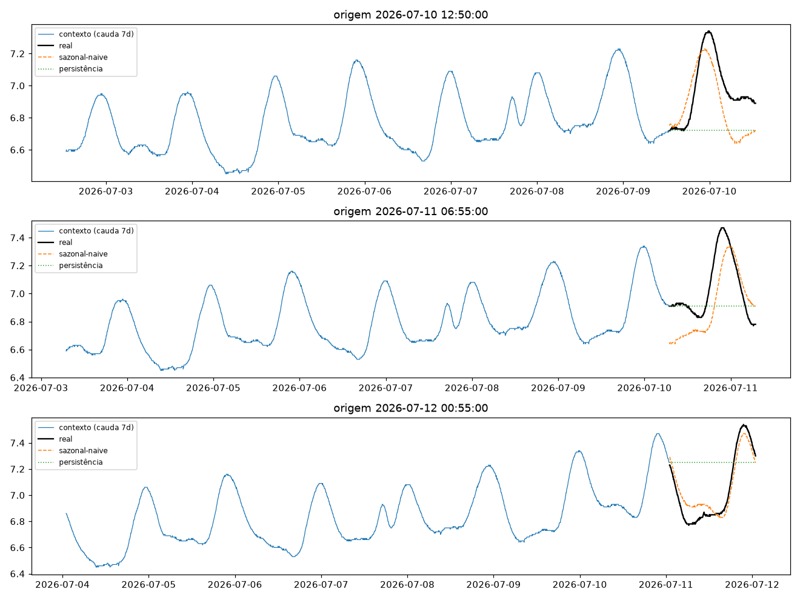
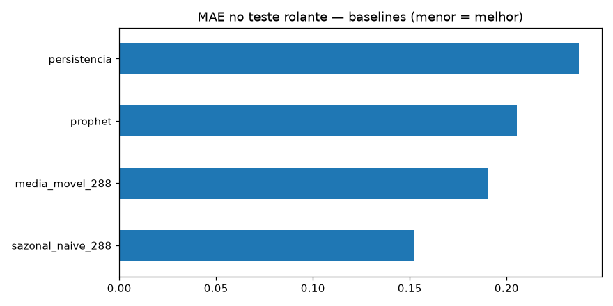
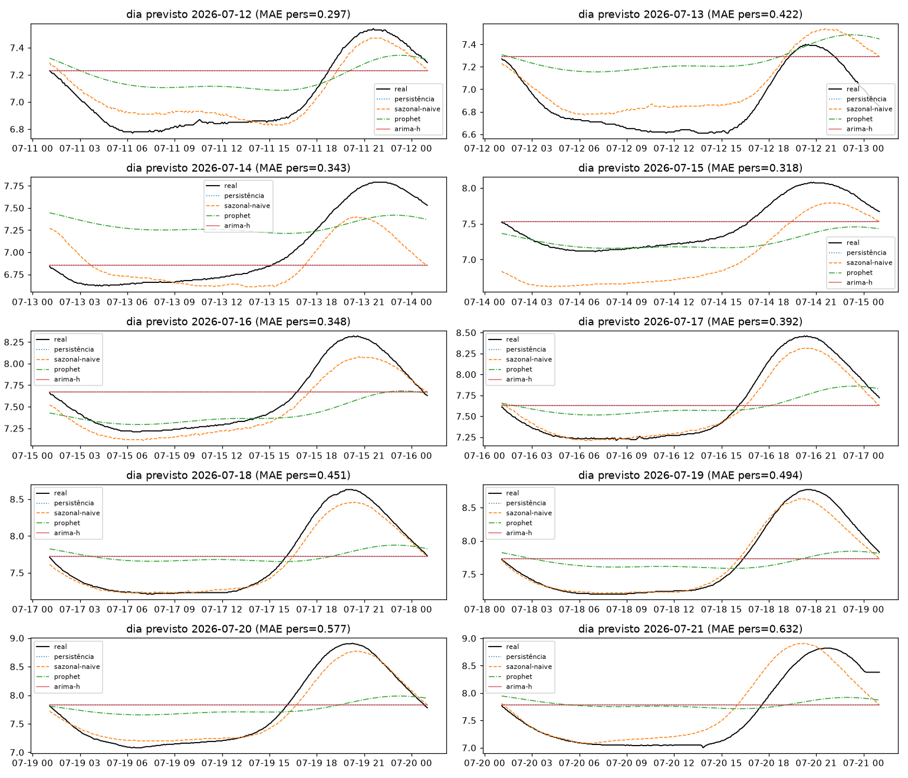

# Experimento 00b — baseline univariado OD (EF01)

Mesmo protocolo do [00-baseline-ph](../00-baseline-ph/) aplicado ao Oxigênio Dissolvido (mg/L).
Artefatos gerados por `notebooks/00b-baseline-od.ipynb` (executado de ponta a ponta, 0 erros).
Reproduzir: `uv run --with jupyter jupyter nbconvert --to notebook --execute --inplace notebooks/00b-baseline-od.ipynb`
(com o `.venv` ativo, ou `uv pip install -r requirements.txt` antes).

## Configuração do experimento (igual ao 00, com um recorte)

- **Série:** OD, estação EF01 Mogi das Cruzes, passo de 5 min (`dados/`, ver `dados/README.md`)
- **Lookback `L`:** 8640 (30 dias) · **Horizonte `H`:** 288 (1 dia) · **Split temporal 70/15/15 pré-holdout sem shuffle**
- **Recorte:** sensor morto de 21/07 01:10 a 06/08 11:30 (16,4 dias, impossível interpolar) → experimento no **segmento limpo 01/06 → 21/07** (50,0 dias; treino 2.025 / val 434 / teste 434 janelas; holdout: 2.594 origens, 10 dias 12→21/07)
- **Bônus:** o segmento inteiro é anterior a 22/08/2026 — este experimento usa **só dados validados**, sem trecho provisório
- Limpeza: grade completa de 5 min + interpolação temporal máx. 2 h (0 NaN restante; 0 janelas descartadas)

## Tabela principal — teste rolante (434 origens)

| modelo | MAE | RMSE | MAPE | sMAPE |
|---|---|---|---|---|
| **sazonal-naive (lag 288)** | **0,1525** | 0,1770 | 2,1668 | 2,1918 |
| média móvel 288 | 0,1900 | 0,2468 | 2,6526 | 2,6942 |
| Prophet | 0,2051 | 0,2285 | 2,9603 | 2,9094 |
| persistência | 0,2371 | 0,3019 | 3,3575 | 3,3530 |

## Tabela do holdout — 10 dias previstos (12→21/07, alvos nunca treinados)

| modelo | MAE | RMSE | MAPE | sMAPE |
|---|---|---|---|---|
| **sazonal-naive 288** | **0,1550** | 0,2233 | 2,0794 | 2,1009 |
| prophet | 0,3745 | 0,4469 | 5,0083 | 4,9765 |
| média móvel 288 | 0,4071 | 0,4916 | 5,3416 | 5,4047 |
| persistência | 0,4273 | 0,4921 | 5,7036 | 5,6685 |
| arima_212_h | 0,4273 | 0,4921 | 5,7036 | 5,6685 |

MAE por dia previsto (persistência × sazonal-naive):

| dia | persistência | sazonal-naive |
|---|---|---|
| 12/07 | 0,297 | 0,076 |
| 13/07 | 0,423 | 0,160 |
| 14/07 | 0,343 | 0,245 |
| 15/07 | 0,318 | 0,454 |
| 16/07 | 0,348 | 0,122 |
| 17/07 | 0,392 | 0,065 |
| 18/07 | 0,451 | 0,059 |
| 19/07 | 0,494 | 0,062 |
| 20/07 | 0,577 | 0,088 |
| 21/07 | 0,632 | 0,219 |

O sazonal-naive vence em **9 dos 10 dias** — a exceção é 15/07, quando o Prophet (0,235) ganha dele (0,454): dia de deslocamento de fase/amplitude (ver `06`). Nota honesta: o ARIMA em grade horária empata exatamente com a persistência — conte-o como "não melhor que ingênuo".

## Figuras — o que cada uma mostra

### `01-eda.png` — perfil, o gap e ciclo diário

- **Topo:** nível subindo até julho com amplitude diária crescente (6→9 mg/L); a **faixa vermelha** é o sensor morto 21/07–06/08, fora do experimento.
- **Meio:** distribuição assimétrica à direita (cauda dos picos vespertinos).
- **Base:** ciclo diário forte — OD alto à tarde/noite (16–23 h, fotossíntese) e baixo de manhã (6–12 h). É esse ciclo que faz o sazonal-naive funcionar.

### `02-limpeza.png` — cru × interpolado (semana 08–15/06)

- Pontos azuis + linha laranja colada: gaps curtos preenchidos sem inventar dinâmica.

### `03-stl.png` — decomposição STL (cauda do treino, período 288)

- **Trend:** vale em ~26/06 e retomada de alta; **Season:** ciclo diário de amplitude crescente; **Resid:** pequeno, com lombada ~24/06 (evento real ou falha — candidato a anomalia).

### `04-forecasts.png` — 3 origens do teste rolante (dia inteiro previsto)

- Cauda de 7 dias + dia real (preto): o sazonal-naive (laranja) acerta a fase da onda diária; a persistência (verde, reta) erra o nível o dia todo. Origens em 10, 11 e 12/07.

### `05-mae.png` — barras de MAE no teste rolante

- Sazonal-naive isolado (~0,15); média móvel e Prophet no meio (~0,19–0,21); persistência sozinha atrás (~0,24). O ARIMA não entra no gráfico (subamostra/diário).

### `06-holdout-dias.png` — os 10 dias previstos × real

- Um painel por dia (12→21/07): o sazonal-naive (laranja) acompanha a onda de ~1,5 mg/L de amplitude; persistência/ARIMA-h (retas) ficam para trás à medida que a amplitude cresce (MAE da persistência vai de 0,297 a 0,632); o Prophet (verde) acerta a forma média mas subestima os picos — exceto em 15/07, único dia em que ele vence o sazonal-naive.

## Arquivos

| Arquivo | O quê |
|---|---|
| `metricas_baseline.csv` | Tabela do teste rolante em CSV |
| `metricas_holdout.csv` | Tabela do holdout diário (todos os modelos) em CSV |
| `modelos/arima212_cauda_treino.pkl` | ARIMA(2,1,2) ajustado na cauda horária do treino |
| `modelos/prophet_od.json` | Modelo Prophet serializado (sazonalidade diária + semanal) |
| `figs/` | As 6 figuras explicadas acima |

## Leitura dos resultados

1. **Mesma hierarquia do pH, erros ~3× maiores** (OD tem amplitude maior): sazonal-naive é a régua (0,15–0,16 mg/L), não a persistência.
2. **Prophet perde feio no holdout (0,37)** — a curva média dele não acompanha a amplitude crescente de julho; só vence num dia atípico (15/07).
3. **ARIMA-h = persistência de novo** — segunda evidência de que a agregação horária + expansão ×12 não serve aqui.
4. **Bônus de validade:** tudo neste experimento é dado validado (pré-22/08) — os números são mais confiáveis que os do 00.
5. **Pós-gap (06/08 → 31/08, 24,5 dias) ficou de fora** por falta de contexto de 30 dias — candidato a teste de transferência do modelo sazonal.
