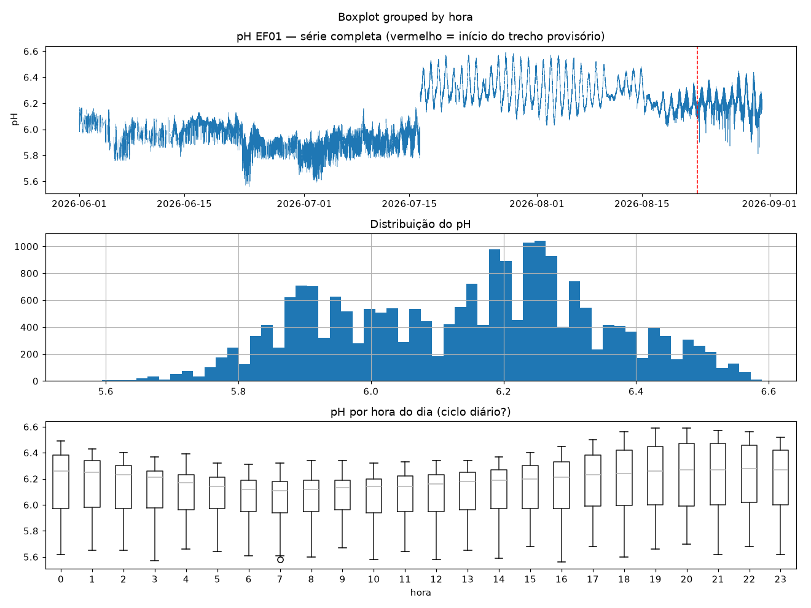
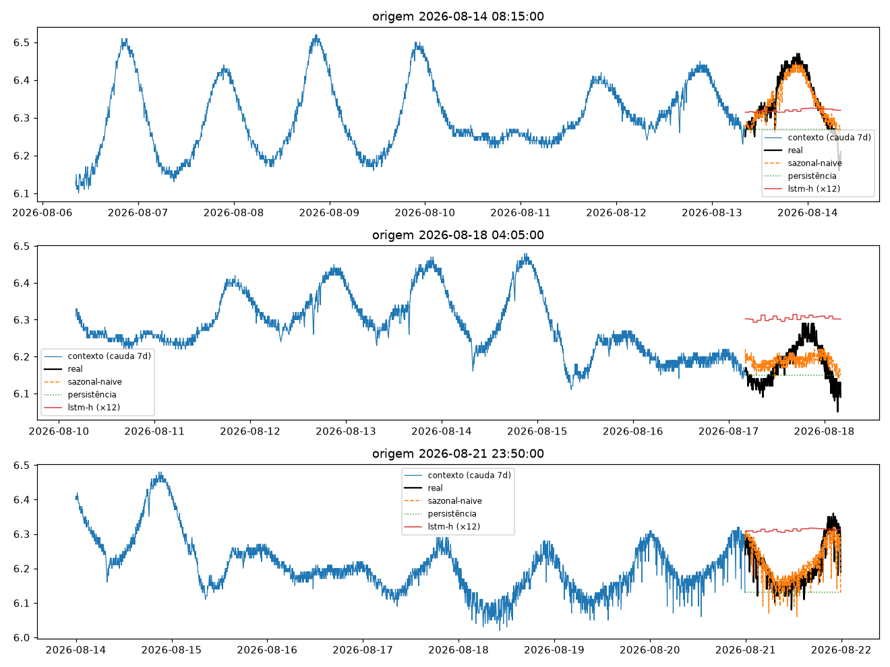
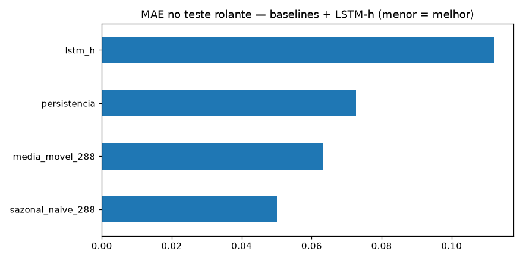
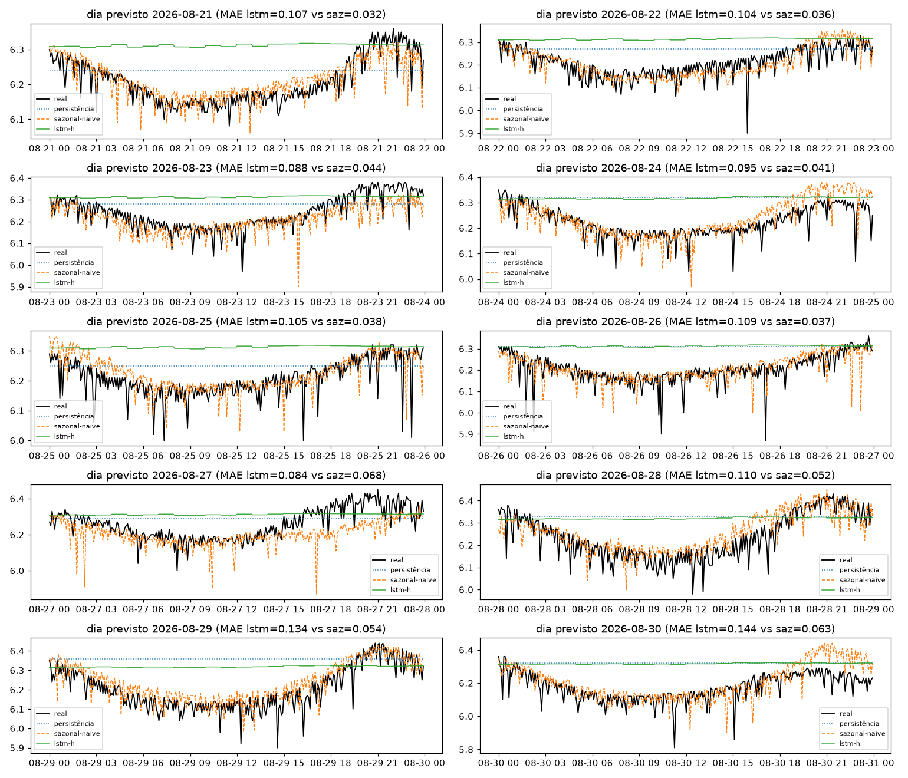
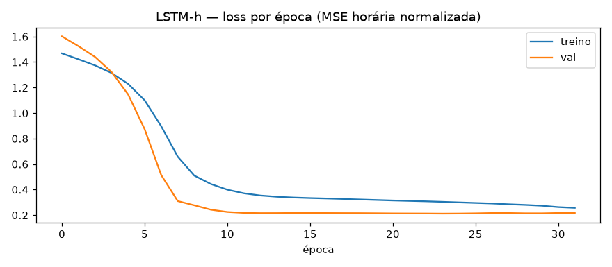

# Experimento 01 — LSTM univariado pH (EF01)

Primeiro modelo neural no pH, **no mesmo desenho do [00-baseline-ph](../00-baseline-ph/)**.
Artefatos gerados por `notebooks/01-lstm-ph.ipynb` (executado de ponta a ponta, 0 erros).
Reproduzir: `.venv/bin/jupyter nbconvert --to notebook --execute --inplace --ExecutePreprocessor.timeout=900 notebooks/01-lstm-ph.ipynb`
(precisa de `torch` CPU no `.venv` — ver `requirements.txt`; treino ~5 min em CPU).

## Configuração do experimento

- **Série:** pH, estação EF01 Mogi das Cruzes, passo de 5 min (`dados/`, ver `dados/README.md`)
- **Protocolo travado (igual ao 00):** lookback `L=8640` (30 dias) · horizonte `H=288` (1 dia) · split temporal 70/15/15 pré-holdout sem shuffle (train 10.281 / val 2.203 / teste 2.204 janelas; alvos do teste 14/08 → 21/08/2026) · **holdout puro** nos últimos 10 dias (alvos 21/08 → 31/08, 2.594 origens) + 10 origens diárias (fim de cada dia)
- **Limpeza:** grade completa de 5 min + interpolação temporal máx. 2 h (0 NaN restante; 0 janelas descartadas)
- **Aproximação de custo (documentada):** LSTM de 8.640 passos a 5 min é inviável em CPU no tempo-alvo (5–10 min). Como o ARIMA no 00, o LSTM roda em **grade horária** — série reamostrada para média de 1 h, contexto `Lh=720h`, alvo `Hh=24h` — e cada previsão horária é repetida 12× para voltar aos 5 min. **Janelas, splits, alvos e métricas são os mesmos do 00** (o mapeamento origem-5min → posição horária é vetorizado e **sem vazamento**: o contexto termina 1 h antes do dia previsto começar).
- **Modelo:** LSTM 1 camada × 32 hidden (5.272 params) + cabeça linear direta 24 passos (sem rollout) · z-score fitado só até o fim do treino (mu=6,0582, sigma=0,1999) · Adam 1e-3, MSE, early stopping na val (patience 8; parou na ep. 32, melhor val=0,2119) · treino em subamostra stride 8 (1.286 janelas; **avaliação em todas as origens**)

## Tabela principal — teste rolante (2.204 origens)

| modelo | MAE | RMSE | MAPE | sMAPE |
|---|---|---|---|---|
| **sazonal-naive (lag 288)** | **0,0501** | 0,0648 | 0,8079 | 0,8051 |
| média móvel 288 | 0,0631 | 0,0768 | 1,0159 | 1,0133 |
| persistência | 0,0727 | 0,0942 | 1,1683 | 1,1657 |
| lstm_h (720h→24h, ×12) | 0,1120 | 0,1255 | 1,8126 | 1,7943 |

## Tabela do holdout — 10 dias previstos (alvos nunca treinados)

| modelo | MAE | RMSE | MAPE | sMAPE |
|---|---|---|---|---|
| **sazonal-naive 288** | **0,0466** | 0,0673 | 0,7501 | 0,7497 |
| média móvel 288 | 0,0655 | 0,0823 | 1,0547 | 1,0540 |
| persistência | 0,0973 | 0,1204 | 1,5774 | 1,5599 |
| lstm_h | 0,1081 | 0,1269 | 1,7518 | 1,7315 |

MAE por dia previsto (sazonal-naive × lstm_h):

| dia | sazonal-naive | lstm_h |
|---|---|---|
| 21/08 | 0,032 | 0,107 |
| 22/08 | 0,036 | 0,104 |
| 23/08 | 0,044 | 0,088 |
| 24/08 | 0,041 | 0,095 |
| 25/08 | 0,038 | 0,105 |
| 26/08 | 0,037 | 0,109 |
| 27/08 | 0,068 | 0,084 |
| 28/08 | 0,052 | 0,110 |
| 29/08 | 0,054 | 0,134 |
| 30/08 | 0,063 | 0,145 |

O sazonal-naive vence o LSTM-h em **todos os 10 dias** (o LSTM-h só fica à frente da persistência nos dias 29–30/08, quando ela colapsa). Detalhe por dia em `metricas_holdout.csv`.

## Figuras — o que cada uma mostra

### `01-eda.png`, `02-limpeza.png`, `03-stl.png` — mesmos do 00 (mesmos dados e limpeza)

### `04-forecasts.png` — 3 origens do teste rolante + curva do LSTM-h

- O LSTM-h (curva adicional) entrega uma forma suavizada/deslocada do dia — acompanha o nível médio mas erra fase e amplitude; o sazonal-naive (ontem-na-mesma-hora, resolução nativa) acerta a forma.

### `05-mae.png` — barras de MAE no teste rolante

- LSTM-h isolado atrás até da persistência — resultado honesto: este desenho neural não compete com os ingênuos.

### `06-holdout-dias.png` — os 10 dias previstos × real

- Um painel por dia: o LSTM-h erra o nível o dia inteiro (viés persistente); o título de cada painel mostra `MAE lstm vs saz` dia a dia.

### `07-curvas-treino.png` — loss por época (nova)

- Treino e val caem juntos (1,6 → 0,21) sem overfit clássico — o modelo **convergiu**; o problema não é treino, é representação (ver leitura).

## Arquivos

| Arquivo | O quê |
|---|---|
| `metricas_baseline.csv` | Tabela do teste rolante em CSV |
| `metricas_holdout.csv` | Tabela do holdout diário em CSV |
| `modelos/lstm_ph.pt` | LSTM treinado (state_dict + config) |
| `modelos/normalizacao.json` | mu/sigma do z-score (fit até o fim do treino) |
| `figs/` | As 7 figuras explicadas acima |

## Leitura dos resultados

1. **O LSTM-h perde de todos os ingênuos (MAE 0,112 / 0,108 vs régua 0,050 / 0,047).** O treino convergiu (`07`), então não é falha de otimização — é a representação: agregação horária + `repeat ×12` destrói a forma intra-hora do ciclo diário, justo o sinal que o sazonal-naive em resolução nativa captura de graça.
2. **Diagnósticos ad-hoc (scripts exploratórios, não versionados):** normalização por janela estilo RevIN (MAE 0,113/0,096), covariáveis de hora-do-dia sen/cos (0,117/0,094) e um Ridge linear direto 720→24 (2 s de treino: 0,094/0,099, `sklearn`). Linear ≈ LSTM ⇒ o gargalo é a grade horária, não a arquitetura. Esses números são exploratórios (para orientar o próximo passo), não artefatos do experimento.
3. **Consequência para o 02:** o próximo modelo deve operar na **resolução nativa de 5 min** — candidatos: PatchTST com patches (reduz tokens sem agregar o alvo, §3.3 do README principal), DLinear-5min com `L` menor, ou LightGBM com lags 288/2016 (tese Zeng §3.2). A grade horária com expansão ×12 está descartada para H=288 (terceira evidência, depois do ARIMA no 00 e 00b).
4. **O que o 01 entrega mesmo assim:** pipeline neural completo e reutilizável (janelamento sem vazamento, z-score só-treino, early stopping, inferência batched nas mesmas janelas, expansão e métricas idênticas ao 00) — o 02 reaproveita tudo, trocando só o modelo e a representação de entrada.
5. **Trecho provisório:** vale o mesmo aviso do 00 — o holdout inclui dados pós-22/08/2026 (não validados).
