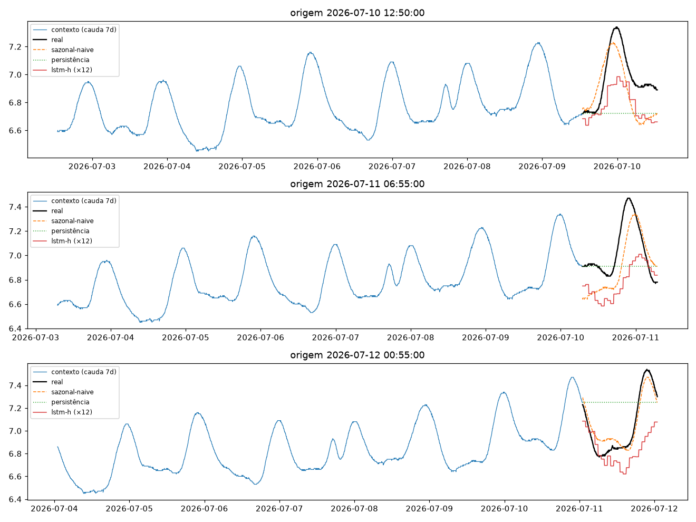
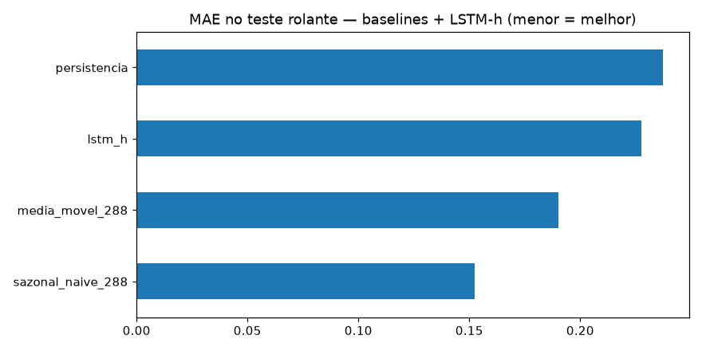
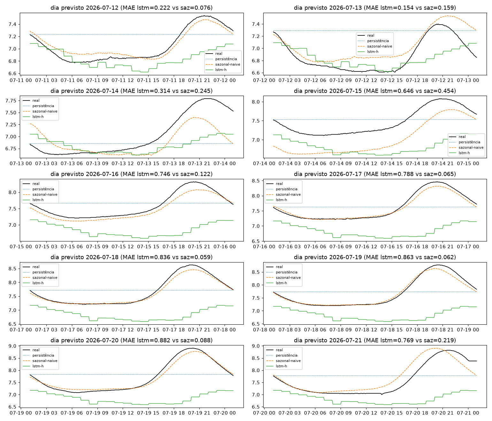
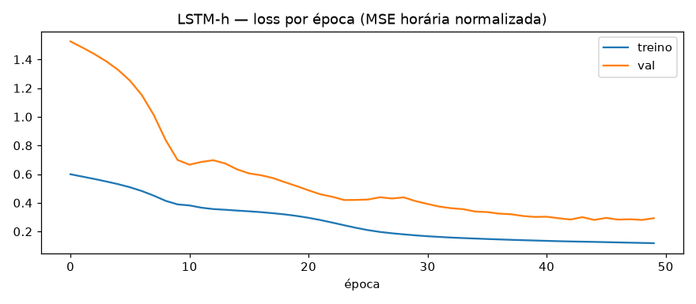

# Experimento 01b — LSTM univariado OD (EF01)

Primeiro modelo neural no Oxigênio Dissolvido (mg/L), **no mesmo desenho do [00b-baseline-od](../00b-baseline-od/)**
e com o mesmo método do [01-lstm-ph](../01-lstm-ph/).
Artefatos gerados por `notebooks/01b-lstm-od.ipynb` (executado de ponta a ponta, 0 erros).
Reproduzir: `.venv/bin/jupyter nbconvert --to notebook --execute --inplace --ExecutePreprocessor.timeout=900 notebooks/01b-lstm-od.ipynb`
(precisa de `torch` CPU no `.venv` — ver `requirements.txt`; treino ~4 min em CPU).

## Configuração do experimento

- **Série:** OD, estação EF01 Mogi das Cruzes, passo de 5 min (`dados/`, ver `dados/README.md`)
- **Recorte (igual ao 00b):** sensor morto de 21/07 01:10 a 06/08 11:30 (16,4 dias) → experimento no **segmento limpo 01/06 → 21/07 01:05** (50,0 dias; 14.413 slots; 0 NaN após interpolação máx. 2 h)
- **Protocolo travado:** lookback `L=8640` (30 dias) · horizonte `H=288` (1 dia) · split temporal 70/15/15 pré-holdout sem shuffle (**train 2.025 / val 434 / teste 434** janelas; alvos do teste 09/07 → 11/07) · **holdout puro** 12/07 → 21/07 (2.594 origens, alvos nunca treinados) + 10 origens diárias
- **Bônus:** o segmento inteiro é anterior a 22/08/2026 — este experimento usa **só dados validados**
- **Aproximação de custo (igual à do 01):** LSTM em **grade horária** (média de 1 h, `Lh=720h` → `Hh=24h`, previsão repetida 12×); mapeamento origem-5min → posição horária vetorizado e **sem vazamento**
- **Modelo:** LSTM 1 camada × 32 hidden (5.272 params) + cabeça linear direta 24 passos · z-score fitado só até o fim do treino (mu=6,5954, sigma=0,2870) · Adam 1e-3, MSE, early stopping na val (treino stride 2: 1.013 janelas, val stride 2: 217 — mesma escala do 01; parou na ep. ~32, train 0,17 vs val 0,42) · **avaliação em todas as origens**

## Tabela principal — teste rolante (434 origens)

| modelo | MAE | RMSE | MAPE | sMAPE |
|---|---|---|---|---|
| **sazonal-naive (lag 288)** | **0,1525** | 0,1770 | 2,1668 | 2,1918 |
| média móvel 288 | 0,1900 | 0,2468 | 2,6526 | 2,6942 |
| lstm_h (720h→24h, ×12) | 0,2277 | 0,2812 | 3,1879 | 3,2648 |
| persistência | 0,2371 | 0,3019 | 3,3575 | 3,3530 |

No teste o LSTM-h fica à frente só da persistência.

## Tabela do holdout — 10 dias previstos (12→21/07, alvos nunca treinados)

| modelo | MAE | RMSE | MAPE | sMAPE |
|---|---|---|---|---|
| **sazonal-naive 288** | **0,1550** | 0,2233 | 2,0794 | 2,1009 |
| persistência | 0,4273 | 0,4921 | 5,7036 | 5,6685 |
| lstm_h | 0,6220 | 0,7987 | 7,9727 | 8,4955 |

MAE por dia previsto:

| dia | persistência | sazonal-naive | lstm_h |
|---|---|---|---|
| 12/07 | 0,297 | 0,076 | 0,222 |
| 13/07 | 0,423 | 0,160 | 0,154 |
| 14/07 | 0,343 | 0,245 | 0,314 |
| 15/07 | 0,318 | 0,454 | 0,646 |
| 16/07 | 0,348 | 0,122 | 0,746 |
| 17/07 | 0,392 | 0,065 | 0,788 |
| 18/07 | 0,451 | 0,059 | 0,837 |
| 19/07 | 0,494 | 0,062 | 0,863 |
| 20/07 | 0,577 | 0,088 | 0,882 |
| 21/07 | 0,632 | 0,219 | 0,769 |

Leitura direta: o LSTM-h começa competitivo (12–14/07, chega a bater a persistência) e **colapsa a partir de 15/07**, quando a amplitude diária de julho cresce (ver `01-eda.png` do 00b) — termina pior que a persistência em 6 dos 10 dias. Detalhe em `metricas_holdout.csv`.

## Figuras — o que cada uma mostra

### `01-eda.png`, `02-limpeza.png`, `03-stl.png` — mesmos dados do 00b (gap + recorte)

### `04-forecasts.png` — 3 origens do teste rolante + curva do LSTM-h

### `05-mae.png` — barras de MAE no teste rolante

### `06-holdout-dias.png` — os 10 dias previstos × real

- Um painel por dia (12→21/07): dá para ver o LSTM-h acompanhando razoavelmente nos primeiros dias e descolando (viés + amplitude errada) à medida que julho avança.

### `07-curvas-treino.png` — loss por época (nova)

- Aviso visível já no treino: val (0,42) descola do treino (0,17) — overfit + shift de regime dentro do próprio segmento; o colapso no holdout não foi surpresa.

## Arquivos

| Arquivo | O quê |
|---|---|
| `metricas_baseline.csv` | Tabela do teste rolante em CSV |
| `metricas_holdout.csv` | Tabela do holdout diário em CSV |
| `modelos/lstm_od.pt` | LSTM treinado (state_dict + config) |
| `modelos/normalizacao.json` | mu/sigma do z-score (fit até o fim do treino) |
| `figs/` | As 7 figuras explicadas acima |

## Leitura dos resultados

1. **O LSTM-h perde no OD como perdeu no pH — e pior (MAE 0,228 / 0,622 vs régua 0,153 / 0,155).** Mesma causa (grade horária + ×12 destrói a forma intra-hora) agravada pela não-estacionariedade do OD: nível subindo e amplitude diária crescente em julho, que o z-score global não acompanha.
2. **O colapso é progressivo, não pontual** (tabela por dia: 0,15–0,31 até 14/07 → 0,65–0,88 depois) — e o gap treino/val (`07`) já o anunciava. Modelo que não extrapola amplitude não serve para esta série.
3. **Quarta evidência contra a grade horária com ×12 para H=288** (depois de ARIMA no 00/00b e LSTM-h no 01): o próximo modelo no OD também deve operar na **resolução nativa** (PatchTST/DLinear/LightGBM com lags 288/2016).
4. **Bônus de validade:** tudo neste experimento é dado validado (pré-22/08) — o negativo é confiável.
5. **Pós-gap (06/08 → 31/08) segue de fora** (ver 00b) — candidato a teste de transferência quando houver um modelo que bata a régua no segmento limpo.
