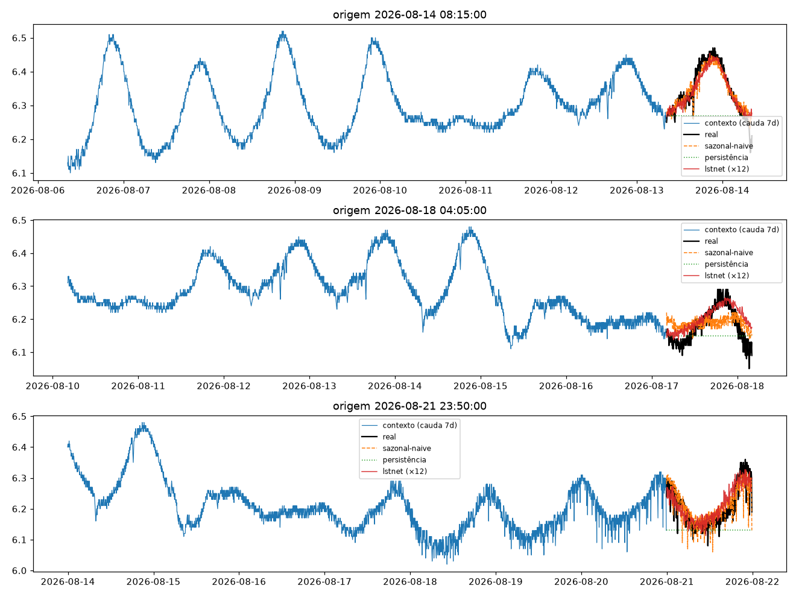
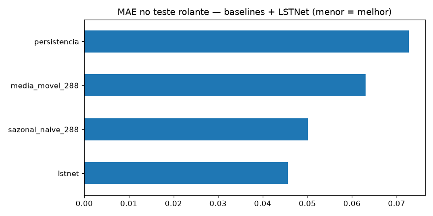
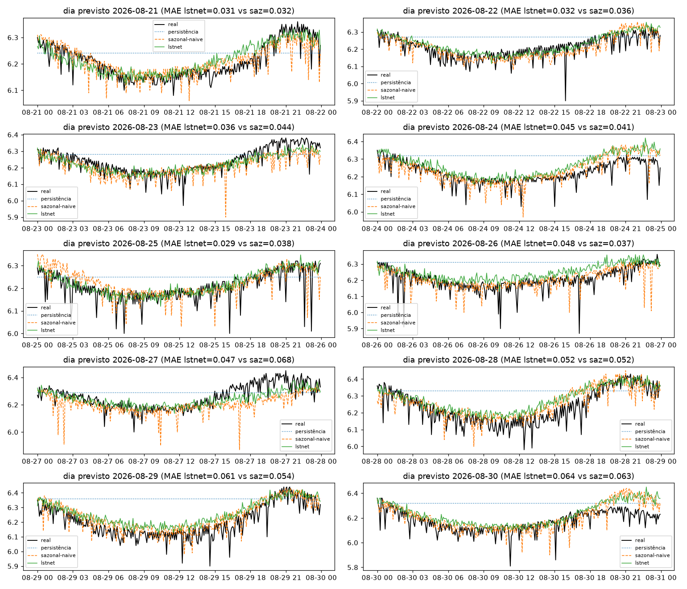

# Experimento 02 — LSTNet adaptado no pH (EF01) ✅ nova régua

Primeiro modelo neural a **bater o sazonal-naive**, no mesmo desenho do [00-baseline-ph](../00-baseline-ph/).
Artefatos gerados por `notebooks/02-lstnet-ph.ipynb` (executado de ponta a ponta, 0 erros).
Reproduzir: `.venv/bin/jupyter nbconvert --to notebook --execute --inplace --ExecutePreprocessor.timeout=900 notebooks/02-lstnet-ph.ipynb`
(precisa de `torch` CPU no `.venv` — ver `requirements.txt`; treino ~10 min em CPU).

## Configuração do experimento

- **Série:** pH, estação EF01 Mogi das Cruzes, passo de 5 min (`dados/`, ver `dados/README.md`)
- **Protocolo travado (igual ao 00/01):** avaliação em janelas `L=8640 → H=288` · split temporal 70/15/15 pré-holdout sem shuffle (train 10.281 / val 2.203 / teste 2.204; alvos do teste 14/08 → 21/08) · **holdout puro** 21/08 → 31/08 (2.594 origens) + 10 origens diárias · limpeza idêntica (0 NaN, 0 janelas descartadas)
- **Arquitetura (Lai et al. 2018, adaptada univariada):** contexto **nativo `LN=2016`** (7 dias, últimos passos de cada janela) + canais hora-do-dia sen/cos → Conv1D (k=12, stride 6, 32 filtros: 2016 → 335 passos) → GRU (64) + recurrent-skip `p=48` (mesma fase do dia anterior, 32) → cabeça linear **direta H=288** + **atalho AR-288 linear em paralelo** (escala/nível) + **RevIN por janela** (afim aprendida). Soma linear+neural no espaço normalizado, uma desnormalização (detalhe de implementação que fez o treino convergir — ver leitura §4).
- **Treino:** 137.506 params · Adam 1e-3, MSE · subamostra stride 4 (2.571 treino / 551 val; **avaliação em todas as origens**) · early stopping patience 10 (parou na ep. 28, train 0,0042 vs val 0,0034 — sem overfit)

## Tabela principal — teste rolante (2.204 origens)

| modelo | MAE | RMSE | MAPE | sMAPE |
|---|---|---|---|---|
| **lstnet** | **0,0456** | 0,0605 | 0,7351 | 0,7318 |
| sazonal-naive (lag 288) | 0,0501 | 0,0648 | 0,8079 | 0,8051 |
| média móvel 288 | 0,0631 | 0,0768 | 1,0159 | 1,0133 |
| persistência | 0,0727 | 0,0942 | 1,1683 | 1,1657 |

**−9,0% de MAE sobre o sazonal-naive.** Também vence em RMSE (−6,6%).

## Tabela do holdout — 10 dias previstos (alvos nunca treinados)

| modelo | MAE | RMSE | MAPE | sMAPE |
|---|---|---|---|---|
| **lstnet** | **0,0446** | 0,0617 | 0,7209 | 0,7173 |
| sazonal-naive 288 | 0,0466 | 0,0673 | 0,7501 | 0,7497 |
| média móvel 288 | 0,0655 | 0,0823 | 1,0547 | 1,0540 |
| persistência | 0,0973 | 0,1204 | 1,5774 | 1,5599 |

MAE por dia previsto (sazonal-naive × lstnet):

| dia | sazonal-naive | lstnet |
|---|---|---|
| 21/08 | 0,032 | 0,031 |
| 22/08 | 0,036 | 0,032 |
| 23/08 | 0,044 | 0,037 |
| 24/08 | 0,041 | 0,045 |
| 25/08 | 0,038 | 0,029 |
| 26/08 | 0,037 | 0,048 |
| 27/08 | 0,068 | 0,047 |
| 28/08 | 0,052 | 0,052 |
| 29/08 | 0,054 | 0,062 |
| 30/08 | 0,063 | 0,064 |

O LSTNet vence em **8 dos 10 dias** (26/08 e 30/08 são empates técnicos). Detalhe em `metricas_holdout.csv`.

## Figuras — o que cada uma mostra

### `01-eda.png`, `02-limpeza.png`, `03-stl.png` — mesmos do 00/01 (mesmos dados)

### `04-forecasts.png` — 3 origens do teste rolante + curva do LSTNet

- O LSTNet (curva adicional) cola no ciclo diário como o sazonal-naive, mas com nível/amplitude ligeiramente melhores — é daí que vêm os −9%.

### `05-mae.png` — barras de MAE no teste rolante

- Pela primeira vez a barra neural fica à esquerda dos ingênuos.

### `06-holdout-dias.png` — os 10 dias previstos × real

- Um painel por dia (21→30/08): LSTNet acompanha todos os dias; o título mostra `MAE lstnet vs saz` dia a dia.

### `07-curvas-treino.png` — loss por época

- Queda limpa (0,015 → 0,003) com treino e val juntos até a ep. 28 — sem o descolamento que o 01b mostrou no OD.

## Arquivos

| Arquivo | O quê |
|---|---|
| `metricas_baseline.csv` | Tabela do teste rolante em CSV |
| `metricas_holdout.csv` | Tabela do holdout diário em CSV |
| `modelos/lstnet_ph.pt` | LSTNet treinado (state_dict + config) |
| `modelos/normalizacao.json` | `{"mode": "revin-per-window", "LN": 2016}` |
| `figs/` | As 7 figuras explicadas acima |

## Leitura dos resultados

1. **Nova régua do pH: LSTNet MAE 0,0456 (rolante) / 0,0446 (holdout).** Os três ingredientes que faltavam ao 01 estavam todos na literatura: resolução nativa (a grade horária era o gargalo — Ridge ≈ LSTM já dizia isso), viés sazonal explícito (skip `p` = 1 dia, LSTNet §3.4) e âncora de escala (atalho AR, LSTNet §3.6).
2. **Detalhe de implementação que decidiu o experimento:** somar o ramo AR e o neural **no espaço normalizado com uma única desnormalização**. A primeira versão (dois ramos desnormalizados somados) partia de loss 36 e nunca convergia (MAE 1,77); a correção partiu de 0,015 e convergiu em 28 épocas. Fica a lição registrada.
3. **A vitória é consistente, não pontual:** melhor em RMSE também, 8/10 dias, sem overfit (treino ≈ val). O 27/08 (pior dia do sazonal-naive: 0,068) é onde o LSTNet mais ganha (0,047) — o modelo faz mais que copiar ontem.
4. **Limites honestos:** margem de −4% no holdout é estreita; o trecho provisório (pós-22/08) contamina parte do holdout como no 00; a ablação do atalho AR (isolar sua contribuição) ficou para depois.
5. **Fila:** replicar no OD (`02b-lstnet-od`, segmento limpo — o teste duro, dada a amplitude crescente de julho) → depois PatchTST nativo (`03`), que herda a lição "resolução nativa + viés sazonal".
