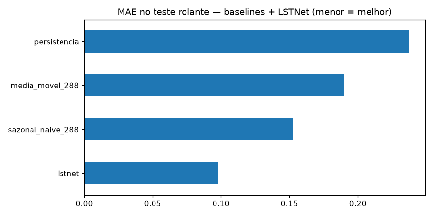
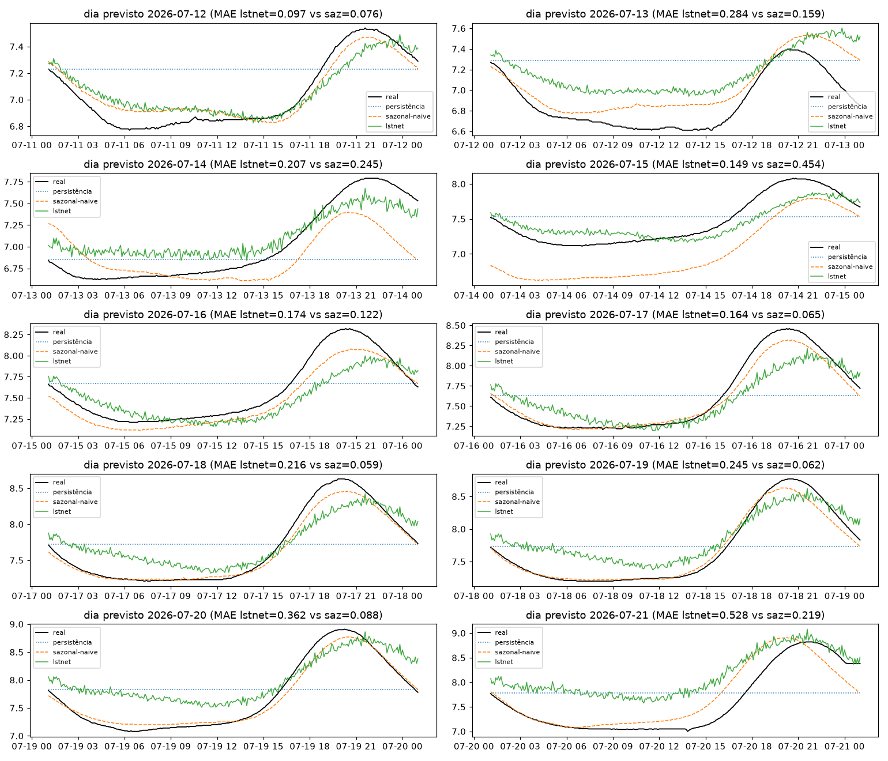
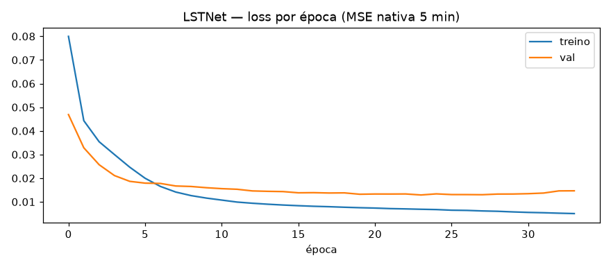

# Experimento 02b — LSTNet adaptado no OD (EF01)

Mesmo método do [02-lstnet-ph](../02-lstnet-ph/), no mesmo desenho do [00b-baseline-od](../00b-baseline-od/).
Artefatos gerados por `notebooks/02b-lstnet-od.ipynb` (executado de ponta a ponta, 0 erros).
Reproduzir: `.venv/bin/jupyter nbconvert --to notebook --execute --inplace --ExecutePreprocessor.timeout=900 notebooks/02b-lstnet-od.ipynb`
(precisa de `torch` CPU no `.venv` — ver `requirements.txt`; treino ~5 min em CPU).

## Configuração do experimento

- **Série:** OD (mg/L), estação EF01 Mogi das Cruzes, passo de 5 min
- **Recorte (igual ao 00b):** segmento limpo 01/06 → 21/07 01:05 (50,0 dias; 0 NaN após interpolação máx. 2 h)
- **Protocolo travado:** avaliação em janelas `L=8640 → H=288` · split 70/15/15 pré-holdout (**train 2.025 / val 434 / teste 434**; alvos do teste 09/07 → 11/07) · **holdout puro** 12/07 → 21/07 (2.594 origens) + 10 origens diárias
- **Bônus:** tudo aqui é dado validado (pré-22/08)
- **Arquitetura (igual à do 02):** contexto nativo `LN=2016` + ToD → Conv1D (k=12, stride 6) → GRU-64 + skip `p=48` → cabeça direta H=288 + atalho AR-288 + RevIN por janela (137.506 params; soma no espaço normalizado, uma desnormalização)
- **Treino:** Adam 1e-3, MSE · stride 2 (1.013 treino / 217 val; **avaliação em todas as origens**) · early stopping (parou na ep. 34, train 0,0050 vs val 0,0129)

## Tabela principal — teste rolante (434 origens)

| modelo | MAE | RMSE | MAPE | sMAPE |
|---|---|---|---|---|
| **lstnet** | **0,0981** | 0,1198 | 1,3839 | 1,3878 |
| sazonal-naive (lag 288) | 0,1525 | 0,1770 | 2,1668 | 2,1918 |
| média móvel 288 | 0,1900 | 0,2468 | 2,6526 | 2,6942 |
| persistência | 0,2371 | 0,3019 | 3,3575 | 3,3530 |

**−35,7% de MAE sobre o sazonal-naive no teste** — melhor neural no OD até aqui.

## Tabela do holdout — 10 dias previstos (12→21/07, alvos nunca treinados)

| modelo | MAE | RMSE | MAPE | sMAPE |
|---|---|---|---|---|
| **sazonal-naive 288** | **0,1550** | 0,2233 | 2,0794 | 2,1009 |
| lstnet | 0,2428 | 0,3048 | 3,2990 | 3,2393 |
| média móvel 288 | 0,4071 | 0,4916 | 5,3416 | 5,4047 |
| persistência | 0,4273 | 0,4921 | 5,7036 | 5,6685 |

MAE por dia previsto:

| dia | sazonal-naive | lstnet |
|---|---|---|
| 12/07 | 0,076 | 0,097 |
| 13/07 | 0,160 | 0,285 |
| 14/07 | 0,245 | 0,207 |
| 15/07 | 0,454 | 0,149 |
| 16/07 | 0,122 | 0,174 |
| 17/07 | 0,065 | 0,164 |
| 18/07 | 0,059 | 0,216 |
| 19/07 | 0,062 | 0,245 |
| 20/07 | 0,088 | 0,363 |
| 21/07 | 0,219 | 0,528 |

Quadro misto: o LSTNet vence com folga o dia atípico de 15/07 (0,149 vs 0,454 — o único dia em que o 00b via o Prophet bater o sazonal-naive) e é competitivo em 12–14/07, mas **degrada à medida que a amplitude de julho cresce** (18–21/07). Detalhe em `metricas_holdout.csv`.

## Figuras — o que cada uma mostra

### `01-eda.png`, `02-limpeza.png`, `03-stl.png` — mesmos dados do 00b

### `04-forecasts.png` — 3 origens do teste rolante + LSTNet

### `05-mae.png` — barras de MAE no teste rolante

- Pela primeira vez no OD a barra neural lidera no teste.

### `06-holdout-dias.png` — os 10 dias previstos × real

- Dá para ver o LSTNet acertando a fase mas **subestimando a amplitude** nos últimos dias — o erro cresce com a onda real.

### `07-curvas-treino.png` — loss por época

- Convergência limpa, sem o descolamento do 01b: o problema do holdout é **extrapolação de amplitude**, não overfit.

## Arquivos

| Arquivo | O quê |
|---|---|
| `metricas_baseline.csv` | Tabela do teste rolante em CSV |
| `metricas_holdout.csv` | Tabela do holdout diário em CSV |
| `modelos/lstnet_od.pt` | LSTNet treinado (state_dict + config) |
| `modelos/normalizacao.json` | `{"mode": "revin-per-window", "LN": 2016}` |
| `figs/` | As 7 figuras explicadas acima |

## Leitura dos resultados

1. **Melhor neural no OD no teste (−36%), mas a régua do holdout segue sazonal-naive (0,1550).** Pelo critério principal do projeto (alvos nunca treinados), o OD continua invicto — diferente do pH, onde o 02 virou a régua.
2. **O modo de falha é específico e mensurável:** erro crescente com a amplitude (tabela por dia; `06` mostra fase certa, amplitude subestimada). O RevIN normaliza pelo contexto de 7 dias, mas quando a amplitude cresce *dentro/fora* da janela, o alvo escapa da escala vista no treino (alvos do treino: até 09/07, amplitude menor).
3. **Ponto positivo real:** 15/07 (dia de deslocamento de fase, onde só o Prophet vencia no 00b) é vencido com folga — o modelo aprendeu forma, não só nível.
4. **Candidatos para o OD:** (i) PatchTST nativo (`03`, atenção sobre patches pode acompanhar amplitude crescente melhor que recorrência fixa); (ii) treino com ênfase nas janelas tardias (ponderação por amplitude/data); (iii) saída probabilística (quantis) para ao menos quantificar a incerteza crescente.
5. **Bônus de validade** (dado validado) e **pós-gap de fora** — como no 00b/01b.
