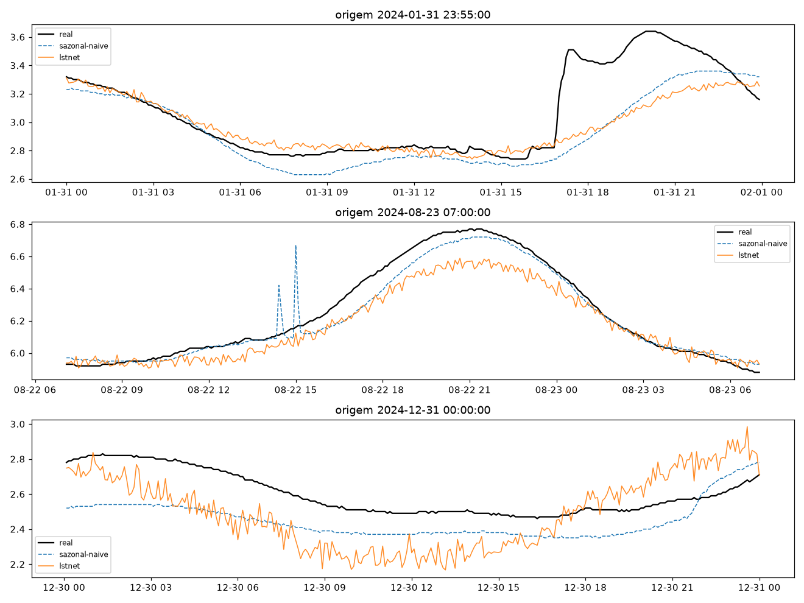
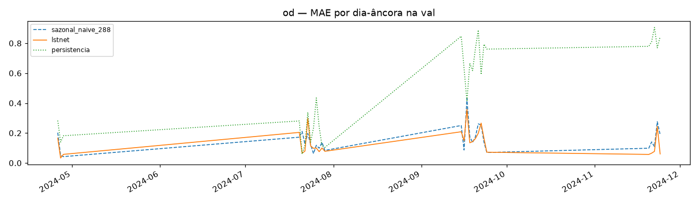

# Experimento 03 — LSTNet no OD (EF01), regime anual (treino 2024)

Mesma arquitetura do 02 (contexto nativo 2016 + RevIN + skip p=1d + AR-288), treinada no
OD 2024 com early stopping na val (4 fatias). 2025 intocado.
Artefatos gerados por `notebooks/03-lstnet-od.ipynb` (executado de ponta a ponta, 0 erros;
procedência: `temporal-remote` 192.168.1.6, dir `/home/marcos/temporal-model`, torch CPU).
Reproduzir: `.venv/bin/jupyter nbconvert --to notebook --execute --inplace --ExecutePreprocessor.timeout=2400 notebooks/03-lstnet-od.ipynb`
(treino ~7 min em 12c com a máquina livre; stride 8 no treino pelo volume maior).

## Configuração do experimento

- **Série:** OD 2024 (`dados/treino/ef01-mogi-das-cruzes_oxigenio-dissolvido_2024.csv`); 0,6% faltantes, sem outages grandes
- **Janelas `L=8640 → H=288`:** treino 66.073 + val 7.857 (fatias 657/2880/2880/1440 — S1 parcial no OD, origens só de 27/abr em diante, conforme previsto); dias-âncora na val: 28
- **Treino:** 137.506 params · Adam 1e-3, MSE · stride 8 (8.260 treino) / 4 (1.965 val) · early stopping patience 10 → parou na ep. 22, best val 0,0349 (ep. 12)

## Tabela principal — val rolante (7.857 origens)

| modelo | MAE | RMSE |
|---|---|---|
| **lstnet** | **0,1380** | 0,1869 |
| sazonal_naive_288 | 0,1579 | 0,2202 |
| media_movel_288 | 0,3260 | 0,4289 |
| persistencia | 0,3929 | 0,5728 |

(copiado de `metricas_val.csv`) — **primeira vez que um modelo bate o sazonal no OD: LSTNet 0,1380 (−12,6%). Nova régua do treino OD.**

## Treino rolante, amostra 1/4 (referência)

| modelo | MAE | RMSE |
|---|---|---|
| lstnet | 0,1777 | 0,2759 |
| sazonal_naive_288 | 0,2424 | 0,3741 |
| media_movel_288 | 0,4003 | 0,5222 |
| persistencia | 0,4429 | 0,6403 |

(copiado de `metricas_treino.csv`)

## Val dias-âncora (28 dias)

| modelo | MAE | RMSE |
|---|---|---|
| lstnet | 0,1369 | 0,1935 |
| sazonal_naive_288 | 0,1579 | 0,2192 |
| media_movel_288 | 0,3189 | 0,4243 |
| persistencia | 0,4910 | 0,6728 |

(copiado de `metricas_val_diaria.csv`; detalhe por dia em `metricas_por_dia.csv`)

## Figuras — o que cada uma mostra

### `01-eda.png`, `02-limpeza.png`, `03-stl.png` — dado 2024

### `04-forecasts.png` — 3 origens do treino (real × sazonal × lstnet)

### `05-mae.png` — barras de MAE na val

### `06-val-dias.png` — MAE por dia-âncora (4 fatias)

### `07-curvas-treino.png` — loss por época

## Arquivos

| Arquivo | O quê |
|---|---|
| `metricas_treino.csv` | Treino (amostra 1/4) em CSV |
| `metricas_val.csv` | Val rolante em CSV (primária) |
| `metricas_val_diaria.csv` | Dias-âncora em CSV |
| `metricas_por_dia.csv` | MAE por dia-âncora em CSV |
| `modelos/lstnet_od.pt` | LSTNet treinado (state_dict + config) |
| `modelos/normalizacao.json` | `{"mode": "revin-per-window", "LN": 2016, "val_slices": [...]}` |
| `figs/` | As 7 figuras explicadas acima |

## Leitura dos resultados

1. **Virada no OD: LSTNet 0,1380 vence o sazonal-naive 0,1579 (−12,6%) na val, e 0,1369 × 0,1579 nos dias-âncora.** Com 1 ano de treino (incluindo o verão/outono de alta amplitude), o modelo aprendeu o que 3 meses de inverno não ensinaram. A régua do OD cai pela primeira vez.
2. Treino longo e saudável: 22 épocas, best na 12, sem colapso (treino estável do início ao fim).
3. Fila: PatchTST/DLinear (05) e ensemble (07) miram 0,1380; checkpoint guardado para o benchmark 2025 (08) — onde o teste de verdade acontece, com o lag-365 na briga.
