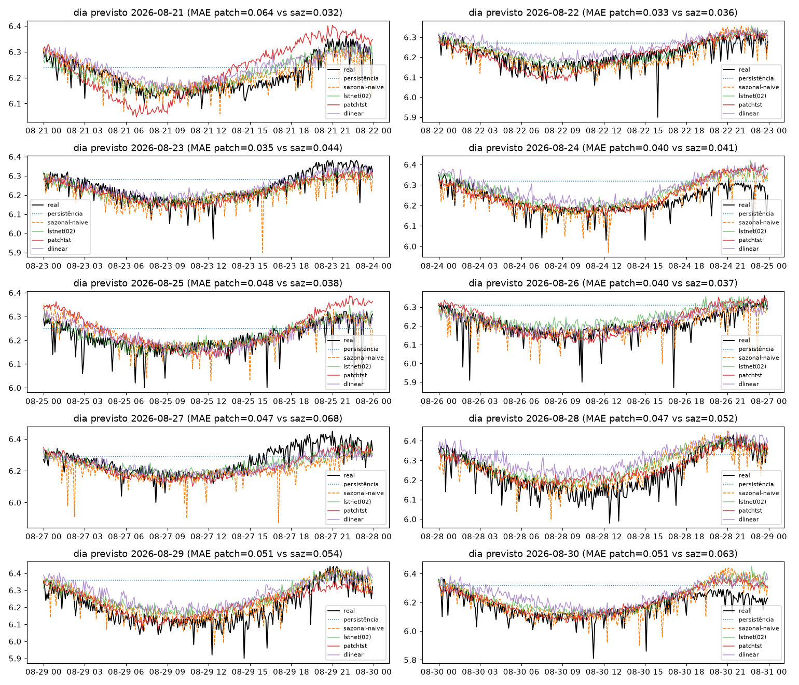
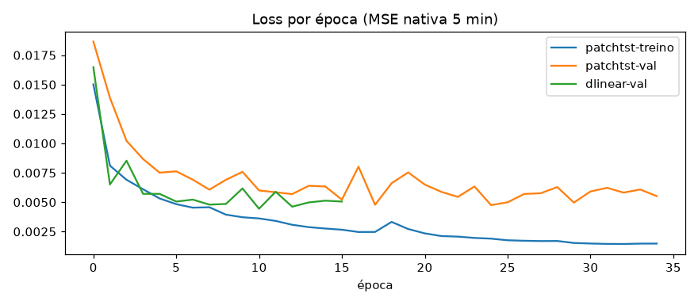

# Experimento 03 — PatchTST nativo no pH (EF01)

Atenção sobre patches em resolução nativa + controle linear, no mesmo desenho do [02-lstnet-ph](../02-lstnet-ph/).
Artefatos gerados por `notebooks/03-patchtst-ph.ipynb` (executado de ponta a ponta, 0 erros).
Reproduzir: `.venv/bin/jupyter nbconvert --to notebook --execute --inplace --ExecutePreprocessor.timeout=900 notebooks/03-patchtst-ph.ipynb`
(precisa de `torch` CPU no `.venv`; treino do PatchTST ~10 min em CPU, DLinear ~10 s).

## Configuração do experimento

- **Série:** pH, estação EF01 Mogi das Cruzes, passo de 5 min
- **Protocolo travado (igual ao 00/01/02):** avaliação em janelas `L=8640 → H=288` · split 70/15/15 (teste 2.204, alvos 14/08 → 21/08) · **holdout puro** 21/08 → 31/08 (2.594 origens) + 10 origens diárias · limpeza idêntica
- **Modelos (Nie et al. 2022, adaptados):**
  - **patchtst** — contexto nativo `LN=2016` + RevIN → patches P=48/S=24 (83 tokens) → encoder Transformer (3 camadas, d=64, 4 heads, ff=128) → cabeça linear direta H=288 (1.639.010 params)
  - **dlinear (controle, tese Zeng §3.2)** — decomposição por média móvel (k=25) + 2 lineares `2016→288`, mesma RevIN (~1,16 M params)
  - **lstnet (régua do 02)** — checkpoint `02-lstnet-ph` recarregado, só inferência, na mesma tabela
- **Treino:** Adam 1e-3, MSE · stride 4 (2.571 treino / 551 val; **avaliação em todas as origens**) · early stopping (PatchTST parou na ep. 16, val 0,0044; DLinear convergiu em segundos)

## Tabela principal — teste rolante (2.204 origens)

| modelo | MAE | RMSE | MAPE | sMAPE |
|---|---|---|---|---|
| lstnet (02) | 0,0456 | 0,0605 | 0,7351 | 0,7318 |
| dlinear | 0,0498 | 0,0636 | 0,8036 | 0,8009 |
| sazonal-naive (lag 288) | 0,0501 | 0,0648 | 0,8079 | 0,8051 |
| patchtst | 0,0611 | 0,0755 | 0,9860 | 0,9807 |
| média móvel 288 | 0,0631 | 0,0768 | 1,0159 | 1,0133 |
| persistência | 0,0727 | 0,0942 | 1,1683 | 1,1657 |

A régua do rolante segue LSTNet. Nota honesta: o **DLinear puro bate o sazonal-naive (0,0498 < 0,0501)** com 8 s de treino — e bate o PatchTST.

## Tabela do holdout — 10 dias previstos (alvos nunca treinados)

| modelo | MAE | RMSE | MAPE | sMAPE |
|---|---|---|---|---|
| lstnet (02) | 0,0446 | 0,0617 | 0,7209 | 0,7173 |
| patchtst | 0,0457 | 0,0615 | 0,7373 | 0,7347 |
| sazonal-naive 288 | 0,0466 | 0,0673 | 0,7501 | 0,7497 |
| dlinear | 0,0538 | 0,0723 | 0,8698 | 0,8641 |
| média móvel 288 | 0,0655 | 0,0823 | 1,0547 | 1,0540 |
| persistência | 0,0973 | 0,1204 | 1,5774 | 1,5599 |

No holdout, PatchTST empata tecnicamente com o LSTNet (MAE +2%, **RMSE −0,3%**) e supera o sazonal-naive; o DLinear cai para 4º.

MAE por dia previsto (destaques): PatchTST vence 5 dos 10 dias, incluindo 29–30/08 (0,051 vs 0,062/0,064 do LSTNet); perde feio o 21/08 (0,064 vs 0,031). Detalhe em `metricas_holdout.csv`.

## Figuras — o que cada uma mostra

### `01-eda.png`, `02-limpeza.png`, `03-stl.png` — mesmos do 00/01/02

### `04-forecasts.png` — 3 origens do teste rolante (5 curvas)

### `05-mae.png` — barras de MAE no teste rolante

### `06-holdout-dias.png` — os 10 dias previstos × real

### `07-curvas-treino.png` — loss por época (PatchTST + val do DLinear)

- PatchTST: queda rápida e early stop na ep. 16 (val 0,0044 vs 0,0031 do LSTNet no 02) — 12× mais params, val pior: sem sinal de under-training resolvível só com mais épocas.

## Arquivos

| Arquivo | O quê |
|---|---|
| `metricas_baseline.csv` | Tabela do teste rolante em CSV (6 modelos) |
| `metricas_holdout.csv` | Tabela do holdout diário em CSV |
| `modelos/patchtst_ph.pt` | PatchTST treinado (state_dict) |
| `modelos/dlinear_ph.pt` | DLinear treinado (state_dict) |
| `modelos/normalizacao.json` | `{"mode": "revin-per-window", "LN": 2016}` |
| `figs/` | As 7 figuras explicadas acima |

## Leitura dos resultados

1. **A régua do pH segue LSTNet (0,0456 / 0,0446).** Atenção não era o ingrediente faltante: PatchTST empata no holdout e perde no rolante, com 12× mais parâmetros.
2. **Tese Zeng confirmada nos nossos dados:** DLinear (linear puro, 8 s) ≈ ou melhor que o Transformer pequeno — bate o sazonal-naive e o PatchTST no rolante. Para esta série, ordem de força: recorrência com viés sazonal > linear direto > atenção pequena > ingênuos.
3. **Checkpoint do 02 reproduzido exatamente** (0,0456/0,0446 recarregados) — validação gratuita da reprodutibilidade do pipeline.
4. **Fila:** replicar no OD (`03b`: PatchTST × DLinear × LSTNet no segmento limpo — a atenção pode acompanhar a amplitude crescente melhor que a recorrência fixa) → só então refinamento de hiperparâmetros do vencedor.
5. **Trecho provisório** pós-22/08: vale o mesmo aviso do 00/02.
