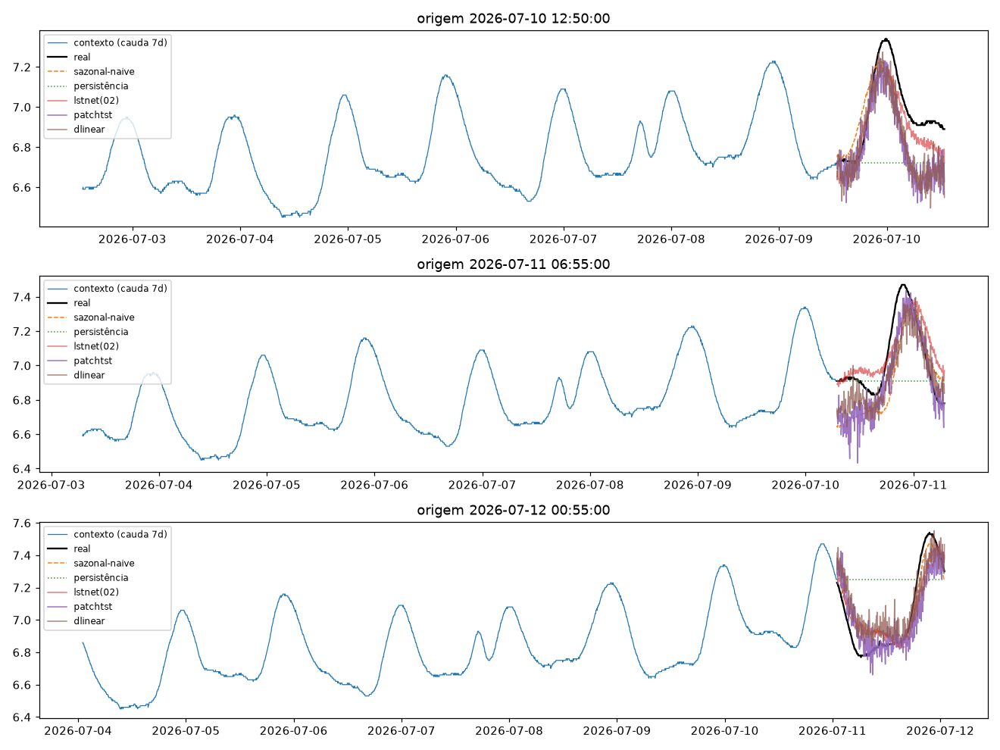
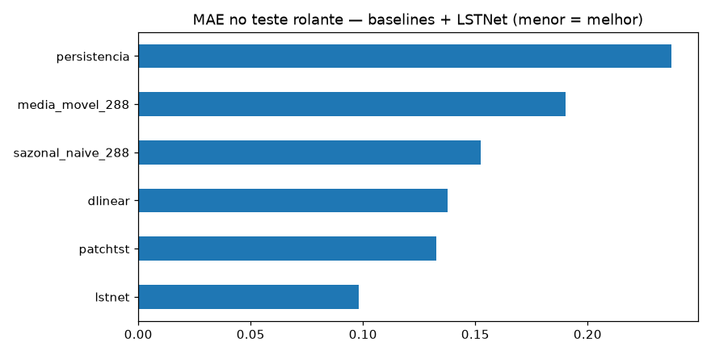
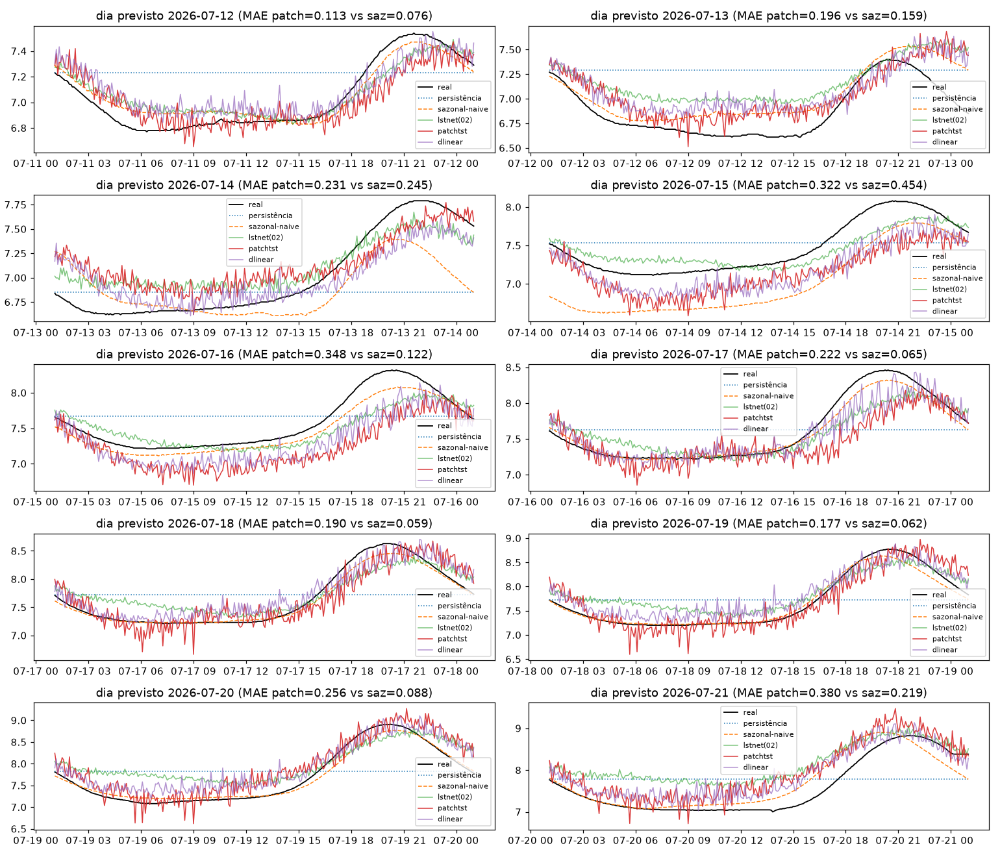
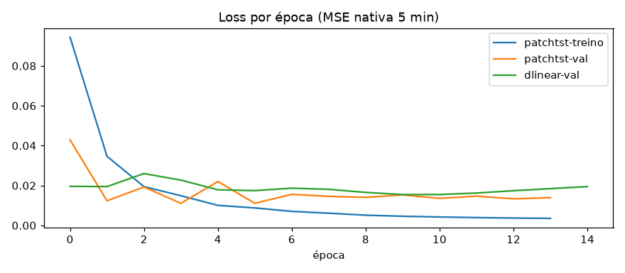

# Experimento 03b — PatchTST + DLinear no OD (EF01)

Os três modelos do [03-patchtst-ph](../03-patchtst-ph/), no mesmo desenho do [00b-baseline-od](../00b-baseline-od/).
Artefatos gerados por `notebooks/03b-patchtst-od.ipynb` (executado de ponta a ponta, 0 erros).
Reproduzir: `.venv/bin/jupyter nbconvert --to notebook --execute --inplace --ExecutePreprocessor.timeout=900 notebooks/03b-patchtst-od.ipynb`
(precisa de `torch` CPU no `.venv`; treino do PatchTST ~5 min em CPU, DLinear ~10 s).

## Configuração do experimento

- **Série:** OD (mg/L), estação EF01 Mogi das Cruzes, passo de 5 min
- **Recorte (igual ao 00b):** segmento limpo 01/06 → 21/07 01:05 (50,0 dias; 0 NaN após interpolação máx. 2 h)
- **Protocolo travado:** avaliação em janelas `L=8640 → H=288` · split 70/15/15 (**teste 434**, alvos 09/07 → 11/07) · **holdout puro** 12/07 → 21/07 (2.594 origens) + 10 origens diárias
- **Bônus:** tudo aqui é dado validado (pré-22/08)
- **Modelos (iguais aos do 03):** **patchtst** (LN=2016 + RevIN → P=48/S=24 → encoder 3×d64 → direta H=288) · **dlinear** (média-móvel k=25 + 2 lineares, mesma RevIN) · **lstnet do 02b** recarregado por checkpoint (só inferência)
- **Treino:** Adam 1e-3, MSE · stride 2 (1.013 treino / 217 val; **avaliação em todas as origens**) · early stopping

## Tabela principal — teste rolante (434 origens)

| modelo | MAE | RMSE | MAPE | sMAPE |
|---|---|---|---|---|
| lstnet (02b) | 0,0981 | 0,1198 | 1,3839 | 1,3878 |
| patchtst | 0,1327 | 0,1648 | 1,8794 | 1,9044 |
| dlinear | 0,1376 | 0,1602 | 1,9528 | 1,9674 |
| sazonal-naive (lag 288) | 0,1525 | 0,1770 | 2,1668 | 2,1918 |
| média móvel 288 | 0,1900 | 0,2468 | 2,6526 | 2,6942 |
| persistência | 0,2371 | 0,3019 | 3,3575 | 3,3530 |

Os três neurais batem o sazonal-naive no teste; LSTNet segue o melhor.

## Tabela do holdout — 10 dias previstos (12→21/07, alvos nunca treinados)

| modelo | MAE | RMSE | MAPE | sMAPE |
|---|---|---|---|---|
| sazonal-naive 288 | 0,1550 | 0,2233 | 2,0794 | 2,1009 |
| dlinear | 0,2146 | 0,2630 | 2,8908 | 2,8785 |
| lstnet (02b) | 0,2428 | 0,3048 | 3,2990 | 3,2393 |
| patchtst | 0,2434 | 0,3044 | 3,2505 | 3,2502 |
| média móvel 288 | 0,4071 | 0,4916 | 5,3416 | 5,4047 |
| persistência | 0,4273 | 0,4921 | 5,7036 | 5,6685 |

MAE por dia previsto (destaques): nenhum neural vence o sazonal-naive em nenhum dia; o DLinear é o melhor neural em 7 dos 10 dias (ex.: 21/07: 0,312 vs 0,528/0,380). Detalhe em `metricas_holdout.csv`.

## Figuras — o que cada uma mostra

### `01-eda.png`, `02-limpeza.png`, `03-stl.png` — mesmos dados do 00b

### `04-forecasts.png` — 3 origens do teste rolante (6 curvas)

### `05-mae.png` — barras de MAE no teste rolante

### `06-holdout-dias.png` — os 10 dias previstos × real

- Padrão repetido nos 10 painéis: neurais com fase razoável e amplitude subestimada nos dias de onda grande.

### `07-curvas-treino.png` — loss por época

## Arquivos

| Arquivo | O quê |
|---|---|
| `metricas_baseline.csv` | Tabela do teste rolante em CSV (6 modelos) |
| `metricas_holdout.csv` | Tabela do holdout diário em CSV |
| `modelos/patchtst_od.pt` | PatchTST treinado (state_dict) |
| `modelos/dlinear_od.pt` | DLinear treinado (state_dict) |
| `modelos/normalizacao.json` | `{"mode": "revin-per-window", "LN": 2016}` |
| `figs/` | As 7 figuras explicadas acima |

## Leitura dos resultados

1. **A régua do holdout no OD segue sazonal-naive (0,1550) — nenhum dos 5 neurais chega perto.** No teste, os três neurais a batem (LSTNet melhor: −36%).
2. **Melhor neural no holdout: o linear (DLinear 0,2146 < LSTNet 0,2428 ≈ PatchTST 0,2434).** Sob amplitude crescente fora da distribuição de treino, o modelo linear extrapola escala melhor que recorrência/atenção com memória de escala fixa — segunda confirmação da tese de escala (LSTNet §3.6) e da tese Zeng, agora no OD.
3. **A atenção não resolveu a amplitude:** PatchTST empata com o LSTNet no holdout (0,2434 vs 0,2428) e perde no teste. A hipótese "atenção acompanha amplitude crescente" está descartada nesta configuração.
4. **O OD é o desafio aberto do projeto:** copiar ontem-na-mesma-hora em resolução nativa continua imbatível quando a amplitude cresce. Candidatos restantes: (i) treino ponderado por amplitude/data tardia; (ii) ensemble sazonal-naive + correção aprendida (piso = régua); (iii) saída probabilística (quantis) para quantificar a incerteza crescente.
5. **Bônus de validade** (dado validado) e **pós-gap de fora** — como no 00b/01b/02b.
