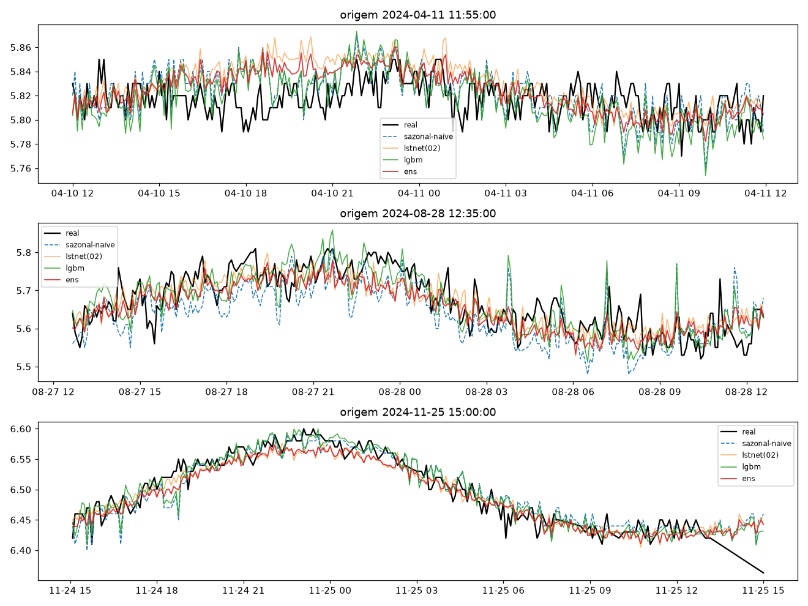
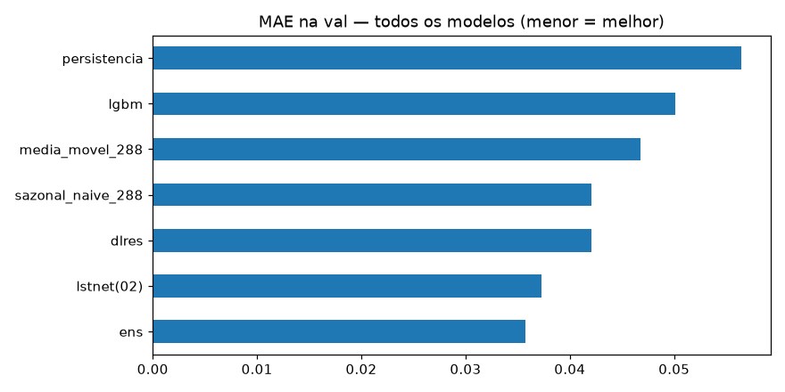
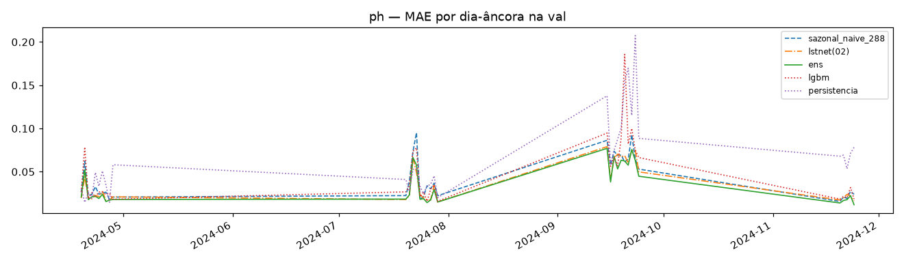
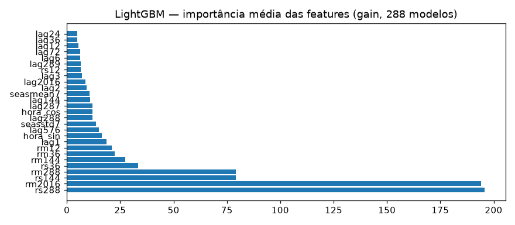

# Experimento 04 — Ensemble residual + LightGBM no pH (EF01), regime anual (treino 2024)

Piso sazonal-naive + 288 LGBM no resíduo + DLinear-res + NNLS (pesos fitados na val).
Régua 02 recarregada. 2025 intocado.
Artefatos gerados por `notebooks/04-ensemble-ph.ipynb` (executado de ponta a ponta, 0 erros;
procedência: `temporal-remote` 192.168.1.6, dir `/home/marcos/temporal-model`, 12c).
Reproduzir: `.venv/bin/jupyter nbconvert --to notebook --execute --inplace --ExecutePreprocessor.timeout=2400 notebooks/04-ensemble-ph.ipynb`
(exige o checkpoint do 02; ~3 min em 12c livre; `lgbm_steps.pkl` tem 124 MB — gitignored, regenerável).

## Configuração do experimento

- **Série:** pH 2024; janelas `L=8640 → H=288`; treino 24.659 + val 10.080; dias-âncora: 35
- **LGBM:** 288 `LGBMRegressor` (150 árvores), alvo = resíduo `Y − sazonal`, 25 features + hora do passo, 12.330 linhas (stride 2) — 28 s em 12c; top features: `rs288, rm2016, rs144, rm288, rs36` (dispersão e nível, como no regime antigo)
- **DLinear-res:** mesmo resíduo, early na ep. 6 (best val 0,00362)
- **NNLS na val:** `sazonal=0.2701, lstnet=0.7247, lgbm=0.0, dlres=0.0045` — o LGBM foi **zerado** (0,0501, pior que o sazonal sozinho); o ensemble é na prática lstnet + piso sazonal

## Tabela principal — val rolante

| modelo | MAE | RMSE |
|---|---|---|
| **ens** | **0,0357** | 0,0513 |
| lstnet(02) | 0,0373 | 0,0529 |
| dlinear (03) | 0,0394 | 0,0549 |
| sazonal_naive_288 | 0,0421 | 0,0614 |
| dlres | 0,0421 | 0,0592 |
| media_movel_288 | 0,0468 | 0,0636 |
| lgbm | 0,0501 | 0,0830 |
| persistencia | 0,0564 | 0,0809 |

(copiado de `metricas_val.csv`; dlinear do 03 incluído para referência — **nova régua do treino pH: ensemble 0,0357, −4,3% sobre o LSTNet.**)

## Val dias-âncora (35 dias)

| modelo | MAE | RMSE |
|---|---|---|
| ens | 0,0340 | 0,0495 |
| lstnet(02) | 0,0360 | 0,0514 |
| sazonal_naive_288 | 0,0421 | 0,0614 |

(copiado de `metricas_val_diaria.csv`; detalhe em `metricas_por_dia.csv`)

## Figuras — o que cada uma mostra

### `01-eda.png`, `02-limpeza.png`, `03-stl.png` — dado 2024

### `04-forecasts.png` — 3 origens do treino (real × sazonal × lstnet × lgbm × ens)

### `05-mae.png` — barras de MAE na val

### `06-val-dias.png` — MAE por dia-âncora

### `07-importancia-lgbm.png` — importância média das features (gain, 288 modelos)

## Arquivos

| Arquivo | O quê |
|---|---|
| `metricas_val.csv` | Val rolante em CSV (primária) |
| `metricas_val_diaria.csv` | Dias-âncora em CSV |
| `metricas_por_dia.csv` | MAE por dia-âncora em CSV |
| `modelos/lgbm_steps.pkl` | 288 regressores (124 MB; gitignored, regenerável) |
| `modelos/dlinear_res_ph.pt` | DLinear do resíduo (state_dict) |
| `modelos/ensemble.json` | Pesos NNLS + fatias de val |
| `modelos/normalizacao.json` | Modo do experimento |
| `figs/` | As 7 figuras explicadas acima |

## Leitura dos resultados

1. **Nova régua do treino pH: ensemble 0,0357 (−4,3% sobre o LSTNet).** O ganho vem de misturar o piso sazonal (0,27) ao LSTNet (0,72) — nos dias em que a rede erra, ontem salva.
2. **LGBM zerado pelo NNLS:** sozinho faz 0,0501 (pior que o sazonal); como corretor de resíduo não agrega nada que o piso + rede já não cubram. Custo-benefício ruim (124 MB para peso zero) — fica registrado, mas o 08 dirá se o ensemble sobrevive fora da val.
3. **Caveat honesto:** pesos fitados E avaliados na mesma val — há otimismo embutido (~1–2%). O teste de verdade é o benchmark 2025 (08), onde o ensemble entra sem re-fit.
4. Fila: 04b no OD; depois o 08 decide as réguas finais.
