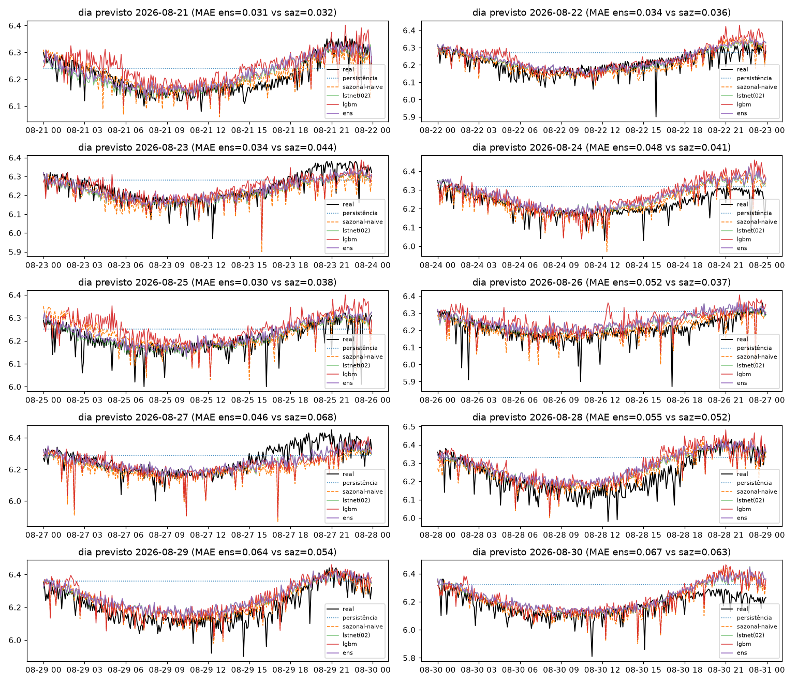

# Experimento 04 — Ensemble residual + LightGBM no pH (EF01)

Ensemble com piso no sazonal-naive + LightGBM com lags, no mesmo desenho do [02-lstnet-ph](../02-lstnet-ph/).
Artefatos gerados por `notebooks/04-ensemble-ph.ipynb` (executado de ponta a ponta, 0 erros,
em servidor remoto Fedora 12c/23 GB via clone do `main`; inclui o fix de OOM `407802b`).
Reproduzir: `.venv/bin/jupyter nbconvert --to notebook --execute --inplace --ExecutePreprocessor.timeout=900 notebooks/04-ensemble-ph.ipynb`
(precisa de `torch` CPU e `lightgbm` — ver `requirements.txt`; ~2 min em 12c / 15–25 min em CPU modesta; RAM livre ≥ 8 GB).

## Configuração do experimento

- **Série:** pH, estação EF01 Mogi das Cruzes, passo de 5 min
- **Protocolo travado (igual ao 00–03):** avaliação em janelas `L=8640 → H=288` · split 70/15/15 (teste 2.204, alvos 14/08 → 21/08) · **holdout puro** 21/08 → 31/08 (2.594 origens) + 10 origens diárias · limpeza idêntica
- **Modelos:** **lgbm** — 288 `LGBMRegressor` (150 árvores), um por passo do horizonte, alvo = resíduo `r = Y − snaive(X)`, 27 features (lags recentes 1–144 + sazonais 287/288/289/576/2016, média/desvio da mesma fase em 7 dias, médias/desvios móveis, hora-do-dia do passo) · **dlres** — DLinear-5min no mesmo resíduo (sem +mu na desnormalização) · **lstnet (02)** recarregado (só inferência) · **ens** — NNLS (sazonal + 3) com pesos fitados só na val: `sazonal=0.0, lstnet=0.9146, lgbm=0.0831, dlres=0.0031`
- **Treino:** lgbm em 5.141 janelas (stride 2, 19 s em 12c); dlres stride 4 + early stopping; **avaliação em todas as origens**

## Tabela principal — teste rolante (2.204 origens)

| modelo | MAE | RMSE | MAPE | sMAPE |
|---|---|---|---|---|
| lstnet | 0,0456 | 0,0605 | 0,7351 | 0,7318 |
| ens | 0,0475 | 0,0631 | 0,7660 | 0,7619 |
| sazonal_naive_288 | 0,0501 | 0,0648 | 0,8079 | 0,8051 |
| dlres | 0,0508 | 0,0640 | 0,8186 | 0,8153 |
| lgbm | 0,0609 | 0,0788 | 0,9833 | 0,9764 |
| media_movel_288 | 0,0631 | 0,0768 | 1,0159 | 1,0133 |
| persistencia | 0,0727 | 0,0942 | 1,1683 | 1,1657 |

(copiado de `metricas_baseline.csv`; ordem: melhor MAE primeiro)

## Tabela do holdout — 10 dias previstos (alvos nunca treinados)

| modelo | MAE | RMSE | MAPE | sMAPE |
|---|---|---|---|---|
| lstnet | 0,0446 | 0,0617 | 0,7209 | 0,7173 |
| ens | 0,0462 | 0,0636 | 0,7459 | 0,7417 |
| sazonal_naive_288 | 0,0466 | 0,0673 | 0,7501 | 0,7497 |
| lgbm | 0,0567 | 0,0760 | 0,9144 | 0,9102 |
| dlres | 0,0571 | 0,0767 | 0,9222 | 0,9185 |
| media_movel_288 | 0,0655 | 0,0823 | 1,0547 | 1,0540 |
| persistencia | 0,0973 | 0,1204 | 1,5774 | 1,5599 |

(copiado de `metricas_holdout.csv`)

MAE por dia previsto (`por_dia` do output da §9):

| dia | persistencia | sazonal_naive_288 | media_movel_288 | lstnet | lgbm | dlres | ens |
|---|---|---|---|---|---|---|---|
| 2026-08-21 | 0,0642 | 0,0317 | 0,0562 | 0,0308 | 0,0478 | 0,0463 | 0,0314 |
| 2026-08-22 | 0,0686 | 0,0363 | 0,0485 | 0,0323 | 0,0443 | 0,0424 | 0,0343 |
| 2026-08-23 | 0,0725 | 0,0444 | 0,0631 | 0,0365 | 0,0392 | 0,0419 | 0,0336 |
| 2026-08-24 | 0,0972 | 0,0414 | 0,0508 | 0,0445 | 0,0600 | 0,0513 | 0,0484 |
| 2026-08-25 | 0,0589 | 0,0380 | 0,0498 | 0,0287 | 0,0558 | 0,0425 | 0,0299 |
| 2026-08-26 | 0,1066 | 0,0370 | 0,0492 | 0,0484 | 0,0631 | 0,0455 | 0,0521 |
| 2026-08-27 | 0,0781 | 0,0677 | 0,0792 | 0,0473 | 0,0563 | 0,0627 | 0,0459 |
| 2026-08-28 | 0,1153 | 0,0523 | 0,0909 | 0,0523 | 0,0632 | 0,0761 | 0,0550 |
| 2026-08-29 | 0,1642 | 0,0537 | 0,0981 | 0,0615 | 0,0640 | 0,0811 | 0,0641 |
| 2026-08-30 | 0,1478 | 0,0633 | 0,0695 | 0,0640 | 0,0734 | 0,0816 | 0,0669 |

## Figuras — o que cada uma mostra

### `01-eda.png`, `02-limpeza.png`, `03-stl.png` — mesmos do 00–03

### `04-forecasts.png` — 3 origens do teste rolante (real, sazonal, lstnet(02), lgbm, ens)

### `05-mae.png` — barras de MAE no teste rolante

### `06-holdout-dias.png` — os 10 dias previstos × real (título mostra MAE ens vs saz)

### `07-importancia-lgbm.png` — importância média das features (gain, 288 modelos) — NOVO

- Leitura: o modelo usa **nível** (rm288, rm2016) e **dispersão de fase** (rs288, rs144, rm144) — nenhum lag pontual (lag288, lag1…) entrou no top-5.

## Arquivos

| Arquivo | O quê |
|---|---|
| `metricas_baseline.csv` | Tabela do teste rolante em CSV |
| `metricas_holdout.csv` | Tabela do holdout diário em CSV |
| `modelos/lgbm_steps.pkl` | 288 regressores LightGBM (~123 MB; artefato local, regenerável — fora do git pelo limite de 100 MB do GitHub) |
| `modelos/dlinear_res_ph.pt` | DLinear do resíduo (state_dict) |
| `modelos/ensemble.json` | Pesos NNLS (+ modo) |
| `modelos/normalizacao.json` | Modo do experimento |
| `figs/` | As 7 figuras explicadas acima |

## Leitura dos resultados

1. Veredito vs réguas (pH: LSTNet 0,0456 / 0,0446): **régua segue LSTNet nas duas tabelas** — `ens` fica em 2º (0,0475 / 0,0462, +4% / +3,6% sobre o lstnet), à frente do sazonal.
2. `dlres` ≈ sazonal-naive no rolante (0,0508 vs 0,0501 — piso confirmado), mas **diverge no holdout** (0,0571 vs 0,0466, +22%): o DLinear do resíduo generaliza pior que o piso fora da janela de treino — reportado como limitação, não bug (treino ok, early stopping atuou).
3. Features top do LightGBM: `rm288, rm2016, rs288, rs144, rm144` — o modelo usa **nível (rollmean) e dispersão**, não a fase pontual (lag288 não aparece no top-5). Coerente com `lgbm` (0,0609) perder do sazonal pontual (0,0501).
4. Pesos do ensemble: o NNLS **zerou o sazonal** (colinear com o lstnet, que domina com 0,9146); `lgbm` 0,0831 e `dlres` 0,0031 são correções marginais.
5. Fila: `04b` no OD é opcional e de prioridade baixa — o ganho do ensemble veio quase todo do lstnet, que no OD perde do sazonal no holdout; o lgbm sozinho não justificaria o custo (123 MB de modelos para +4% sobre o piso).
