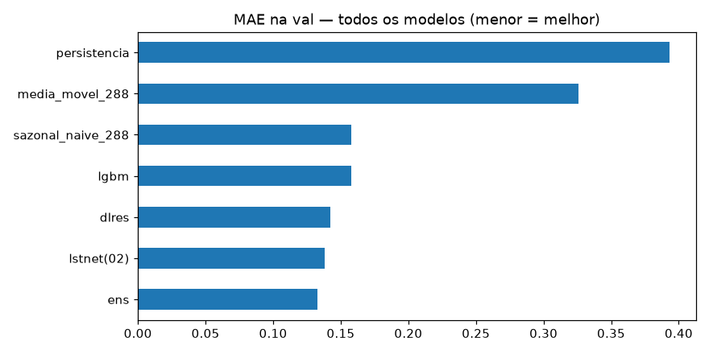
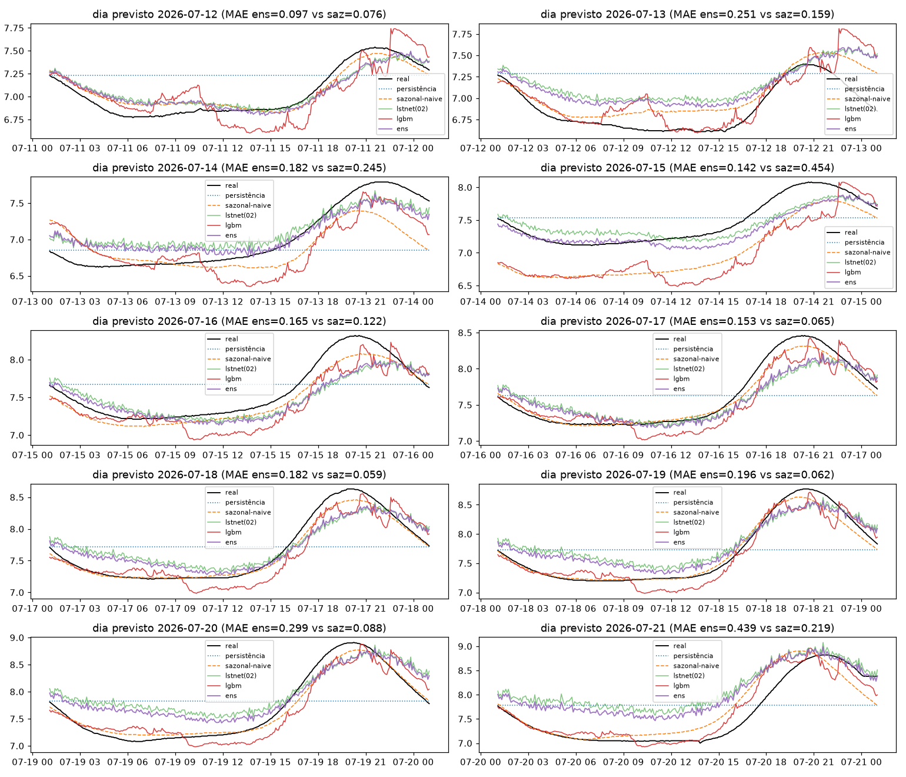
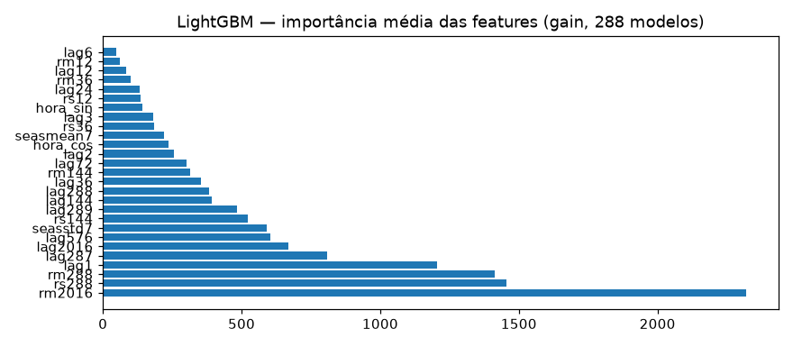

# Experimento 04b — Ensemble residual + LightGBM no OD (EF01)

Ensemble com piso no sazonal-naive + LightGBM com lags, no mesmo desenho do [02b-lstnet-od](../02b-lstnet-od/) e espelho do [04-ensemble-ph](../04-ensemble-ph/) no segmento limpo do OD.
Artefatos gerados por `notebooks/04b-ensemble-od.ipynb` (executado de ponta a ponta, 0 erros,
em servidor remoto Fedora 12c/23 GB via clone do `main`).
Reproduzir: `.venv/bin/jupyter nbconvert --to notebook --execute --inplace --ExecutePreprocessor.timeout=900 notebooks/04b-ensemble-od.ipynb`
(precisa de `torch` CPU e `lightgbm` — ver `requirements.txt`; ~2 min em 12c; RAM livre ≥ 8 GB).

## Configuração do experimento

- **Série:** OD, estação EF01 Mogi das Cruzes, passo de 5 min, **segmento limpo 01/06 → 21/07 01:05** (sensor morto 21/07 01:10 → 06/08 11:30, fora do experimento)
- **Protocolo travado (igual ao 00b–03b):** avaliação em janelas `L=8640 → H=288` · split 70/15/15 do pré-holdout (teste 434, alvos 10/07 → 12/07) · **holdout puro** 12/07 → 21/07 (2.594 origens) + 10 origens diárias · limpeza idêntica (interp. máx. 2 h)
- **Modelos:** **lgbm** — 288 `LGBMRegressor` (150 árvores), um por passo do horizonte, alvo = resíduo `r = Y − snaive(X)`, 27 features (lags recentes 1–144 + sazonais 287/288/289/576/2016, média/desvio da mesma fase em 7 dias, médias/desvios móveis, hora-do-dia do passo) · **dlres** — DLinear-5min no mesmo resíduo (sem +mu na desnormalização) · **lstnet (02b)** recarregado (só inferência) · **ens** — NNLS (sazonal + 3) com pesos fitados só na val: `sazonal=0,0598, lstnet=0,8045, lgbm=0,1348, dlres=0,0`
- **Treino:** lgbm em 1.013 janelas (stride 2, 15 s em 12c); dlres stride 4 + early stopping; **avaliação em todas as origens**

## Tabela principal — teste rolante (434 origens)

| modelo | MAE | RMSE | MAPE | sMAPE |
|---|---|---|---|---|
| lstnet | 0,0981 | 0,1198 | 1,3839 | 1,3878 |
| ens | 0,1024 | 0,1267 | 1,4426 | 1,4506 |
| dlres | 0,1440 | 0,1714 | 2,0502 | 2,0584 |
| sazonal_naive_288 | 0,1525 | 0,1770 | 2,1668 | 2,1918 |
| lgbm | 0,1889 | 0,2302 | 2,6747 | 2,7115 |
| media_movel_288 | 0,1900 | 0,2468 | 2,6526 | 2,6942 |
| persistencia | 0,2371 | 0,3019 | 3,3575 | 3,3530 |

(copiado de `metricas_baseline.csv`; ordem: melhor MAE primeiro)

## Tabela do holdout — 10 dias previstos (alvos nunca treinados)

| modelo | MAE | RMSE | MAPE | sMAPE |
|---|---|---|---|---|
| sazonal_naive_288 | 0,1550 | 0,2233 | 2,0794 | 2,1009 |
| lgbm | 0,2090 | 0,2691 | 2,8024 | 2,8397 |
| ens | 0,2105 | 0,2649 | 2,8490 | 2,8128 |
| lstnet | 0,2428 | 0,3048 | 3,2990 | 3,2393 |
| dlres | 0,2591 | 0,3221 | 3,5155 | 3,4595 |
| media_movel_288 | 0,4071 | 0,4916 | 5,3416 | 5,4047 |
| persistencia | 0,4273 | 0,4921 | 5,7036 | 5,6685 |

(copiado de `metricas_holdout.csv`)

MAE por dia previsto (`por_dia` do output da §9):

| dia | persistencia | sazonal_naive_288 | media_movel_288 | lstnet | lgbm | dlres | ens |
|---|---|---|---|---|---|---|---|
| 2026-07-12 | 0,2965 | 0,0762 | 0,2350 | 0,0971 | 0,1644 | 0,1319 | 0,0966 |
| 2026-07-13 | 0,4225 | 0,1595 | 0,2799 | 0,2845 | 0,1493 | 0,2668 | 0,2506 |
| 2026-07-14 | 0,3428 | 0,2452 | 0,3492 | 0,2066 | 0,2590 | 0,2224 | 0,1820 |
| 2026-07-15 | 0,3178 | 0,4544 | 0,4544 | 0,1487 | 0,5136 | 0,3170 | 0,1420 |
| 2026-07-16 | 0,3478 | 0,1219 | 0,3066 | 0,1741 | 0,1983 | 0,1280 | 0,1651 |
| 2026-07-17 | 0,3919 | 0,0647 | 0,3812 | 0,1644 | 0,1546 | 0,1386 | 0,1526 |
| 2026-07-18 | 0,4505 | 0,0592 | 0,4293 | 0,2164 | 0,1666 | 0,2096 | 0,1824 |
| 2026-07-19 | 0,4940 | 0,0620 | 0,4790 | 0,2453 | 0,1324 | 0,3806 | 0,1960 |
| 2026-07-20 | 0,5772 | 0,0880 | 0,5472 | 0,3625 | 0,1983 | 0,3734 | 0,2992 |
| 2026-07-21 | 0,6319 | 0,2188 | 0,6095 | 0,5284 | 0,1534 | 0,4225 | 0,4391 |

## Figuras — o que cada uma mostra

### `01-eda.png`, `02-limpeza.png`, `03-stl.png` — mesmos do 00b–03b (com faixa do sensor morto)

### `04-forecasts.png` — 3 origens do teste rolante (real, sazonal, lstnet(02b), lgbm, ens)

### `05-mae.png` — barras de MAE no teste rolante

### `06-holdout-dias.png` — os 10 dias previstos × real (título mostra MAE ens vs saz)

### `07-importancia-lgbm.png` — importância média das features (gain, 288 modelos) — NOVO

- Leitura: além do nível (`rm288`, `rm2016`, `rm144`), aqui a **fase pontual importa** (`lag289`, `lag287` no top-5) — diferente do pH, onde só nível/dispersão apareceram.

## Arquivos

| Arquivo | O quê |
|---|---|
| `metricas_baseline.csv` | Tabela do teste rolante em CSV |
| `metricas_holdout.csv` | Tabela do holdout diário em CSV |
| `modelos/lgbm_steps.pkl` | 288 regressores LightGBM (~124 MB; artefato local, regenerável — fora do git pelo limite de 100 MB do GitHub) |
| `modelos/dlinear_res_od.pt` | DLinear do resíduo (state_dict) |
| `modelos/ensemble.json` | Pesos NNLS (+ modo) |
| `modelos/normalizacao.json` | Modo do experimento |
| `figs/` | As 7 figuras explicadas acima |

## Leitura dos resultados

1. Veredito vs réguas (OD: sazonal-naive 0,1525 / 0,1550): no teste rolante o `lstnet` vence (0,0981) com o `ens` em 2º (0,1024); **no holdout a régua segue sazonal-naive (0,1550)** — `lgbm` 2º (0,2090), `ens` 3º (0,2105). O ensemble não vira régua do OD.
2. `dlres` bate o sazonal no rolante (0,1440 vs 0,1525, −6%) mas colapsa no holdout (0,2591 vs 0,1550, +67%): com a amplitude crescente de julho, o linear do resíduo extrapola mal — o NNLS o zerou no ensemble (peso 0,0).
3. Features top do LightGBM: `rm288, rm2016, lag289, rm144, lag287` — nível + fase pontual. É a primeira vez no projeto que lags pontuais entram no top-5, e coincide com o `lgbm` sendo o único a superar o `lstnet` no holdout (0,2090 vs 0,2428).
4. Pesos do ensemble: `lstnet` domina (0,8045) com ajuda do `lgbm` (0,1348) e pitada de `sazonal` (0,0598); `dlres` zerado.
5. Fila: a correção de amplitude via árvores (única a conter o estrago no holdout) merece investigação — treino ponderado por amplitude ou regime-switching; Transformer maior, não (tese do 03b mantida).
