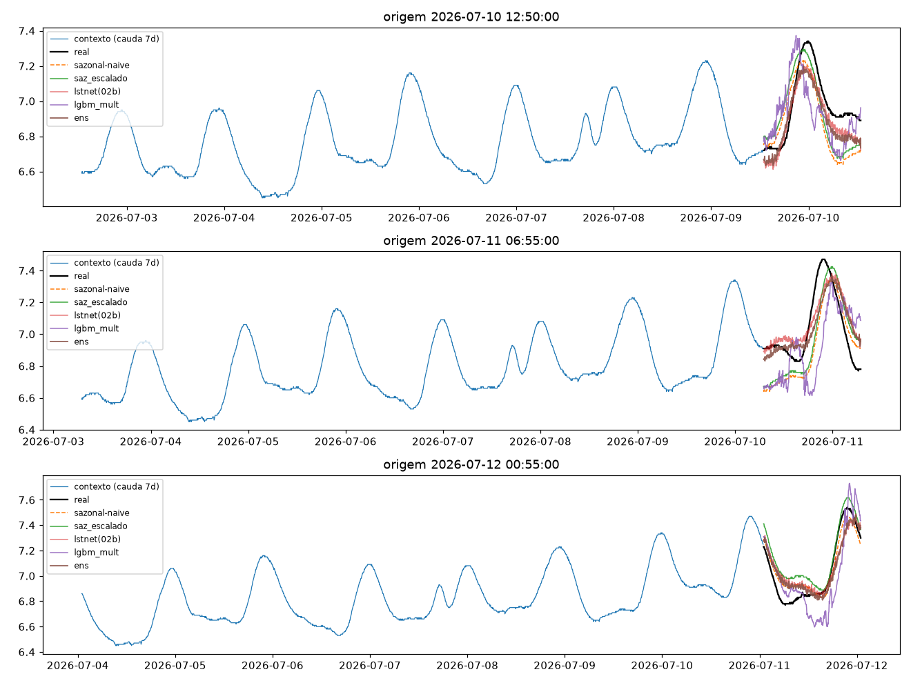
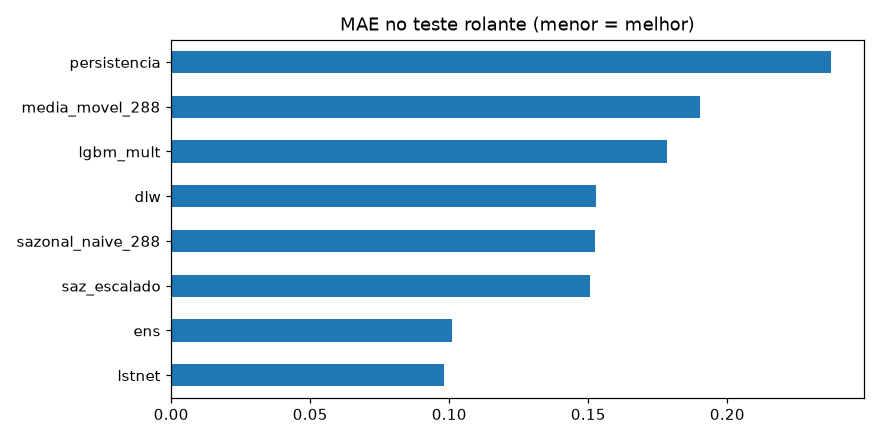
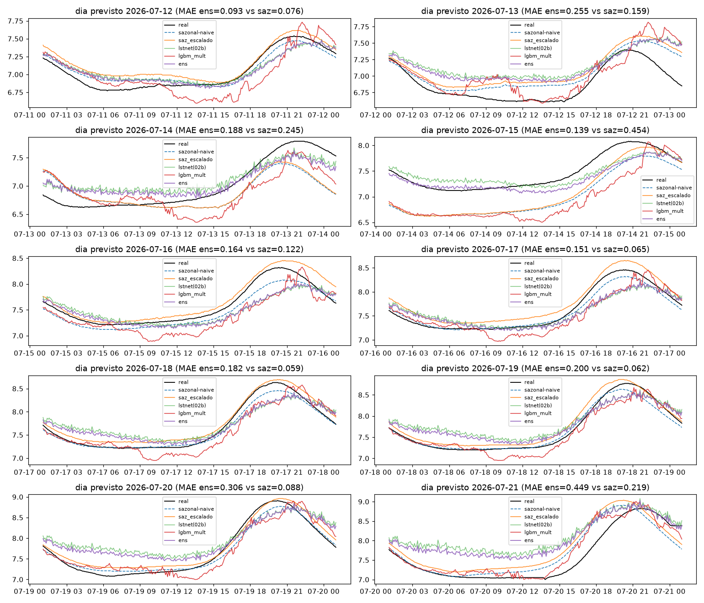
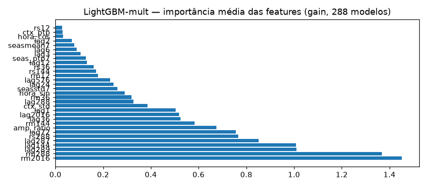
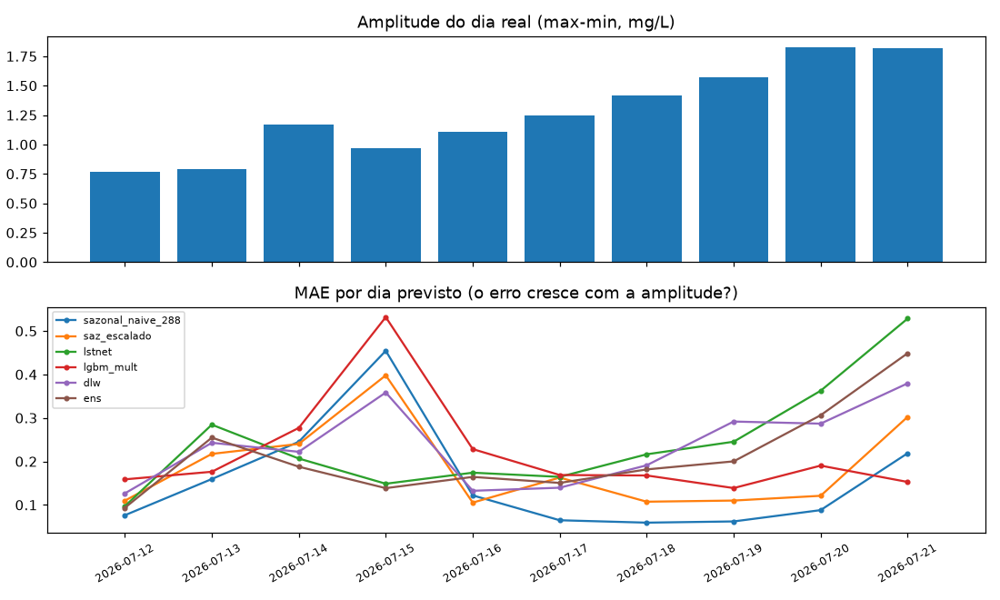

# Experimento 05 — Correção de amplitude no OD (EF01)

Ataque direto ao modo de falha dos experimentos anteriores (fase certa, amplitude subestimada quando a onda de julho cresce), no mesmo desenho do [00b-baseline-od](../00b-baseline-od/) e espelho do [04b-ensemble-od](../04b-ensemble-od/) no segmento limpo do OD.
Artefatos gerados por `notebooks/05-amplitude-od.ipynb` (executado de ponta a ponta, 0 erros,
em servidor remoto Fedora 12c/23 GB via clone do `main`).
Reproduzir: `.venv/bin/jupyter nbconvert --to notebook --execute --inplace --ExecutePreprocessor.timeout=900 notebooks/05-amplitude-od.ipynb`
(precisa de `torch` CPU e `lightgbm` — ver `requirements.txt`; RAM livre ≥ 8 GB).

## Configuração do experimento

- **Série:** OD, estação EF01 Mogi das Cruzes, passo de 5 min, **segmento limpo 01/06 → 21/07 01:05** (sensor morto 21/07 01:10 → 06/08 11:30, fora do experimento)
- **Protocolo travado (igual ao 00b–04b):** avaliação em janelas `L=8640 → H=288` · split 70/15/15 do pré-holdout (teste 434, alvos 10/07 → 12/07) · **holdout puro** 12/07 → 21/07 (2.594 origens) + 10 origens diárias · limpeza idêntica (interp. máx. 2 h)
- **Modelos:** **saz_escalado** — sazonal-naive recentrado na média do contexto com desvios × `std(ctx)/std(ref)` (clip [0,5, 2,0]; analítico, sem treino) · **lgbm_mult** — 288 `LGBMRegressor` (150 árvores) prevendo a razão `Y/snaive` (clip [0,5, 1,5]), 25 features do 04b + 4 de amplitude (`ctx_std`, `ctx_ptp`, `seas_ptp7`, `amp_ratio`) + peso de recência `1+3·posição` · **dlw** — DLinear-5min no resíduo com loss ponderada por recência + jitter de escala autoconsistente (`X'=mu+f·(X−mu)`, `R'=f·R`, `f ~ U(0,8, 1,25)`) · **lstnet (02b)** recarregado (só inferência) · **ens** — NNLS (sazonal + saz_esc + lstnet + lgbm_mult + dlw) com pesos fitados só na val: `sazonal=0,0907, saz_esc=0,0, lstnet=0,8218, lgbm_mult=0,0863, dlw=0,0`
- **Treino:** lgbm_mult em 1.013 janelas (stride 2); dlw stride 4 + early stopping; **avaliação em todas as origens**

## Tabela principal — teste rolante (434 origens)

| modelo | MAE | RMSE | MAPE | sMAPE |
|---|---|---|---|---|
| lstnet | 0,0981 | 0,1198 | 1,3839 | 1,3878 |
| ens | 0,1009 | 0,1247 | 1,4215 | 1,4294 |
| saz_escalado | 0,1506 | 0,1677 | 2,1472 | 2,1577 |
| sazonal_naive_288 | 0,1525 | 0,1770 | 2,1668 | 2,1918 |
| dlw | 0,1526 | 0,1792 | 2,1728 | 2,1841 |
| lgbm_mult | 0,1784 | 0,2223 | 2,5251 | 2,5610 |
| media_movel_288 | 0,1900 | 0,2468 | 2,6526 | 2,6942 |
| persistencia | 0,2371 | 0,3019 | 3,3575 | 3,3530 |

(copiado de `metricas_baseline.csv`; ordem: melhor MAE primeiro)

## Tabela do holdout — 10 dias previstos (alvos nunca treinados)

| modelo | MAE | RMSE | MAPE | sMAPE |
|---|---|---|---|---|
| sazonal_naive_288 | 0,1550 | 0,2233 | 2,0794 | 2,1009 |
| saz_escalado | 0,1874 | 0,2406 | 2,5452 | 2,5431 |
| ens | 0,2126 | 0,2688 | 2,8773 | 2,8397 |
| lgbm_mult | 0,2190 | 0,2846 | 2,9333 | 2,9761 |
| dlw | 0,2371 | 0,2948 | 3,2156 | 3,1826 |
| lstnet | 0,2428 | 0,3048 | 3,2990 | 3,2393 |
| media_movel_288 | 0,4071 | 0,4916 | 5,3416 | 5,4047 |
| persistencia | 0,4273 | 0,4921 | 5,7036 | 5,6685 |

(copiado de `metricas_holdout.csv`)

MAE por dia previsto (`metricas_por_dia.csv`, com amplitude do dia real):

| dia | sazonal_naive_288 | saz_escalado | lstnet | lgbm_mult | dlw | ens | amp_dia |
|---|---|---|---|---|---|---|---|
| 2026-07-12 | 0,0762 | 0,1097 | 0,0971 | 0,1587 | 0,1265 | 0,0934 | 0,77 |
| 2026-07-13 | 0,1595 | 0,2173 | 0,2845 | 0,1762 | 0,2429 | 0,2547 | 0,79 |
| 2026-07-14 | 0,2452 | 0,2402 | 0,2066 | 0,2771 | 0,2221 | 0,1878 | 1,17 |
| 2026-07-15 | 0,4544 | 0,3979 | 0,1487 | 0,5319 | 0,3585 | 0,1385 | 0,97 |
| 2026-07-16 | 0,1219 | 0,1053 | 0,1741 | 0,2283 | 0,1325 | 0,1644 | 1,11 |
| 2026-07-17 | 0,0647 | 0,1629 | 0,1644 | 0,1687 | 0,1395 | 0,1505 | 1,25 |
| 2026-07-18 | 0,0592 | 0,1073 | 0,2164 | 0,1677 | 0,1911 | 0,1816 | 1,42 |
| 2026-07-19 | 0,0620 | 0,1100 | 0,2453 | 0,1387 | 0,2917 | 0,2001 | 1,57 |
| 2026-07-20 | 0,0880 | 0,1209 | 0,3625 | 0,1903 | 0,2869 | 0,3062 | 1,83 |
| 2026-07-21 | 0,2188 | 0,3024 | 0,5284 | 0,1528 | 0,3795 | 0,4488 | 1,82 |

## Figuras — o que cada uma mostra

### `01-eda.png`, `02-limpeza.png`, `03-stl.png` — mesmos do 00b–04b (com faixa do sensor morto)

### `04-forecasts.png` — 3 origens do teste rolante (real, sazonal, saz_escalado, lstnet(02b), lgbm_mult, ens)

### `05-mae.png` — barras de MAE no teste rolante

### `06-holdout-dias.png` — os 10 dias previstos × real (título mostra MAE ens vs saz)

### `07-importancia-lgbm.png` — importância média das features (gain, 288 modelos)

- Leitura: `rm2016, rm288, lag289, lag144, lag287` — nível + fase pontual de novo; **nenhuma das 4 features novas de amplitude entrou no top-5**.

### `08-erro-amplitude.png` — amplitude do dia real × MAE por dia e modelo — NOVO

- Leitura: a amplitude quase dobra ao longo do holdout (0,77 → 1,83); o erro dos neurais cresce com ela, o do sazonal-naive não — é a visualização do modo de falha.

## Arquivos

| Arquivo | O quê |
|---|---|
| `metricas_baseline.csv` | Tabela do teste rolante em CSV |
| `metricas_holdout.csv` | Tabela do holdout diário em CSV |
| `metricas_por_dia.csv` | MAE por dia + amplitude do dia real em CSV |
| `modelos/lgbm_mult_steps.pkl` | 288 regressores LightGBM (~150 MB; artefato local, regenerável — fora do git pelo limite de 100 MB do GitHub) |
| `modelos/dlinear_w_od.pt` | DLinear ponderado (state_dict) |
| `modelos/ensemble.json` | Pesos NNLS (+ modo) |
| `modelos/normalizacao.json` | Modo do experimento |
| `figs/` | As 8 figuras explicadas acima |

## Leitura dos resultados

1. Veredito vs réguas (OD: sazonal-naive 0,1525 / 0,1550): no teste rolante o `lstnet` vence (0,0981) com o `ens` em 2º (0,1009); **no holdout a régua segue sazonal-naive (0,1550)** — o 05 não vira régua do OD.
2. `saz_escalado` é o melhor dos novos nos dois quadros (0,1506 no teste, −1,2% sobre o sazonal; 0,1874 no holdout, 2º geral à frente de todos os aprendidos) — reescala analítica de amplitude ajuda, mas o NNLS o zerou no ensemble (colinear com o piso na val).
3. `lgbm_mult` (0,1784/0,2190) supera o lgbm aditivo do 04b (0,1889/0,2090) no teste mas não no holdout; vence o último dia (21/07: 0,153 vs 0,219 do sazonal) — único modelo a conter a maior onda. As features novas de amplitude não entraram no top-5: o ganho veio da razão + recência, não das features.
4. `dlw` (0,1526/0,2371) empata com o sazonal no teste e perde no holdout como o `dlres` do 04b — ponderação + jitter não resolveram a extrapolação do linear.
5. Fila: a correção de amplitude conteve mas não fechou o gap (0,1874 vs 0,1550, +21%); próximos candidatos — saída probabilística (quantis) para quantificar a incerteza crescente, e teste de transferência no pós-gap 06→31/08.
