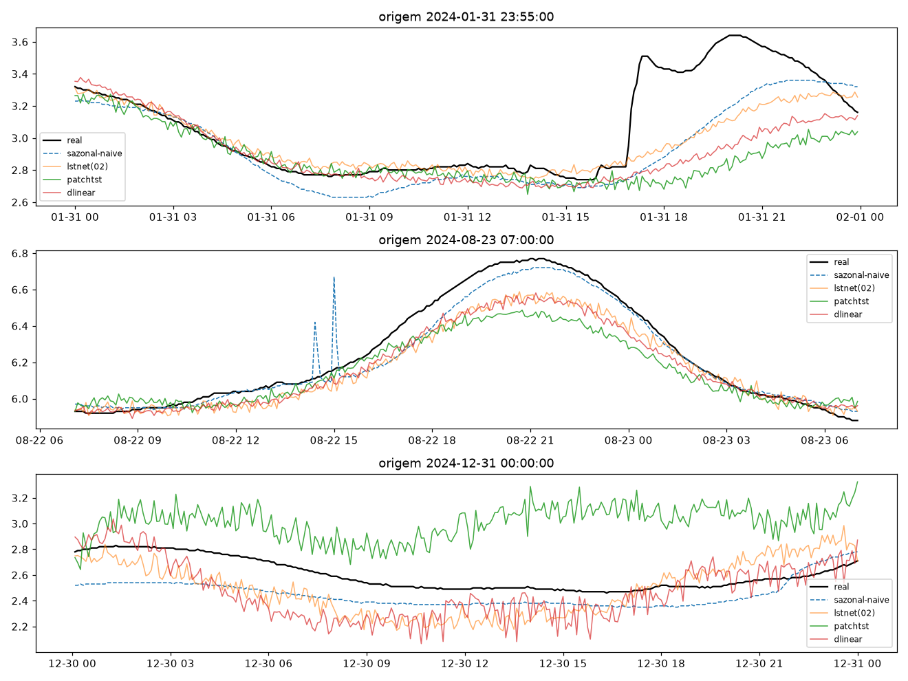
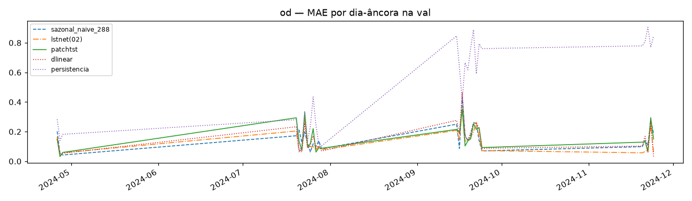
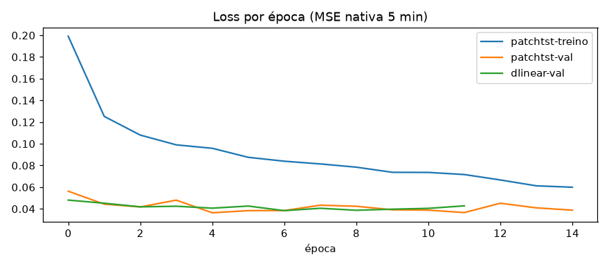

# Experimento 05 — PatchTST + DLinear no OD (EF01), regime anual (treino 2024)

PatchTST nativo + controle DLinear, treinados no OD 2024 com early stopping na val.
Régua 03 recarregada só para inferência. 2025 intocado.
Artefatos gerados por `notebooks/05-patchtst-od.ipynb` (executado de ponta a ponta, 0 erros;
procedência: `temporal-remote` 192.168.1.6, dir `/home/marcos/temporal-model`, torch CPU).
Reproduzir: `.venv/bin/jupyter nbconvert --to notebook --execute --inplace --ExecutePreprocessor.timeout=2400 notebooks/05-patchtst-od.ipynb`
(exige o checkpoint do 03; stride 8 no treino; ~10 min em 12c livre).

## Configuração do experimento

- **Série:** OD 2024; janelas `L=8640 → H=288`; treino 66.073 + val 7.857 (S1 parcial: 657); dias-âncora: 28
- **Treino:** PatchTST 1.639.010 params — early na ep. 15 (best val 0,0364, ep. 5); DLinear 1.161.794 params

## Tabela principal — val rolante

| modelo | MAE | RMSE |
|---|---|---|
| lstnet(02) | 0,1380 | 0,1869 |
| patchtst | 0,1432 | 0,1909 |
| dlinear | 0,1435 | 0,1958 |
| sazonal_naive_288 | 0,1579 | 0,2202 |
| media_movel_288 | 0,3260 | 0,4289 |
| persistencia | 0,3929 | 0,5728 |

(copiado de `metricas_val.csv`) — **régua segue LSTNet (03)**; patchtst e dlinear empatados em 2º, ambos batem o sazonal (−9%).

## Val dias-âncora (28 dias)

| modelo | MAE | RMSE |
|---|---|---|
| lstnet(02) | 0,1369 | 0,1935 |
| dlinear | 0,1573 | 0,2137 |
| sazonal_naive_288 | 0,1579 | 0,2192 |
| patchtst | 0,1594 | 0,2142 |

(copiado de `metricas_val_diaria.csv`; detalhe em `metricas_por_dia.csv`) — nos dias-âncora o patchtst perde do sazonal por pouco; dlinear empata tecnicamente.

## Figuras — o que cada uma mostra

### `01-eda.png`, `02-limpeza.png`, `03-stl.png` — dado 2024

### `04-forecasts.png` — 3 origens do treino

### `05-mae.png` — barras de MAE na val

### `06-val-dias.png` — MAE por dia-âncora

### `07-curvas-treino.png` — loss por época

## Arquivos

| Arquivo | O quê |
|---|---|
| `metricas_val.csv` | Val rolante em CSV (primária) |
| `metricas_val_diaria.csv` | Dias-âncora em CSV |
| `metricas_por_dia.csv` | MAE por dia-âncora em CSV |
| `modelos/patchtst_od.pt` | PatchTST treinado (state_dict) |
| `modelos/dlinear_od.pt` | DLinear treinado (state_dict) |
| `modelos/normalizacao.json` | Modo + fatias de val |
| `figs/` | As 7 figuras explicadas acima |

## Leitura dos resultados

1. **Régua segue LSTNet (0,1380).** PatchTST e DLinear empatados (~0,143, −9% sobre o sazonal) — mesma convergência de métodos vista no pH.
2. Divergência rolante × dias-âncora no patchtst (0,1432 vs 0,1594): nos dias-âncora ele perde do sazonal — instabilidade diária segue o calcanhar de todos menos o LSTNet.
3. Fila: ensemble (07) combina os três; checkpoints guardados para o 08.
