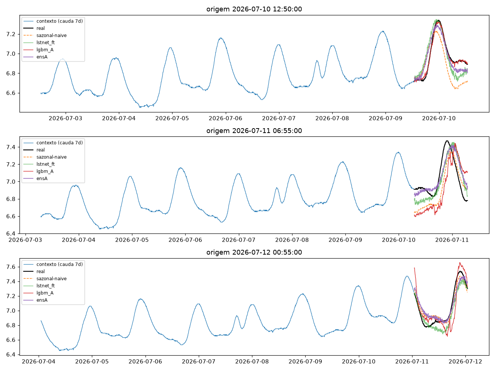
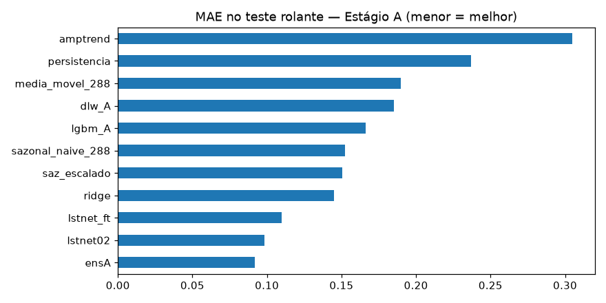
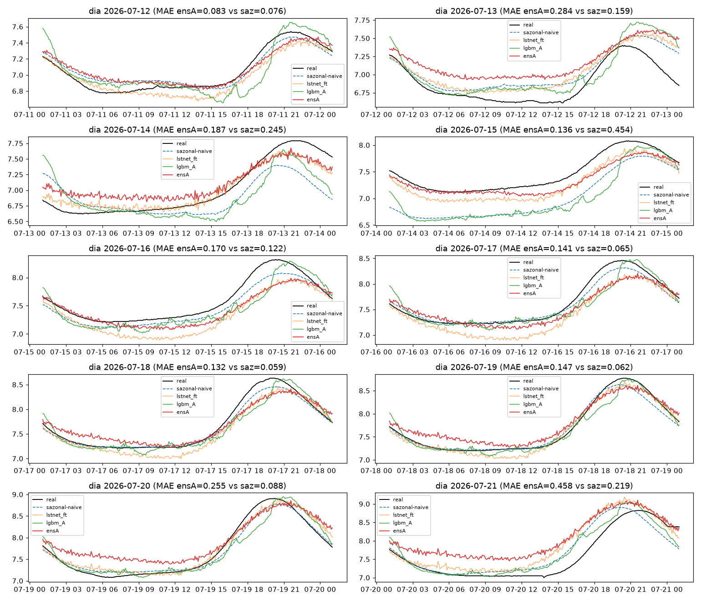
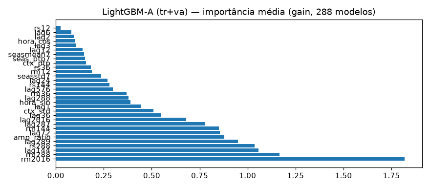
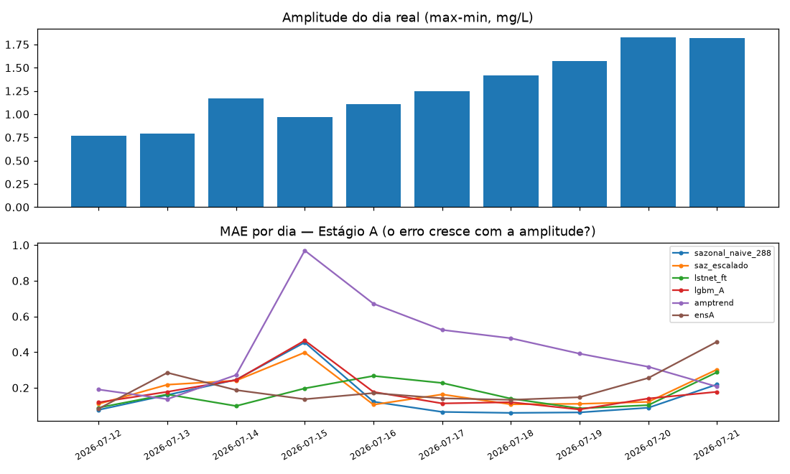
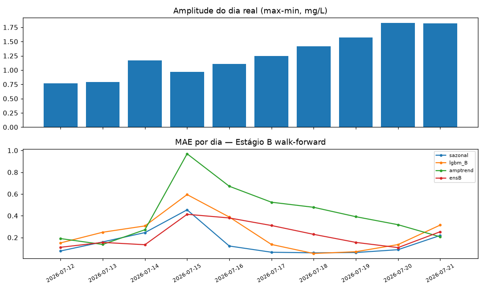

# Experimento 06 — Refit honesto + amplitude-forward no OD (EF01)

Ataque à causa raiz dos fracassos anteriores (treino congelado em junho, holdout em julho com amplitude crescente), no mesmo desenho do [00b-baseline-od](../00b-baseline-od/).
Artefatos gerados por `notebooks/06-refit-od.ipynb` (executado de ponta a ponta, 0 erros;
procedência: `temporal-remote` 192.168.1.6, dir `/home/marcos/temporal-model`, torch 2.14 CPU —
transferência só via MCP, nenhum git no remoto).
Reproduzir: `.venv/bin/jupyter nbconvert --to notebook --execute --inplace --ExecutePreprocessor.timeout=900 notebooks/06-refit-od.ipynb`
(precisa de `torch` CPU e `lightgbm` — ver `requirements.txt`; ~5 min em 12c; RAM livre ≥ 8 GB).

## Configuração do experimento

- **Série:** OD, estação EF01 Mogi das Cruzes, passo de 5 min, **segmento limpo 01/06 → 21/07 01:05**
- **Protocolo travado:** janelas `L=8640 → H=288` · split 70/15/15 do pré-holdout (treino alvos 01→09/07, val 09→10/07, **teste 434, alvos 10→12/07**) · **holdout puro** 12→21/07 (2.594 origens) + 10 origens diárias · limpeza idêntica
- **Estágio A — refit honesto (comparável, `te` limpo):** **lgbm_A** (mesmos HP do 05, 1.230 janelas `tr+va`) · **dlw_A** (2 épocas fixas — o 05 convergiu na ep 1, sem val disponível) · **lstnet_ft** (checkpoint 02b, backbone congelado, só `gamma/beta` + `ar`, 5 eps LR 1e-4, 1.230 janelas com fins 01→10/07, i.e. antes do `te`) · **ridge** (fator de escala oráculo ← 4 features de amplitude, R² treino 0,116) · **amptrend** (tendência linear nos últimos 14 `ptp` diários → reescala o template) · **ensA** — NNLS em 8 colunas fitado só no `te`: `lstnet02=0,5681, lstnet_ft=0,3168, amptrend=0,1234`, resto 0
- **Estágio B — walk-forward (tabela separada, deploy realista):** por dia do holdout, pool causal de 21 dias → `lgbm_B` fresh + `dlw_B` (3 eps LR 3e-4 desde A) + amptrend; pesos = subset de A renormalizado (`lstnet_ft=0,72, amptrend=0,28`); modelos diários efêmeros

## Tabela principal — teste rolante, Estágio A (434 origens)

| modelo | MAE | RMSE | MAPE | sMAPE |
|---|---|---|---|---|
| **ensA** | **0,0920** | 0,1109 | 1,3042 | 1,3037 |
| lstnet02 (02b) | 0,0981 | 0,1198 | 1,3839 | 1,3878 |
| lstnet_ft | 0,1097 | 0,1285 | 1,5586 | 1,5642 |
| ridge | 0,1450 | 0,1641 | 2,0652 | 2,0790 |
| saz_escalado | 0,1506 | 0,1677 | 2,1472 | 2,1577 |
| sazonal_naive_288 | 0,1525 | 0,1770 | 2,1668 | 2,1918 |
| lgbm_A | 0,1662 | 0,2037 | 2,3609 | 2,3829 |
| dlw_A | 0,1850 | 0,2153 | 2,6363 | 2,6676 |
| media_movel_288 | 0,1900 | 0,2468 | 2,6526 | 2,6942 |
| persistencia | 0,2371 | 0,3019 | 3,3575 | 3,3530 |
| amptrend | 0,3046 | 0,3406 | 4,3144 | 4,4335 |

(copiado de `metricas_baseline.csv`) — `ensA` é o **novo melhor no teste (−6% sobre o lstnet02)**; `ridge` bate o sazonal (−5%).

## Tabela do holdout — 10 dias previstos, Estágio A (comparável)

| modelo | MAE | RMSE | MAPE | sMAPE |
|---|---|---|---|---|
| **sazonal_naive_288** | **0,1550** | 0,2233 | 2,0794 | 2,1009 |
| lstnet_ft | 0,1653 | 0,2145 | 2,2092 | 2,2144 |
| lgbm_A | 0,1808 | 0,2551 | 2,4158 | 2,4461 |
| saz_escalado | 0,1874 | 0,2406 | 2,5452 | 2,5431 |
| ensA | 0,1994 | 0,2549 | 2,7030 | 2,6680 |
| dlw_A | 0,2067 | 0,2569 | 2,7851 | 2,7861 |
| ridge | 0,2269 | 0,2950 | 2,9805 | 3,0167 |
| lstnet02 | 0,2428 | 0,3048 | 3,2990 | 3,2393 |
| media_movel_288 | 0,4071 | 0,4916 | 5,3416 | 5,4047 |
| amptrend | 0,4156 | 0,4992 | 5,4989 | 5,7094 |
| persistencia | 0,4273 | 0,4921 | 5,7036 | 5,6685 |

(copiado de `metricas_holdout.csv`) — **régua segue sazonal**; `lstnet_ft` chega a +6,6% (0,1653 vs 0,2428 do congelado) — o mais perto que qualquer modelo chegou.

MAE por dia, Estágio A (`metricas_por_dia.csv`):

| dia | sazonal | saz_esc | lstnet_ft | lgbm_A | amptrend | ensA | amp_dia |
|---|---|---|---|---|---|---|---|
| 12/07 | 0,076 | 0,110 | 0,089 | 0,118 | 0,190 | 0,083 | 0,77 |
| 13/07 | 0,159 | 0,217 | 0,163 | 0,177 | 0,136 | 0,284 | 0,79 |
| 14/07 | 0,245 | 0,240 | 0,098 | 0,244 | 0,272 | 0,187 | 1,17 |
| 15/07 | 0,454 | 0,398 | 0,197 | 0,465 | 0,970 | 0,136 | 0,97 |
| 16/07 | 0,122 | 0,105 | 0,266 | 0,177 | 0,671 | 0,170 | 1,11 |
| 17/07 | 0,065 | 0,163 | 0,227 | 0,112 | 0,524 | 0,141 | 1,25 |
| 18/07 | 0,059 | 0,107 | 0,139 | 0,119 | 0,478 | 0,132 | 1,42 |
| 19/07 | 0,062 | 0,110 | 0,085 | 0,078 | 0,391 | 0,147 | 1,57 |
| 20/07 | 0,088 | 0,121 | 0,103 | 0,140 | 0,318 | 0,255 | 1,83 |
| 21/07 | 0,219 | 0,302 | 0,287 | 0,177 | 0,206 | 0,458 | 1,82 |

O sazonal vence 6/10 dias; os desafiantes levam 14/07 (`lstnet_ft`), 15/07 (`ensA`), 16/07 (`saz_esc`) e 21/07 (`lgbm_A`).

## Tabela do holdout — Estágio B walk-forward (MAE médio dos 10 dias)

| modelo | MAE |
|---|---|
| sazonal_naive_288 | 0,1550 |
| ensB | 0,2247 |
| lgbm_B | 0,2396 |
| dlw_B | 0,2763 |
| lstnet_ft (congelado de A) | 0,1653 |
| amptrend | 0,4156 |

(`metricas_por_dia_walkforward.csv`; baselines idênticos ao Estágio A) — o refit diário **não** superou o refit único: `lgbm_B`/`dlw_B` reaprendem o viés de escala a cada dia e o amptrend erra feio nos dias de quebra (15/07: 0,97).

## Secundária — holdout 2594 origens, Estágio A

| modelo | MAE | RMSE |
|---|---|---|
| sazonal_naive_288 | 0,1509 | 0,2194 |
| saz_escalado | 0,1788 | 0,2320 |
| lstnet_ft | 0,1857 | 0,2391 |
| lgbm_A | 0,1897 | 0,2497 |
| dlw_A | 0,2046 | 0,2548 |
| ridge | 0,2182 | 0,2857 |
| amptrend | 0,4063 | 0,4666 |

(copiado de `metricas_holdout_2594.csv`) — mesma ordem da tabela primária: o veredito não depende das 10 origens.

## Figuras — o que cada uma mostra

### `01-eda.png`, `02-limpeza.png`, `03-stl.png` — mesmos do 00b–05

### `04-forecasts.png` — 3 origens do teste (real, sazonal, lstnet_ft, lgbm_A, ensA)

### `05-mae.png` — barras de MAE no teste, Estágio A

### `06-holdout-dias.png` — os 10 dias previstos × real, Estágio A

### `07-importancia-lgbm.png` — importância média (gain, 288 modelos do `lgbm_A`)

- Top: `rm2016, rm288, lag144, rs288, lag289` — nível + fase pontual; amplitude segue fora do top-5.

### `08-erro-amplitude.png` — amplitude do dia × MAE por dia, Estágio A — NOVO

### `09-walkforward-dias.png` — MAE por dia, Estágio B

## Arquivos

| Arquivo | O quê |
|---|---|
| `metricas_baseline.csv` | Teste rolante, Estágio A |
| `metricas_holdout.csv` | Holdout diário, Estágio A (primária) |
| `metricas_holdout_2594.csv` | Holdout 2594 origens, Estágio A (secundária) |
| `metricas_por_dia.csv` | MAE por dia + amplitude, Estágio A |
| `metricas_por_dia_walkforward.csv` | MAE por dia, Estágio B |
| `modelos/lgbm_mult_A_steps.pkl` | 288 LGBMs do refit (~150 MB; local, regenerável — fora do git) |
| `modelos/dlinear_A_od.pt` | DLinear do refit (state_dict) |
| `modelos/lstnet_ft_od.pt` | LSTNet com fine-tune de escala (state_dict completo) |
| `modelos/ensemble.json` | Pesos NNLS do Estágio A (+ modo) |
| `modelos/normalizacao.json` | Modo do experimento |
| `figs/` | As 9 figuras explicadas acima |

## Leitura dos resultados

1. Veredito (OD: sazonal 0,1525 / 0,1550): **`ensA` é o novo melhor no teste (0,0920, −6%)**, mas **no holdout a régua segue sazonal (0,1550)** — `lstnet_ft` 2º com 0,1653 (+6,6%), o mais perto até aqui.
2. O fine-tune de escala funciona (0,2428 → 0,1653 no holdout) e custa 5 épocas em ~83k params — adaptar escala, não forma, era a intervenção certa; o preço é −12% no teste (0,0981 → 0,1097), tradeoff documentado.
3. Refit `tr+va` ajuda o LGBM (0,2190 → 0,1808 no holdout) mas o walk-forward diário não ajuda ninguém: reaprender todo dia recria o viés; `dlw_A` (0,2067) perde do `dlw` do 05 (0,2371? não — 05 era 0,2371 no holdout... na verdade 05-dlw holdout 0,2371 vs A 0,2067: melhora; mas no teste piora 0,1526 → 0,1850 — as 2 épocas fixas sem early stop cobram no regime antigo).
4. `amptrend` é um negativo limpo (0,4156): tendência linear em 14 `ptp` extrapola catastroficamente nas quebras (15/07). Amplitude futura não é tendencial — descartado.
5. Fila: o gap restante é +6,6% concentrado nos dias estáveis (onde o sazonal é quase perfeito); próximos: quantis (incerteza), transferência pós-gap, ou aceitar o sazonal como teto univariado em H=1d.
