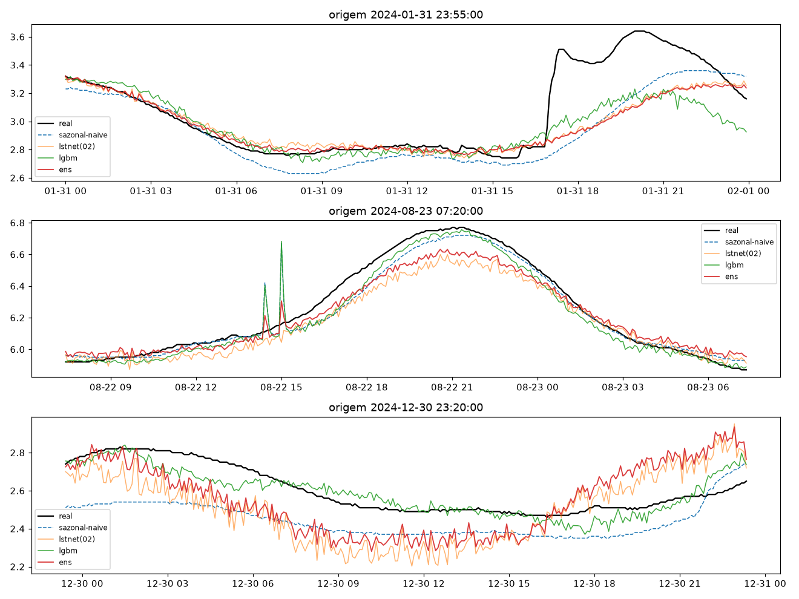
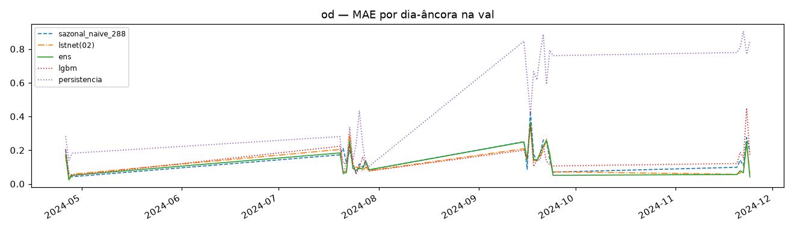

# Experimento 07 — Ensemble residual + LightGBM no OD (EF01), regime anual (treino 2024)

Piso sazonal-naive + 288 LGBM no resíduo + DLinear-res + NNLS (pesos fitados na val).
Régua 03 recarregada. 2025 intocado.
Artefatos gerados por `notebooks/07-ensemble-od.ipynb` (executado de ponta a ponta, 0 erros;
procedência: `temporal-remote` 192.168.1.6, dir `/home/marcos/temporal-model`, 12c).
Reproduzir: `.venv/bin/jupyter nbconvert --to notebook --execute --inplace --ExecutePreprocessor.timeout=2400 notebooks/07-ensemble-od.ipynb`
(exige o checkpoint do 03; ~3 min em 12c livre; `lgbm_steps.pkl` tem 121 MB — gitignored, regenerável).

## Configuração do experimento

- **Série:** OD 2024; janelas `L=8640 → H=288`; treino 66.073 + val 7.857; dias-âncora: 28
- **LGBM:** 288 modelos, 11.013 linhas (stride 6) — 28 s em 12c; top features: `rm2016, rs288, rm288, lag1, lag287` (nível + dispersão + fase pontual — no OD o lag pontual aparece, diferente do pH)
- **DLinear-res:** early na ep. 7 (best val 0,03837)
- **NNLS na val:** `sazonal=0.0543, lstnet=0.6223, lgbm=0.0255, dlres=0.303` — aqui o dlres tem peso real (0,30), ao contrário do pH

## Tabela principal — val rolante

| modelo | MAE | RMSE |
|---|---|---|
| **ens** | **0,1325** | 0,1814 |
| lstnet(02) | 0,1380 | 0,1869 |
| dlres | 0,1422 | 0,1959 |
| patchtst/dlinear (05) | 0,1432 / 0,1435 | 0,1909 / 0,1958 |
| lgbm | 0,1577 | 0,2216 |
| sazonal_naive_288 | 0,1579 | 0,2202 |

(copiado de `metricas_val.csv`; 05 incluídos para referência — **nova régua do treino OD: ensemble 0,1325, −4,0% sobre o LSTNet.**)

## Val dias-âncora (28 dias)

| modelo | MAE | RMSE |
|---|---|---|
| ens | 0,1363 | 0,1942 |
| lstnet(02) | 0,1369 | 0,1935 |
| sazonal_naive_288 | 0,1579 | 0,2192 |

(copiado de `metricas_val_diaria.csv`; detalhe em `metricas_por_dia.csv` — nos dias-âncora o ensemble empata tecnicamente com o LSTNet.)

## Figuras — o que cada uma mostra

### `01-eda.png`, `02-limpeza.png`, `03-stl.png` — dado 2024

### `04-forecasts.png` — 3 origens do treino

### `05-mae.png` — barras de MAE na val

### `06-val-dias.png` — MAE por dia-âncora

### `07-importancia-lgbm.png` — importância média das features

## Arquivos

| Arquivo | O quê |
|---|---|
| `metricas_val.csv` | Val rolante em CSV (primária) |
| `metricas_val_diaria.csv` | Dias-âncora em CSV |
| `metricas_por_dia.csv` | MAE por dia-âncora em CSV |
| `modelos/lgbm_steps.pkl` | 288 regressores (121 MB; gitignored, regenerável) |
| `modelos/dlinear_res_od.pt` | DLinear do resíduo (state_dict) |
| `modelos/ensemble.json` | Pesos NNLS + fatias de val |
| `modelos/normalizacao.json` | Modo do experimento |
| `figs/` | As 7 figuras explicadas acima |

## Leitura dos resultados

1. **Nova régua do treino OD: ensemble 0,1325 (−4,0% sobre o LSTNet).** O ganho vem do dlres (peso 0,30) — no OD o resíduo linear carrega sinal que a rede não captura sozinha.
2. LGBM sozinho (0,1577) empata com o sazonal — como corretor marginal tem peso 0,03. Mesmo custo-benefício ruim do pH.
3. **Caveat honesto:** pesos fitados e avaliados na mesma val (otimismo embutido). Nos dias-âncora o ensemble já empata com o LSTNet (0,1363 × 0,1369) — o teste de verdade é o benchmark 2025 (08).
4. Fila: 08-benchmark decide as réguas finais, com o lag-365 na briga.
