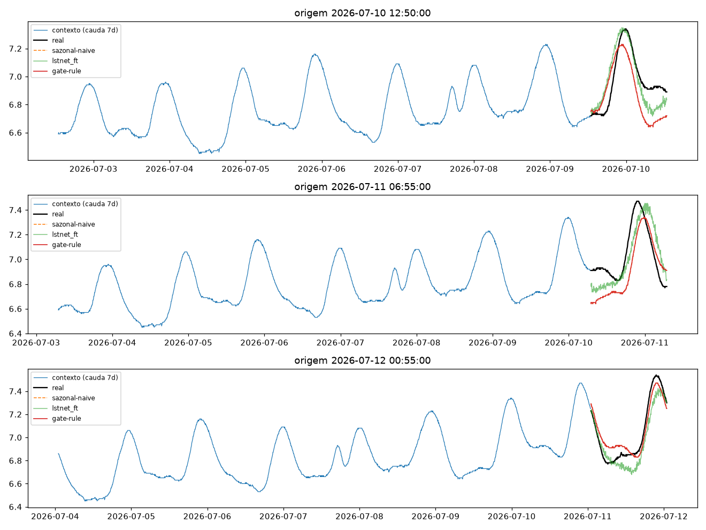
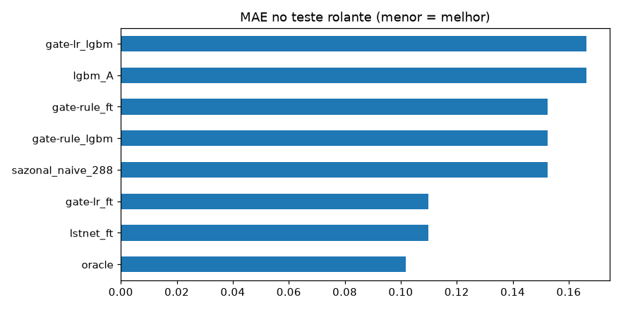
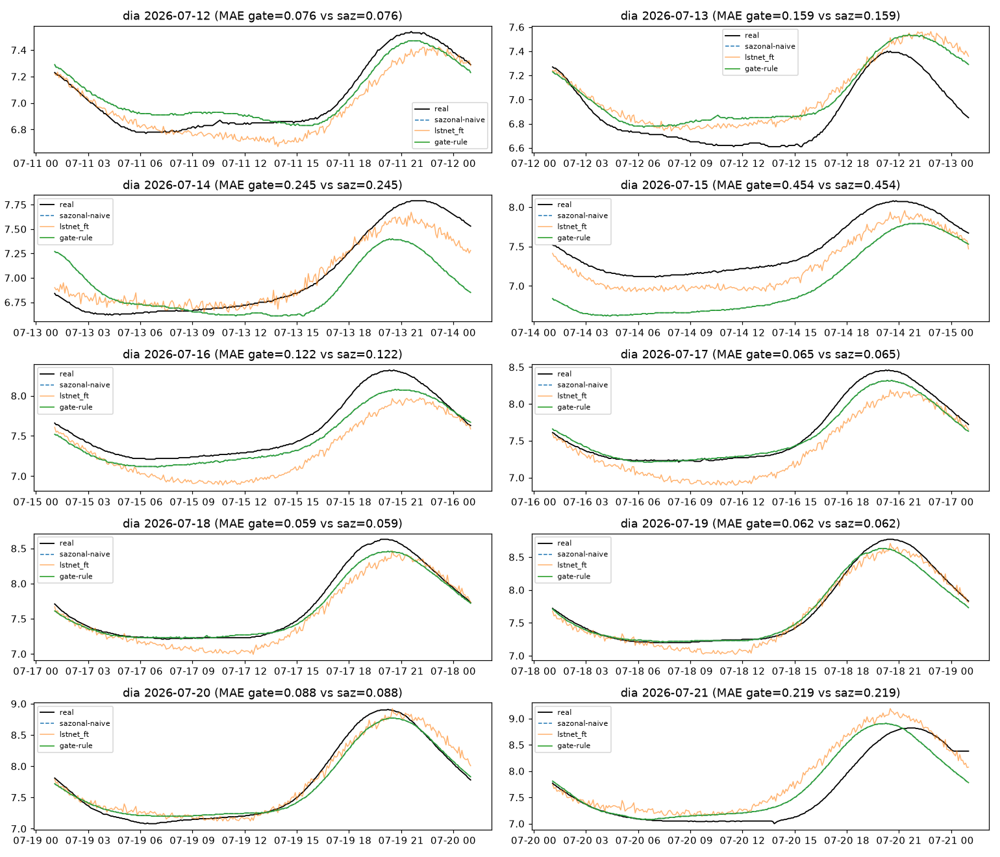
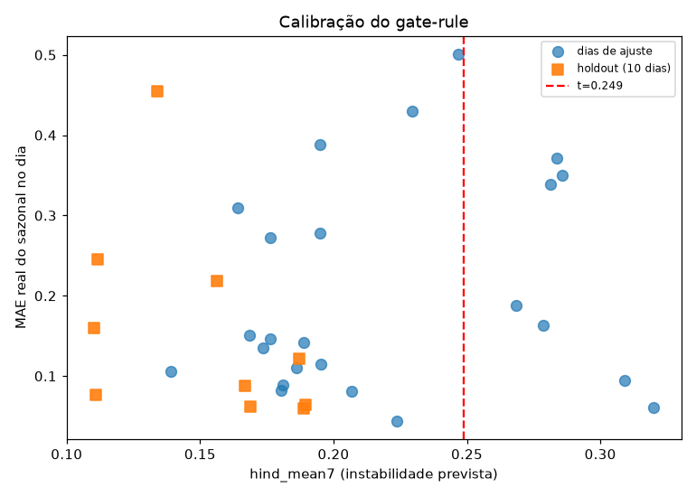
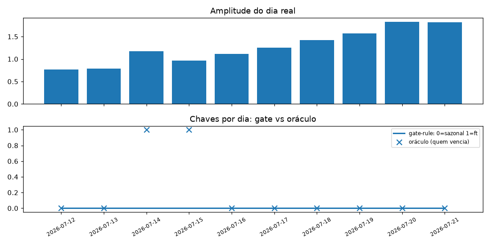

# Experimento 07 — Gate de instabilidade no OD (EF01)

Última via estrutural contra a régua do OD: em vez de prever o dia, prever **se amanhã muda** e chavear (sazonal ↔ desafiante). Mesmo desenho do [00b-baseline-od](../00b-baseline-od/), nenhum treino pesado — só reuso dos checkpoints do [06-refit-od](../06-refit-od/).
Artefatos gerados por `notebooks/07-gate-od.ipynb` (executado de ponta a ponta, 0 erros;
procedência: `temporal-remote` 192.168.1.6, dir `/home/marcos/temporal-model`, torch 2.14 CPU —
transferência só via MCP, nenhum git no remoto).
Reproduzir: `.venv/bin/jupyter nbconvert --to notebook --execute --inplace --ExecutePreprocessor.timeout=900 notebooks/07-gate-od.ipynb`
(precisa de `torch` CPU + `scikit-learn` — ver `requirements.txt`; ~3 min em 12c.
Nota: o braço `lgbm` exige `resultados/06-refit-od/modelos/lgbm_mult_A_steps.pkl`, fora do git;
sem ele o notebook cai para modo só-`ft`).

## Configuração do experimento

- **Série:** OD, estação EF01 Mogi das Cruzes, passo de 5 min, **segmento limpo 01/06 → 21/07 01:05**
- **Protocolo travado:** janelas `L=8640 → H=288` · split 70/15/15 (teste 434, alvos 10→12/07) · **holdout puro** 12→21/07 (2.594 origens) + 10 origens diárias
- **Dias-alvo alinhados:** `T(d)` = 288 slots até `d 01:00` (horário das origens diárias); `hind(d) = MAE(T(d−1), T(d))`, causal, sem modelo
- **Features do gate (só passado):** `hind_mean7/max/last` (hindcast trailing), `ptp_slope7`, `ctx_std`
- **Ajuste (só dias `d < te`, 24 dias 16/06→09/07, `ft` venceu 13/24):** **gate-rule** (`hind_mean7 > t`, `t=0,2489`, acerto 58% = 14/24) · **gate-lr** (logística 5 feats, acerto 58%) · **oracle** (melhor ex-post por origem — teto, não modelo). Parâmetros em `modelos/gate.json` (versionado, sem `.pkl` novo)

## Tabela principal — teste rolante (434 origens, sanity)

| modelo | MAE | RMSE |
|---|---|---|
| oracle | 0,1019 | 0,1216 |
| gate-lr_ft (= ft, 434/434) | 0,1097 | 0,1285 |
| lstnet_ft | 0,1097 | 0,1285 |
| gate-rule_ft (= sazonal, 0/434) | 0,1525 | 0,1770 |
| sazonal_naive_288 | 0,1525 | 0,1770 |
| lgbm_A / gate-lr_lgbm | 0,1662 | 0,2037 |

## Tabela do holdout — 10 dias previstos (primária)

| modelo | MAE | RMSE |
|---|---|---|
| **oracle** | **0,1103** | 0,1442 |
| **sazonal_naive_288** | **0,1550** | 0,2233 |
| gate-rule_ft (= sazonal, 0/10) | 0,1550 | 0,2233 |
| lstnet_ft / gate-lr_ft (= ft, 10/10) | 0,1653 | 0,2145 |
| lgbm_A / gate-lr_lgbm | 0,1808 | 0,2551 |

(copiado de `metricas_holdout.csv`) — **régua segue sazonal**: a regra nunca dispara (`t=0,2489` acima de todo hind do holdout, máx 0,19) e a logística dispara sempre. O `oracle` (−29%) mostra o headroom que o chaveamento perfeito teria — nenhum gate o captura.

MAE por dia (`metricas_por_dia.csv`, com `hind_mean7` e amplitude):

| dia | sazonal | lstnet_ft | gate-rule | gate-lr | oracle | hind_mean7 | amp_dia |
|---|---|---|---|---|---|---|---|
| 12/07 | 0,076 | 0,089 | 0,076 | 0,089 | 0,076 | 0,111 | 0,77 |
| 13/07 | 0,159 | 0,163 | 0,159 | 0,163 | 0,159 | 0,110 | 0,79 |
| 14/07 | 0,245 | 0,098 | 0,245 | 0,098 | 0,098 | 0,112 | 1,17 |
| 15/07 | 0,454 | 0,197 | 0,454 | 0,197 | 0,197 | 0,134 | 0,97 |
| 16/07 | 0,122 | 0,266 | 0,122 | 0,266 | 0,122 | 0,187 | 1,11 |
| 17/07 | 0,065 | 0,227 | 0,065 | 0,227 | 0,065 | 0,190 | 1,25 |
| 18/07 | 0,059 | 0,139 | 0,059 | 0,139 | 0,059 | 0,189 | 1,42 |
| 19/07 | 0,062 | 0,085 | 0,062 | 0,085 | 0,062 | 0,169 | 1,57 |
| 20/07 | 0,088 | 0,103 | 0,088 | 0,103 | 0,088 | 0,167 | 1,83 |
| 21/07 | 0,219 | 0,287 | 0,219 | 0,287 | 0,177 | 0,156 | 1,82 |

## Secundária — holdout 2594 origens (gating por origem)

| modelo | MAE | RMSE |
|---|---|---|
| oracle | 0,1086 | 0,1464 |
| sazonal / gate-rule | 0,1509 | 0,2194 |
| lstnet_ft / gate-lr | 0,1857 | 0,2391 |
| lgbm_A | 0,1897 | 0,2497 |

(copiado de `metricas_holdout_2594.csv`) — mesma ordem da primária.

## Figuras — o que cada uma mostra

### `01-eda.png`, `02-limpeza.png`, `03-stl.png` — mesmos do 00b–06

### `04-forecasts.png` — 3 origens do teste (real, sazonal, lstnet_ft, gate-rule)

### `05-mae.png` — barras de MAE no teste

### `06-holdout-dias.png` — os 10 dias previstos × real

### `07-gate-calibracao.png` — hind_mean7 × erro real do sazonal (ajuste + holdout) — NOVO

- Leitura: nos dias de ajuste, `ft` vence e perde em toda a faixa de hind (13/24 espalhados) — o hindcast não separa os regimes; no holdout, todos os dias caem à esquerda do limiar.

### `08-chaves.png` — quem o gate escolheu por dia vs oráculo — NOVO

- Leitura: a regra escolhe sazonal nos 10 dias (0 acertos de chave para `ft`); o oráculo alternaria em 14–15/07 e 21/07.

## Arquivos

| Arquivo | O quê |
|---|---|
| `metricas_baseline.csv` | Teste rolante em CSV |
| `metricas_holdout.csv` | Holdout diário em CSV (primária) |
| `metricas_holdout_2594.csv` | Holdout 2594 origens em CSV (secundária) |
| `metricas_por_dia.csv` | MAE por dia + hind_mean7 + amplitude em CSV |
| `modelos/gate.json` | Limiar, coeficientes e dias de ajuste (pequeno, versionado) |
| `figs/` | As 8 figuras explicadas acima |

## Leitura dos resultados

1. Veredito (OD: sazonal 0,1525 / 0,1550): **régua segue sazonal** — gate-rule empata (nunca dispara), gate-lr empata com o `ft` (dispara sempre). O chaveamento aprendido não existe aqui.
2. O negativo é informativo e fecha o track: com 58% de acerto no ajuste (cara-ou-coroa em 24 dias), a instabilidade dia-a-dia **não é previsível** a partir de histórico univariado — nem o hindcast trailing (a feature mais direta possível) separa os regimes. Somado ao 06, o diagnóstico é completo: o que era aprendível em escala foi aprendido (`ft` a +7%); o resto é inovação diária irredutível em H=1d.
3. O `oracle` (−29% no diário, −28% nas 2594 origens) quantifica o preço dessa imprevisibilidade — é o número a citar se um dia houver covariáveis exógenas (ex.: temperatura/radiação para a amplitude do OD) para condicionar o gate.
4. Fila: encerrar a busca por MAE no OD H=1d univariado (teto declarado); próximos com valor: saída probabilística (quantis), teste de transferência pós-gap 06→31/08, e `app.py` FastAPI (pH `lstnet` + OD sazonal/`ft`).
