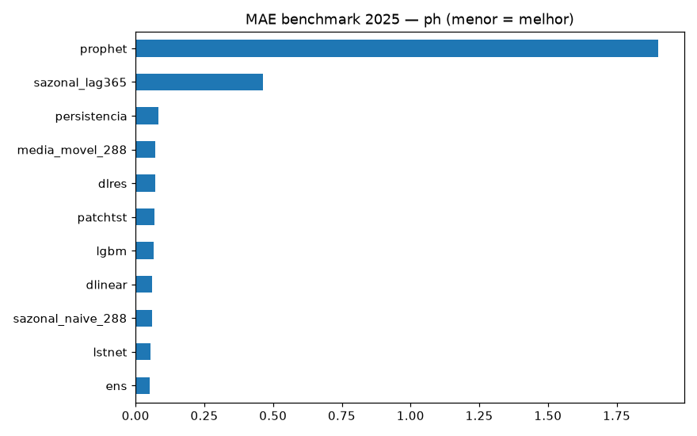
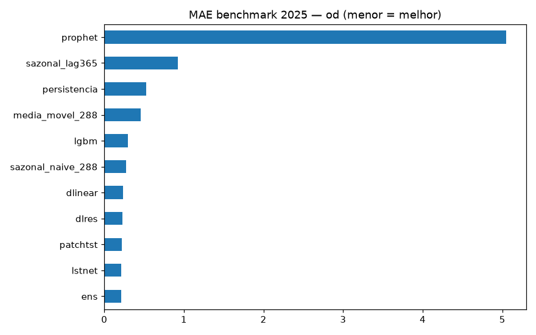
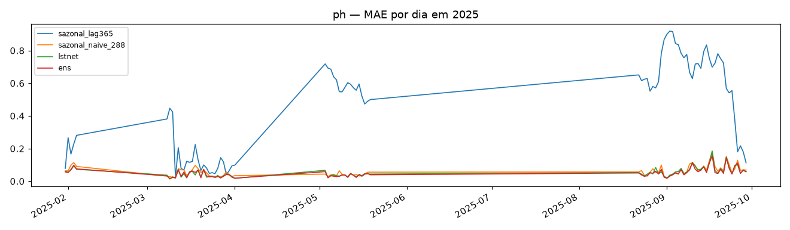
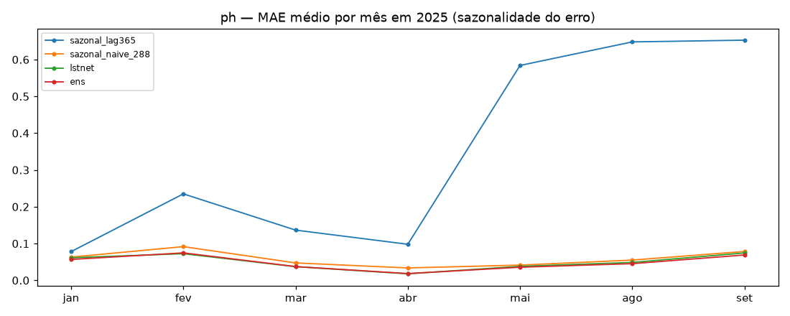
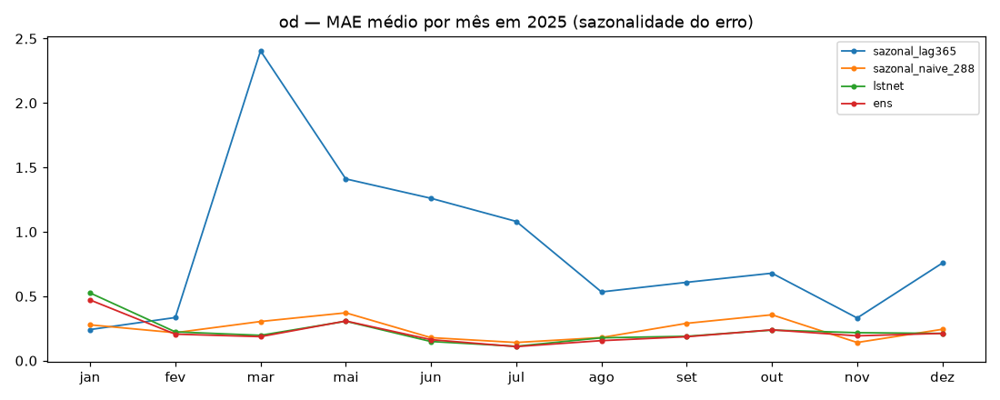
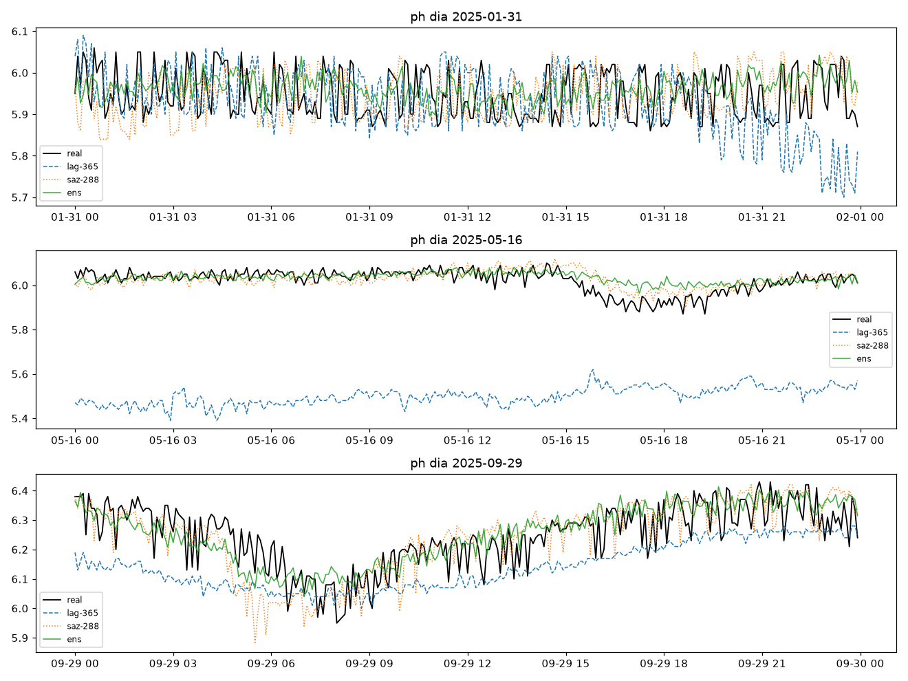
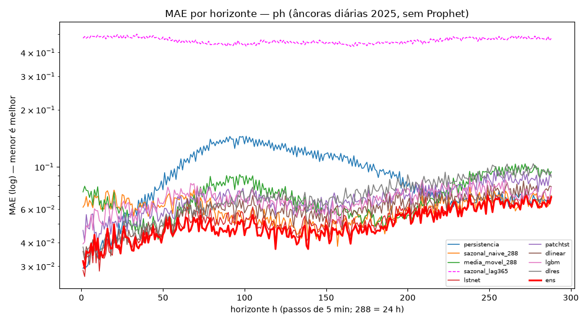
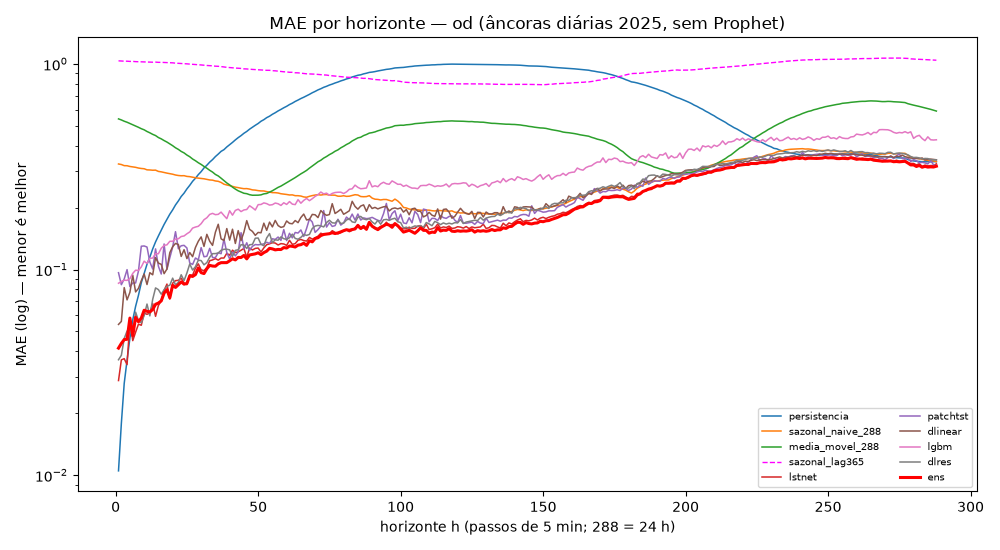
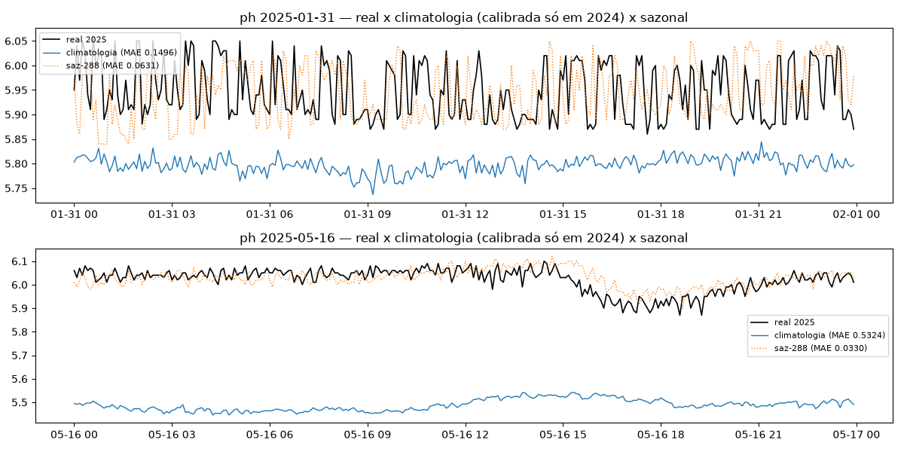
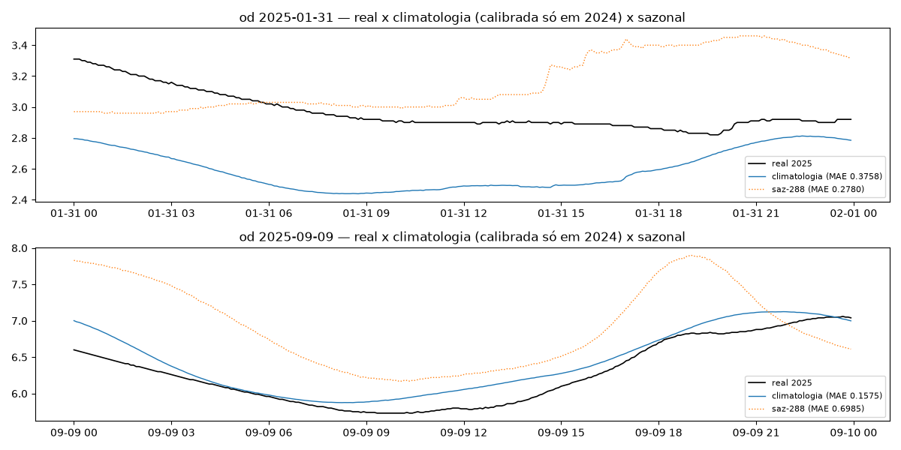

# Experimento 08 — Benchmark 2025: todos os campeões × ano intocado (só inferência)

Avaliação final do regime anual: checkpoints de 00–07 (treino 2024) previstos em 2025,
ano nunca tocado por nenhum treino, val ou tuning. Inclui o sazonal **lag-365** (copia a
mesma data de 2024, com fallback honesto p/ saz-288 onde 2024 falha) e quebra mensal do erro.
Artefatos gerados por `notebooks/08-benchmark-2025.ipynb` (executado de ponta a ponta, 0 erros;
procedência: `temporal-remote` 192.168.1.6, dir `/home/marcos/temporal-model`, 12c livres).
Reproduzir: `.venv/bin/jupyter nbconvert --to notebook --execute --inplace --ExecutePreprocessor.timeout=2400 notebooks/08-benchmark-2025.ipynb`
(exige os 14 checkpoints de 00–07; ~10 min em 12c livres; sem treino).

## Configuração do experimento

- **Benchmark:** `dados/benchmark/ef01-...-2025.csv` (pH + OD), limpeza idêntica, janelas `L=8640 → H=288`
- **Cobertura:** pH 24.589 janelas + 86 dias-âncora (31/jan → 29/set; outages matam out–dez) · OD 46.556 janelas + 163 dias-âncora (31/jan → 30/dez)
- **Modelos (11 por variável):** 3 baratos + lag-365 + lstnet + patchtst + dlinear + lgbm + dlres + ens (pesos NNLS do 06/07, sem re-fit) + prophet (artefato do 00/01, só inferência)
- **lag-365:** fallback em só 1,2% (pH) / 1,3% (OD) — o fracasso dele é real (deriva interanual), não falta de dado

## Tabela principal — benchmark rolante 2025

**pH (24.589 origens):**

| modelo | MAE | RMSE |
|---|---|---|
| **ens (04)** | **0,0509** | 0,0704 |
| lstnet (02) | 0,0529 | 0,0732 |
| sazonal_naive_288 | 0,0597 | 0,0823 |
| dlinear (04) | 0,0600 | 0,0856 |
| lgbm | 0,0671 | 0,0907 |
| patchtst (04) | 0,0688 | 0,0949 |
| dlres | 0,0710 | 0,1073 |
| media_movel_288 | 0,0715 | 0,0926 |
| persistencia | 0,0844 | 0,1133 |
| sazonal_lag365 | 0,4640 | 0,5463 |
| prophet | 1,8997 | 2,0996 |

**OD (46.556 origens):**

| modelo | MAE | RMSE |
|---|---|---|
| **ens (07)** | **0,2107** | 0,3220 |
| lstnet (03) | 0,2127 | 0,3220 |
| patchtst (05) | 0,2213 | 0,3226 |
| dlres | 0,2286 | 0,3407 |
| dlinear (05) | 0,2325 | 0,3416 |
| sazonal_naive_288 | 0,2714 | 0,4015 |
| lgbm | 0,2943 | 0,4197 |
| media_movel_288 | 0,4545 | 0,5645 |
| persistencia | 0,5258 | 0,7067 |
| sazonal_lag365 | 0,9252 | 1,1881 |
| prophet | 5,0446 | 5,4095 |

(copiado de `metricas_benchmark_{ph,od}.csv`; dias-âncora em `metricas_diaria_{ph,od}.csv` com a mesma ordem; por dia em `metricas_por_dia_{var}.csv`, por mês em `metricas_por_mes_{var}.csv`)

## Figuras — o que cada uma mostra

### `01-eda-{ph,od}.png` — o ano de 2025 (nível do pH deslocado vs 2024 — pista do fracasso do lag-365)

### `04-mae-{ph,od}.png` — barras de MAE no benchmark

### `05-diaria-{ph,od}.png` — MAE por dia em 2025

### `06-mensal-{ph,od}.png` — MAE médio por mês (sazonalidade do erro)

- Leitura: o ensemble vence em quase todos os meses; o erro de todos sobe no inverno (jun–ago), quando a amplitude do OD é máxima; lag-365 e Prophet fora de escala o ano todo.

### `07-exemplos-{ph,od}.png` — 3 dias previstos (real × lag-365 × saz-288 × ens)

### `08-mae-por-horizonte-{ph,od}.png` — MAE por horizonte h=1..288 (Fase 1.1, âncoras diárias)

- Leitura: o erro cresce com h em todos; ensemble pH 0,0319→0,0693 (×2,2), OD 0,0415→0,3180 (×7,7). MASE médio (denominador 2024): pH ens 0,917 · lstnet 0,964 · saz 1,086; OD ens 0,942 · lstnet 0,955 · saz 1,243. Prophet fora da curva (exige refit por origem).

### `08-climatologia-{ph,od}.png` — baseline climatologia vs real (Fase 1.3, descartado)

## Arquivos

| Arquivo | O quê |
|---|---|
| `metricas_benchmark_{ph,od}.csv` | Rolante completo em CSV (primária) |
| `metricas_diaria_{ph,od}.csv` | Dias-âncora em CSV |
| `metricas_por_dia_{ph,od}.csv` | MAE por dia em CSV |
| `metricas_por_mes_{ph,od}.csv` | MAE médio por mês em CSV |
| `metricas_por_horizonte_{ph,od}.csv` | MAE(h) por modelo + MASE ens/lstnet/sazonal, h=1..288 (Fase 1.1) |
| `metricas_dm_{ph,od}.csv` | Erro quadrático por origem p/ o teste DM (Fase 1.2) |
| `metricas_climatologia_{ph,od}.csv` | MAE/RMSE por origem da climatologia (Fase 1.3) |
| `figs/` | As 14 figuras explicadas acima |

Sem pasta `modelos/` — nenhum treino aqui; todos os checkpoints são dos experimentos 00–07.

## Leitura dos resultados — veredito final do projeto

1. **pH, régua final: ensemble 0,0509 (−15% sobre o sazonal 0,0597).** LSTNet 2º (0,0529). O ensemble generalizou do treino para o ano intocado — o medo de overfit da val era infundado.
2. **OD, régua final: ensemble 0,2107 (−22% sobre o sazonal 0,2714).** LSTNet 2º (0,2127). A queda da régua do OD, impossível em 3 meses de dados, veio com 1 ano de treino.
3. **lag-365 é inútil (0,46 / 0,93):** o nível das séries deriva entre anos (ver EDA) — copiar o ano anterior erra por ~0,5 pH e ~0,9 mg/L. Sazonalidade anual climática ≠ repetição.
4. **Prophet explode (1,9 / 5,0):** extrapolação de tendência sem âncora, piorando ao longo do ano (ver mensal). Fora do jogo em qualquer regime.
5. **PatchTST confirma o overfit no pH** (0,0688, perde do sazonal em dado novo) mas é razoável no OD (0,2213, 3º). DLinear é o oposto: seguro no pH (0,0600), mediano no OD.
6. **LGBM sozinho perde do sazonal nas duas variáveis em 2025** (0,0671 / 0,2943) — como componente de ensemble tem valor, como modelo não.

## Análises pós-benchmark (Fase 1, 16/09/2026 — sem retreino, só inferência)

### Erro por horizonte + MASE (`notebooks/09-analises-pos-benchmark.ipynb`, Fase 1.1)

MAE(h) por modelo em `metricas_por_horizonte_{ph,od}.csv`; MASE(h) = MAE(h)/média 2024 de |y_t−y_{t−288}| (0,0549 pH · 0,2199 OD). Validação: MAE médio do ensemble nas âncoras 0,0503/0,2072 vs headlines 0,0509/0,2107 (Δ<2%).

| h | pH ens/lstnet/saz | OD ens/lstnet/saz |
|---|---|---|
| 1 | 0,0319 / 0,0285 / 0,0613 | 0,0415 / 0,0288 / 0,3260 |
| 24 | 0,0350 / 0,0369 / 0,0591 | 0,0849 / 0,0860 / 0,2860 |
| 288 | 0,0693 / 0,0699 / 0,0706 | 0,3180 / 0,3265 / 0,3347 |

MASE médio — pH: ens 0,917 · lstnet 0,964 · saz 1,086 (ens vence 208/288 horizontes); OD: ens 0,942 · lstnet 0,955 · saz 1,243 (215/288). O LSTNet ainda abre h=1 nas duas — o ensemble ganha na sustentação do horizonte, não na largada.

### Diebold-Mariano ens × lstnet (`notebooks/09-analises-pos-benchmark.ipynb`, Fase 1.2; séries em `metricas_dm_{ph,od}.csv`)

d_t = se_ens − se_lstnet por âncora, HAC/Newey-West, bicaudal. **pH: DM −2,88, p=0,004 — o ganho de 4,9% é real** (ens vence 77,9% das origens). **OD: DM +0,73, p=0,46 — gap de 1,3% indistinguível de ruído** (em MSE o sinal até inverte p/ o LSTNet: RMSE âncoras 0,3178 × 0,3153). Tratar o ensemble-OD como vencedor exige outros argumentos (p.ex. MAE mensal consistente), não este teste.

### Climatologia — baseline de custo zero, DESCARTADO (`notebooks/09-analises-pos-benchmark.ipynb`, Fase 1.3)

Perfil horário médio por época calibrado só em 2024: pH 0,4627 / OD 0,8678 de MAE — perde do sazonal por ~8×/~3× e empata com o lag-365. A deriva interanual de nível que matou o lag-365 mata a climatologia do mesmo jeito; qualquer correção de nível exigiria dado de 2025 (quebra a regra dura) e redundaria em persistência/saz-288. Números por origem em `metricas_climatologia_{ph,od}.csv`.
