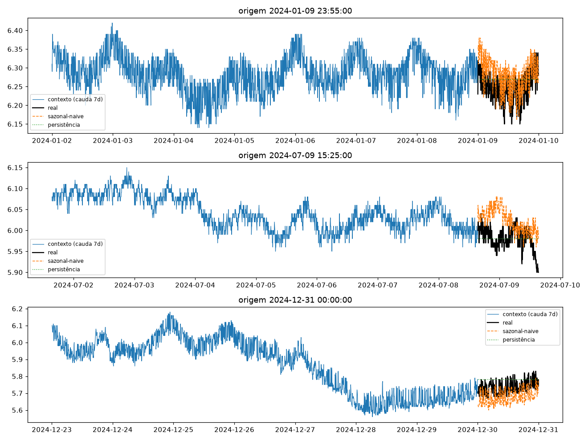
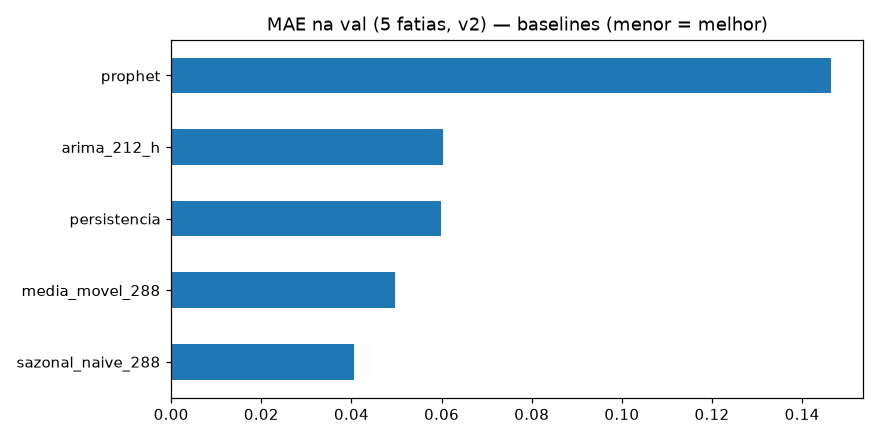
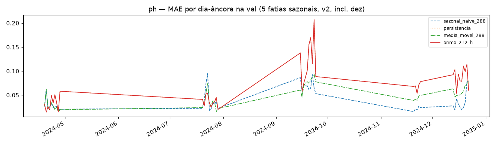

# Experimento 10 — Baseline v2 no pH (EF01): protocolo L=2304 + purge/embargo + 5 fatias

Baselines clássicos **idênticos ao 00** (persistência · sazonal-naive-288 · média-móvel-288 · ARIMA(2,1,2) em grade horária · Prophet),
agora no **protocolo v2**: `L=2304 → H=288` (8 d → 1 d, passo 5 min), interpolação limite 24, descarte de janelas com NaN,
val em **5 fatias de 2024 por data de fim** (19–28/abr, 20–29/jul, 15–24/set, 20–24/nov [5 d], **13–22/dez [10 d, verão — nova]**)
com **purge/embargo ±H** no treino. 2025 intocado (benchmark futuro). O sazonal lag-365 segue fora (incalculável sem 2023).
Artefatos gerados por `notebooks/10-v2-baseline-ph.ipynb` (executado de ponta a ponta, 0 erros;
procedência: `temporal-remote` 192.168.1.6, dir `/home/marcos/temporal-model`, 2026-09-16, solo — 12c, threads unset).
Reproduzir: `.venv/bin/jupyter nbconvert --to notebook --execute --inplace --ExecutePreprocessor.timeout=2400 notebooks/10-v2-baseline-ph.ipynb`
(ARIMA + Prophet; ~10–25 min em 12c. Prophet pula sem CmdStan — aqui **rodou**.)

## Protocolo v2

- **Janelas** `L=2304 → H=288` (8 d → 1 d, 5 min), interp `time` limite 24, descarte de janelas com NaN (idêntico ao 00).
- **Val = 5 fatias por data de fim** (19–28/abr, 20–29/jul, 15–24/set, 20–24/nov [5 d], **13–22/dez [10 d, verão]**);
  a 5ª fatia cobre o verão austral (estação sem cobertura na VAL4) e servirá ao NNLS futuro — aqui é só reporte.
- **Purge/embargo:** treino exclui janelas cujo alvo `[fim−H, fim]` intersecte qualquer fatia estendida `±H`
  (gap mín **+289 passos**; no v1 era −288, i.e. sem purge). Lógica `purge_train`/`signed_gap_steps` reaproveitada
  verbatim de `/tmp/v2split/validate_split.py`; travada por `assert` (gap ≥ H+1, overlap zero).
- **Baselines idênticos ao 00**, determinísticos, sem seeds; ARIMA em grade horária 720 h/24 h repeat ×12
  (val com stride 48); Prophet ajustado só no treino (fatias de val removidas da série de ajuste).
- **Diferenças vs v1 (00):** `L` 8640→2304 · val 4→5 fatias · split com purge · `metricas_por_fatia.csv` novo.

## Configuração do experimento

- **Série:** pH 2024 (`dados/treino/ef01-mogi-das-cruzes_ph_2024.csv`), 105.121 slots, 11,1% faltantes
- **Limpeza idêntica:** grade 5 min + interpolação limite 24; NaN pós-interp 6.408 slots em 9 blocos —
  16–18/jan (54,3 h) · 29/abr–02/mai (63,8 h) · **27/mai–13/jun (412,2 h)** + 6 microrresíduos (fev/mar/out ×2/nov/dez)
- **Janelas:** treino pós-purge 59.349 + val 12.960 ([2880, 2880, 2880, 1440, 2880]);
  descartadas por NaN 26.910 · purge 3.311 · gap mín +289 · dias-âncora (23:55) na val: 45 ([10, 10, 10, 5, 10])
- **Modelos:** persistência · sazonal-naive-288 · média-móvel-288 · ARIMA(2,1,2) em grade horária (stride 48 na val: 270 origens) · Prophet (ajuste só no treino)

## Tabela principal — val rolante

| modelo | MAE | RMSE |
|---|---|---|
| **sazonal_naive_288** | **0,0406** | 0,0589 |
| media_movel_288 | 0,0497 | 0,0652 |
| persistencia | 0,0599 | 0,0829 |
| arima_212_h | 0,0602 | 0,0842 |
| prophet | 0,1463 | 0,1885 |

(copiado de `metricas_val.csv`; ARIMA avaliado em subamostra stride-48) — **régua v2 do pH: sazonal-naive 0,0406.**

## Treino rolante (referência)

| modelo | MAE | RMSE |
|---|---|---|
| media_movel_288 | 0,0533 | 0,0715 |
| sazonal_naive_288 | 0,0551 | 0,0757 |
| persistencia | 0,0580 | 0,0796 |

(copiado de `metricas_treino.csv`)

## Val dias-âncora (45)

| modelo | MAE | RMSE |
|---|---|---|
| sazonal_naive_288 | 0,0412 | 0,0594 |
| media_movel_288 | 0,0487 | 0,0637 |
| persistencia / arima_212_h | 0,0692 | 0,0929 |
| prophet | 0,1525 | 0,1966 |

(copiado de `metricas_val_diaria.csv`; detalhe por dia em `metricas_por_dia.csv`)

## Val por fatia — MAE (novo no v2)

| fatia | persistencia | sazonal_naive_288 | media_movel_288 | arima_212_h | prophet |
|---|---|---|---|---|---|
| 2024-04-19→2024-04-28 | 0,0287 | 0,0282 | 0,0267 | 0,0273 | 0,0937 |
| 2024-07-20→2024-07-29 | 0,0434 | 0,0391 | 0,0392 | 0,0419 | 0,1032 |
| 2024-09-15→2024-09-24 | 0,0983 | 0,0693 | 0,0768 | 0,1016 | 0,2912 |
| 2024-11-20→2024-11-24 | 0,0536 | 0,0215 | 0,0421 | 0,0542 | 0,2467 |
| 2024-12-13→2024-12-22 | 0,0721 | 0,0354 | 0,0598 | 0,0729 | 0,0468 |

(copiado de `metricas_por_fatia.csv`; cobertura por fatia [2880, 2880, 2880, 1440, 2880])

## Figuras — o que cada uma mostra

### `01-eda.png`, `02-limpeza.png`, `03-stl.png` — dado 2024 (ADF −1,79 / p 0,384: não estacionária no trecho jul–ago)

### `04-forecasts.png` — 3 origens do treino (real × sazonal × persistência)

### `05-mae.png` — barras de MAE na val (5 fatias)

### `06-val-dias.png` — MAE por dia-âncora (5 fatias sazonais, incl. dez; Prophet fora da escala — omitido)

## Arquivos

| Arquivo | O quê |
|---|---|
| `metricas_treino.csv` | Treino rolante em CSV (3 modelos baratos) |
| `metricas_val.csv` | Val rolante em CSV (primária) |
| `metricas_val_diaria.csv` | Dias-âncora (45) em CSV |
| `metricas_por_dia.csv` | MAE por dia-âncora em CSV (45 linhas, incl. 10 de dez) |
| `metricas_por_fatia.csv` | MAE/RMSE por (fatia, modelo) em CSV (25 linhas, incl. dez — novo no v2) |
| `modelos/arima212_cauda_treino.pkl` | ARIMA ajustado na cauda do treino (inspeção) |
| `modelos/prophet_ph.json` | Prophet ajustado só no treino |
| `figs/` | As 6 figuras explicadas acima |

## Leitura dos resultados

1. **Régua v2 do pH: sazonal-naive MAE 0,0406 (val).** Ordem preservada vs 00 (sazonal > MM > persistência ≈ ARIMA >> Prophet), em patamar parecido (00: 0,0421).
2. **ARIMA com fallback total nos dias-âncora** (idêntico à persistência nos 45/45 dias, bit a bit): o ajuste horário falha nas âncoras 23:55 e o fallback honesto assume. Na val stride-48 o ARIMA (0,0602) ≠ persistência (0,0599) — parte dos ajustes converge; taxa de fallback não logada. Limitação reportada, não bug (mesmo padrão do 00).
3. **Prophet NÃO foi pulado** (CmdStan presente; chain ~52 s) e colapsa do mesmo jeito (0,1463, 3,6× a régua) — exceto em **dez**, sua única fatia decente (0,0468, 2º melhor atrás do sazonal 0,0354). Fora do jogo como modelo global neste regime.
4. **Setembro é a fatia dura** (sazonal 0,0693, demais ≥ 0,0768); novembro é a mais fácil pro sazonal (0,0215). Dez comporta-se como fatia normal — cobre o verão sem anomalia de cobertura (val cheia 2880).
5. Fila: portar o mesmo protocolo v2 para o OD; a fatia dez servirá ao NNLS futuro — aqui é só reporte.
