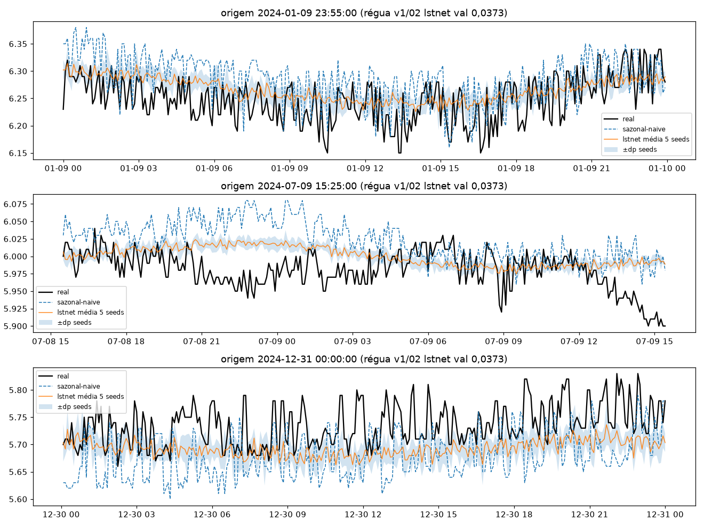
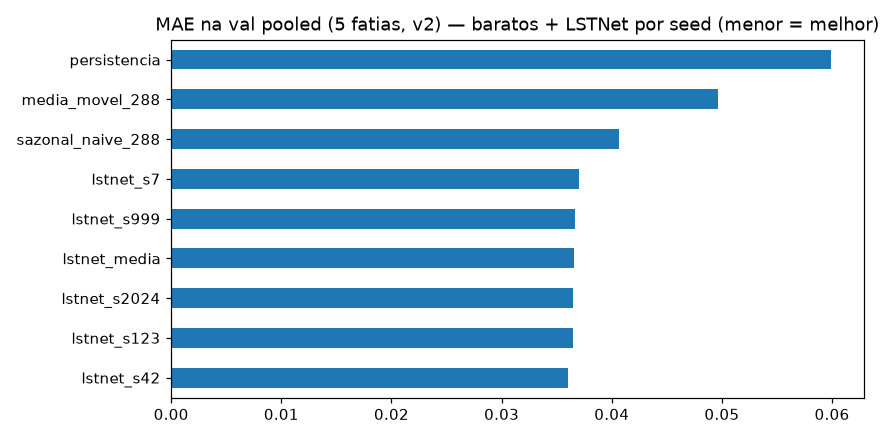
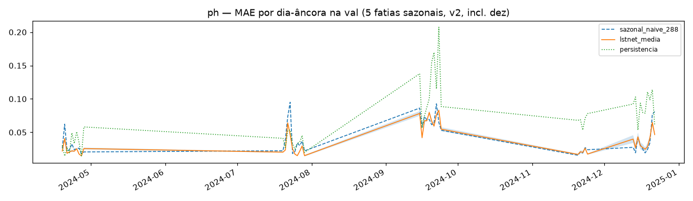
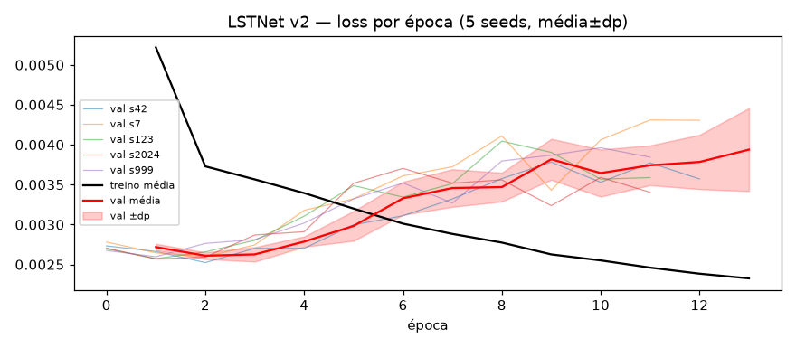

# Experimento 12 — LSTNet v2 no pH (EF01): protocolo L=2304 + purge/embargo + 5 fatias + 5 seeds

LSTNet1D do 02 (conv + GRU + skip p=48 + cabeça H=288 + AR-288 + RevIN por janela)
com 2 mudanças — cauda `LN=2016` da janela `L=2304` e conv `in_channels 3→8`
(valor + tod_sin/cos + solar/90 + Fourier anual f1/f2) — treinado em 2024 no
**protocolo v2**, 5 seeds com early stopping por seed. 2025 intocado.
Artefatos gerados por `notebooks/12-v2-lstnet-ph.ipynb` (rerun pós-fix do groupby,
executado de ponta a ponta, 0 erros; procedência: `temporal-remote` 192.168.1.6,
dir `/home/marcos/temporal-model`, 2026-09-16 21:16–21:57 −03:00, solo — 12c,
threads unset, torch CPU).
Reproduzir: `.venv/bin/jupyter nbconvert --to notebook --execute --inplace --ExecutePreprocessor.timeout=2400 notebooks/12-v2-lstnet-ph.ipynb`
(5 seeds; ~33 min em 12c solo, ~6–7 min por seed).

## Protocolo v2

- **Janelas** `L=2304 → H=288` (8 d → 1 d, 5 min), interp `time` limite 24, descarte de janelas com NaN (idêntico ao 10).
- **Val = 5 fatias por data de fim** (19–28/abr, 20–29/jul, 15–24/set, 20–24/nov [5 d], **13–22/dez [10 d, verão]**);
  a 5ª fatia cobre o verão austral (estação sem cobertura na VAL4).
- **Purge/embargo:** treino exclui janelas cujo alvo `[fim−H, fim]` intersecte qualquer fatia estendida `±H`
  (gap mín **+289 passos**; no v1 era −288, i.e. sem purge). Lógica `purge_train`/`signed_gap_steps` reaproveitada
  verbatim de `/tmp/v2split/validate_split.py`; travada por `assert` (gap ≥ H+1, overlap zero).
- **Modelo = LSTNet1D do 02 com 2 mudanças:** (a) cauda `LN=2016` da janela `L=2304` (mesmos tamanhos de camada);
  (b) conv `in_channels 3→8` (valor + tod_sin/cos + solar/90 + f1_sin/cos + f2_sin/cos; RevIN e AR-288 iguais ao 02).
- **Treino = hiperparâmetros/early-stopping do 02 por seed** (`BATCH=256`, `LR=1e-3`, `MAX 60/PAT 10`, strides 4/4,
  Adam/MSE), seeds `[42, 7, 123, 2024, 999]`; reporte por seed + média±dp pooled e por fatia.
- **Diferenças vs v1 (02):** `L` 8640→2304 · val 4→5 fatias · split com purge · canais 3→8 · 5 seeds + `metricas_por_fatia*.csv`.

## Configuração do experimento

- **Série:** pH 2024 (`dados/treino/ef01-mogi-das-cruzes_ph_2024.csv`), 105.121 slots, 11,1% faltantes
- **Limpeza idêntica:** grade 5 min + interpolação limite 24; NaN pós-interp 6.408 slots em 9 blocos —
  16–18/jan (54,3 h) · 29/abr–02/mai (63,8 h) · **27/mai–13/jun (412,2 h)** + 6 microrresíduos (fev/mar/out ×2/nov/dez)
- **Janelas:** treino pós-purge 59.349 + val 12.960 ([2880, 2880, 2880, 1440, 2880]);
  descartadas por NaN 26.910 · purge 3.311 · gap mín +289 · dias-âncora (23:55) na val: 45 ([10, 10, 10, 5, 10])
- **Treino:** 139.426 params (+1.920 do conv vs 137.506 do 02) · Adam 1e-3, MSE · stride 4
  (14.838 treino / 3.240 val por seed) · early stopping patience 10 → best val nas eps. 2–3;
  373–421 s por seed (1.984 s no total); train final ~0,0023 vs best val 0,0025–0,0026 — sem overfit relevante

## Tabela principal — val rolante pooled (12.960 origens)

| modelo | MAE | RMSE |
|---|---|---|
| **lstnet média 5 seeds** | **0,0365±0,0004** | 0,0507±0,0003 |
| lstnet_s42 | 0,0360 | 0,0502 |
| lstnet_s123 / s2024 | 0,0365 | 0,0507 |
| lstnet_s999 | 0,0367 | 0,0510 |
| lstnet_s7 | 0,0370 | 0,0509 |
| sazonal_naive_288 | 0,0406 | 0,0589 |
| media_movel_288 | 0,0497 | 0,0652 |
| persistencia | 0,0599 | 0,0829 |

(copiado de `metricas_val_por_seed.csv` / `metricas_val_media_dp.csv`; baratos idênticos ao 10) —
**LSTNet v2 0,0365 (−10,1% sobre o sazonal v2 0,0406; as 5 seeds batem o sazonal, mín–máx 0,0360–0,0370)**
e abaixo da régua v1 (02: 0,0373) — com a ressalva de que v1×v2 embute mudança de protocolo + canais, não só o modelo.

## Val por fatia — MAE (5 seeds)

| fatia | lstnet média±dp | mín–máx seeds | sazonal (10) |
|---|---|---|---|
| 2024-04-19→2024-04-28 | 0,0237±0,0003 | 0,0233–0,0239 | 0,0282 |
| 2024-07-20→2024-07-29 | 0,0338±0,0002 | 0,0334–0,0340 | 0,0391 |
| 2024-09-15→2024-09-24 | 0,0601±0,0004 | 0,0596–0,0605 | 0,0693 |
| 2024-11-20→2024-11-24 | 0,0231±0,0006 | 0,0224–0,0238 | 0,0215 |
| 2024-12-13→2024-12-22 | 0,0354±0,0017 | 0,0338–0,0381 | 0,0354 |

(copiado de `metricas_por_fatia_media_dp.csv` / `metricas_por_fatia.csv`; cobertura [2880, 2880, 2880, 1440, 2880])

## Val dias-âncora (45)

| modelo | MAE |
|---|---|
| **lstnet média 5 seeds** | **0,0368** |
| sazonal_naive_288 | 0,0412 |
| media_movel_288 | 0,0487 |
| persistencia | 0,0692 |

(média simples dos 45 dias de `metricas_por_dia.csv`; dp médio entre seeds 0,0022 — detalhe por dia no CSV)

## Figuras — o que cada uma mostra

### `01-eda.png`, `02-limpeza.png`, `03-stl.png` — dado 2024 (ADF −1,79 / p 0,384: não estacionária no trecho jul–ago)

### `04-forecasts.png` — 3 origens do treino (real × sazonal × lstnet média±dp 5 seeds)

### `05-mae.png` — barras de MAE na val pooled (baratos + 5 seeds + média)

### `06-val-dias.png` — MAE por dia-âncora (5 fatias sazonais, incl. dez; banda = ±dp entre seeds)

### `07-curvas-treino.png` — loss por época (5 seeds finas + média±dp; treino cai até o fim, val em U com mín. nas eps. 2–3)

## Arquivos

| Arquivo | O quê |
|---|---|
| `metricas_val_por_seed.csv` | Val rolante pooled por seed em CSV (primária, 5 linhas) |
| `metricas_val_media_dp.csv` | Val pooled média±dp em CSV |
| `metricas_por_fatia.csv` | MAE/RMSE por (fatia, seed) em CSV (25 linhas, incl. dez) |
| `metricas_por_fatia_media_dp.csv` | Por fatia média±dp em CSV (5 linhas) |
| `metricas_por_dia.csv` | MAE por dia-âncora em CSV (45 linhas: baratos + lstnet por seed + média±dp) |
| `modelos/lstnet_ph_s{42,7,123,2024,999}.pt` | LSTNet treinado por seed (state_dict + config, ~550 KB cada) |
| `modelos/normalizacao.json` | `{"mode": "revin-per-window", "L": 2304, "LN": 2016, "in_channels": 8, "channels": [...], "seeds": [...]}` |
| `figs/` | As 7 figuras explicadas acima |

## Leitura dos resultados

1. **LSTNet v2 no pH: MAE pooled 0,0365±0,0004 (val) / 0,0368 (dias-âncora), −10,1% sobre o sazonal v2 (0,0406).**
   Margem sobre o sazonal preservada vs v1 (−11,4% no 02) — o modelo segue ganhando da regra no protocolo com purge.
2. **Dispersão entre seeds pequena (0,0360–0,0370) e as 5 batem o sazonal** — o ganho não depende de seed sortuda.
   A maior dispersão está em dez (±0,0017, puxada pela s7 0,0381); abr/jul/set têm dp ≤ 0,0004.
3. **Setembro é a fatia dura** (0,0601, como nos baratos); **novembro é a única fatia onde o sazonal (0,0215) bate o LSTNet (0,0231)** —
   mesma inversão do v1, agora com purge; dez empata (0,0354 × 0,0354) e comporta-se como fatia normal.
4. Treino saudável: best val nas eps. 2–3 nas 5 seeds (early stopping 12–13), curvas de val em U sem divergência tardia.
5. Fila: benchmark 2025 (protocolo v2) e NNLS futuro — checkpoints por seed guardados; a comparação v1×v2 (0,0373 → 0,0365)
   mistura protocolo + canais, então o veredito do LSTNet-v2 como arquitetura vem do benchmark, não daqui.
