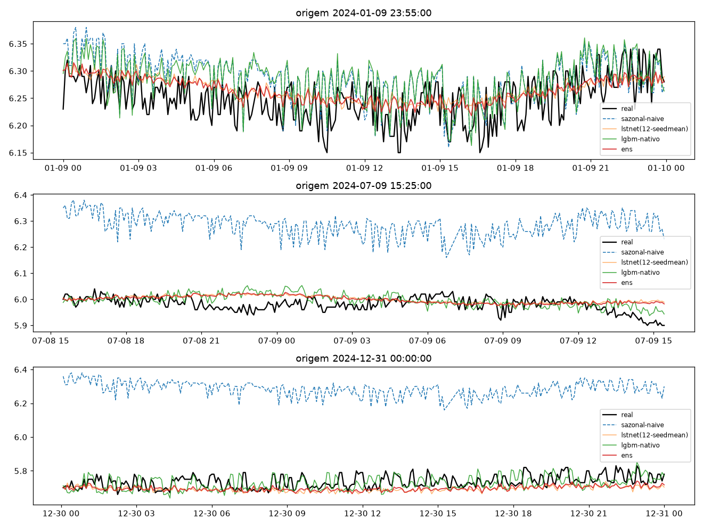
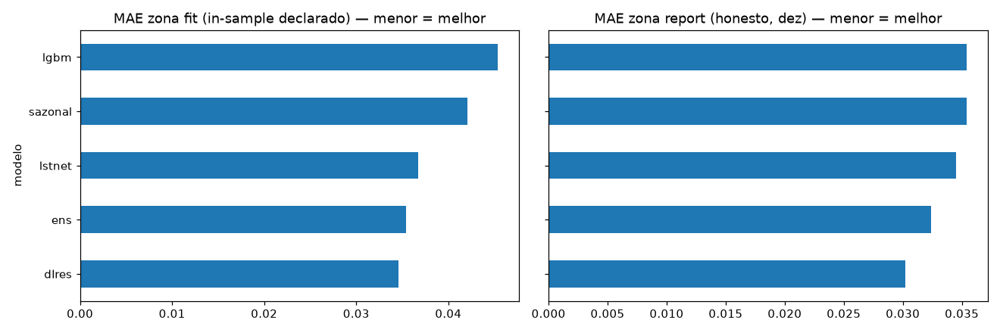
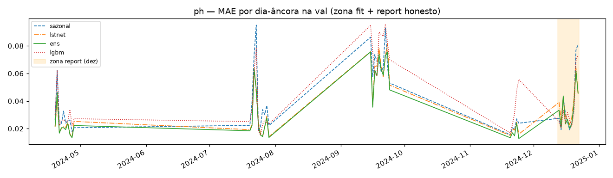
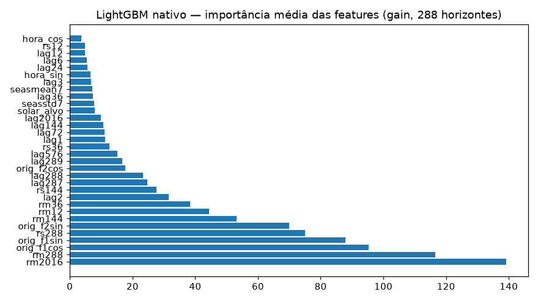
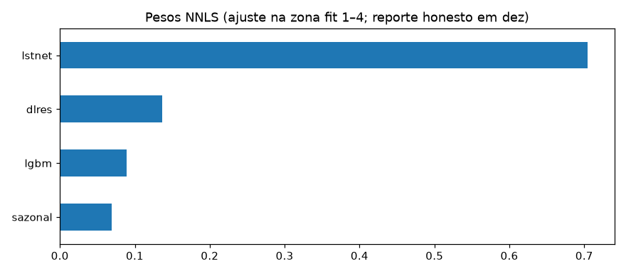
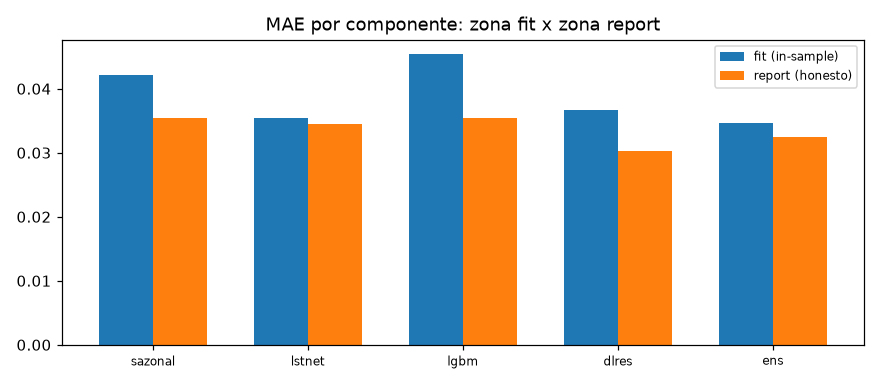

# Experimento 16 — Ensemble v2 no pH (EF01): sazonal + LSTNet-12 + LGBM-nativo + DLinear-res + NNLS fit/report

Piso sazonal-naive-288 + LSTNet-12 (seed-mean, recarregado) + 288 LGBM nativos no resíduo + DLinear-res
seed-mean + NNLS com **separação peso × reporte** (pesos nas fatias 1–4, reporte honesto em dez). Protocolo v2
idêntico ao 10/12/14. 2025 intocado.
Artefatos gerados por `notebooks/16-v2-ensemble-ph.ipynb` (executado de ponta a ponta, 0 erros;
procedência: `temporal-remote` 192.168.1.6, dir `/home/marcos/temporal-model`, 2026-09-17, 12c solo —
threads unset, torch CPU 2.14.0).
Reproduzir: `.venv/bin/jupyter nbconvert --to notebook --execute --inplace --ExecutePreprocessor.timeout=7200 notebooks/16-v2-ensemble-ph.ipynb`
(exige os 5 checkpoints do 12; 288 `.txt` + 5 `.pt` gitignored, regeneráveis).

## Protocolo v2 (resumo)

- **Janelas** `L=2304 → H=288` (8 d → 1 d, 5 min), interp `time` limite 24, descarte de janelas com NaN (idêntico ao 10/12/14).
- **Val = 5 fatias por data de fim** (19–28/abr, 20–29/jul, 15–24/set, 20–24/nov [5 d], **13–22/dez [10 d, verão]**);
  purge/embargo ±H (gap mín **+289 passos**; trava por `assert`, overlap zero).
- **NNLS por zona:** pesos (fit) nas fatias 1–4 (10.080 origens) — NNLS sobre os 4 componentes;
  reporte honesto na fatia 5 (dez, 2.880 origens, unseen p/ os pesos, p/ a val do DLinear e p/ o treino LGBM pós-purge)
  + reporte declarado in-sample nas fatias 1–4.

## Configuração do experimento

- **Série:** pH 2024 (`dados/treino/ef01-mogi-das-cruzes_ph_2024.csv`), 105.121 slots, 11,1% faltantes;
  limpeza idêntica ao 10/12/14 (NaN pós-interp 6.408 slots em 9 blocos, maior 27/mai–13/jun 412,2 h; ADF −1,79 / p 0,384)
- **Janelas:** treino pós-purge 59.349 + val 12.960 (fit 10.080 + report 2.880);
  descartadas por NaN 26.910 · purge 3.311 · gap mín +289 · dias-âncora (23:55) na val: 45 ([10, 10, 10, 5, 10])
- **LSTNet:** 5 `.pt` do 12 recarregados, seed-mean, sem re-treino (`HAS_LSTNET=True`)
- **LGBM:** 288 boosters nativos (`seed=42`, 1 run determinístico) no resíduo `Y−sazonal`,
  29.675 linhas × (25 feats base do 06 + 4 Fourier da origem + hora_sin/cos + solar do passo-alvo);
  resíduo std 0,0755; 54 s; paridade save/reload ≤1e-9;
  top feats: `rm2016, rm288, orig_f1cos, orig_f1sin, rs288` (Fourier da origem entre as mais úteis)
- **DLinear-res:** 5 seeds no mesmo resíduo (cauda `LN=2016`), early por val-fit
  (best 0,00281–0,00289, eps. 12–27), 213 s no total; seed-mean como componente
- **NNLS na zona fit:** `sazonal=0,0694, lstnet=0,7048, lgbm=0,0889, dlres=0,1366` (soma 0,9997) —
  o LSTNet domina, o LGBM **não** é zerado (≠ v1-06, onde levou peso 0)

## Tabela principal — val por zona (`metricas_zonas.csv`, primária)

Zona fit = in-sample declarado (os pesos viram essas origens) · zona report = honesta (dez, unseen p/ os pesos):

| modelo | MAE fit | RMSE fit | MAE report | RMSE report |
|---|---|---|---|---|
| **ens** | **0,0346** | 0,0494 | **0,0324** | 0,0417 |
| lstnet (12, seed-mean) | 0,0354 | 0,0502 | 0,0345 | 0,0436 |
| dlres (seed-mean) | 0,0367 | 0,0518 | 0,0302 | 0,0407 |
| sazonal_naive_288 | 0,0421 | 0,0614 | 0,0354 | 0,0488 |
| lgbm (288 nativos) | 0,0454 | 0,0648 | 0,0354 | 0,0486 |

(copiado de `metricas_zonas.csv` — **o número honesto é o report (dez): ens 0,0324**; o fit 0,0346 é in-sample dos pesos.)

## Peso × reporte — a comparação honesta

- **Pesos fitados nas fatias 1–4, reportados em dez (verão):** no fit o ranking é
  ens 0,0346 < lstnet 0,0354 < dlres 0,0367 < sazonal 0,0421 < lgbm 0,0454;
  em dez ele **inverte no topo**: dlres 0,0302 < ens 0,0324 < lstnet 0,0345 < sazonal = lgbm 0,0354.
  Os pesos (70% lstnet) foram ótimos onde foram fitados, mas em dez o DLinear-res sozinho vence o ensemble por ~7%.
- **Pooled 5 fatias (só p/ comparar com as réguas v2, com caveat de otimismo):**
  ens 0,0341 · lstnet 0,0352 · dlres 0,0353 · sazonal 0,0406 · lgbm 0,0432 —
  o ensemble pooled bate patchtst-14 (0,0352±0,0003), dlinear-14 (0,0356±0,0001),
  lstnet-12 (0,0365±0,0004) e o piso v2-10 (0,0406), mas esse número mistura a zona
  in-sample dos pesos — **não é o número honesto**.
- **Régua v1 de referência (06, outro protocolo L=8640/4 fatias/sem purge — caveat, não é comparação direta):**
  ens 0,0357 com LGBM zerado; no v2 o LGBM ganha peso 0,089 e o sazonal cai de 0,27 para 0,07 —
  o piso perde espaço porque os corretores v2 (purge + janela curta) são mais fortes.
- **Caveat herdado:** o componente lstnet do 12 usou as 5 fatias como val no treino —
  o reporte em dez é honesto p/ os **pesos**, não p/ o componente lstnet.

## Val por fatia — MAE (`metricas_por_fatia.csv`)

| fatia (zona) | ens | lstnet | dlres | sazonal | lgbm |
|---|---|---|---|---|---|
| 2024-04-19→2024-04-28 (fit) | 0,0224 | 0,0229 | 0,0236 | 0,0282 | 0,0283 |
| 2024-07-20→2024-07-29 (fit) | 0,0324 | 0,0332 | 0,0349 | 0,0391 | 0,0354 |
| 2024-09-15→2024-09-24 (fit) | 0,0558 | 0,0568 | 0,0586 | 0,0693 | 0,0788 |
| 2024-11-20→2024-11-24 (fit) | 0,0210 | 0,0218 | 0,0228 | 0,0215 | 0,0325 |
| 2024-12-13→2024-12-22 (report) | 0,0324 | 0,0345 | 0,0302 | 0,0354 | 0,0354 |

(cobertura [2880, 2880, 2880, 1440, 2880] — o ensemble vence nas 4 fit e perde só em dez, p/ o dlres;
setembro segue a fatia dura, novembro a única onde o sazonal 0,0215 bate lstnet/dlres.)

## Val dias-âncora (45)

| modelo | MAE |
|---|---|
| **ens** | **0,0340** |
| dlres | 0,0355 |
| lstnet | 0,0356 |
| sazonal_naive_288 | 0,0412 |
| lgbm | 0,0437 |

(média simples dos 45 dias de `metricas_por_dia.csv`; detalhe por dia no CSV)

## Figuras — o que cada uma mostra

### `01-eda.png`, `02-limpeza.png`, `03-stl.png` — dado 2024 (idênticos ao 10/12/14)

### `04-forecasts.png` — 3 origens do treino (real × 4 componentes × ens)

### `05-mae.png` — MAE por zona: fit in-sample × report honesto (barras lado a lado)

### `06-val-dias.png` — MAE por dia-âncora (5 fatias, incl. dez)

### `07-importancia-lgbm.png` — importância média das features (gain, 288 boosters nativos)

### `08-pesos-nnls.png` — pesos NNLS (lstnet domina com 0,70; dlres 0,14; lgbm 0,09; sazonal 0,07)

### `09-zonas.png` — MAE por componente: zona fit × zona report (barras agrupadas)

## Arquivos

| Arquivo | O quê |
|---|---|
| `metricas_zonas.csv` | Val por zona em CSV (primária, 10 linhas: 2 zonas × 5 modelos) |
| `metricas_por_fatia.csv` | MAE/RMSE por (fatia, zona, modelo) em CSV (25 linhas, com zona) |
| `metricas_por_dia.csv` | MAE por dia-âncora em CSV (45 linhas + zona por dia) |
| `modelos/dlinear_res_ph_s{42,7,123,2024,999}.pt` | DLinear do resíduo por seed (state_dict, ~4,4 MB cada; no Release, regenerável) |
| `modelos/lgbm_nativo/lgbm_h{000..287}.txt` | 288 boosters nativos (um por horizonte; no Release, regenerável) |
| `modelos/ensemble.json` | Pesos NNLS + fit/report slices + componentes |
| `modelos/normalizacao.json` | Modo do experimento (`L=2304/H=288`, feats LGBM, seeds) |
| `figs/` | As 9 figuras explicadas acima |

## Leitura dos resultados

1. **O número honesto (dez): ens 0,0324 — e o dlres sozinho faz 0,0302.** O ensemble vence nas 4 fatias
   onde os pesos foram fitados, mas no holdout de verão o DLinear-res isolado é ~7% melhor.
   Peso × reporte cumprindo seu papel: sem a separação, o fit 0,0346 teria virado a manchete.
2. **LGBM com peso não-zero (0,089) — diferente do v1-06, onde foi zerado.** Sozinho continua o pior
   componente no fit (0,0454), mas no reporte (0,0354, igual ao sazonal) ao menos não atrapalha;
   as features de Fourier da origem aparecem no top-5 de importância.
3. **Pooled 5 fatias com caveat: ens 0,0341 bate as réguas v2** (patchtst-14 0,0352 · dlinear-14 0,0356 ·
   lstnet-12 0,0365 · sazonal-10 0,0406) — mas mistura zona in-sample dos pesos; vale como
   comparabilidade de protocolo, não como veredito.
4. Limitações declaradas: comparação v1×v2 embute mudança de protocolo (L, purge, 5ª fatia), não só método;
   o componente lstnet viu dez na val do 12 (reporte honesto só p/ os pesos); univariado, como todo o v2.
5. Fila: ensemble v2 no OD (17) com o mesmo desenho fit/report; depois o benchmark 2025 em protocolo v2
   decide as réguas finais — checkpoints guardados (`lgbm_nativo/*.txt` + `dlinear_res_ph_s*.pt` vão ao Release).
