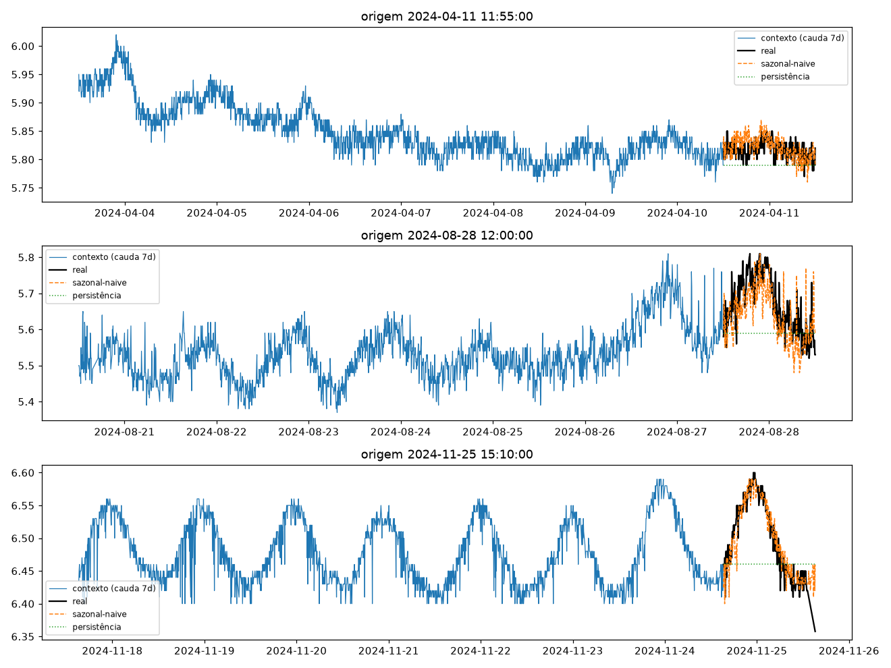
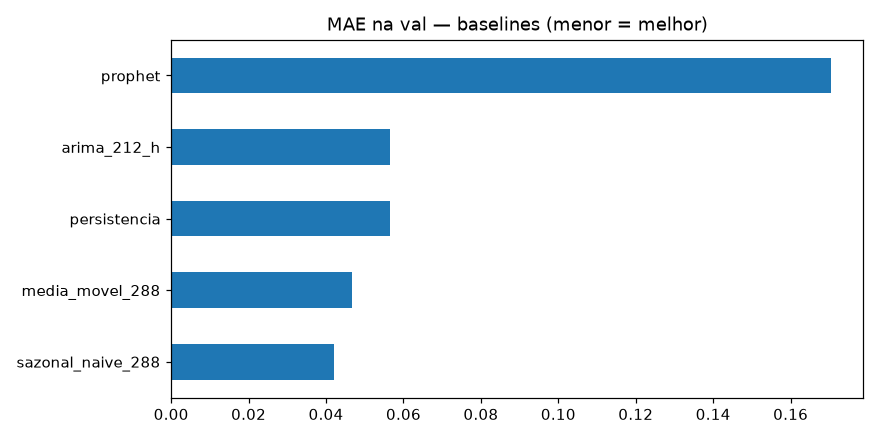
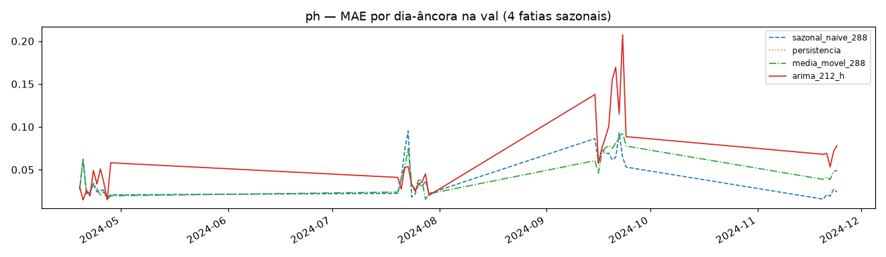

# Experimento 00 — Baselines no pH (EF01), regime anual (treino 2024)

Baselines clássicos no desenho travado (`L=8640 → H=288`), agora em 1 ano de treino.
Sem holdout interno: treino = todas as janelas válidas de 2024 fora da val;
val = 4 fatias de 10 dias (19–28/abr, 20–29/jul, 15–24/set, 20–24/nov), uma por estação.
2025 intocado (benchmark no 08). O sazonal lag-365 é incalculável sem 2023 — estreia no 08.
Artefatos gerados por `univariavel/notebooks/00-baseline-ph.ipynb` (executado de ponta a ponta, 0 erros;
procedência: `temporal-remote` 192.168.1.6, dir `/home/marcos/temporal-model`).
Reproduzir: `.venv/bin/jupyter nbconvert --to notebook --execute --inplace --ExecutePreprocessor.timeout=2400 univariavel/notebooks/00-baseline-ph.ipynb`
(ARIMA + Prophet; ~15–30 min em 12c. Prophet pula sem CmdStan.)

## Configuração do experimento

- **Série:** pH 2024 (`dados/treino/ef01-mogi-das-cruzes_ph_2024.csv`), 105.121 slots, 11,1% faltantes
- **Limpeza idêntica:** grade 5 min + interpolação limite 24; outages pós-interp: 16–18/jan (2,3 d) · 29/abr–02/mai (2,7 d) · **27/mai–13/jun (17 d)** + microrresíduos
- **Janelas:** ~34 mil válidas (treino ~24 mil + val ~10 mil); dias-âncora (23:55) na val: 35
- **Modelos:** persistência · sazonal-naive-288 · média-móvel-288 · ARIMA(2,1,2) em grade horária (stride 48 na val) · Prophet (ajuste só no treino, com as fatias de val removidas)

## Tabela principal — val rolante

| modelo | MAE | RMSE |
|---|---|---|
| **sazonal_naive_288** | **0,0421** | 0,0614 |
| media_movel_288 | 0,0468 | 0,0636 |
| persistencia | 0,0564 | 0,0809 |
| arima_212_h | 0,0565 | 0,0822 |
| prophet | 0,1703 | 0,2001 |

(copiado de `metricas_val.csv`) — **régua do treino pH: sazonal-naive 0,0421.**

## Treino rolante (referência)

| modelo | MAE | RMSE |
|---|---|---|
| sazonal_naive_288 | 0,0627 | 0,0937 |
| media_movel_288 | 0,0668 | 0,0965 |
| persistencia | 0,0740 | 0,1040 |

(copiado de `metricas_treino.csv`)

## Val dias-âncora

| modelo | MAE | RMSE |
|---|---|---|
| sazonal_naive_288 | 0,0421 | 0,0614 |
| media_movel_288 | 0,0458 | 0,0619 |
| persistencia / arima_212_h | 0,0638 | 0,0892 |
| prophet | 0,1800 | 0,2094 |

(copiado de `metricas_val_diaria.csv`; detalhe por dia em `metricas_por_dia.csv`)

## Figuras — o que cada uma mostra

### `01-eda.png`, `02-limpeza.png`, `03-stl.png` — dado 2024

### `04-forecasts.png` — 3 origens do treino (real × sazonal × persistência)

### `05-mae.png` — barras de MAE na val

### `06-val-dias.png` — MAE por dia-âncora (4 fatias sazonais)

## Arquivos

| Arquivo | O quê |
|---|---|
| `metricas_treino.csv` | Treino rolante em CSV |
| `metricas_val.csv` | Val rolante em CSV (primária) |
| `metricas_val_diaria.csv` | Dias-âncora em CSV |
| `metricas_por_dia.csv` | MAE por dia-âncora em CSV |
| `modelos/arima212_cauda_treino.pkl` | ARIMA ajustado na cauda do treino (inspeção) |
| `modelos/prophet_ph.json` | Prophet ajustado só no treino (p/ o benchmark 08) |
| `figs/` | As 6 figuras explicadas acima |

## Leitura dos resultados

1. **Régua do treino pH: sazonal-naive MAE 0,0421 (val).** Ordem idêntica à do regime antigo (sazonal > MM > persistência), em patamar parecido.
2. **ARIMA ≈ persistência** (0,0565 vs 0,0564; nos dias-âncora idêntico): o fallback honesto disparou em quase todas as origens — a grade horária carrega os NaNs dos outages e o ajuste falha. Limitação reportada, não bug.
3. **Prophet colapsa em dado anual** (0,1703, 4× a régua): com sazonalidade anual ligada e 90 mil linhas, o modelo subajusta grosseiramente. No regime de 3 meses ele era competitivo; em 1 ano, sem chance. Veredito: fora do jogo neste regime (artefato guardado só para o teste de transferência no 08).
4. Fila: LSTNet (02) precisa bater 0,0421 na val; lag-365 estreia no benchmark.
