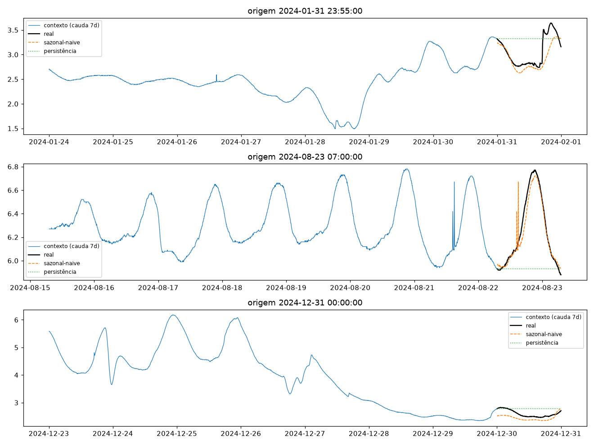
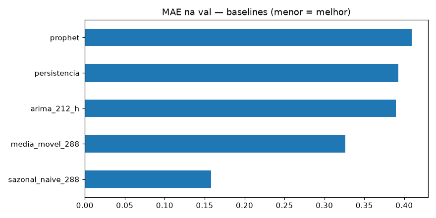
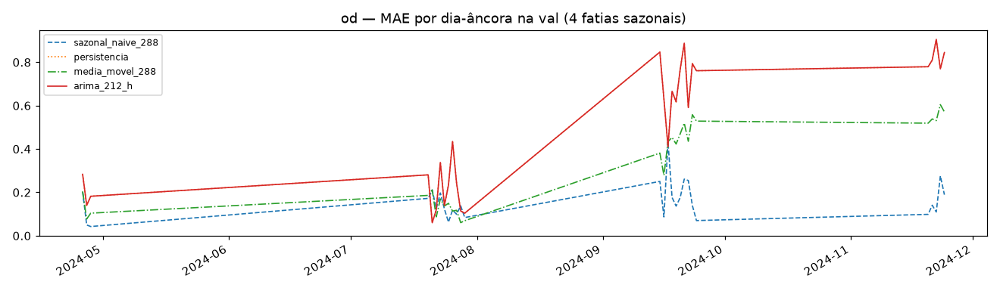

# Experimento 01 — Baselines no OD (EF01), regime anual (treino 2024)

Baselines clássicos no desenho travado (`L=8640 → H=288`), em 1 ano de treino.
Treino = janelas válidas de 2024 fora da val; val = 4 fatias (19–28/abr parcial no OD,
20–29/jul, 15–24/set, 20–24/nov). 2025 intocado (benchmark no 08). Lag-365 estreia no 08.
Artefatos gerados por `univariavel/notebooks/01-baseline-od.ipynb` (executado de ponta a ponta, 0 erros;
procedência: `temporal-remote` 192.168.1.6, dir `/home/marcos/temporal-model`).
Reproduzir: `.venv/bin/jupyter nbconvert --to notebook --execute --inplace --ExecutePreprocessor.timeout=2400 univariavel/notebooks/01-baseline-od.ipynb`

## Configuração do experimento

- **Série:** OD 2024 (`dados/treino/ef01-mogi-das-cruzes_oxigenio-dissolvido_2024.csv`), 105.121 slots, 0,6% faltantes, sem outages grandes
- **Janelas:** treino 66.073 + val 7.857 (S1 parcial: origens OD só de 27/abr); dias-âncora na val: 28
- **Modelos:** persistência · sazonal-naive-288 · média-móvel-288 · ARIMA(2,1,2) horário (stride 48) · Prophet (só treino)

## Tabela principal — val rolante

| modelo | MAE | RMSE |
|---|---|---|
| **sazonal_naive_288** | **0,1579** | 0,2202 |
| media_movel_288 | 0,3260 | 0,4289 |
| arima_212_h | 0,3893 | 0,5694 |
| persistencia | 0,3929 | 0,5728 |
| prophet | 0,4091 | 0,5003 |

(copiado de `metricas_val.csv`) — **régua dos baselines OD: sazonal-naive 0,1579** (já batida pelo LSTNet do 03: 0,1380).

## Treino rolante (referência)

| modelo | MAE | RMSE |
|---|---|---|
| sazonal_naive_288 | 0,2424 | 0,3741 |
| media_movel_288 | 0,4003 | 0,5222 |
| persistencia | 0,4429 | 0,6403 |

(copiado de `metricas_treino.csv`)

## Val dias-âncora (28 dias)

| modelo | MAE | RMSE |
|---|---|---|
| sazonal_naive_288 | 0,1579 | 0,2192 |
| media_movel_288 | 0,3189 | 0,4243 |
| persistencia / arima_212_h | 0,4910 | 0,6728 |
| prophet | 0,4117 | 0,5080 |

(copiado de `metricas_val_diaria.csv`; detalhe por dia em `metricas_por_dia.csv`)

## Figuras — o que cada uma mostra

### `01-eda.png`, `02-limpeza.png`, `03-stl.png` — dado 2024

### `04-forecasts.png` — 3 origens do treino

### `05-mae.png` — barras de MAE na val

### `06-val-dias.png` — MAE por dia-âncora (4 fatias)

## Arquivos

| Arquivo | O quê |
|---|---|
| `metricas_treino.csv` | Treino rolante em CSV |
| `metricas_val.csv` | Val rolante em CSV (primária) |
| `metricas_val_diaria.csv` | Dias-âncora em CSV |
| `metricas_por_dia.csv` | MAE por dia-âncora em CSV |
| `modelos/arima212_cauda_treino.pkl` | ARIMA ajustado na cauda do treino (inspeção) |
| `modelos/prophet_od.json` | Prophet ajustado só no treino (p/ o benchmark 08) |
| `figs/` | As 6 figuras explicadas acima |

## Leitura dos resultados

1. **Régua dos baselines OD: sazonal-naive 0,1579** — mas o 03 já a superou (LSTNet 0,1380). Ordem dos demais como no regime antigo, com gaps maiores (OD anual é mais volátil).
2. **ARIMA = persistência nos dias-âncora** (fallback 100% — grade horária com NaN). **Prophet colapsa** (0,41, 2,6× a régua), igual ao pH: fora do jogo no regime anual.
3. Fila: 05/07 miram o LSTNet 0,1380; lag-365 estreia no benchmark.
