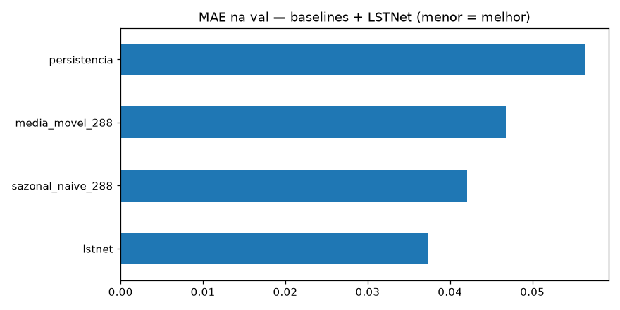
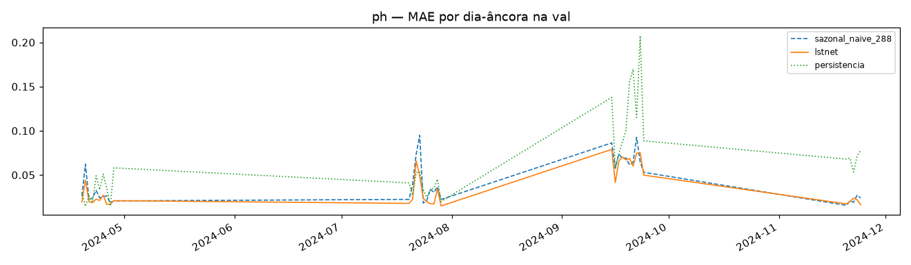
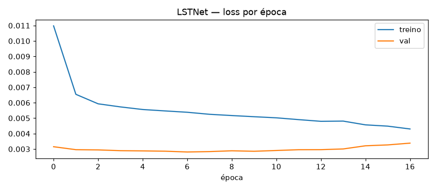

# Experimento 02 — LSTNet no pH (EF01), regime anual (treino 2024)

Mesma arquitetura do regime anterior (contexto nativo 2016 + canais hora sen/cos → Conv1D
k=12 stride 6 → GRU 64 + recurrent-skip p=48 + cabeça direta H=288 + atalho AR-288 + RevIN
por janela), treinada em 2024 com early stopping na val (4 fatias sazonais). 2025 intocado.
Artefatos gerados por `univariavel/notebooks/02-lstnet-ph.ipynb` (executado de ponta a ponta, 0 erros;
procedência: `temporal-remote` 192.168.1.6, dir `/home/marcos/temporal-model`, torch CPU).
Reproduzir: `.venv/bin/jupyter nbconvert --to notebook --execute --inplace --ExecutePreprocessor.timeout=2400 univariavel/notebooks/02-lstnet-ph.ipynb`
(treino ~7 min em 12c com a máquina livre; ~15 min sob contenção).

## Configuração do experimento

- **Série:** pH 2024 (`dados/treino/ef01-mogi-das-cruzes_ph_2024.csv`); limpeza idêntica (interp limite 24)
- **Janelas `L=8640 → H=288`:** treino 24.659 + val 10.080 (fatias 19–28/abr, 20–29/jul, 15–24/set, 20–24/nov — 2880/2880/2880/1440); 61.455 descartadas (outages); dias-âncora na val: 35
- **Treino:** 137.506 params · Adam 1e-3, MSE · stride 4 (6.165 treino / 2.520 val) · early stopping patience 10 → parou na ep. 17, best val 0,0028 (ep. 7); train 0,0043 vs val 0,0034 no fim — sem overfit relevante

## Tabela principal — val rolante (10.080 origens)

| modelo | MAE | RMSE |
|---|---|---|
| **lstnet** | **0,0373** | 0,0529 |
| sazonal_naive_288 | 0,0421 | 0,0614 |
| media_movel_288 | 0,0468 | 0,0636 |
| persistencia | 0,0564 | 0,0809 |

(copiado de `metricas_val.csv`) — **nova régua do treino pH: LSTNet 0,0373 (−11,4% sobre o sazonal).**

## Treino rolante, amostra 1/4 (referência)

| modelo | MAE | RMSE |
|---|---|---|
| lstnet | 0,0489 | 0,0724 |
| sazonal_naive_288 | 0,0627 | 0,0937 |
| media_movel_288 | 0,0668 | 0,0965 |
| persistencia | 0,0745 | 0,1046 |

(copiado de `metricas_treino.csv`)

## Val dias-âncora (35 dias)

| modelo | MAE | RMSE |
|---|---|---|
| lstnet | 0,0360 | 0,0514 |
| sazonal_naive_288 | 0,0421 | 0,0614 |
| media_movel_288 | 0,0458 | 0,0619 |
| persistencia | 0,0638 | 0,0892 |

(copiado de `metricas_val_diaria.csv`; detalhe por dia em `metricas_por_dia.csv`)

## Figuras — o que cada uma mostra

### `01-eda.png`, `02-limpeza.png`, `03-stl.png` — dado 2024

### `04-forecasts.png` — 3 origens do treino (real × sazonal × lstnet)

### `05-mae.png` — barras de MAE na val

### `06-val-dias.png` — MAE por dia-âncora (4 fatias)

### `07-curvas-treino.png` — loss por época

## Arquivos

| Arquivo | O quê |
|---|---|
| `metricas_treino.csv` | Treino (amostra 1/4) em CSV |
| `metricas_val.csv` | Val rolante em CSV (primária) |
| `metricas_val_diaria.csv` | Dias-âncora em CSV |
| `metricas_por_dia.csv` | MAE por dia-âncora em CSV |
| `modelos/lstnet_ph.pt` | LSTNet treinado (state_dict + config) |
| `modelos/normalizacao.json` | `{"mode": "revin-per-window", "LN": 2016, "val_slices": [...]}` |
| `figs/` | As 7 figuras explicadas acima |

## Leitura dos resultados

1. **Nova régua do treino pH: LSTNet MAE 0,0373 (val) / 0,0360 (dias-âncora), −11% sobre o sazonal.** Com 1 ano de treino a margem sobre o sazonal cresceu (era −9% no regime de 3 meses) — mais dados ajudaram o modelo mais que a regra.
2. Treino saudável: val cai até a ep. 7 e estabiliza; early stopping na 17 sem divergência treino/val.
3. Fila: PatchTST/DLinear (04) precisam bater 0,0373; checkpoint guardado para o benchmark 2025 (08).
