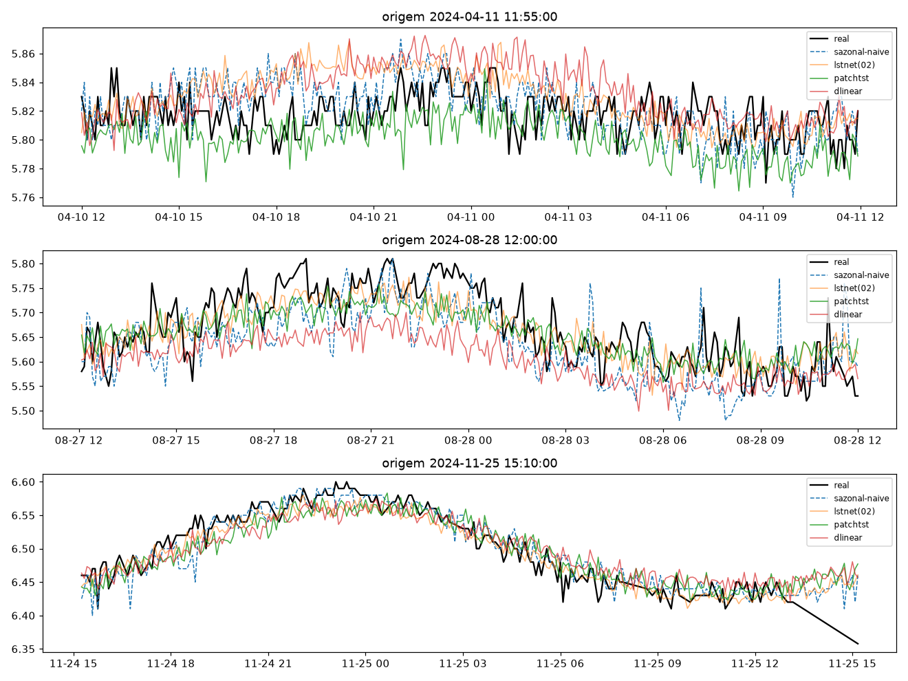
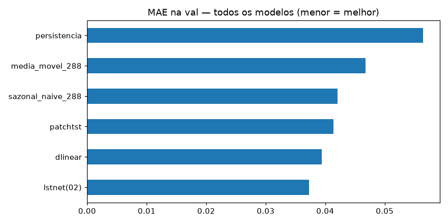
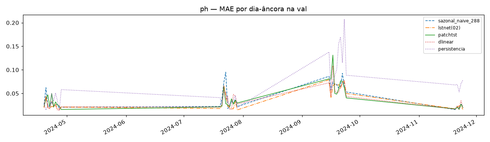
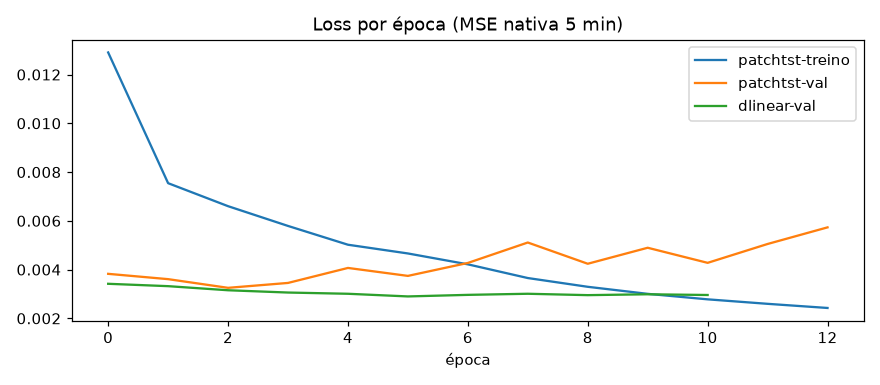

# Experimento 04 — PatchTST + DLinear no pH (EF01), regime anual (treino 2024)

PatchTST nativo (Nie et al. 2022: patches 48/24 → 83 tokens, transformer 3×64/4 heads) +
controle DLinear, treinados em 2024 com early stopping na val (4 fatias). Régua 02
recarregada só para inferência. 2025 intocado.
Artefatos gerados por `univariavel/notebooks/04-patchtst-ph.ipynb` (executado de ponta a ponta, 0 erros;
procedência: `temporal-remote` 192.168.1.6, dir `/home/marcos/temporal-model`, torch CPU).
Reproduzir: `.venv/bin/jupyter nbconvert --to notebook --execute --inplace --ExecutePreprocessor.timeout=2400 univariavel/notebooks/04-patchtst-ph.ipynb`
(exige o checkpoint do 02; ~10 min em 12c livre).

## Configuração do experimento

- **Série:** pH 2024; janelas `L=8640 → H=288`, contexto nativo 2016; treino 24.659 + val 10.080 (stride 4: 6.165/2.520); dias-âncora: 35
- **Treino:** PatchTST 1.639.010 params, Adam 1e-3 — early na ep. 13 (best val 0,0033, ep. 3; train segue caindo — overfit clássico de transformer); DLinear 1.161.794 params, 30 ep máx

## Tabela principal — val rolante

| modelo | MAE | RMSE |
|---|---|---|
| lstnet(02) | 0,0373 | 0,0529 |
| dlinear | 0,0394 | 0,0549 |
| patchtst | 0,0414 | 0,0578 |
| sazonal_naive_288 | 0,0421 | 0,0614 |
| media_movel_288 | 0,0468 | 0,0636 |
| persistencia | 0,0564 | 0,0809 |

(copiado de `metricas_val.csv`) — **régua segue LSTNet (02)**; DLinear em 2º, PatchTST em 3º (ambos batem o sazonal).

## Val dias-âncora (35 dias)

| modelo | MAE | RMSE |
|---|---|---|
| lstnet(02) | 0,0360 | 0,0514 |
| dlinear | 0,0381 | 0,0532 |
| patchtst | 0,0405 | 0,0567 |
| sazonal_naive_288 | 0,0421 | 0,0614 |

(copiado de `metricas_val_diaria.csv`; detalhe em `metricas_por_dia.csv`)

## Figuras — o que cada uma mostra

### `01-eda.png`, `02-limpeza.png`, `03-stl.png` — dado 2024

### `04-forecasts.png` — 3 origens do treino (real × sazonal × lstnet × patchtst × dlinear)

### `05-mae.png` — barras de MAE na val

### `06-val-dias.png` — MAE por dia-âncora

### `07-curvas-treino.png` — loss por época (patchtst overfita, dlinear estável)

## Arquivos

| Arquivo | O quê |
|---|---|
| `metricas_val.csv` | Val rolante em CSV (primária) |
| `metricas_val_diaria.csv` | Dias-âncora em CSV |
| `metricas_por_dia.csv` | MAE por dia-âncora em CSV |
| `modelos/patchtst_ph.pt` | PatchTST treinado (state_dict) |
| `modelos/dlinear_ph.pt` | DLinear treinado (state_dict) |
| `modelos/normalizacao.json` | Modo + fatias de val |
| `figs/` | As 7 figuras explicadas acima |

## Leitura dos resultados

1. **Régua segue LSTNet (0,0373).** DLinear (0,0394) supera o PatchTST (0,0414) — com 1 ano de dados o modelo linear simples aproveita melhor que o transformer, que overfita (val sobe da ep. 4 em diante enquanto o treino despenca).
2. Os três neurais batem o sazonal (0,0421) — convergência de métodos, bom sinal para o benchmark.
3. Fila: ensemble (04) combina os três; checkpoints guardados para o 08.
