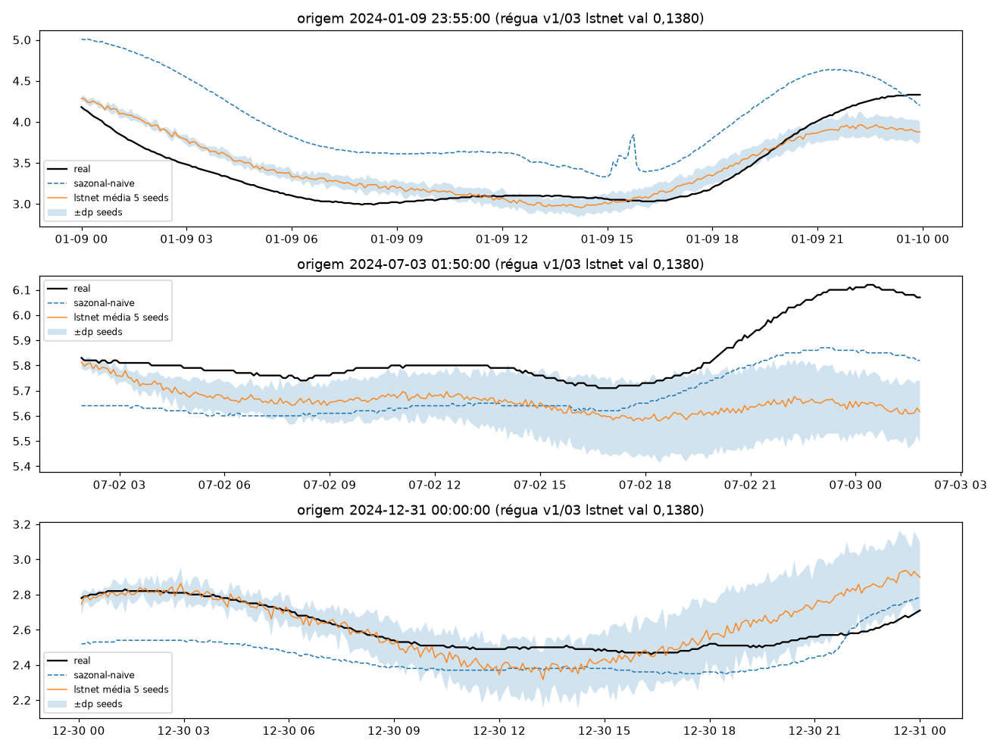
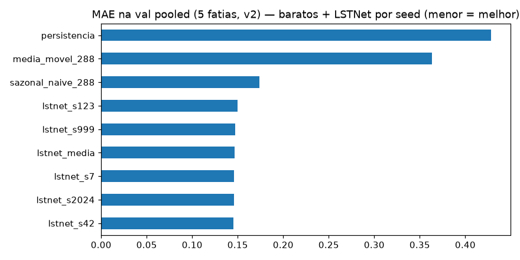
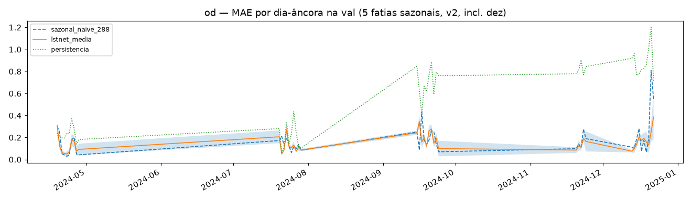
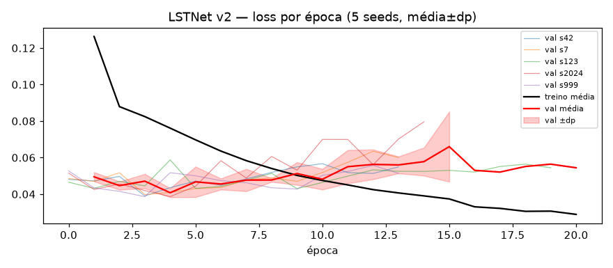

# Experimento 13 — LSTNet v2 no OD (EF01): protocolo L=2304 + purge/embargo + 5 fatias + 5 seeds

LSTNet1D do 03 (conv + GRU + skip p=48 + cabeça H=288 + AR-288 + RevIN por janela)
com 3 mudanças — cauda `LN=2016` da janela `L=2304`, conv `in_channels 3→8`
(valor + tod_sin/cos + solar/90 + Fourier anual f1/f2) e strides 8/4→4/4 (idêntico ao 12) —
treinado em 2024 no **protocolo v2**, 5 seeds com early stopping por seed. 2025 intocado.
Artefatos gerados por `univariavel/notebooks/13-v2-lstnet-od.ipynb` (executado de ponta a ponta,
0 erros; procedência: `temporal-remote` 192.168.1.6, dir `/home/marcos/temporal-model`,
2026-09-16 21:57–22:47 −03:00, solo — 12c, threads unset, torch CPU 2.14.0+cpu).
Reproduzir: `.venv/bin/jupyter nbconvert --to notebook --execute --inplace --ExecutePreprocessor.timeout=2400 univariavel/notebooks/13-v2-lstnet-od.ipynb`
(5 seeds; ~50 min em 12c solo, ~9–12 min por seed).

## Protocolo v2

- **Janelas** `L=2304 → H=288` (8 d → 1 d, 5 min), interp `time` limite 24, descarte de janelas com NaN (idêntico ao 11).
- **Val = 5 fatias por data de fim** (19–28/abr, 20–29/jul, 15–24/set, 20–24/nov [5 d], **13–22/dez [10 d, verão]**);
  a 5ª fatia cobre o verão austral (estação sem cobertura na VAL4).
- **Purge/embargo:** treino exclui janelas cujo alvo `[fim−H, fim]` intersecte qualquer fatia estendida `±H`
  (gap mín **+289 passos**; no v1 era −288, i.e. sem purge). Lógica `purge_train`/`signed_gap_steps` reaproveitada
  verbatim de `/tmp/v2split/validate_split.py`; travada por `assert` (gap ≥ H+1, overlap zero).
- **Modelo = LSTNet1D do 03 com 3 mudanças:** (a) cauda `LN=2016` da janela `L=2304` (mesmos tamanhos de camada);
  (b) conv `in_channels 3→8` (valor + tod_sin/cos + solar/90 + f1_sin/cos + f2_sin/cos; RevIN e AR-288 iguais ao 03);
  (c) strides 8/4→4/4 (idêntico ao 12).
- **Treino = hiperparâmetros/early-stopping do 03 por seed** (`BATCH=256`, `LR=1e-3`, `MAX 60/PAT 10`, strides 4/4,
  Adam/MSE), seeds `[42, 7, 123, 2024, 999]`; reporte por seed + média±dp pooled e por fatia.
- **Diferenças vs v1 (03):** `L` 8640→2304 · val 4→5 fatias (S1 parcial de 657 vira cheia) · split com purge · canais 3→8 · strides 8/4→4/4 · 5 seeds + `metricas_por_fatia*.csv`.

## Configuração do experimento

- **Série:** OD 2024 (`univariavel/dados/treino/ef01-mogi-das-cruzes_oxigenio-dissolvido_2024.csv`), 105.121 slots, 0,6% faltantes (594)
- **Limpeza idêntica:** grade 5 min + interpolação limite 24; NaN pós-interp 336 slots em 3 blocos —
  02/fev (13 slots, 1,1 h) · 11/mar (13 slots, 1,1 h) · **25–26/mar (310 slots, 25,8 h)** (só micro-outages, como no 11)
- **Janelas:** treino pós-purge 77.141 + val 12.960 ([2880, 2880, 2880, 1440, 2880]);
  descartadas por NaN 8.109 · purge 4.320 · gap mín +289 · dias-âncora (23:55) na val: 45 ([10, 10, 10, 5, 10])
- **Treino:** 139.426 params (+1.920 do conv vs 137.506 do 03) · Adam 1e-3, MSE · stride 4
  (19.286 treino / 3.240 val por seed) · early stopping patience 10 → best val nas eps. 4, 4, 10, 5, 4;
  529–718 s por seed (2.948 s no total); treino cai até o fim, val em U sem divergência tardia

## Tabela principal — val rolante pooled (12.960 origens)

| modelo | MAE | RMSE |
|---|---|---|
| **lstnet média 5 seeds** | **0,1467±0,0017** | 0,1996±0,0046 |
| lstnet_s42 | 0,1450 | 0,1975 |
| lstnet_s2024 | 0,1459 | 0,1967 |
| lstnet_s7 | 0,1462 | 0,1995 |
| lstnet_s999 | 0,1469 | 0,1965 |
| lstnet_s123 | 0,1495 | 0,2076 |
| sazonal_naive_288 | 0,1736 | 0,2548 |
| media_movel_288 | 0,3631 | 0,4801 |
| persistencia | 0,4280 | 0,6222 |

(copiado de `metricas_val_por_seed.csv` / `metricas_val_media_dp.csv`; baratos idênticos ao 11) —
**LSTNet v2 0,1467 (−15,5% sobre o sazonal v2 0,1736; as 5 seeds batem o sazonal, mín–máx 0,1450–0,1495)**,
acima da régua v1 (03: 0,1380) — com a ressalva de que v1×v2 embute mudança de protocolo + canais, não só o modelo.

## Val por fatia — MAE (5 seeds)

| fatia | lstnet média±dp | mín–máx seeds | sazonal (11) |
|---|---|---|---|
| 2024-04-19→2024-04-28 | 0,1098±0,0067 | 0,1015–0,1189 | 0,1240 |
| 2024-07-20→2024-07-29 | 0,1206±0,0079 | 0,1130–0,1299 | 0,1316 |
| 2024-09-15→2024-09-24 | 0,1613±0,0043 | 0,1563–0,1678 | 0,1969 |
| 2024-11-20→2024-11-24 | 0,1494±0,0161 | 0,1332–0,1745 | 0,1579 |
| 2024-12-13→2024-12-22 | 0,1938±0,0040 | 0,1881–0,1977 | 0,2499 |

(copiado de `metricas_por_fatia_media_dp.csv` / `metricas_por_fatia.csv`; cobertura [2880, 2880, 2880, 1440, 2880])

## Val dias-âncora (45)

| modelo | MAE |
|---|---|
| **lstnet média 5 seeds** | **0,1547** |
| sazonal_naive_288 | 0,1748 |
| media_movel_288 | 0,3593 |
| persistencia | 0,5386 |

(média simples dos 45 dias de `metricas_por_dia.csv`; dp médio entre seeds 0,0424 — detalhe por dia no CSV)

## Figuras — o que cada uma mostra

### `01-eda.png`, `02-limpeza.png`, `03-stl.png` — dado 2024 (ADF −6,61 / p 6,3e-09: estacionária no trecho jul–ago)

### `04-forecasts.png` — 3 origens do treino (real × sazonal × lstnet média±dp 5 seeds)

### `05-mae.png` — barras de MAE na val pooled (baratos + 5 seeds + média)

### `06-val-dias.png` — MAE por dia-âncora (5 fatias sazonais, incl. dez; banda = ±dp entre seeds)

### `07-curvas-treino.png` — loss por época (5 seeds finas + média±dp; treino cai até o fim, val em U com mín. nas eps. 4–5, s123 até a ep. 20)

## Arquivos

| Arquivo | O quê |
|---|---|
| `metricas_val_por_seed.csv` | Val rolante pooled por seed em CSV (primária, 5 linhas) |
| `metricas_val_media_dp.csv` | Val pooled média±dp em CSV |
| `metricas_por_fatia.csv` | MAE/RMSE por (fatia, seed) em CSV (25 linhas, incl. dez) |
| `metricas_por_fatia_media_dp.csv` | Por fatia média±dp em CSV (5 linhas) |
| `metricas_por_dia.csv` | MAE por dia-âncora em CSV (45 linhas: baratos + lstnet por seed + média±dp) |
| `modelos/lstnet_od_s{42,7,123,2024,999}.pt` | LSTNet treinado por seed (state_dict + config, ~550 KB cada) |
| `modelos/normalizacao.json` | `{"mode": "revin-per-window", "L": 2304, "LN": 2016, "in_channels": 8, "channels": [...], "seeds": [...]}` |
| `figs/` | As 7 figuras explicadas acima |

## Leitura dos resultados

1. **LSTNet v2 no OD: MAE pooled 0,1467±0,0017 (val) / 0,1547 (dias-âncora), −15,5% sobre o sazonal v2 (0,1736).**
   Margem sobre o sazonal maior que no v1 (−12,6% no 03) — o modelo segue ganhando da regra no protocolo com purge,
   agora com val cheia (S1 parcial de 657 vira 2880) mais a fatia dura de dez.
2. **Dispersão entre seeds pequena (0,1450–0,1495) e as 5 batem o sazonal** — o ganho não depende de seed sortuda.
   A maior dispersão está em nov (±0,0161, puxada pela s123 0,1745 — única combinação seed×fatia acima do sazonal);
   abr/jul/set/dez têm dp ≤ 0,0079.
3. **Dezembro é a fatia dura** (0,1938, como nos baratos); **julho é a mais fácil** (0,1206). Diferente do pH-12
   (onde o sazonal vencia em nov), aqui o LSTNet bate o sazonal nas 5 fatias — inclusive nov (0,1494 × 0,1579).
4. Treino saudável: best val nas eps. 4–5 em 4 seeds (s123 na 10, 20 eps), curvas de val em U sem divergência tardia;
   early stopping 14–15 eps (s123: 20).
5. Contexto cruzado: v1 (03) 0,1380 → v2 0,1467 (+6,3%) mistura protocolo (L, purge, S1 cheia, 5ª fatia) + canais,
   então o veredito do LSTNet-v2 como arquitetura vem do benchmark, não daqui. Espelho do 12 no pH
   (0,0365±0,0004, −10,1% sobre o sazonal v2): margem v2 maior no OD (−15,5%) que no pH (−10,1%),
   coerente com o v1 (OD −12,6% vs pH −11,4%).
6. Fila: benchmark 2025 (protocolo v2) e NNLS futuro — checkpoints por seed guardados.
