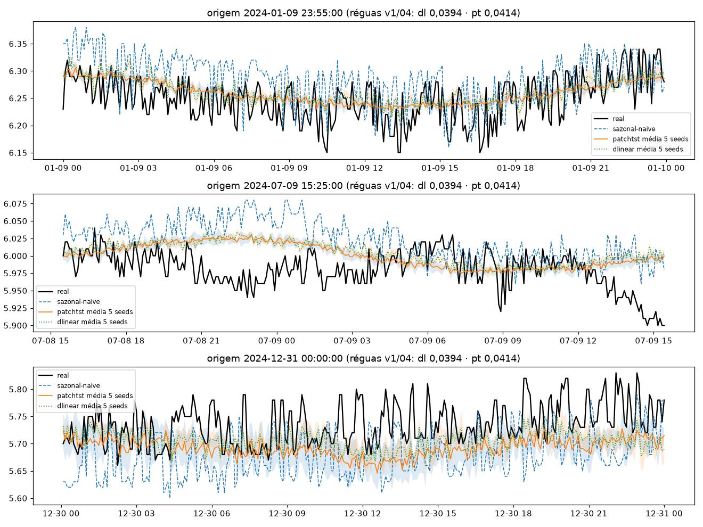
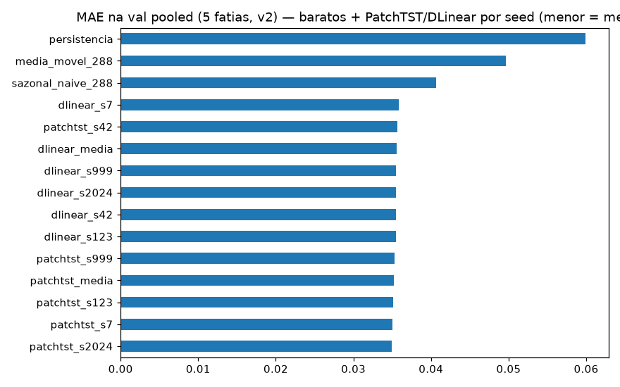
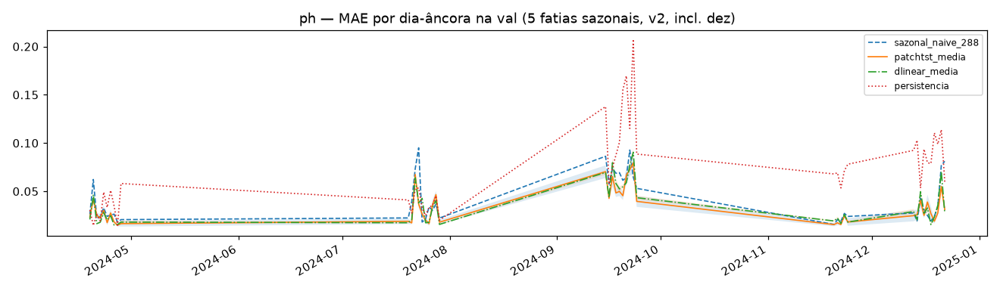
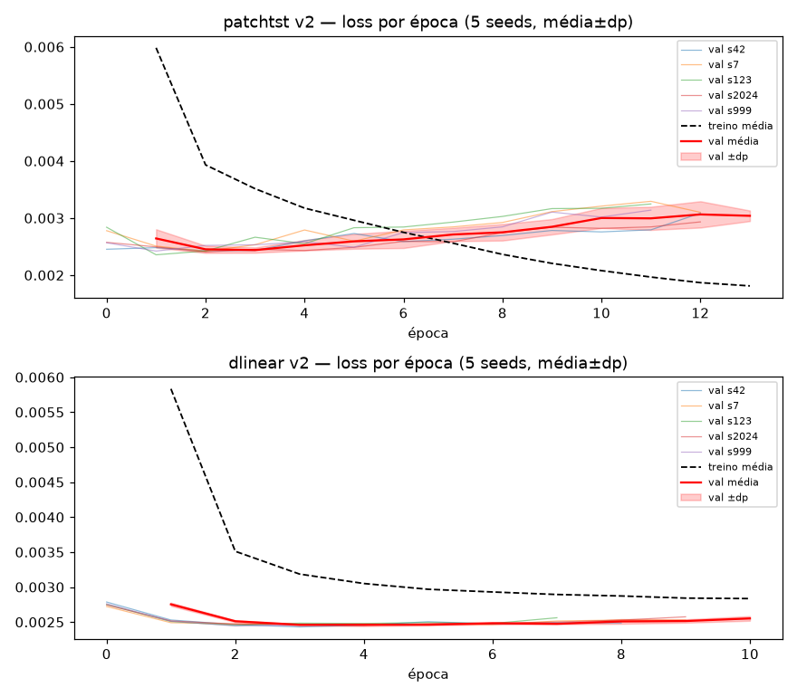

# Experimento 14 — PatchTST + DLinear v2 no pH (EF01): protocolo L=2304 + purge/embargo + 5 fatias × 5 seeds

PatchTST + DLinearLite do **04 com UMA mudança** (cauda `LN=2016` da janela
`L=2304`; arquiteturas, hiperparâmetros, RevIN e early stopping idênticos),
**univariados por construção** — treinados em 2024 no **protocolo v2**,
5 seeds por modelo com early stopping por seed (10 treinos). Média das 5 seeds
do 12 lida de CSV só como referência contextual (sem re-treino). 2025 intocado.
Artefatos gerados por `univariavel/notebooks/14-v2-patchtst-ph.ipynb` (rerun pós-fix,
executado de ponta a ponta, 0 erros; procedência: `temporal-remote` 192.168.1.6,
dir `/home/marcos/temporal-model`, 2026-09-17 — checkpoints 00:48–01:32,
notebook 01:40 −03:00, solo — 12c, threads unset, torch CPU 2.14.0).
Reproduzir: `.venv/bin/jupyter nbconvert --to notebook --execute --inplace --ExecutePreprocessor.timeout=7200 univariavel/notebooks/14-v2-patchtst-ph.ipynb`
(10 treinos; ~50–60 min em 12c solo, ~2 h compartilhada).

## Protocolo v2

- **Janelas** `L=2304 → H=288` (8 d → 1 d, 5 min), interp `time` limite 24, descarte de janelas com NaN (idêntico ao 10/12).
- **Val = 5 fatias por data de fim** (19–28/abr, 20–29/jul, 15–24/set, 20–24/nov [5 d], **13–22/dez [10 d, verão]**);
  a 5ª fatia cobre o verão austral (estação sem cobertura na VAL4).
- **Purge/embargo:** treino exclui janelas cujo alvo `[fim−H, fim]` intersecte qualquer fatia estendida `±H`
  (gap mín **+289 passos**; no v1 era −288, i.e. sem purge). Splitter `purge_train`/`signed_gap_steps`
  verbatim do 12 §5 — trava por `assert` (gap ≥ H+1, overlap zero).
- **Modelos = PatchTST + DLinearLite do 04, univariados:** cauda `LN=2016` da janela `L=2304`
  (patches 48/24 → 83 tokens, transformer 3×64/4 heads; DLinear k=25 + 2 lineares; mesmos tamanhos do 04).
- **Treino = hiperparâmetros/early-stopping do 04 por (modelo, seed)** (`BATCH 256/512`, `LR=1e-3`,
  patchtst `MAX 60/PAT 10`, dlinear `MAX 30/PAT 5`, strides 4/4, Adam/MSE),
  seeds `[42, 7, 123, 2024, 999]`; reporte por seed + média±dp pooled, por fatia e dias-âncora.
- **Diferenças vs v1 (04):** `L` 8640→2304 · val 4→5 fatias · split com purge · 5 seeds + `metricas_por_fatia*.csv`.

## Configuração do experimento

- **Série:** pH 2024 (`dados/treino/ef01-mogi-das-cruzes_ph_2024.csv`), 105.121 slots, 11,1% faltantes
- **Limpeza idêntica:** grade 5 min + interpolação limite 24; NaN pós-interp 6.408 slots em 9 blocos —
  16–18/jan (54,3 h) · 29/abr–02/mai (63,8 h) · **27/mai–13/jun (412,2 h)** + 6 microrresíduos (fev/mar/out ×2/nov/dez)
- **Janelas:** treino pós-purge 59.349 + val 12.960 ([2880, 2880, 2880, 1440, 2880]);
  descartadas por NaN 26.910 · purge 3.311 · gap mín +289 · dias-âncora (23:55) na val: 45 ([10, 10, 10, 5, 10])
- **Treino:** PatchTST 1.639.010 params, DLinear 1.161.794 params (idênticos ao 04) · stride 4
  (14.838 treino / 3.240 val por seed) · best val nas eps. 2–3 (patchtst) e 3–5 (dlinear);
  518–562 s por seed de patchtst vs 8–10 s de dlinear; train final ~0,0028–0,0035 vs best val 0,0024–0,0025 — sem overfit relevante

## Tabela principal — val rolante pooled (12.960 origens)

| modelo | MAE | RMSE |
|---|---|---|
| **patchtst média 5 seeds** | **0,0352±0,0003** | 0,0491±0,0004 |
| patchtst_s2024 | 0,0349 | 0,0490 |
| patchtst_s7 | 0,0350 | 0,0489 |
| patchtst_s123 | 0,0351 | 0,0486 |
| patchtst_s999 | 0,0353 | 0,0493 |
| patchtst_s42 | 0,0357 | 0,0496 |
| **dlinear média 5 seeds** | **0,0356±0,0001** | 0,0500±0,0001 |
| dlinear_s42 / s123 / s2024 / s999 | 0,0355 | 0,0499–0,0501 |
| dlinear_s7 | 0,0358 | 0,0502 |
| lstnet-12 média (ref. contextual) | 0,0365±0,0004 | 0,0507±0,0003 |
| sazonal_naive_288 | 0,0406 | 0,0589 |
| media_movel_288 | 0,0497 | 0,0652 |
| persistencia | 0,0599 | 0,0829 |

(copiado de `metricas_val_por_seed.csv` / `metricas_val_media_dp.csv`; baratos idênticos ao 10) —
**os dois batem o LSTNet-v2 (0,0365) e o sazonal-v2 (0,0406); as 10 seeds batem o sazonal.**
Réguas v1 de referência (04, outro protocolo): dlinear 0,0394 · patchtst 0,0414 · lstnet-02 0,0373.

## Val por fatia — MAE (5 seeds)

| fatia | patchtst média±dp | dlinear média±dp | lstnet-12 média±dp | sazonal (10) |
|---|---|---|---|---|
| 2024-04-19→2024-04-28 | 0,0241±0,0004 | 0,0237±0,0001 | 0,0237±0,0003 | 0,0282 |
| 2024-07-20→2024-07-29 | 0,0344±0,0004 | 0,0348±0,0002 | 0,0338±0,0002 | 0,0391 |
| 2024-09-15→2024-09-24 | 0,0575±0,0007 | 0,0597±0,0003 | 0,0601±0,0004 | 0,0693 |
| 2024-11-20→2024-11-24 | 0,0215±0,0009 | 0,0217±0,0003 | 0,0231±0,0006 | 0,0215 |
| 2024-12-13→2024-12-22 | 0,0316±0,0011 | 0,0310±0,0003 | 0,0354±0,0017 | 0,0354 |

(copiado de `metricas_por_fatia_media_dp.csv` / `metricas_por_fatia.csv`; cobertura [2880, 2880, 2880, 1440, 2880])

## Val dias-âncora (45)

| modelo | MAE |
|---|---|
| **patchtst média 5 seeds** | **0,0339** |
| **dlinear média 5 seeds** | **0,0354** |
| sazonal_naive_288 | 0,0412 |
| media_movel_288 | 0,0487 |
| persistencia | 0,0692 |

(média simples dos 45 dias de `metricas_por_dia.csv`; dp médio entre seeds 0,0022 — detalhe por dia no CSV)

## Figuras — o que cada uma mostra

### `01-eda.png`, `02-limpeza.png`, `03-stl.png` — dado 2024 (ADF −1,79 / p 0,384: não estacionária no trecho jul–ago)

### `04-forecasts.png` — 3 origens do treino (real × sazonal × patchtst/dlinear média±dp 5 seeds)

### `05-mae.png` — barras de MAE na val pooled (baratos + 10 seeds + 2 médias)

### `06-val-dias.png` — MAE por dia-âncora (5 fatias sazonais, incl. dez; banda = ±dp entre seeds)

### `07-curvas-treino.png` — loss por época (2 painéis × 5 seeds finas + média±dp; patchtst em U com mín. nas eps. 2–3, dlinear plano — sem divergência tardia)

## Arquivos

| Arquivo | O quê |
|---|---|
| `metricas_val_por_seed.csv` | Val rolante pooled por (modelo, seed) em CSV (primária, 10 linhas) |
| `metricas_val_media_dp.csv` | Val pooled média±dp por modelo em CSV (2 linhas) |
| `metricas_val_diaria.csv` | Dias-âncora pooled por (modelo, seed) em CSV (10 linhas) |
| `metricas_por_fatia.csv` | MAE/RMSE por (fatia, modelo, seed) em CSV (50 linhas, incl. dez) |
| `metricas_por_fatia_media_dp.csv` | Por fatia média±dp em CSV (10 linhas) |
| `metricas_por_dia.csv` | MAE por dia-âncora em CSV (45 linhas: baratos + patchtst/dlinear por seed + média±dp) |
| `modelos/patchtst_ph_s{42,7,123,2024,999}.pt` | PatchTST treinado por seed (state_dict + config, ~6,3 MB cada) |
| `modelos/dlinear_ph_s{42,7,123,2024,999}.pt` | DLinear treinado por seed (state_dict + config, ~4,5 MB cada) |
| `modelos/normalizacao.json` | `{"mode": "revin-per-window", "univariate": true, "L": 2304, "LN": 2016, "channels": ["valor"], "seeds": [...]}` |
| `figs/` | As 7 figuras explicadas acima |

## Leitura dos resultados

1. **A história principal: o overfit do v1 sumiu.** No 04 o PatchTST (0,0414) perdia para o DLinear (0,0394) —
   val subindo da ep. 4 em diante enquanto o treino despencava. No v2 (janela curta 2304 + purge) o
   **patchtst 0,0352±0,0003 passa à frente do dlinear 0,0356±0,0001**, com best val nas eps. 2–3 e curva
   em U sem divergência tardia — e **ambos batem o LSTNet-v2 (0,0365±0,0004) e o sazonal-v2 (0,0406)**.
2. **Dispersão entre seeds pequena e as 10 batem o sazonal** (patchtst 0,0349–0,0357; dlinear 0,0355–0,0358) —
   o ganho não depende de seed sortuda. DLinear é o mais estável (±0,0001 pooled); patchtst varia mais por
   fatia (dez ±0,0011, nov ±0,0009).
3. **Setembro é a fatia dura** (patchtst 0,0575, melhor dos três neurais); **novembro é a única fatia onde o
   sazonal (0,0215) empata o patchtst (0,0215) e bate o dlinear (0,0217)** — mesma inversão do v1/v2-lstnet,
   agora com purge; em **dez os dois (0,0316/0,0310) batem lstnet-12 e sazonal (0,0354)**.
4. Limitação declarada: PatchTST/DLinear seguem **univariados** (sem os canais solar+Fourier do 12) e a
   comparação v1×v2 embute mudança de protocolo (L, purge, 5ª fatia), não só o modelo.
5. Fila: benchmark 2025 (protocolo v2) e NNLS futuro — checkpoints por (modelo, seed) guardados.
