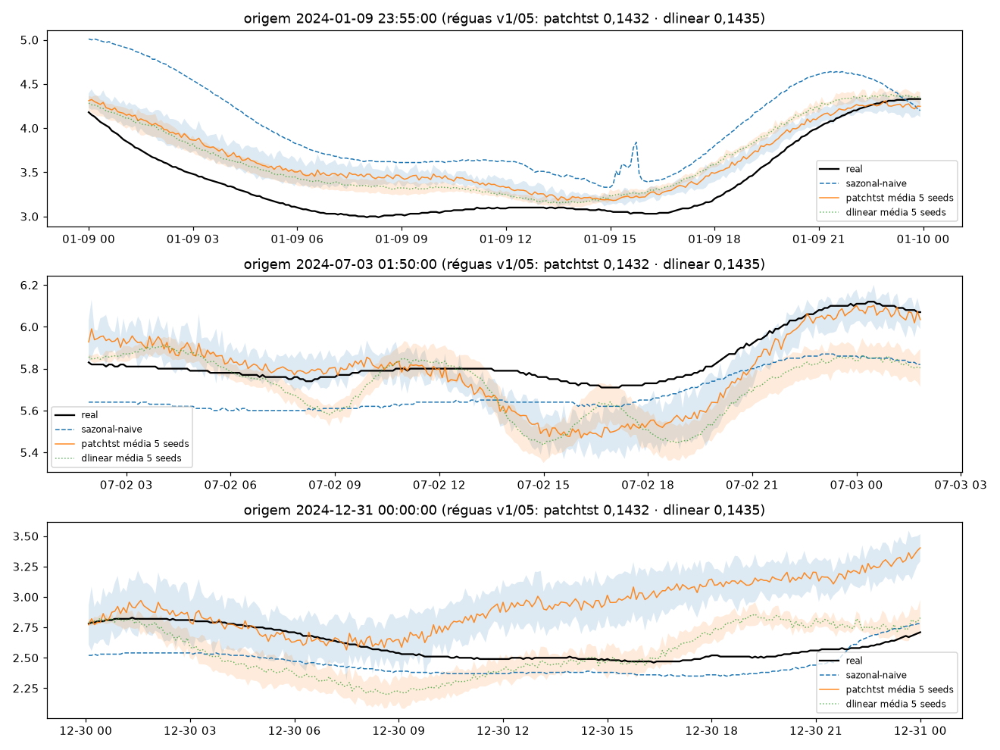
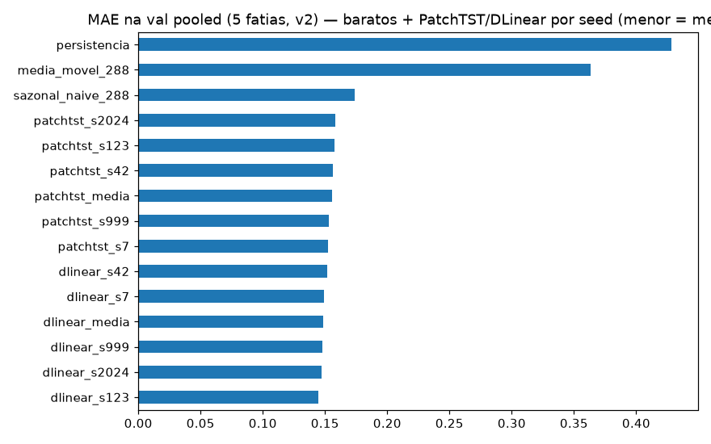
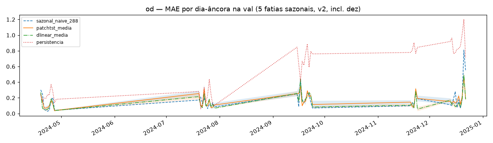
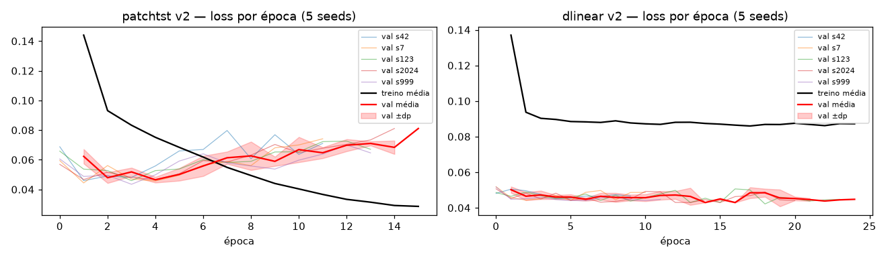

# Experimento 15 — PatchTST + DLinear v2 no OD (EF01): protocolo L=2304 + purge/embargo + 5 fatias × 5 seeds

PatchTST + DLinearLite do **05 com UMA mudança** (cauda `LN=2016` da janela
`L=2304`; arquiteturas, hiperparâmetros, RevIN e early stopping idênticos),
**univariados por construção** — treinados em 2024 no **protocolo v2**,
5 seeds por modelo com early stopping por seed (10 treinos). Média das 5 seeds
do 13 lida de CSV só como referência contextual (sem re-treino). 2025 intocado.
Artefatos gerados por `univariavel/notebooks/15-v2-patchtst-od.ipynb` (executado de ponta
a ponta, 0 erros; procedência: `temporal-remote` 192.168.1.6,
dir `/home/marcos/temporal-model`, 2026-09-17 04:41–05:43 UTC — 10 treinos em
3.720 s + inferência/figs, solo — 12c, threads unset, torch CPU 2.14.0+cpu).
Reproduzir: `.venv/bin/jupyter nbconvert --to notebook --execute --inplace --ExecutePreprocessor.timeout=7200 univariavel/notebooks/15-v2-patchtst-od.ipynb`
(10 treinos; ~62 min em 12c solo).

## Protocolo v2

- **Janelas** `L=2304 → H=288` (8 d → 1 d, 5 min), interp `time` limite 24, descarte de janelas com NaN (idêntico ao 11/13).
- **Val = 5 fatias por data de fim** (19–28/abr, 20–29/jul, 15–24/set, 20–24/nov [5 d], **13–22/dez [10 d, verão]**);
  a 5ª fatia cobre o verão austral (estação sem cobertura na VAL4).
- **Purge/embargo:** treino exclui janelas cujo alvo `[fim−H, fim]` intersecte qualquer fatia estendida `±H`
  (gap mín **+289 passos**; no v1 era −288, i.e. sem purge). Splitter `purge_train`/`signed_gap_steps`
  verbatim do 13 §5 — trava por `assert` (gap ≥ H+1, overlap zero).
- **Modelos = PatchTST + DLinearLite do 05, univariados:** cauda `LN=2016` da janela `L=2304`
  (patches 48/24 → 83 tokens, transformer 3×64/4 heads; DLinear k=25 + 2 lineares; mesmos tamanhos do 05).
- **Treino = hiperparâmetros/early-stopping do 05 por (modelo, seed)** (`BATCH 256/512`, `LR=1e-3`,
  patchtst `MAX 60/PAT 10`, dlinear `MAX 30/PAT 5`, strides 4/4, Adam/MSE),
  seeds `[42, 7, 123, 2024, 999]`; reporte por seed + média±dp pooled, por fatia e dias-âncora.
- **Diferenças vs v1 (05):** `L` 8640→2304 · val 4→5 fatias · split com purge · 5 seeds + `metricas_por_fatia*.csv`.

## Configuração do experimento

- **Série:** OD 2024 (`univariavel/dados/treino/ef01-mogi-das-cruzes_oxigenio-dissolvido_2024.csv`), 105.121 slots, 0,6% faltantes (594)
- **Limpeza idêntica:** grade 5 min + interpolação limite 24; NaN pós-interp 336 slots em 3 blocos —
  02/fev (13 slots, 1,1 h) · 11/mar (13 slots, 1,1 h) · **25–26/mar (310 slots, 25,8 h)** (só micro-outages, como no 11/13)
- **Janelas:** treino pós-purge 77.141 + val 12.960 ([2880, 2880, 2880, 1440, 2880]);
  descartadas por NaN 8.109 · purge 4.320 · gap mín +289 · dias-âncora (23:55) na val: 45 ([10, 10, 10, 5, 10])
- **Treino:** PatchTST 1.639.010 params, DLinear 1.161.794 params (idênticos ao 05) · stride 4
  (19.286 treino / 3.240 val por seed) · best val nas eps. 2–5 (patchtst) e 5–19 (dlinear);
  645–809 s por seed de patchtst vs 12–29 s de dlinear; val em U sem divergência tardia

## Tabela principal — val rolante pooled (12.960 origens)

| modelo | MAE | RMSE |
|---|---|---|
| **dlinear média 5 seeds** | **0,1482±0,0027** | 0,2089±0,0028 |
| dlinear_s123 | 0,1445 | 0,2052 |
| dlinear_s2024 | 0,1474 | 0,2071 |
| dlinear_s999 | 0,1481 | 0,2097 |
| dlinear_s7 | 0,1492 | 0,2101 |
| dlinear_s42 | 0,1520 | 0,2124 |
| **patchtst média 5 seeds** | **0,1556±0,0028** | 0,2127±0,0031 |
| patchtst_s7 | 0,1522 | 0,2107 |
| patchtst_s999 | 0,1531 | 0,2084 |
| patchtst_s42 | 0,1564 | 0,2144 |
| patchtst_s123 | 0,1577 | 0,2143 |
| patchtst_s2024 | 0,1585 | 0,2159 |
| lstnet-13 média (ref. contextual) | 0,1467±0,0017 | 0,1996±0,0046 |
| sazonal_naive_288 | 0,1736 | 0,2548 |
| media_movel_288 | 0,3631 | 0,4801 |
| persistencia | 0,4280 | 0,6222 |

(copiado de `metricas_val_por_seed.csv` / `metricas_val_media_dp.csv`; baratos idênticos ao 11) —
**dlinear empata tecnicamente o LSTNet-v2 (0,1467) e ambos os modelos batem o sazonal-v2 (0,1736);
as 10 seeds batem o sazonal.** Réguas v1 de referência (05, outro protocolo): patchtst 0,1432 · dlinear 0,1435 · lstnet-03 0,1380.

## Val por fatia — MAE (5 seeds)

| fatia | patchtst média±dp | dlinear média±dp | lstnet-13 média±dp | sazonal (11) |
|---|---|---|---|---|
| 2024-04-19→2024-04-28 | 0,1021±0,0032 | 0,1005±0,0033 | 0,1098±0,0067 | 0,1240 |
| 2024-07-20→2024-07-29 | 0,1240±0,0178 | 0,1155±0,0049 | 0,1206±0,0079 | 0,1316 |
| 2024-09-15→2024-09-24 | 0,1805±0,0070 | 0,1820±0,0021 | 0,1613±0,0043 | 0,1969 |
| 2024-11-20→2024-11-24 | 0,1715±0,0149 | 0,1571±0,0023 | 0,1494±0,0161 | 0,1579 |
| 2024-12-13→2024-12-22 | 0,2077±0,0075 | 0,1905±0,0050 | 0,1938±0,0040 | 0,2499 |

(copiado de `metricas_por_fatia_media_dp.csv` / `metricas_por_fatia.csv`; cobertura [2880, 2880, 2880, 1440, 2880])

## Val dias-âncora (45)

| modelo | MAE |
|---|---|
| **dlinear média 5 seeds** | **0,1498** |
| **patchtst média 5 seeds** | **0,1633** |
| sazonal_naive_288 | 0,1748 |
| media_movel_288 | 0,3593 |
| persistencia | 0,5386 |

(média simples dos 45 dias de `metricas_por_dia.csv`; dp médio entre seeds 0,0191 (dlinear) e 0,0292 (patchtst) — detalhe por dia no CSV)

## Figuras — o que cada uma mostra

### `01-eda.png`, `02-limpeza.png`, `03-stl.png` — dado 2024 (ADF −6,61 / p 6,3e-09: estacionária no trecho jul–ago)

### `04-forecasts.png` — 3 origens do treino (real × sazonal × patchtst/dlinear média±dp 5 seeds)

### `05-mae.png` — barras de MAE na val pooled (baratos + 10 seeds + 2 médias)

### `06-val-dias.png` — MAE por dia-âncora (5 fatias sazonais, incl. dez; banda = ±dp entre seeds)

### `07-curvas-treino.png` — loss por época (2 painéis × 5 seeds finas + média±dp; patchtst em U com mín. nas eps. 2–5, dlinear plano — sem divergência tardia)

## Arquivos

| Arquivo | O quê |
|---|---|
| `metricas_val_por_seed.csv` | Val rolante pooled por (modelo, seed) em CSV (primária, 10 linhas) |
| `metricas_val_media_dp.csv` | Val pooled média±dp por modelo em CSV (2 linhas) |
| `metricas_por_fatia.csv` | MAE/RMSE por (fatia, modelo, seed) em CSV (50 linhas, incl. dez) |
| `metricas_por_fatia_media_dp.csv` | Por fatia média±dp em CSV (10 linhas) |
| `metricas_por_dia.csv` | MAE por dia-âncora em CSV (45 linhas: baratos + patchtst/dlinear por seed + média±dp) |
| `modelos/patchtst_od_s{42,7,123,2024,999}.pt` | PatchTST treinado por seed (state_dict + config, ~6,3 MB cada) |
| `modelos/dlinear_od_s{42,7,123,2024,999}.pt` | DLinear treinado por seed (state_dict + config, ~4,4 MB cada) |
| `modelos/normalizacao.json` | `{"mode": "revin-per-window", "univariate": true, "L": 2304, "LN": 2016, "channels": ["valor"], "seeds": [...]}` |
| `figs/` | As 7 figuras explicadas acima |

Nota: sem `metricas_val_diaria.csv` — o notebook 15 não a gera (ao contrário do 14);
o pooled de dias-âncora está agregado em `metricas_por_dia.csv` (colunas `*_media`).

## Leitura dos resultados

1. **A história principal: no OD-v2 o DLinear (0,1482±0,0027) bate o PatchTST (0,1556±0,0028)** —
   mesma ordem do v1-05 (dlinear 0,1435 × patchtst 0,1432, empate técnico lá; gap claro de ~5% aqui),
   o inverso do pH-14 (onde o patchtst passou à frente). O **dlinear empata tecnicamente o LSTNet-v2
   (0,1467±0,0017, +1,0%)** e ambos batem o sazonal-v2 (0,1736: −14,6% / −10,4%).
2. **As 10 seeds batem o sazonal** (patchtst 0,1522–0,1585; dlinear 0,1445–0,1520) — o ganho não depende
   de seed sortuda; a melhor seed (dlinear_s123 0,1445) bate a média do LSTNet-13. Maior dispersão por
   fatia no patchtst: jul ±0,0178 (s2024 0,1510) e nov ±0,0149 (s999 0,1920).
3. **Setembro é a fatia onde o LSTNet-v2 se destaca** (0,1613 × 0,1805/0,1820); **novembro é a única fatia
   onde o patchtst (0,1715) perde do sazonal (0,1579)** — o dlinear (0,1571) passa por pouco; em **dez
   (fatia dura) o dlinear (0,1905) bate lstnet-13 (0,1938) e sazonal (0,2499)**, o patchtst (0,2077) só o sazonal.
4. Treino saudável: patchtst com best val nas eps. 2–5 e curva em U (treino cai até o fim, sem colapso);
   dlinear plano com best nas eps. 5–19 — early stopping cumpriu o papel nos dois.
5. Limitação declarada: PatchTST/DLinear seguem **univariados** (sem os canais solar+Fourier do 13) e a
   comparação v1×v2 embute mudança de protocolo (L, purge, 5ª fatia), não só o modelo.
6. Fila: benchmark 2025 (protocolo v2) e NNLS futuro — checkpoints por (modelo, seed) guardados.
