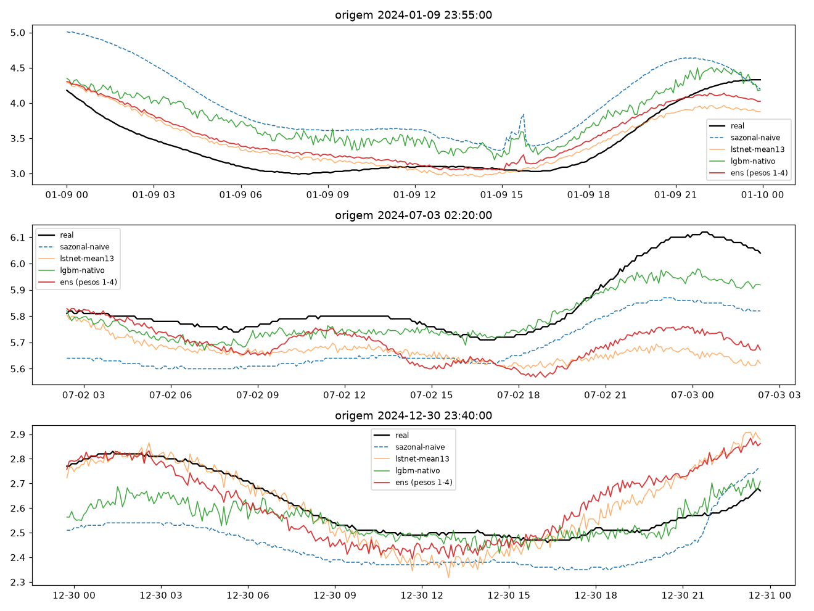
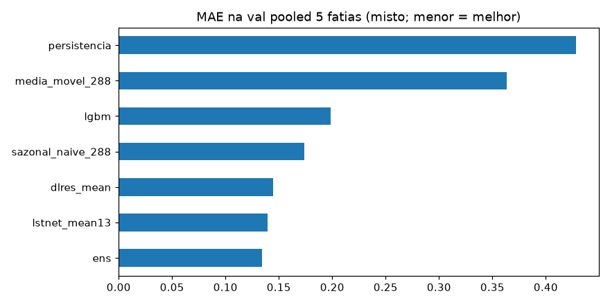
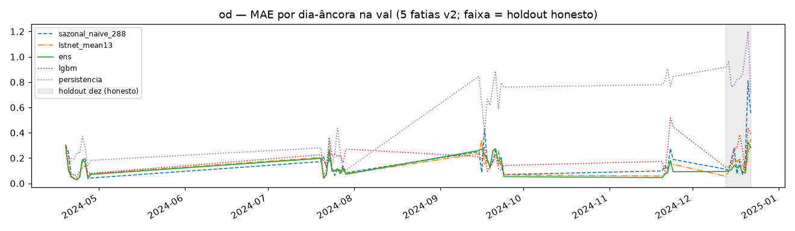
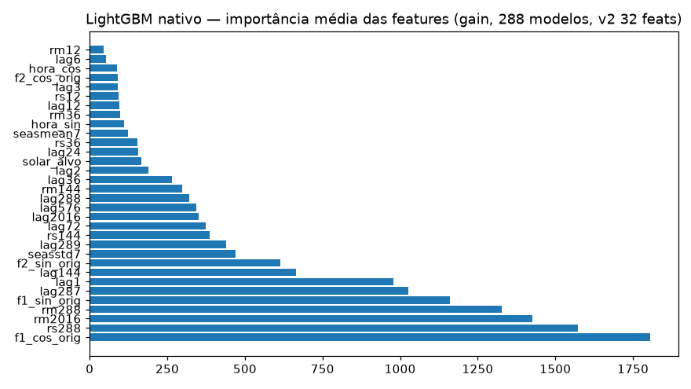

# Experimento 17 — Ensemble v2 no OD (EF01): sazonal + LSTNet-13 + LGBM-nativo + DLinear-res + NNLS fit/report

Piso sazonal-naive-288 + LSTNet-13 (seed-mean, recarregado) + 288 LGBM nativos no resíduo + DLinear-res
seed-mean + NNLS com **separação peso × reporte** (pesos nas fatias 1–4, reporte honesto em dez). Protocolo v2
idêntico ao 11/13/15. 2025 intocado.
Artefatos gerados por `univariavel/notebooks/17-v2-ensemble-od.ipynb` (executado de ponta a ponta, 0 erros;
procedência: `temporal-remote` 192.168.1.6, dir `/home/marcos/temporal-model`, 2026-09-17).
Reproduzir: `.venv/bin/jupyter nbconvert --to notebook --execute --inplace --ExecutePreprocessor.timeout=7200 univariavel/notebooks/17-v2-ensemble-od.ipynb`
(exige os 5 checkpoints do 13; 288 `.txt` + 5 `.pt` gitignored, regeneráveis).

## Protocolo v2 (resumo)

- **Janelas** `L=2304 → H=288` (8 d → 1 d, 5 min), interp `time` limite 24, descarte de janelas com NaN (idêntico ao 11/13/15).
- **Val = 5 fatias por data de fim** (19–28/abr, 20–29/jul, 15–24/set, 20–24/nov [5 d], **13–22/dez [10 d, verão]**);
  purge/embargo ±H (gap mín **+289 passos**; trava por `assert`, overlap zero).
- **NNLS por zona:** pesos (fit) nas fatias 1–4 (10.080 origens) — NNLS sobre os 4 componentes;
  reporte honesto na fatia 5 (dez, 2.880 origens, unseen p/ os pesos, p/ a val do DLinear e p/ o treino LGBM pós-purge)
  + reporte declarado in-sample nas fatias 1–4.

## Configuração do experimento

- **Série:** OD 2024 (`dados/treino/ef01-mogi-das-cruzes_od_2024.csv`); só micro-outages
  (336 slots NaN pós-interp) → 5 fatias cheias, asserts idênticos aos do 11/13
- **Janelas:** treino pós-purge 77.141 + val 12.960 (fit 10.080 + report 2.880);
  descartadas por NaN 8.109 · purge 4.320 · gap mín +289 · dias-âncora (23:55) na val: 45 ([10, 10, 10, 5, 10])
- **LSTNet:** 5 `.pt` do 13 recarregados, seed-mean, sem re-treino
- **LGBM:** 288 boosters nativos (`lgb.train`, 1 run determinístico) no resíduo `Y−sazonal`,
  32 feats (base do 07 a `L=2304` + 4 Fourier do dia-da-origem + hora_sin/cos + solar do passo-alvo);
  paridade save/reload ≤1e-9;
  top feats: `rm2016, rm288` + Fourier da origem (mesmo perfil do 16)
- **DLinear-res:** 5 seeds no mesmo resíduo (cauda `LN=2016`), early só nas fatias 1–4; seed-mean como componente
- **NNLS na zona fit:** `sazonal=0,0038, lstnet=0,6771, lgbm=0,0, dlres=0,3216` (soma 1,0025) —
  o LSTNet domina, o LGBM é **zerado** (= v1-07) e o dlres leva 0,32 (≈ 0,30 do v1-07); o piso some (0,004)

## Tabela principal — val por zona (`metricas_nnls_zonas.csv`, primária)

Zona fit = in-sample declarado (os pesos viram essas origens) · zona report = honesta (dez, unseen p/ os pesos):

| modelo | MAE fit | RMSE fit | MAE report | RMSE report |
|---|---|---|---|---|
| **ens** | **0,1234** | 0,1688 | **0,1733** | 0,2383 |
| lstnet (13, seed-mean) | 0,1262 | 0,1715 | 0,1848 | 0,2447 |
| dlres (seed-mean) | 0,1336 | 0,1832 | 0,1842 | 0,2677 |
| sazonal_naive_288 | 0,1518 | 0,2148 | 0,2499 | 0,3616 |
| lgbm (288 nativos) | 0,1795 | 0,2458 | 0,2636 | 0,3270 |

(copiado de `metricas_nnls_zonas.csv` — **o número honesto é o report (dez): ens 0,1733**; o fit 0,1234 é in-sample dos pesos.)

## Peso × reporte — a comparação honesta

- **Pesos fitados nas fatias 1–4, reportados em dez (verão):** no fit o ranking é
  ens 0,1234 < lstnet 0,1262 < dlres 0,1336 < sazonal 0,1518 < lgbm 0,1795;
  em dez a ordem se mantém no topo: ens 0,1733 < dlres 0,1842 ≈ lstnet 0,1848 < sazonal 0,2499 < lgbm 0,2636.
  O ensemble honesto bate o lstnet por −6,2% e o dlres por −5,9% — aqui, ao contrário do pH (16),
  o ensemble **vence também no holdout**.
- **Pooled 5 fatias (só p/ comparar com as réguas v2, com caveat de otimismo):**
  ens 0,1345 · lstnet 0,1392 · dlres 0,1448 · sazonal 0,1736 · lgbm 0,1982 —
  o ensemble pooled bate dlinear-15 (0,1482±0,0027), patchtst-15 (0,1556±0,0028),
  lstnet-13 (0,1467±0,0017) e o piso v2-11 (0,1736), mas esse número mistura a zona
  in-sample dos pesos — **não é o número honesto**.
- **Régua v1 de referência (07, outro protocolo L=8640/4 fatias/sem purge — caveat, não é comparação direta):**
  ens 0,1325 com dlres a 0,30 e LGBM zerado; no v2 o padrão se repete (dlres 0,32, LGBM 0,0, piso 0,004) —
  no OD o resíduo linear carrega o sinal que falta ao LSTNet, nos dois protocolos.
  (Contraste com o pH: no 16-v2 o LGBM ganhou peso 0,089; no OD ele é zerado nos dois.)
- **Caveat herdado:** o componente lstnet do 13 usou as 5 fatias como val no treino —
  o reporte em dez é honesto p/ os **pesos**, não p/ o componente lstnet.

## Val por fatia — MAE (`metricas_por_fatia.csv`)

| fatia (zona) | ens | lstnet | dlres | sazonal | lgbm |
|---|---|---|---|---|---|
| 2024-04-19→2024-04-28 (fit) | 0,0992 | 0,1042 | 0,0990 | 0,1240 | 0,1203 |
| 2024-07-20→2024-07-29 (fit) | 0,1093 | 0,1154 | 0,1146 | 0,1316 | 0,2210 |
| 2024-09-15→2024-09-24 (fit) | 0,1581 | 0,1535 | 0,1792 | 0,1969 | 0,1589 |
| 2024-11-20→2024-11-24 (fit) | 0,1304 | 0,1368 | 0,1493 | 0,1579 | 0,2558 |
| 2024-12-13→2024-12-22 (report) | 0,1733 | 0,1848 | 0,1842 | 0,2499 | 0,2636 |

(o ensemble vence em 4 das 5 fatias; só perde em set p/ o lstnet 0,1535 × 0,1581.
O LGBM colapsa em jul (0,2210) e nov (0,2558) — daí o peso NNLS zero; em abr ele é competitivo, 0,1203.)

## Val dias-âncora (45)

| modelo | MAE |
|---|---|
| **ens** | **0,1372** |
| lstnet | 0,1431 |
| dlres | 0,1467 |
| sazonal_naive_288 | 0,1748 |
| lgbm | 0,2034 |

(média simples dos 45 dias de `metricas_por_dia.csv`; detalhe por dia no CSV)

## Figuras — o que cada uma mostra

### `01-eda.png`, `02-limpeza.png`, `03-stl.png` — dado 2024 (idênticos ao 11/13/15)

### `04-forecasts.png` — 3 origens do treino (real × 4 componentes × ens)

### `05-mae.png` — MAE pooled 5 fatias (misto in-sample + honesto; menor = melhor)

### `06-val-dias.png` — MAE por dia-âncora (5 fatias; faixa = holdout honesto de dez)

### `07-importancia-lgbm.png` — importância média das features (gain, 288 boosters nativos)

## Arquivos

| Arquivo | O quê |
|---|---|
| `metricas_nnls_zonas.csv` | Val por zona em CSV (primária, 10 linhas: 2 zonas × 5 modelos) |
| `metricas_por_fatia.csv` | MAE/RMSE por fatia×modelo em CSV (35 linhas: 5 fatias × 7 modelos, incl. persist/MM) |
| `metricas_por_dia.csv` | MAE por dia-âncora em CSV (45 linhas) |
| `metricas_val.csv` | Val pooled 5 fatias em CSV (misto, só p/ comparar com réguas v2) |
| `metricas_val_diaria.csv` | Dias-âncora pooled em CSV |
| `modelos/dlinear_res_od_s{42,7,123,2024,999}.pt` | DLinear do resíduo por seed (state_dict, ~4,4 MB cada; no Release, regenerável) |
| `modelos/lgbm_nativo/model_j{000..287}.txt` | 288 boosters nativos (um por horizonte; no Release, regenerável) |
| `modelos/ensemble.json` | Pesos NNLS + fit/report slices + componentes |
| `modelos/normalizacao.json` | Modo do experimento (`L=2304/H=288`, feats LGBM, seeds) |
| `figs/` | As 7 figuras explicadas acima (sem 08-pesos/09-zonas: ver `05-mae.png` + tabelas) |

## Leitura dos resultados

1. **O número honesto (dez): ens 0,1733 — vence lstnet (0,1848) e dlres (0,1842) por ~6%.**
   Fit in-sample 0,1234 é declarado, não manchete. Peso × reporte cumprindo seu papel:
   sem a separação, o pooled 0,1345 teria virado a manchete.
2. **Padrão de pesos idêntico ao v1-07** (dlres ~0,3, LGBM zerado, piso residual) —
   no OD o ensemble é LSTNet + corretor linear do resíduo, nos dois protocolos.
   O LGBM sozinho é o pior componente nas duas zonas (fit 0,1795, dez 0,2636).
3. **Pooled 5 fatias com caveat: ens 0,1345 bate as réguas v2** (lstnet-13 0,1467 · dlinear-15 0,1482 ·
   patchtst-15 0,1556 · sazonal-11 0,1736) — mas mistura zona in-sample dos pesos; vale como
   comparabilidade de protocolo, não como veredito.
4. Limitações declaradas: comparação v1×v2 embute mudança de protocolo (L, purge, 5ª fatia), não só método;
   o componente lstnet viu dez na val do 13 (reporte honesto só p/ os pesos); univariado, como todo o v2.
5. Fila: benchmark 2025 em protocolo v2 decide as réguas finais — checkpoints guardados
   (`lgbm_nativo/*.txt` + `dlinear_res_od_s*.pt` vão ao Release).
