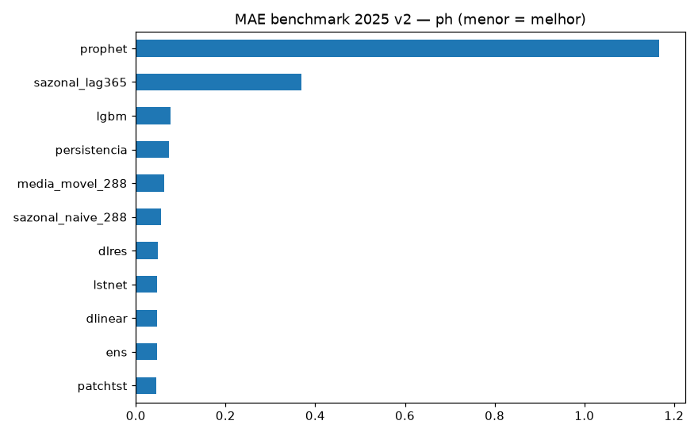
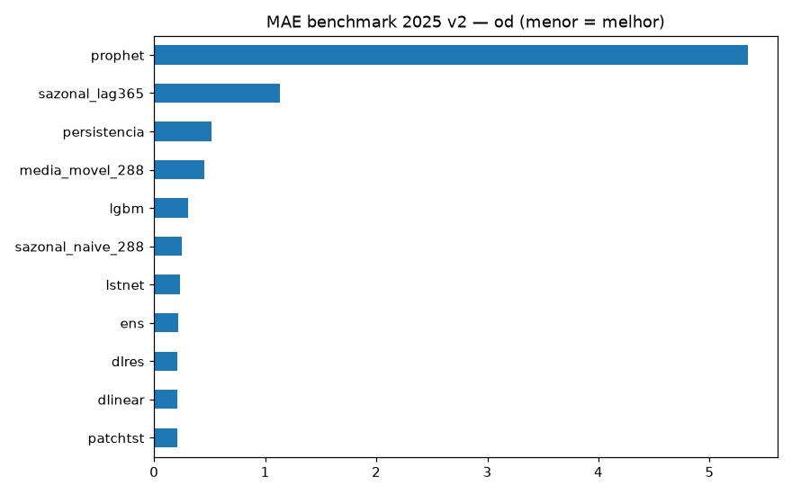
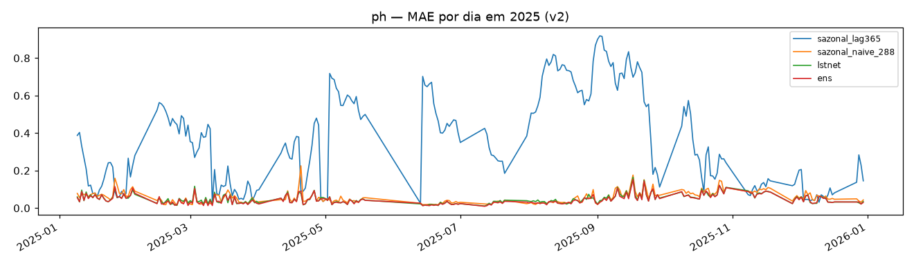
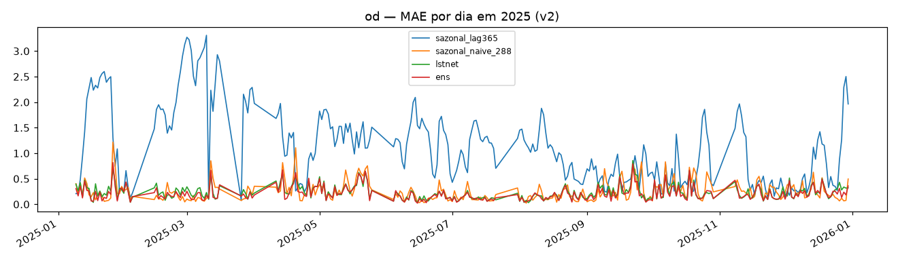
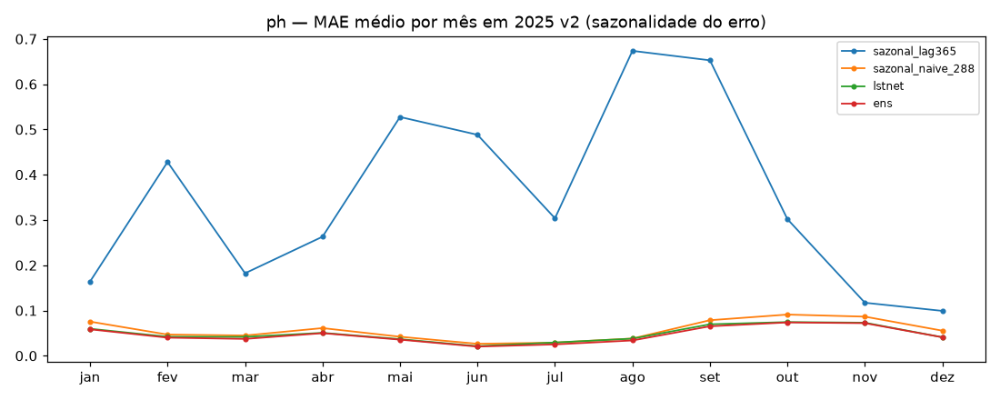
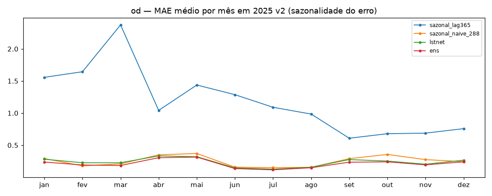
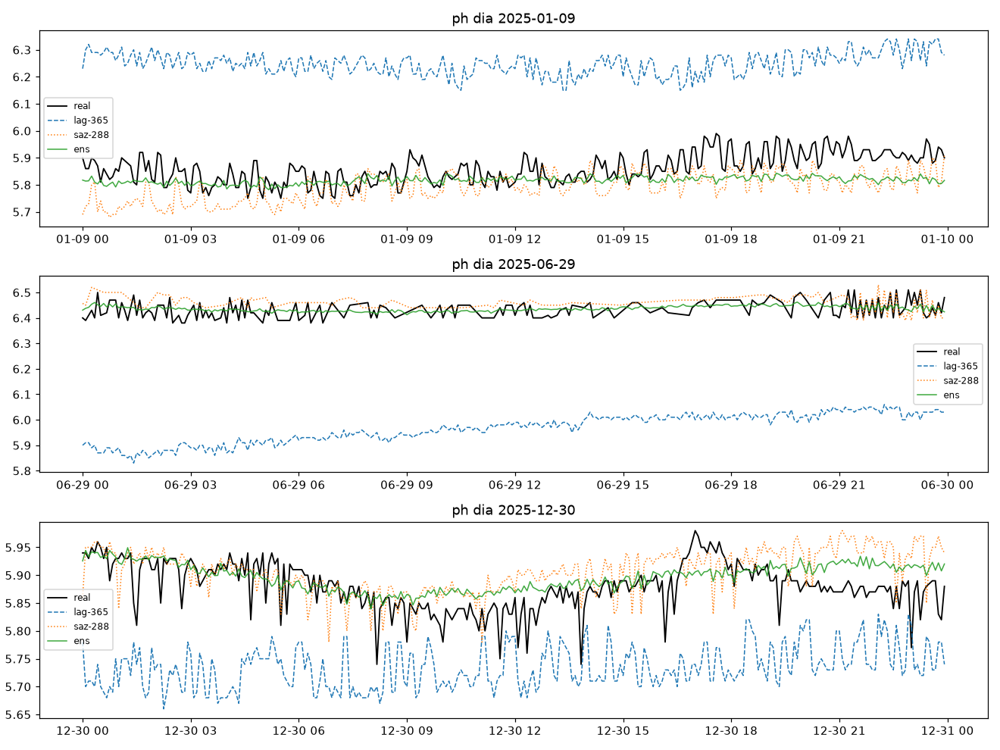
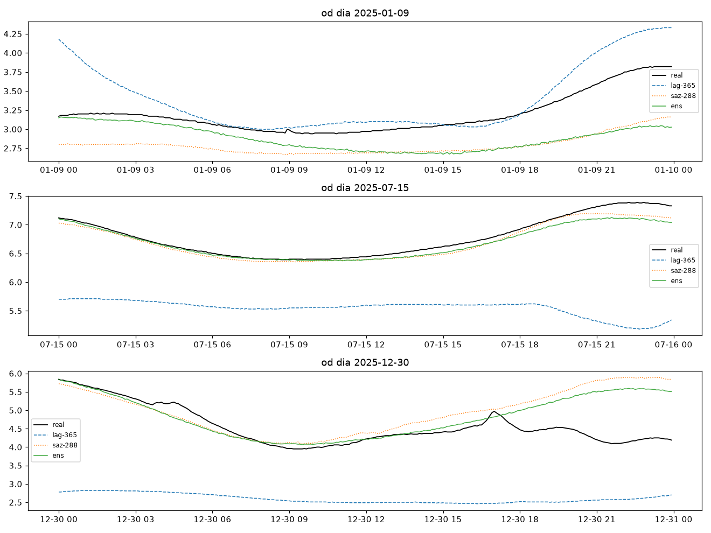

# Experimento 18 — Benchmark 2025 v2: campeões v2 × ano intocado (só inferência)

Veredito do protocolo v2 no regime anual: checkpoints de 10–17 (treino 2024, `L=2304`,
purge/embargo, 5 fatias) previstos em 2025, ano nunca tocado por nenhum treino, val ou
tuning. Inclui o sazonal **lag-365** (copia a mesma data de 2024, com fallback honesto p/
saz-288) e quebra mensal do erro. Sem ARIMA (como no 08).
Artefatos gerados por `univariavel/notebooks/18-v2-benchmark-2025.ipynb` (executado de ponta a ponta, 0 erros;
procedência: `temporal-remote` 192.168.1.6, dir `/home/marcos/temporal-model`, 2026-09-17;
inferência pH 350 s + OD 398 s, 12c, threads unset).
Reproduzir: `.venv/bin/jupyter nbconvert --to notebook --execute --inplace --ExecutePreprocessor.timeout=7200 univariavel/notebooks/18-v2-benchmark-2025.ipynb`
(exige os checkpoints de 10–17: torch 4×5 seeds + LGBM 288 boosters/var + `ensemble.json` + Prophet; ~15 min em 12c livres; sem treino).

## Configuração do experimento

- **Benchmark:** `dados/benchmark/ef01-...-2025.csv` (pH + OD), limpeza idêntica, janelas `L=2304 → H=288` (8 d → 1 d)
- **Cobertura:** pH 74.222 janelas + 259 dias-âncora (09/jan → 30/dez) · OD 86.567 janelas + 302 dias-âncora (09/jan → 30/dez)
- **Modelos (11 por variável):** 3 baratos + lag-365 + lstnet + patchtst + dlinear + lgbm + dlres + ens (pesos NNLS do 16/17, sem re-fit) + prophet (artefato do 10/11, só inferência)
- **lag-365:** fallback p/ saz-288 em 4,5% (pH) / 1,1% (OD) — o fracasso dele é real (deriva interanual), não falta de dado

## Tabela principal — benchmark rolante 2025 v2

**pH (74.222 origens):**

| modelo | MAE | RMSE |
|---|---|---|
| **patchtst (14)** | **0,0465** | 0,0644 |
| ens (16) | 0,0470 | 0,0646 |
| dlinear (14) | 0,0472 | 0,0657 |
| lstnet (12) | 0,0476 | 0,0655 |
| dlres | 0,0486 | 0,0684 |
| sazonal_naive_288 | 0,0565 | 0,0788 |
| media_movel_288 | 0,0632 | 0,0829 |
| persistencia | 0,0746 | 0,1009 |
| lgbm | 0,0768 | 0,1004 |
| sazonal_lag365 | 0,3692 | 0,4495 |
| prophet | 1,1659 | 1,3271 |

**OD (86.567 origens):**

| modelo | MAE | RMSE |
|---|---|---|
| **patchtst (15)** | **0,2056** | 0,3031 |
| dlinear (15) | 0,2073 | 0,3102 |
| dlres | 0,2074 | 0,3111 |
| ens (17) | 0,2133 | 0,3100 |
| lstnet (13) | 0,2330 | 0,3286 |
| sazonal_naive_288 | 0,2519 | 0,3739 |
| lgbm | 0,3070 | 0,4137 |
| media_movel_288 | 0,4501 | 0,5591 |
| persistencia | 0,5181 | 0,7005 |
| sazonal_lag365 | 1,1353 | 1,4142 |
| prophet | 5,3414 | 6,1357 |

(copiado de `metricas_benchmark_{ph,od}.csv`; dias-âncora em `metricas_diaria_{ph,od}.csv` com a mesma ordem; por dia em `metricas_por_dia_{var}.csv`, por mês em `metricas_por_mes_{var}.csv`)

**Dias-âncora (checagem, não manchete):** pH ens 0,0463 < patchtst 0,0464 (único recorte onde o
ens lidera no pH) · OD dlres 0,2072 < patchtst 0,2076 < dlinear 0,2085 < ens 0,2116.
O ranking rolante (tabela acima) decide — ver veredito.

## Figuras — o que cada uma mostra

### `01-eda-{ph,od}.png` — o ano de 2025 (pH com 544 slots NaN, OD com 129; nível do pH deslocado vs 2024 — pista do fracasso do lag-365)

### `04-mae-{ph,od}.png` — barras de MAE no benchmark

### `05-diaria-{ph,od}.png` — MAE por dia em 2025

### `06-mensal-{ph,od}.png` — MAE médio por mês (sazonalidade do erro)

- Leitura: o lag-365 fica fora de escala o ano todo nas duas; no pH o erro de todos concentra-se
  em set–nov (patchtst/ens ~0,07) com o melhor mês em jun–jul (~0,02); no OD os erros são mínimos
  em jun–ago (~0,11–0,15) e máximos em abr–mai/out–dez (~0,24–0,34); o Prophet cresce ao longo do
  ano nas duas (pH 0,11 em jan → ~2,0 em nov; OD 0,77 em jan → ~8,6 em nov).

### `07-exemplos-{ph,od}.png` — 3 dias previstos (real × lag-365 × saz-288 × ens)

## Arquivos

| Arquivo | O quê |
|---|---|
| `metricas_benchmark_{ph,od}.csv` | Rolante completo em CSV (primária) |
| `metricas_diaria_{ph,od}.csv` | Dias-âncora em CSV |
| `metricas_por_dia_{ph,od}.csv` | MAE por dia em CSV (pH 259 · OD 302 dias) |
| `metricas_por_mes_{ph,od}.csv` | MAE médio por mês em CSV (12 linhas) |
| `figs/` | As 10 figuras explicadas acima |

Sem pasta `modelos/` — nenhum treino aqui; todos os checkpoints são dos experimentos 10–17.

## Veredito v1×v2 — o que o benchmark 2025 decide

Rolante 2025, MAE por modelo (v1 = 08, `L=8640`; v2 = este, `L=2304` — a comparação embute a
mudança de protocolo, não só de método):

| modelo | pH v1 | pH v2 | OD v1 | OD v2 |
|---|---|---|---|---|
| patchtst | 0,0688 | **0,0465** | 0,2213 | **0,2056** |
| ens | 0,0509 | 0,0470 | 0,2107 | 0,2133 |
| dlinear | 0,0600 | 0,0472 | 0,2325 | 0,2073 |
| lstnet | 0,0529 | 0,0476 | 0,2127 | 0,2330 |
| dlres | 0,0710 | 0,0486 | 0,2286 | 0,2074 |
| sazonal_naive_288 | 0,0597 | 0,0565 | 0,2714 | 0,2519 |
| lgbm | 0,0671 | 0,0768 | 0,2943 | 0,3070 |
| media_movel_288 | 0,0715 | 0,0632 | 0,4545 | 0,4501 |
| persistencia | 0,0844 | 0,0746 | 0,5258 | 0,5181 |
| sazonal_lag365 | 0,4640 | 0,3692 | 0,9252 | 1,1353 |
| prophet | 1,8997 | 1,1659 | 5,0446 | 5,3414 |

1. **Componentes v2 melhores que v1 nas duas variáveis:** patchtst (pH −32% · OD −7%),
   dlinear (−21% · −11%), dlres (−32% · −9%) e o próprio piso sazonal (−5% · −7%).
   O protocolo v2 curou o overfit do PatchTST no pH (v1: 0,0688, perdia do sazonal; v2: 0,0465,
   campeão) e manteve a ordem do v1 no OD. Exceções honestas: o LSTNet piora no OD
   (0,2127 → 0,2330) e o LGBM sozinho piora nas duas (0,0671 → 0,0768 · 0,2943 → 0,3070) —
   como componente tem valor, como modelo perde até da persistência no pH.
2. **O ensemble NÃO vence em 2025:** pH patchtst 0,0465 < ens 0,0470; OD patchtst 0,2056 <
   dlinear 0,2073 ≈ dlres 0,2074 < ens 0,2133. Os pesos NNLS ajustados nas fatias 1–4/2024
   (pH: lstnet 0,70 dominante; OD: lstnet 0,68 + dlres 0,32) não transferiram o ranking para
   2025 — embora o holdout honesto de dez/2024 parecesse bom (16: ens 0,0324 vence;
   17: ens 0,1733 vence). Um mês de holdout não previu um ano de deriva: em 2025 o componente
   mais pesado (LSTNet) é só 4º no pH e 5º no OD.
3. **Campeões v2: PatchTST nas duas** — pH 0,0465 (−18% sobre o sazonal 0,0565) ·
   OD 0,2056 (−18% sobre o sazonal 0,2519). No pH o top-4 (patchtst/ens/dlinear/lstnet) cabe
   em 0,0011; no OD o patchtst abre ~0,008 do dlinear e ~0,03 do LSTNet.
4. **lag-365 e Prophet seguem fora:** lag-365 erra por ~0,37 pH e ~1,14 mg/L (a deriva
   interanual de nível não perdoa nem com `L` curto); Prophet explode (1,17 / 5,34) e piora
   mês a mês — extrapolação de tendência sem âncora, fora do jogo em qualquer regime.
5. **Réguas (decisão pendente, NÃO atualizadas no app):** este benchmark coroa o patchtst-v2
   nas duas variáveis, mas as réguas servidas (`app.py`, `/regras`: pH ens-v1 0,0509 ·
   OD ens-v1 0,2107) seguem intactas até decisão do usuário.
